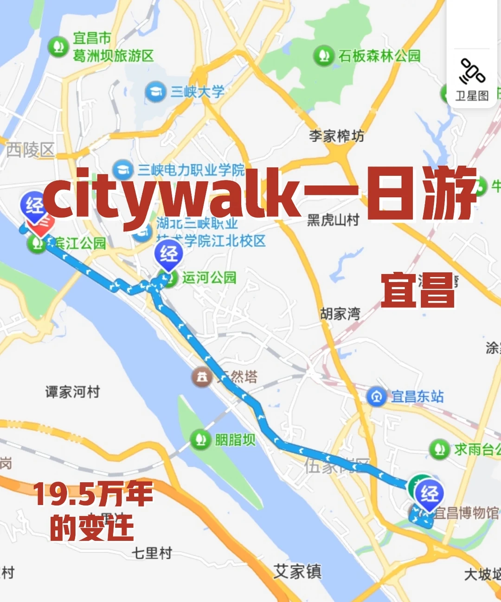

# 一条路读完这座城的过去现在和未来

- 作者: 飞行蛋挞
- 👍22 · 💬 · ⭐36 · 图 1
- feed_id: 6a2d88b5000000000702db4a

> [OCR] 宜昌市
葛洲坝旅游区

三峡大学

三峡电力职业学院

湖北三峡职业技术学院江北校区

滨江公园

运河公园

天然塔

胭脂坝

宜昌东站

求雨台公园

宜昌博物馆

西陵区

李家榨坊

黑虎山村

胡家湾

谭家河村

19.5万年
的变迁

citywalk一日游
宜昌

## 正文
📍路线总览
宜昌博物馆 → 宜昌规划展览馆 → 运河公园 → 二马路历史文化街区 → 滨江公园
	
🏛️ 第1站｜宜昌博物馆
📍 地址：伍家岗区柏临河路求索广场西侧
🕐 开放：周二至周日9:00-17:00（16:00停止入馆），周一闭馆
💰 门票：免费｜凭身份证入馆
	
[一R]一楼｜自然之窗
▫️物竞天择展厅：肯尼斯·贝林捐赠的200+件珍稀动物标本
▫️开辟鸿蒙展厅：太阳人石刻——国内最早的太阳图腾崇拜文物
[二R]二楼｜巴楚之魂
远古西陵展厅：19.5万年，把宜昌人类史拉到旧石器时代
巴楚夷陵展厅：
🔔 楚季宝钟——西周晚期，钟体铭文"楚季宝钟"
🔔 秦王卑命钟——东周铜甬钟
🐅 虎钮錞于——巴文化标志性军乐器
千载峡州展厅：春秋漆木瑟、磨光黑皮陶罐，看峡江千年市井烟火
	
💎 第2站｜宜昌规划展览馆
📍 地址：伍家岗区柏临河路北侧（求雨台公园南侧）
🕐 开放：周二至周日9:00-12:00/14:30-17:00
💰 门票：免费｜凭身份证入馆
🔥 必体验：
▫️穿古越今——城市风貌时空隧道
▫️开埠风云——宜昌码头场景复原
▫️宜昌会战——沉浸式战场体验
▫️走进画卷——模拟船舱+清江画廊大屏
⭐ 限时场次（当天前台提前预约，领完即止）：
总规沙盘：10:00、15:00
4D未来影院：10:30、15:30
	
🌸 第3站｜运河公园
📍 地址：西陵区与伍家岗区交界处，港窑路11号附近
🕐 全天开放
▫️空中栈道路线
工业风廊桥横跨湿地，俯瞰12个荷花池塘全景
▫️水上步道路线
穿梭12个池塘间，近距离拍睡莲、荷花、再力花、菖蒲，白鹭在水面掠过，随手拍都是油画感
季节限定👇
🌿 4-5月：绣球花展
🪷 6-8月：荷花满塘
💡 生态景观长廊全长9.1公里
	
🪭 第4站｜二马路历史文化街区
打卡点👇
▫️满意楼：红砖欧式百年建筑
▫️太古楼：太古轮船公司旧址→城市数字记忆馆
▫️天主教堂方济各堂：1883年建，哥特式尖拱门窗
▫️1883酒咖：天主教堂原址
▫️邮政巷：青石板+红砖墙，重庆山城既视感
▫️英驻宜领事馆旧址：修缮后宝瓶柱式栏杆，英式建筑
▫️警茶局：复古风格警务点
	
🌊 第5站｜滨江公园
▫️镇江阁：古建筑+江景同框
▫️至喜长江大桥：17:30-19:00蹲蓝调时刻
▫️大草坪纳凉、遛弯、看货轮驶过，最宜昌的松弛感
⚠️ 江边蠓虫多，必须带驱蚊！
	
#宜昌citywalk[话题]# #宜昌博物馆[话题]# #宜昌旅游攻略[话题]# #小众旅行地[话题]# #免费景点[话题]# #莫奈花园[话题]# #二马路[话题]# #运河公园[话题]#

---