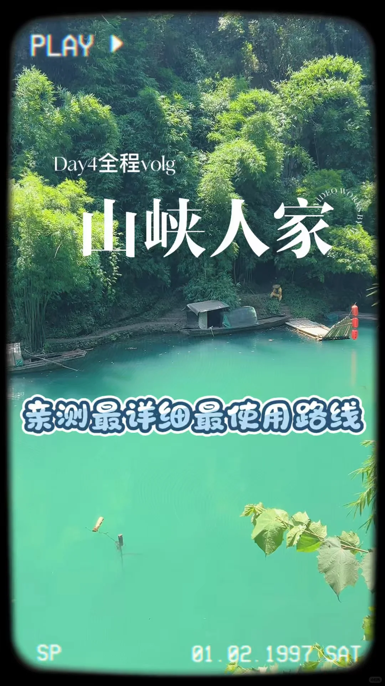

# 三峡人家🚗自驾一日游玩路线分享

- 作者: 於小蛋（努力涨粉版）
- 👍21 · 💬10 · ⭐20 · 图 1
- feed_id: 6a53572800000000070245b7

> [OCR] PLAY >
Day4全程volg
山峡人家
亲测最详细最使用路线
01.02.1997 SAT

## 正文
上周自驾去三峡人家，就想顺路看看348国道，干脆选了车进车出的方式~酒店定在王家坪游客中心旁边，步行5分钟就到，真的超方便!!
⚠️买票一定要问清楚散票还是团票!
散票8:30就能上三楼坐大巴走，不用等;团票在一楼，得9:30等人齐才出发。民宿老板帮忙订的180左右也是团票，夏天实在太热了，等得我直接从三楼散客中心走也没人拦~
💼随身带这些就够:
帽子+防晒衣+小电扇，太阳到10点以后真的晒得顶不住!
🍜吃饭建议:
带点小零食就行，景区物价不算虚高水3块，冰棒比外面贵一两块。路边12块的盒饭可以试试，里面的餐厅偏贵不太推荐~
✨游玩路线分享: 1️⃣龙津溪线:	码头靠岸直走，路线是圈能逛全~哭嫁表演15分钟一场，一小时一次。里面只有两三只猴子，出口按指示牌去巴人寨就行。
2️⃣巴人部落线:野坡岭太极猫洞口(维修中)孤亭巴王宫茶盐古道巴王寨(有表演)
野坡岭全是台阶，不长但陡!遇到带推车的宝妈全程扛车，带小宝宝建议用背带~
📢隐藏路线!
想最快去巴王寨又不想坐缆车?直接从太极猫洞口出口顺道走，近很多!我返程就走的这条路~
如果有年卡的小宝建议把清江画廊和大瀑布玩完！
#和爸妈的第一次旅行[话题]# #宜昌旅游攻略[话题]# #山峡人家[话题]# #带着父母去旅行[话题]# #周边游说走就走[话题]#

---