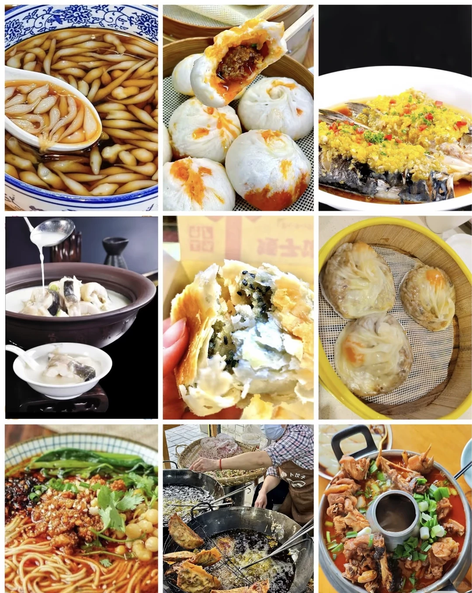
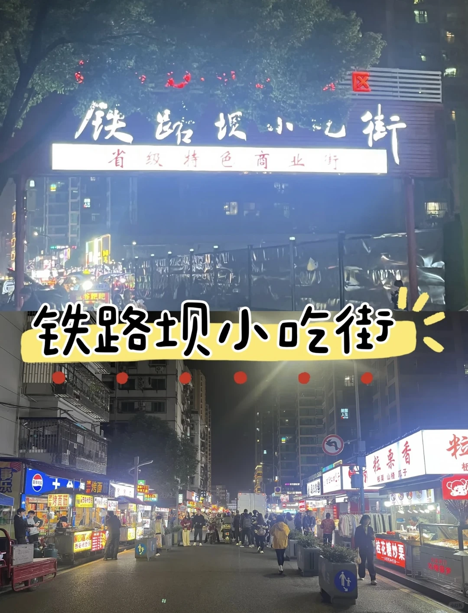
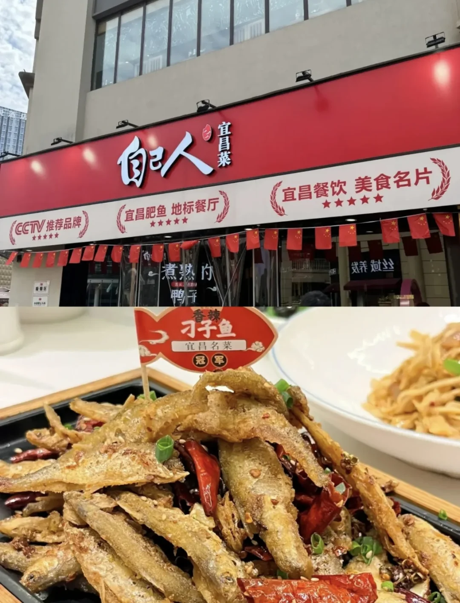
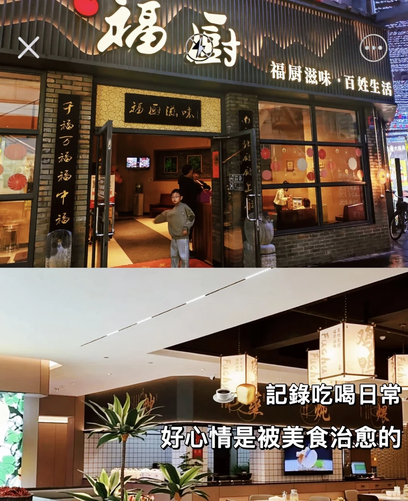
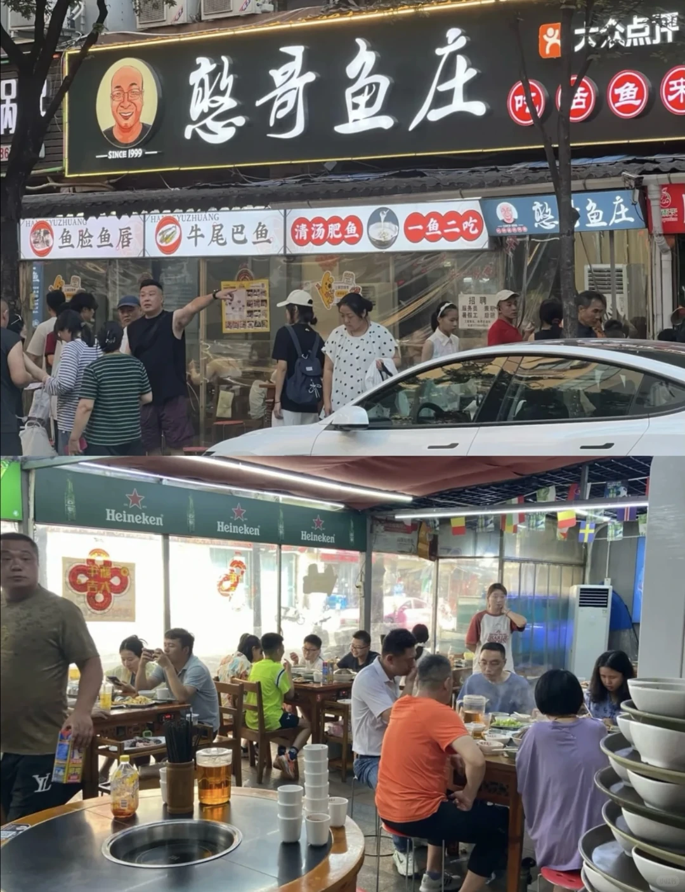
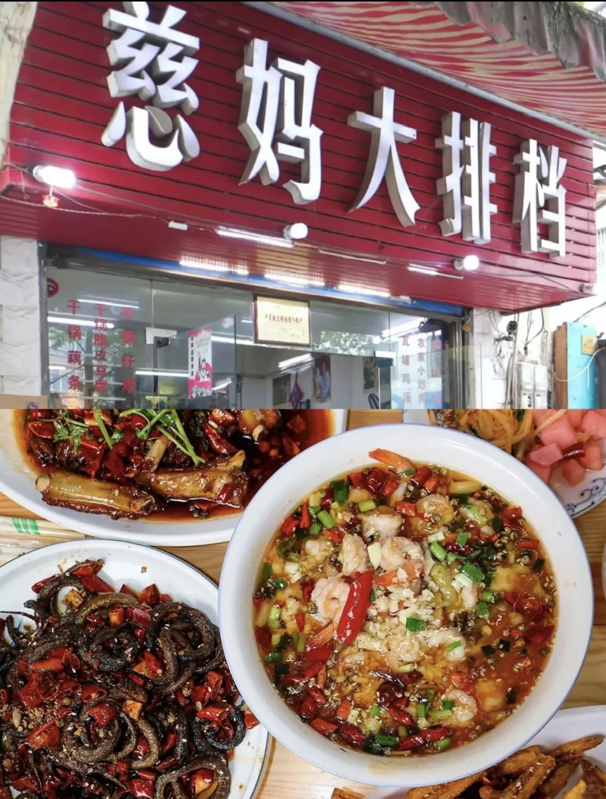

# 湖北宜昌小吃、小吃街及餐厅推荐～

- 作者: 晓晓带你玩湖北
- 👍21 · 💬 · ⭐20 · 图 7
- feed_id: 69280fa1000000001e0146fb

> [OCR] [?]
[?]

> [OCR] STYLE
Harper's
Fashion
FASHION FADES, ONLY STYLE REMAINS CONSTANT
NEW SEASON & 
CASINO
PREMIERE
OMG
CASINO
CINEMA
[?]
[?]
[?]
[?] 源夜巷
[?] 夜集市 越夜越精彩
[?] 新天地
5G
专业贴膜
专业贴膜
BEST COFFEE
WiFi
MODEL ISSUE
If you ever wonder what to wear always go for the classic look.

> [OCR] 铁路坝小吃街
省级特色商业街
铁路坝小吃街

> [OCR] 自己人
宜昌菜

CCTV推荐品牌
宜昌肥鱼 地标餐厅
宜昌餐饮 美食名片

香辣
刁子鱼
宜昌名菜
冠 军

> [OCR] 福厨
福厨滋味·百姓生活
千福万福福中福
Fuchu
Fuchu
Fuchu
記録吃喝日常
好心情是被美食治愈的

> [OCR] 憨哥鱼庄
SINCE 1999
大众点评
憨哥鱼庄
牛尾巴鱼 清汤肥鱼 一鱼二吃
憨哥鱼庄
鱼脸鱼唇
Heineken
Heineken
Heineken
[?]

> [OCR] 慈妈大排档
干锅藕条
锅贴皮豆腐汤
瓦罐鸡汤
农家小炒肉
麻婆豆腐

## 正文
宜昌特色小吃及人气店铺推荐：
特色小吃
1. 萝卜饺子：现炸外酥里嫩，袁姐萝卜饺子（中山路店）是热门选择。
2. 凉虾：红糖凉虾清爽滑糯，推荐郑信记凉虾（致祥路店）或致祥王氏凉虾（解放路店）。
3. 胡记包子：牛肉包子（4元/个）皮薄馅大，需排队。
4. 矮子馅饼：外皮酥脆，可常温保存10天。
夜市推荐
📍 西陵区铁路坝小吃街、伍家岗香山福久源小吃街
市民平价餐厅及菜肴推荐（官方推荐）
- 福厨餐厅：湘菜招牌鱼头王。
- 憨哥鱼庄：现杀活鱼火锅。
- 自己人酒楼：肥鱼火锅、基围虾。
- 慈妈大排档：老字号本土风味。  #值得为吃而去的小城[话题]#

---