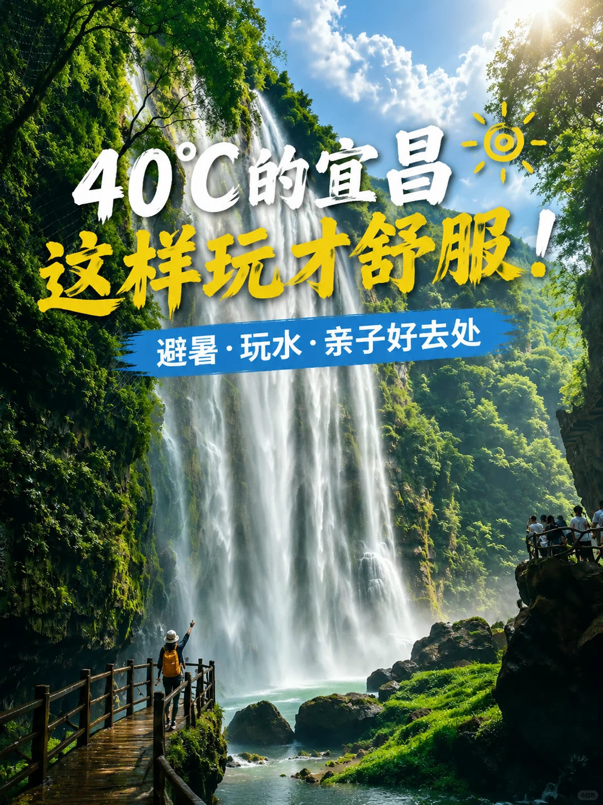
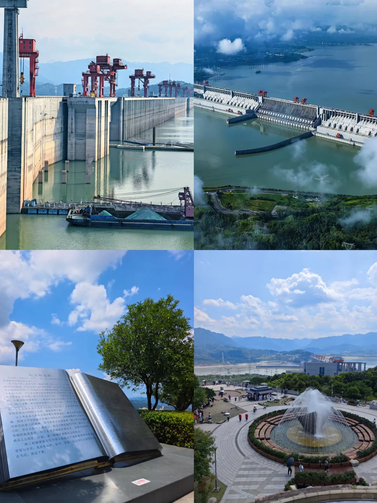
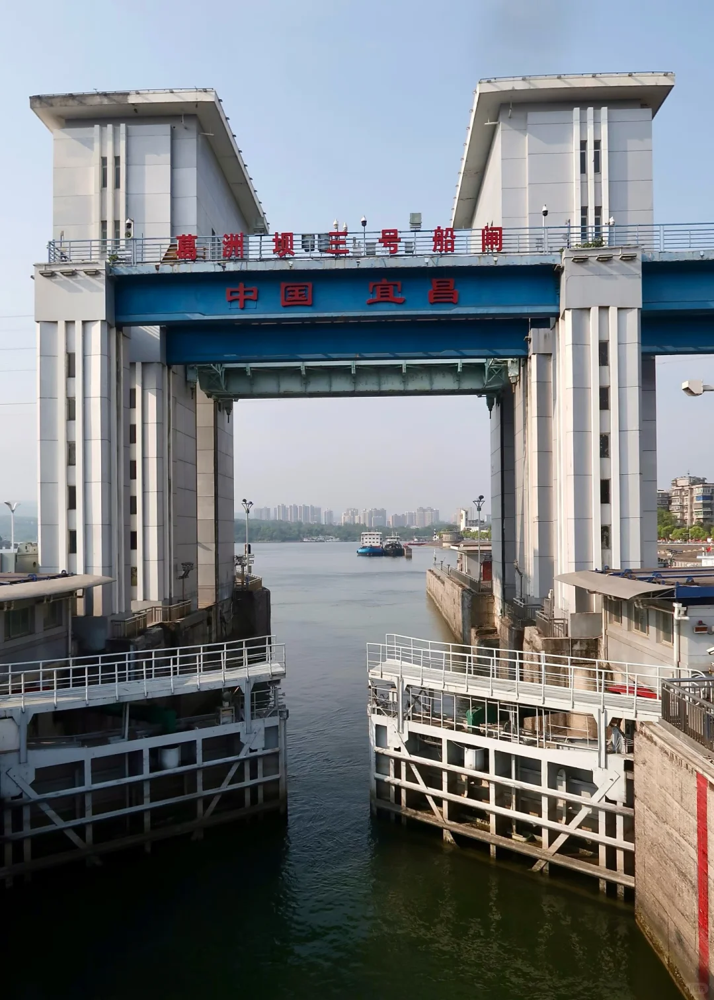
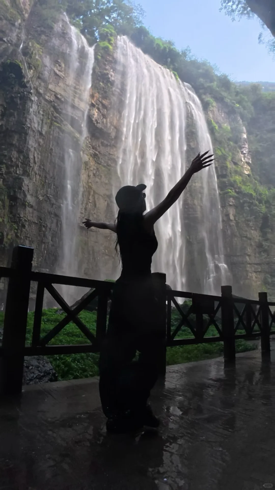
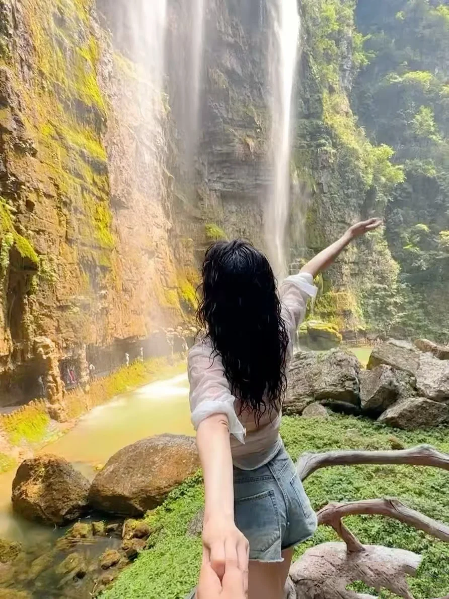
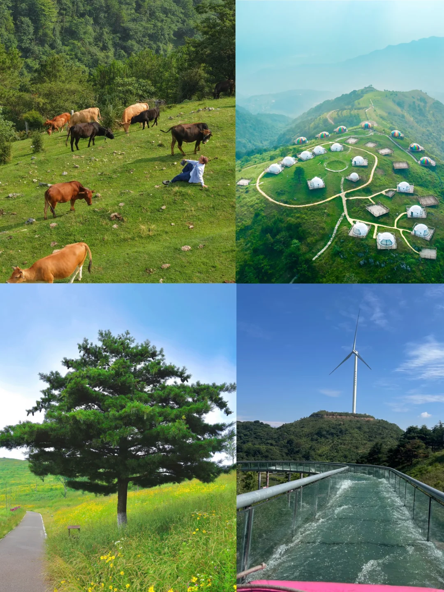
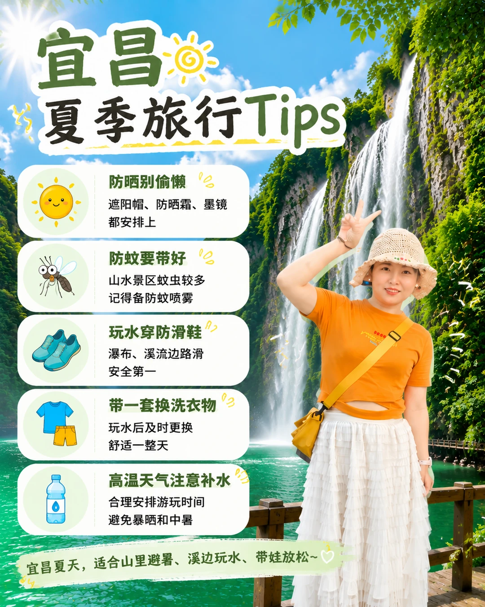

# 40℃来到宜昌，不建议这样玩❌

- 作者: 是悠悠呀
- 👍18 · 💬6 · ⭐27 · 图 8
- feed_id: 6a5a15cf0000000004028fa8

> [OCR] 40℃的宜昌☀️
这样玩才舒服！
避暑·玩水·亲子好去处

> [OCR] 上:三峡大坝

下:子陵遗迹

> [OCR] 三峡旅游

> [OCR] 葛洲坝三号船闸
中国宜昌

> [OCR] [?]

> [OCR] system

> [OCR] 牛
山
树
风车

> [OCR] 宜昌
夏季旅行Tips

防晒别偷懒
遮阳帽、防晒霜、墨镜都安排上

防蚊要带好
山水景区蚊虫较多记得备防蚊喷雾

玩水穿防滑鞋
瀑布、溪流边路滑安全第一

带一套换洗衣物
玩水后及时更换舒适一整天

高温天气注意补水
合理安排游玩时间避免暴晒和中暑

宜昌夏天，适合山里避暑、溪边玩水、带娃放松~

## 正文
这两天看到不少薯宝留言：
“来了宜昌，天气太热，三峡都没好好看。”
甚至有薯宝因为高温，酒店躺了3天直接返程。
作为一个宜昌本地人，我想告诉大家：
宜昌不是不能玩，而是夏天要选对玩法。
避开中午暴晒，把户外安排在早晚，把玩水、峡谷、森林安排进去，才是夏天打开宜昌的正确方式👇
① 两坝一峡｜夏天推荐“车去船回”，很多游客第一次来宜昌，会选择：
❌ 船去车回
但夏天我更推荐：
✅ 车去船回
上午：前往三峡大坝，早上的温度相对舒服，可以慢慢游览。
下午：天气热的时候，坐上游船。吹着空调或者站在甲板上，看西陵峡风光。
一路经过：
✔ 西陵峡
✔ 葛洲坝船闸
体验“水涨船高、水降船低”的过闸过程，这一趟不仅看风景，还能涨知识。
重点：把最热的时间留给船上，是夏季游三峡的小技巧。
② 朝天吼漂流｜夏天一定要安排一次玩水
📍高岚朝天吼漂流
宜昌出发约1.5小时。这里最大的优势：刺激和亲子可以同时满足。
喜欢挑战：
👉 户外刺激河道 一路尖叫，爽感拉满。
带孩子：
👉 洞漂 避晒、不担心翻船，更适合家庭。
一句话：夏天来到宜昌，没有漂流是不完整的。
③ 百里荒｜宜昌人的夏日后花园
如果你是自驾来宜昌，一定不要错过：
📍百里荒
这里夏天最大的魅力：不是景点有多密集，而是——凉快。山上平均体感温度舒适，牛羊成群，草地辽阔。
推荐：
⛺搭帐篷
🌿露营
👨‍👩‍👧带娃放空
不用赶行程，找个地方坐一天，这才是夏天旅行该有的样子。
④ 三峡大瀑布｜宜昌戏水天花板
带娃来宜昌，这里可以：
💦穿瀑布
体验水从头顶落下的快乐。
提醒：不要只带雨衣！
建议：
✅ 一套干爽衣服
✅ 防滑鞋
✅ 水枪（孩子快乐加倍）
今年还有：
✔ 飞拉达
✔ 观景电梯
可以增加更多体验。
宜昌夏季旅行Tips👇
☀️ 防晒一定做好
🦟 带防蚊水
👟 戏水准备防滑鞋
👕 玩水记得带换洗衣服
💦 高温天气注意补水，避免中暑
宜昌夏天还有很多宝藏玩法。如果你知道哪些避暑好地方，欢迎评论区告诉我👇
#勇敢的人先享受世界[话题]#  #小众避暑地[话题]# #城市周边游[话题]# #避开人流的旅游地[话题]# #值得N刷的宝藏出游地[话题]# #视听长江遇见知音湖北[话题]# #旅游编辑部[话题]# #夏日避暑好去处[话题]# #城市的一百种玩法[话题]# #就这样避暑[话题]#

---