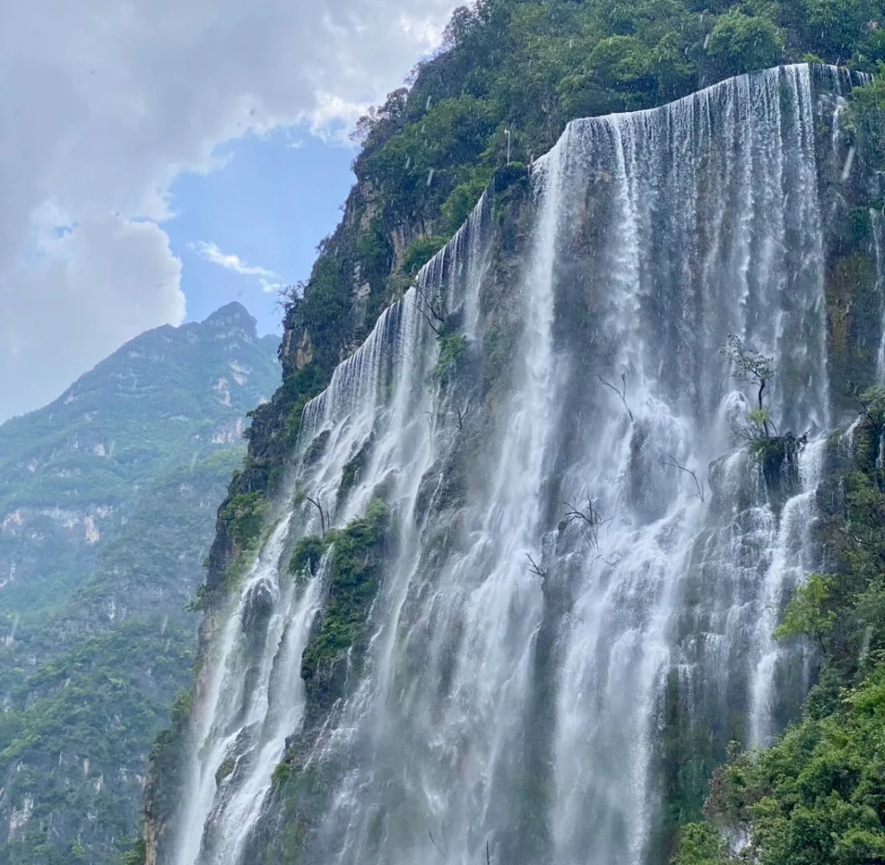
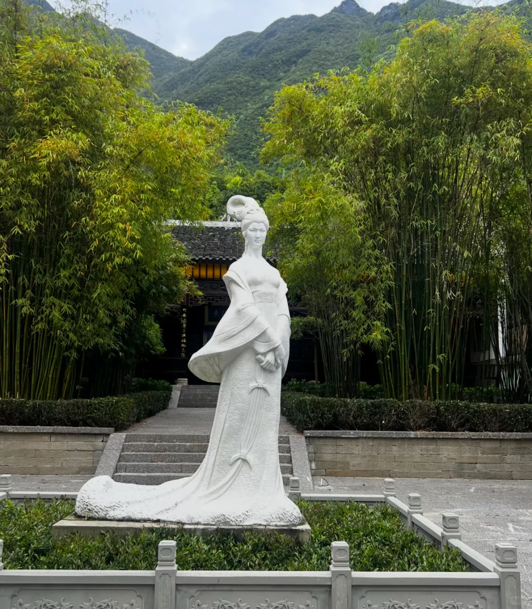
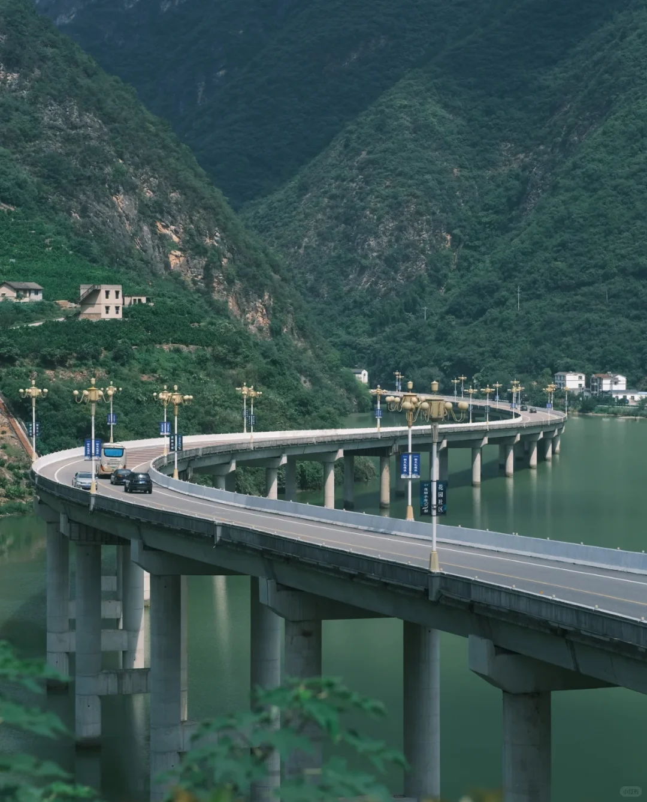
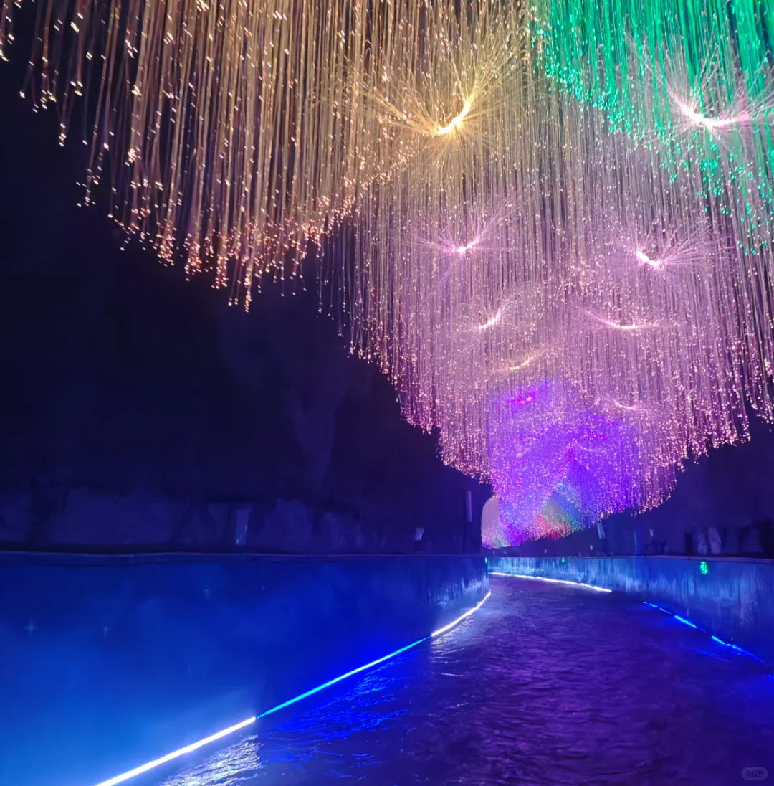
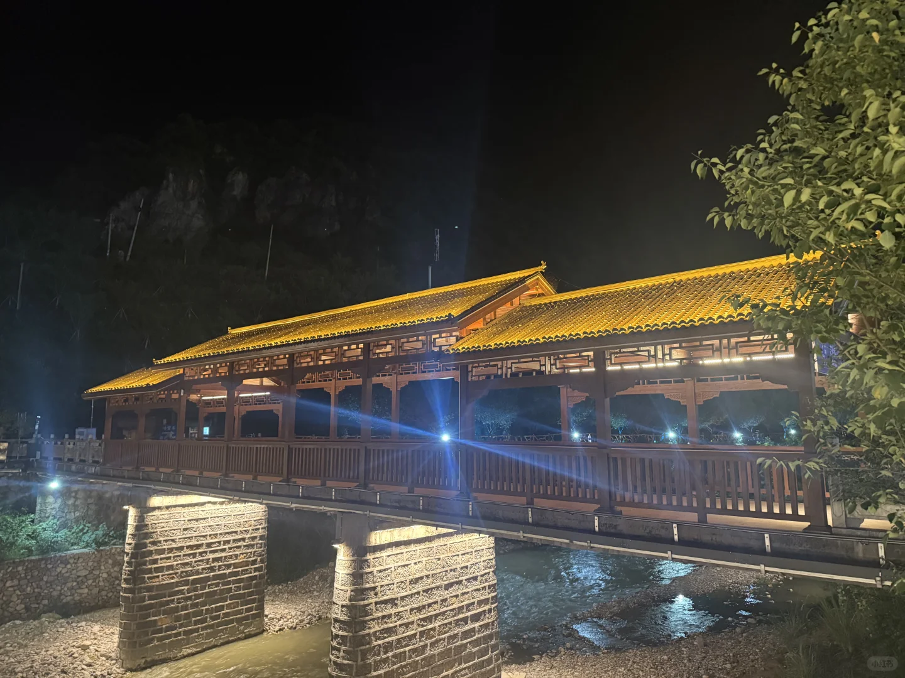
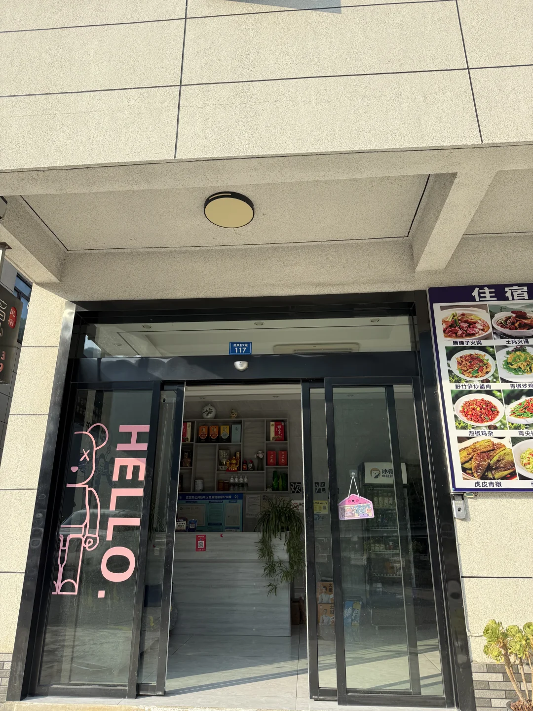

# 宜昌朝天吼漂流｜周边保姆级游玩攻略✨

- 作者: 吃完睡.
- 👍17 · 💬2 · ⭐10 · 图 6
- feed_id: 6a636446000000000a03b608

> [OCR] 青[?]

> [OCR] 花园小区

> [OCR] [?][?]

> [OCR] 小红书

> [OCR] 117
HELLO.
住宿
腊蹄子火锅 土鸡火锅
野竹笋炒腊肉 青椒炒鸡
泡椒鸡杂 青尖
虎皮青椒

## 正文
武汉周边避暑天花板来啦！
朝天吼漂流玩爽之后，周边山水人文一站式打卡，一日两日游都合适，整理了超全小红书版攻略，直接抄作业～
	
🌿【漂流后必逛周边景点】
▪️高岚大峡谷度假区（漂流终点步行可达！免费）
漂流完不用走远，立马解锁天然氧吧
80米落差的高岚大瀑布超震撼，晴天上午大概率能看到彩虹🌈
十里画廊峰林、卧佛山奇石，沿溪步道慢悠悠散步，浅滩踩水超舒服
还有玻璃滑道、山地卡丁车，放松解压刚刚好
	
▪️古昭水上公路（免费网红打卡点）
去往昭君村必经之路，湖北最美水上公路名不虚传
碧水青山蜿蜒穿行，沿途多处观景台，停车拍照巨出片，随手都是山水大片
	
▪️昭君村（车程40min）
漂流结束放慢节奏，沉浸式感受汉风古韵
昭君故居、古庭院、香溪河全景视野超绝
可以租汉服拍照，了解昭君出塞的故事，氛围感拉满，适合喜欢人文的姐妹
	
▪️高岚洞漂（怕刺激首选）
和朝天吼激流漂互补，溶洞光影漂流超梦幻
水流平缓，全程清凉，亲子、不敢玩险滩的朋友可以冲
	
📍经典行程安排
✅一日游紧凑版
上午朝天吼激情漂流→中午农家菜干饭→下午高岚大峡谷逛瀑布吸氧→打卡水上公路→返程
✅两日松弛版
Day1：抵达兴山，玩朝天吼漂流，傍晚民宿烧烤，晚上可体验夜漂
Day2：高岚峡谷徒步→昭君村逛古村→水上公路拍照返程
	
🍜本地美食推荐
兴山土家菜真的香！
渣广椒炒腊肉、清江酸汤鱼、农家野菜、土家熏肠
景区周边农家乐人均50+，分量超足，漂流完补充体力绝了
	
🏨住宿选择
▫️就近住：独家记忆民宿离漂流点近，干净卫生是新装修的吃住一站式 早起不用赶时间～
	
⚠️漂流&游玩避坑小贴士
	
1. 漂流一定要带速干衣、防滑拖鞋、防水手机袋，贵重物品寄存好
	
2. 周末人流大，尽量工作日错峰，瀑布上午光线拍照更好看
	
3. 自驾最方便，沪蓉高速直达，宜昌也有直通车
	
4. 山里早晚微凉，带一件薄外套，玩水记得做好防晒
	
夏天就该玩水看山！逃离城市闷热，来朝天吼一站式玩透山水～
#宜昌旅游[话题]# #朝天吼漂流[话题]# #武汉周边避暑[话题]# #湖北小众旅行[话题]# #兴山游玩攻略[话题]# #夏日漂流好去处[话题]#

---