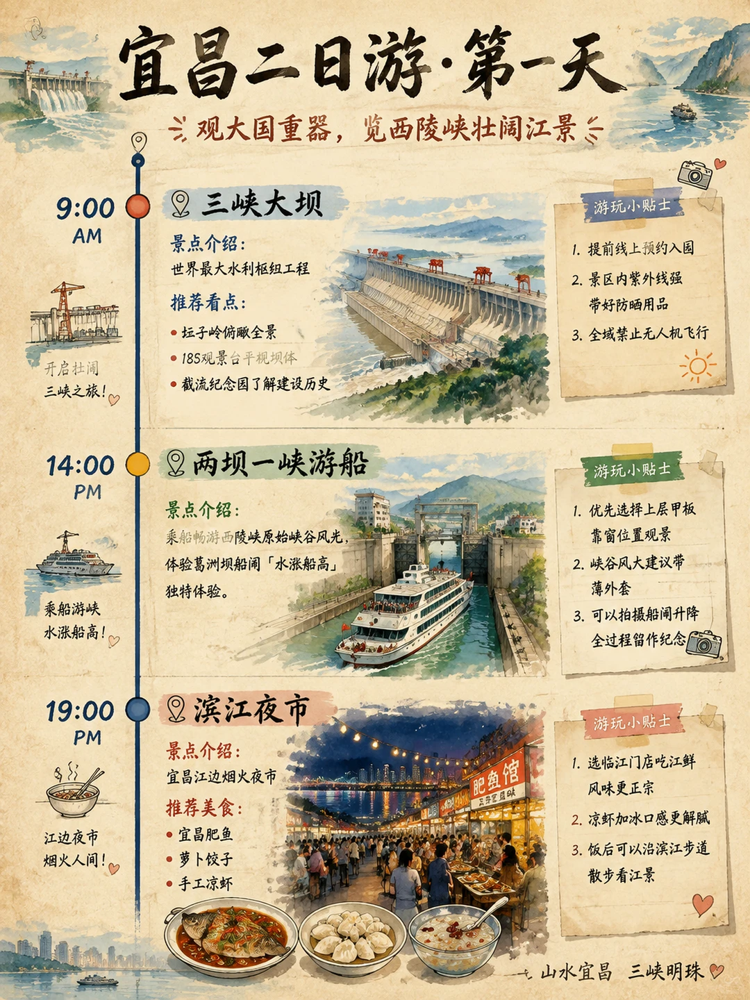
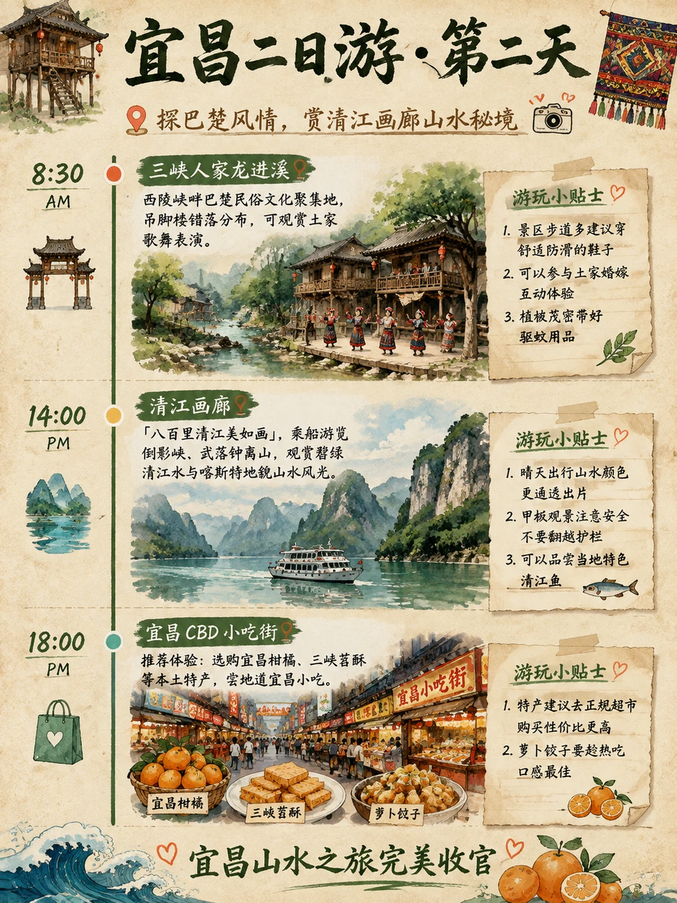

# 谁能拒绝：宜昌两天一夜超松弛旅游攻略

- 作者: 王安全的富贵儿
- 👍20 · 💬7 · ⭐15 · 图 2
- feed_id: 6a77ebb80000000032021a5a

> [OCR] 宜昌二日游·第一天
三峡大坝
景点介绍：
世界最大水利枢纽工程
推荐看点：
- 坛子岭俯瞰全景
- 185观景台平视坝体
- 截流纪念园了解建设历史

游玩小贴士
1. 提前线上预约入园
2. 景区内紫外线强
带好防晒用品
3. 全域禁止无人机飞行

两坝一峡游船
景点介绍：
乘船畅游西陵峡原始峡谷风光，
体验葛洲坝船闸「水涨船高」
独特体验。

游玩小贴士
1. 优先选择上层甲板
靠窗位置观景
2. 峡谷风大建议带
薄外套
3. 可以拍摄船闸升降
全过程留作纪念

滨江夜市
景点介绍：
宜昌江边烟火夜市
推荐美食：
- 宜昌肥鱼
- 萝卜饺子
- 手工凉虾

游玩小贴士
1. 选临江门店吃江鲜
风味更正宗
2. 凉虾加冰口感更解腻
3. 饭后可以沿滨江步道
散步看江景

山水宜昌 三峡明珠

> [OCR] 宜昌二日游·第二天

探巴楚风情，赏清江画廊山水秘境
8:30 AM
三峡人家龙进溪
西陵峡畔巴楚民俗文化聚集地，
吊脚楼错落分布，可观赏土家歌舞表演。
游玩小贴士
1. 景区步道多建议穿舒适防滑的鞋子
2. 可以参与土家婚嫁互动体验
3. 植被茂密带好驱蚊用品

14:00 PM
清江画廊
「八百里清江美如画」，乘船游览倒影峡、武落钟离山，观赏碧绿清江水与喀斯特地貌山水风光。
游玩小贴士
1. 晴天出行山水颜色更通透出片
2. 甲板观景注意安全不要翻越护栏
3. 可以品尝当地特色清江鱼

18:00 PM
宜昌CBD小吃街
推荐体验：选购宜昌柑橘、三峡苕酥等本土特产，尝地道宜昌小吃。
游玩小贴士
1. 特产建议去正规超市购买性价比更高
2. 萝卜饺子要趁热吃口感最佳

宜昌山水之旅完美收官

## 正文
江边吹来的风都裹着清润的水汽🍃
花了不少心思整理出这份手绘攻略
不用刻意赶点位，顺着心情逛就很舒服
把宜昌值得停留的小美好都收录进来了
来玩的朋友直接码住参考就好，省超多事
#手绘地图[话题]# #旅游攻略[话题]# #带着手账去旅行[话题]# #城市速写[话题]# #宜昌旅行[话题]# #带着手帐去旅行[话题]##本地人做的攻略[话题]#

---