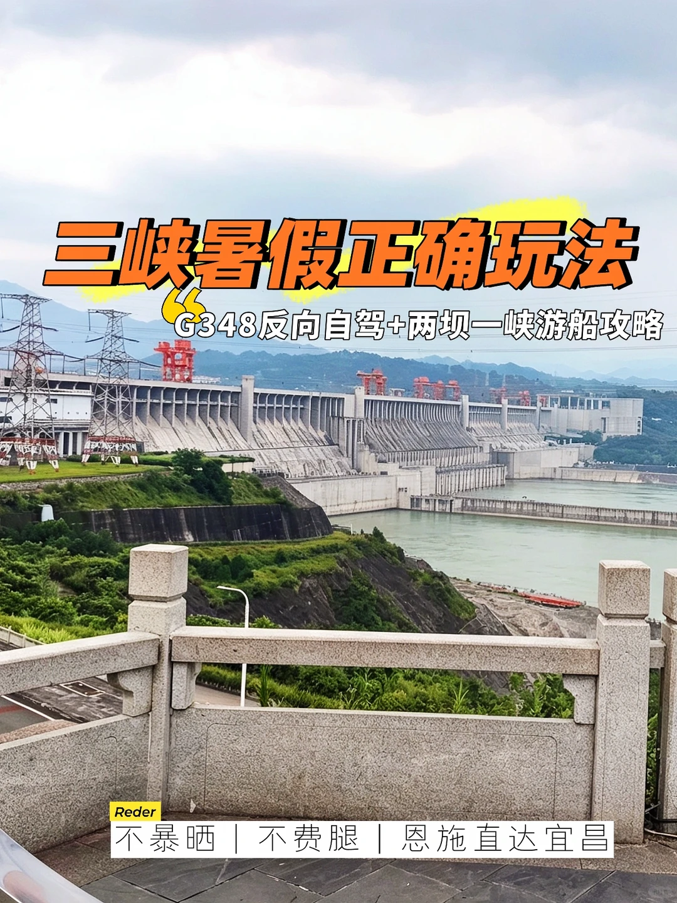
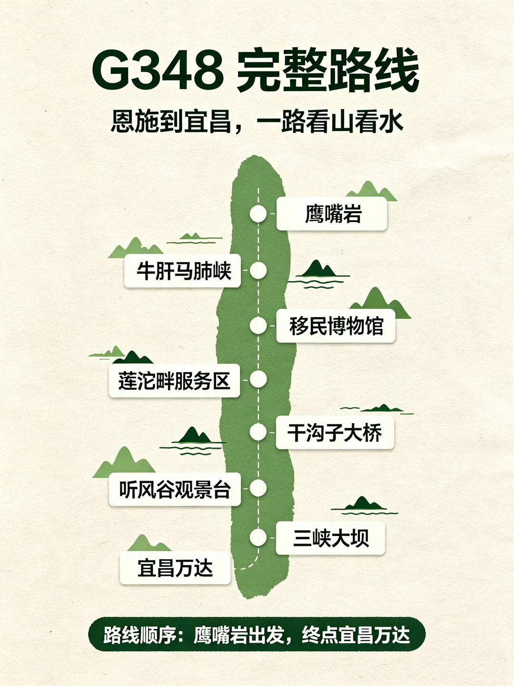
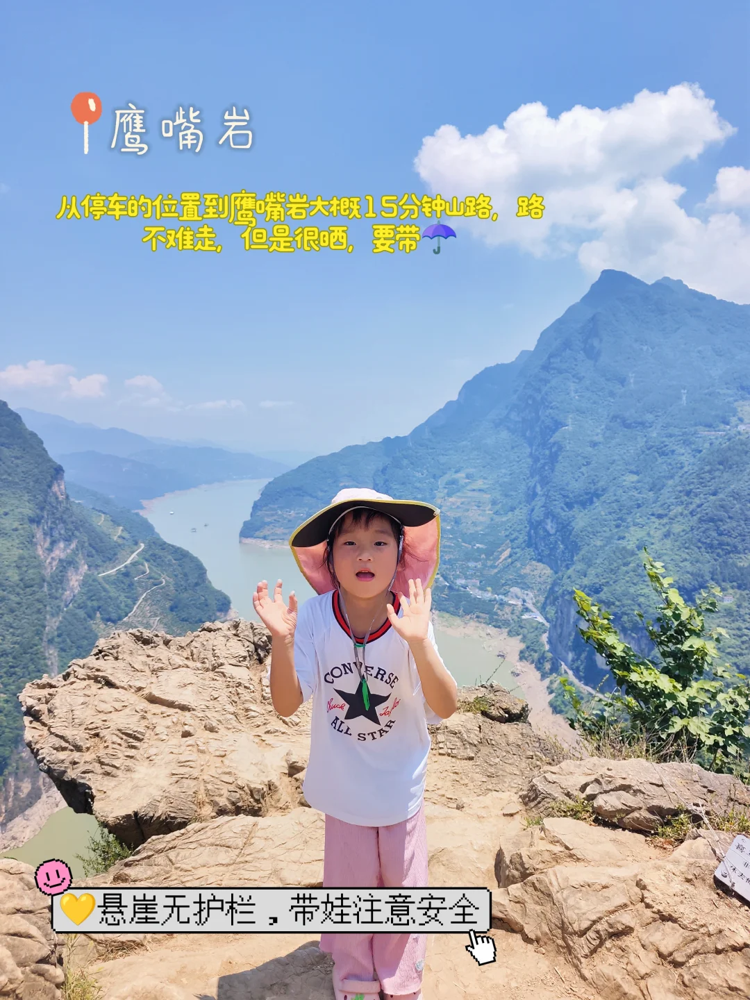
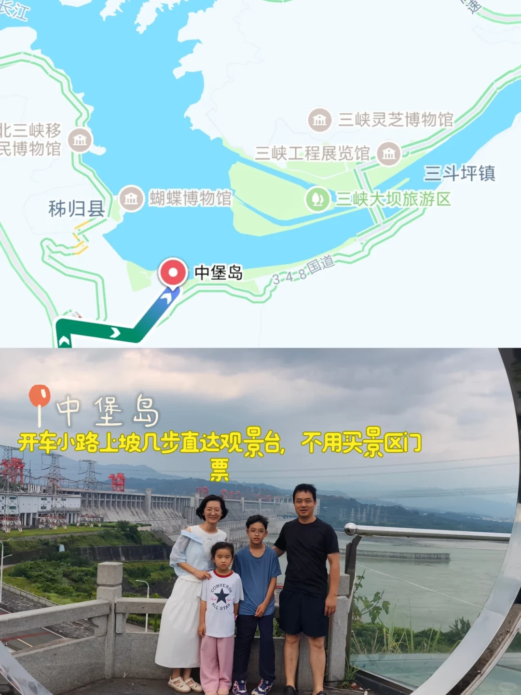
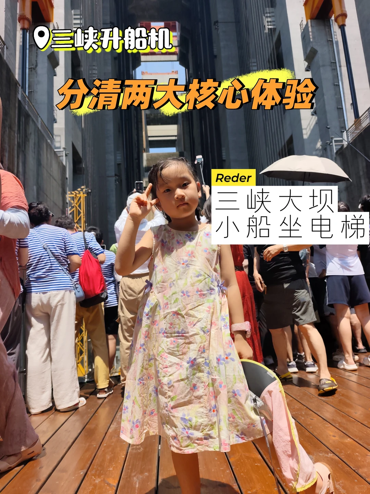
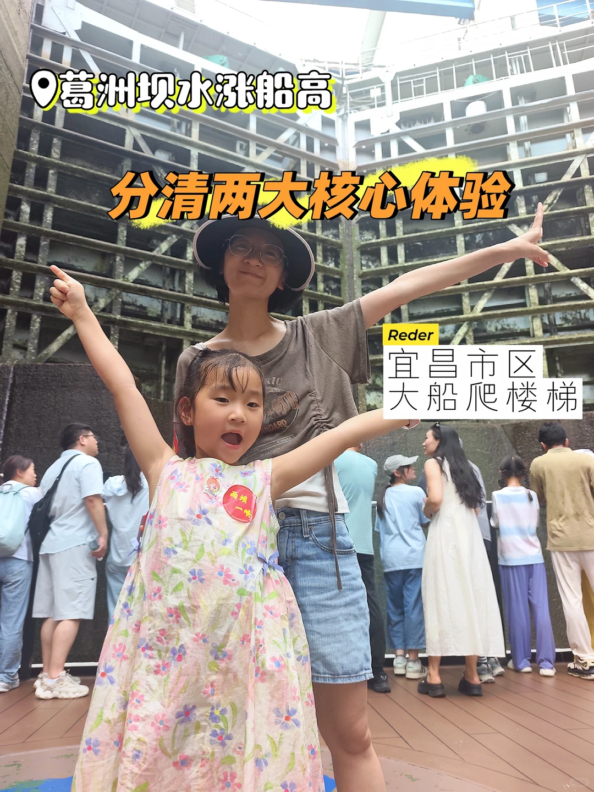
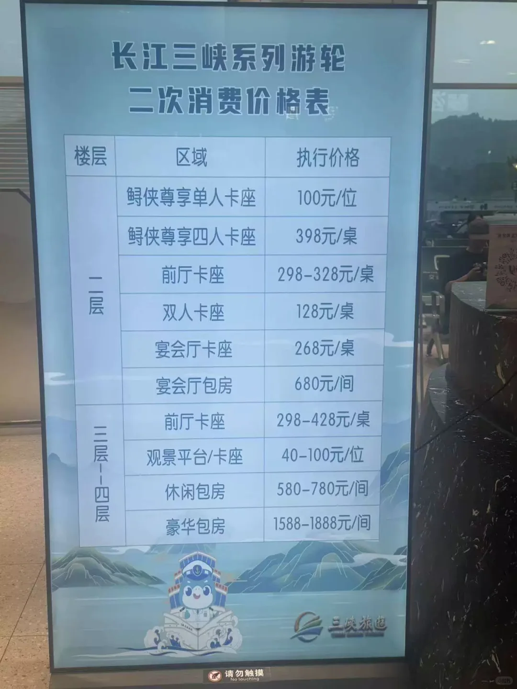
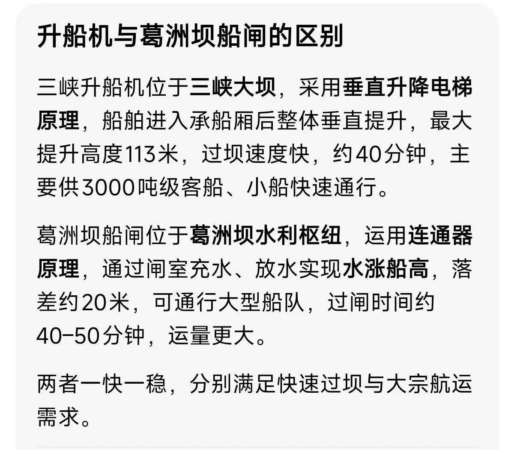

# 三峡暑假｜G348反向自驾+两坝一峡游船攻略

- 作者: 晴天小花妈妈
- 👍16 · 💬3 · ⭐17 · 图 10
- feed_id: 6a7733fd000000002402d17c

> [OCR] 三峡暑假正确玩法
“G348反向自驾+两坝一峡游船攻略

不暴晒 | 不费腿 | 恩施直达宜昌
ReDer

> [OCR] G348 完整路线
恩施到宜昌,一路看山看水

鹰嘴岩
牛肝马肺峡
移民博物馆
莲沱畔服务区
干沟子大桥
听风谷观景台
三峡大坝
宜昌万达

路线顺序: 鹰嘴岩出发，终点宜昌万达

> [OCR] 鹰嘴岩
从停车的位置到鹰嘴岩大概15分钟山路，路不难走，但是很晒，要带伞
悬崖无护栏，带娃注意安全

> [OCR] 长江
北三峡移民博物馆
秭归县
蝴蝶博物馆
三峡灵芝博物馆
三峡工程展览馆
三峡大坝旅游区
三斗坪镇
中堡岛
3-4-8国道
中堡岛
开车小路上坡几步直达观景台，不用买景区门票

> [OCR] ReDer
全程车上观景，没有勇气频繁下车拍照，
太热了…

> [OCR] 三峡升船机
分清两大核心体验
ReDeR
三峡大坝小船坐电梯

> [OCR] 葛洲坝水涨船高
分清两大核心体验
Reder
宜昌市区大船爬楼梯

> [OCR] 长江三峡系列游轮
二次消费价格表

楼层 区域 执行价格
一层 鲟侠尊享单人卡座 100元/位
鲟侠尊享四人卡座 398元/桌
前厅卡座 298-328元/桌
双人卡座 128元/桌
宴会厅卡座 268元/桌
宴会厅包房 680元/间

三层 前厅卡座 298-428元/桌
观景平台/卡座 40-100元/位
休闲包房 580-780元/间
豪华包房 1588-1888元/间

> [OCR] 升船机与葛洲坝船闸的区别

三峡升船机位于三峡大坝，采用垂直升降电梯原理，船舶进入承船厢后整体垂直提升，最大提升高度113米，过坝速度快，约40分钟，主要供3000吨级客船、小船快速通行。

葛洲坝船闸位于葛洲坝水利枢纽，运用连通器原理，通过闸室充水、放水实现水涨船高，落差约20米，可通行大型船队，过闸时间约40-50分钟，运量更大。

两者一快一稳，分别满足快速过坝与大宗航运需求。

> [OCR] Reder 船上补给&出行必备

冰淇淋18元/支，
免费冰水无限续
必带：防晒衣、
冰贴、遮阳伞、
扑克、零食

## 正文
实测：这是暑假唯一不暴晒、不费腿、体验最完整的三峡玩法！
🌄 G348反向自驾｜恩施→宜昌完整点位
完整路线：
	
① 鹰嘴岩｜入峡第一站
导航：鹰嘴岩
恩施进三峡首个观景台，俯瞰西陵峡、牛肝马肺峡长江大拐弯
山路多弯慢行，山顶可停车，徒步10分钟登
⚠️无护栏，带娃务必注意安全
② 三峡移民水下博物馆（自驾日必去）
📍秭归县
⚠️周一闭馆！游船当天没时间逛！
③ 中堡岛｜三峡大坝免费全景C位
导航：中堡岛（别搜三峡大坝景区）
尽头上坡小路，路边停车走几步即达观景台
✅免费无遮挡全景看三峡大坝
④ 三峡军事管制检查站（必经）
所有车辆人员必查！
需备好：身份证、驾驶证、行驶证，统一登记通行
⑤ 莲沱畔大桥+服务区
长江S弯绝美江景
⑥ 干沟子大桥｜星空之眼
新旧双桥形成天然“眼睛”造型
⑦ 0.618地质科普服务区
全线配套最完善，可补给充电
自带化石步道，直观看亿年地质地貌
⑧ 明月台观景台
长江110°月牙大拐弯，圆环取景框
⑨ 山外山观景台
双层悬挑平台，远眺西陵峡层层群山，安静治愈
⑩ 听风谷
悬空玻璃观景台，6亿年石灰岩地貌，恐高可跳过
☀️暑假千万别白天徒步逛三峡大坝！
无遮挡暴晒，地表近50度，巨热费腿易中暑
✅最佳组合：
第一天G348自驾看全景｜第二天坐船吹江风逛两坝
⛴ 两坝一峡游船｜精简超全攻略
两大核心体验（很多人搞混）
▪️三峡升船机（秭归）：大坝百米水上电梯，小船坐电梯
▪️葛洲坝水涨船高（市区夷陵）：大船爬楼梯船闸体验
往返路线选择
▪️船去车回：太早、走路多 ❌不推荐
▪️车去船回：8:30集合，全程坐船 ✅带娃首选
购票避坑
❌无单独升船机门票！只能套票
✅某鱼提前更划算，导游提前一晚对接
票价：
普通票300+：中午需换船，三楼露天江风舒服，下午我们加298升级独立茶位，独享桌椅更舒服（下午时间更长）
	
​VIP600+：全程不换船
	
船上实况
免费冰水可续｜冰淇淋18/支
​座位分：免费散座、卡座、付费观景、茶位
👉同行建议分开登船，更好抢窗边位
必带物品
防晒衣、遮阳伞、冰贴、墨镜
零食、水、扑克（打发时间）
	
💡硬核科普｜全国唯二国家战略工程
1. 三峡大坝：国家级战略水利枢纽，管控防洪、发电、航运，全程军事管制
​
2. 海南战略核潜艇基地：国家深海核心国防基地
#宜昌三峡[话题]# #G348三峡自驾线[话题]# #两坝一峡[话题]# #三峡大坝[话题]# #三峡升船机[话题]# #暑假亲子游[话题]#

---