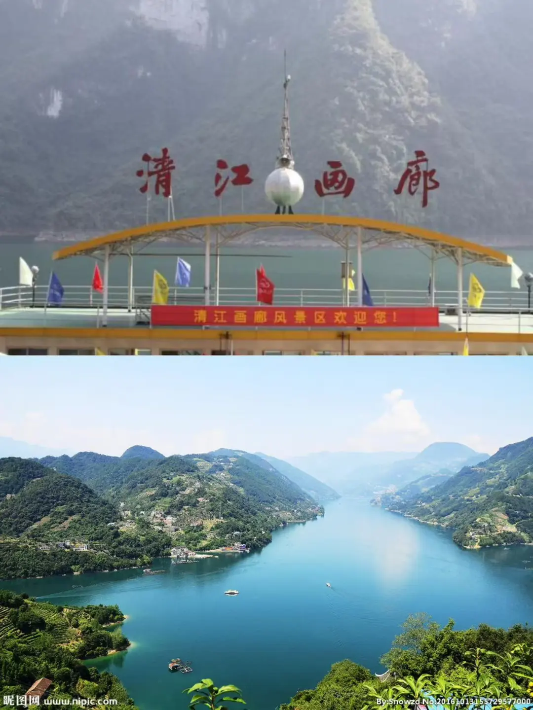
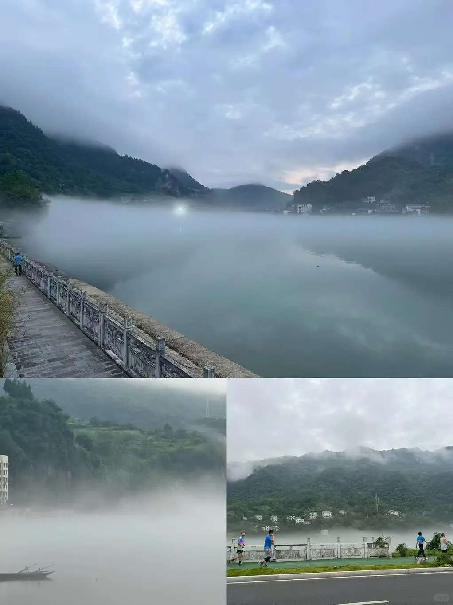
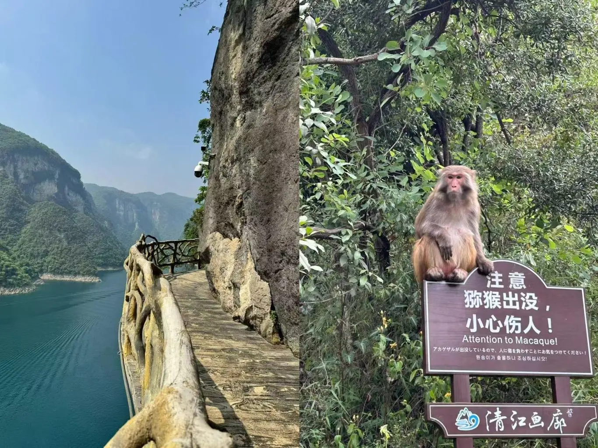
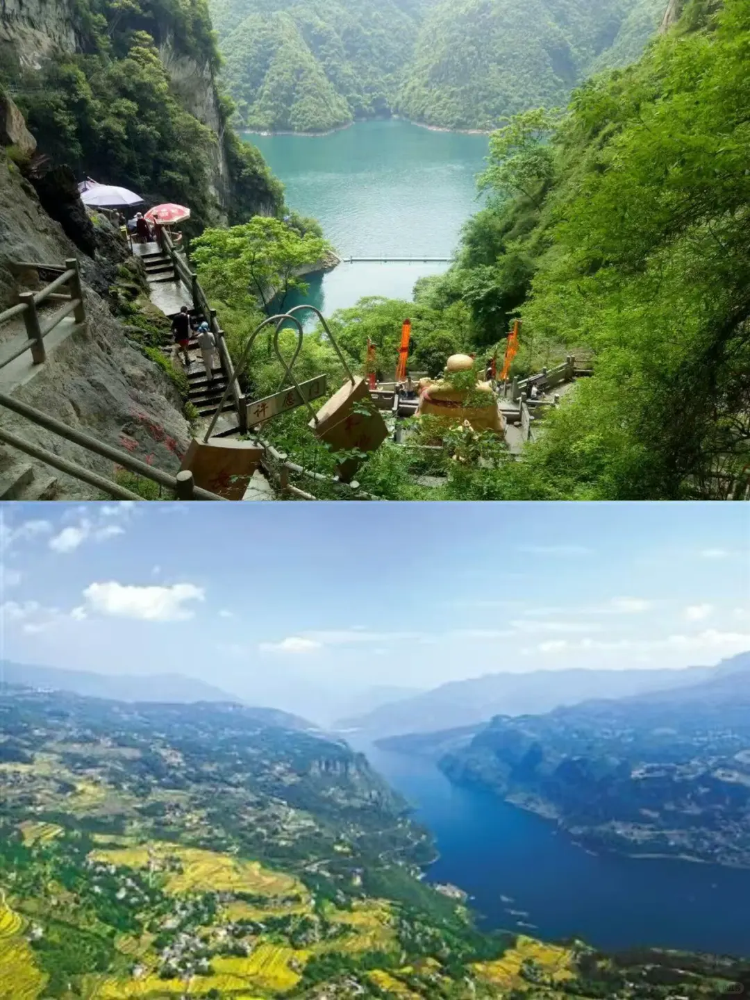
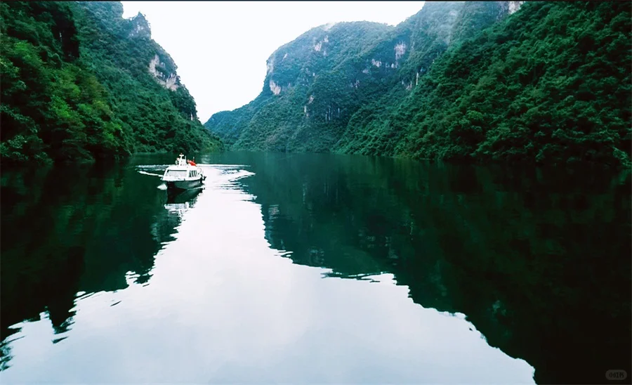
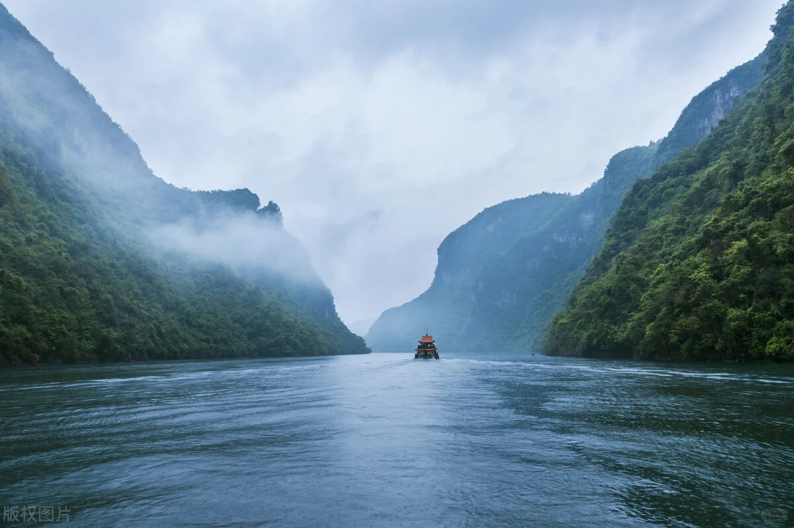
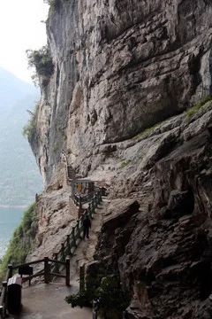

# 宜昌清江画廊｜闯入现实版千里江山图🌿

- 作者: 幻影
- 👍16 · 💬2 · ⭐5 · 图 13
- feed_id: 6a5ad88c000000000402a85d

> [OCR] 清江画廊
清江画廊风景区欢迎您！
www.nipic.com
By:Snowzd No20161013155729577000

> [OCR] [图片文字]

> [OCR] [?]

> [OCR] 注意
猕猴出没，
小心伤人！
Attention to Macaque!
アカゲザルが出没しているので、人に傷を負わすことにお気をつけてください！
원숭이가 출몰하니 조심해십시오!

> [OCR] 许愿
千[?]

> [OCR] HUAWA

> [OCR] 小红书

> [OCR] [?]

> [OCR] 版权图片

> [OCR] 美篇
@红豆杉
美篇号:54171471

> [OCR] [?]

## 正文
🌿【藏在湖北的山水诗画】
来湖北别再只盯着武汉和黄鹤楼啦！恩施的清江画廊才是真正被低估的“人间仙境”！八百里清江宛如一条翡翠丝带，蜿蜒在武陵山脉间，每一帧都像从古画里走出来的水墨长卷，美到失语！游玩后再到宜昌的市中心逛一逛再在长城酒店住一晚！体验感直接拉满
	
🛳️【游船体验：沉浸式入画】
一定要坐游船！推荐早上9点那班，晨雾未散时江面薄纱笼罩，山影朦胧如黛。船行江中，两岸峭壁千仞，瀑布飞珠溅玉，偶尔有土家吊脚楼点缀山腰，仿佛穿越进《千里江山图》。顶层甲板拍照绝佳，记得穿白色或浅色长裙，风扬起衣角时妥妥武侠女主！
	
📍必打卡点：
1️⃣ 蝴蝶崖🦋
清江标志性景观！两片山岩形似展翅蝴蝶，中间瀑布倾泻而下，阳光折射出彩虹时简直仙气爆棚！建议用广角镜头拍全景，无人机视角更震撼（注意景区限飞区哦）。
	
2️⃣ 仙人寨🌿
登高望远的好地方！沿着栈道徒步20分钟，沿途古藤缠绕、钟乳石奇诡，山顶俯瞰清江大拐弯，江水碧绿如玉带环绕，眼睛和心灵双重治愈～
	
3️⃣ 景阳河段🚤
这段江水颜色绝了！晴天是蒂芙尼蓝，阴天是墨绿色，手机原图直出都像加了滤镜。运气好能看到渔民划着木船撒网，瞬间get“孤舟蓑笠翁”的诗意画面。
	
📌实用Tips：
✔️ 门票+游船套票约150元，提前一天线上订票有优惠！
✔️ 游程约4小时，带好防晒帽、墨镜和充电宝，甲板紫外线超强！
✔️ 景区入口有土家腊肉炕土豆，10元一碗香到舔屏，别错过～
✔️ 自驾建议住恩施市区，车程1小时；自由行可报一日游含接送。
	
💬 后记：
回程时船工哼起土家山歌，悠扬的调子荡在山水间，突然懂了“山水养人”的含义。这里没有过度商业化的喧嚣，只有自然最本真的馈赠。如果你也厌倦了人挤人的景点，清江画廊会给你一场治愈灵魂的逃离🌙
	
📷 拍摄：iPhone原相机+醒图“青柠”滤镜
📍定位：湖北省恩施土家族苗族自治州·清江画廊旅游度假区
#湖北旅游[话题]# #小众旅行地[话题]# #山水画卷[话题]# #恩施旅游攻略[话题]# #治愈系风景[话题]#

---