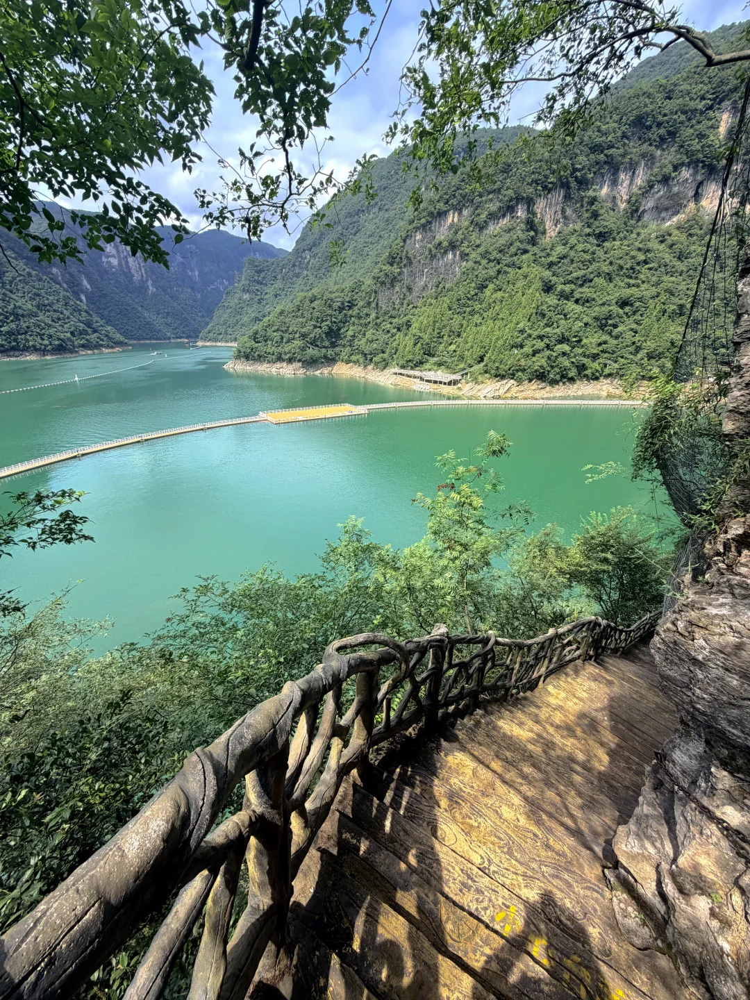
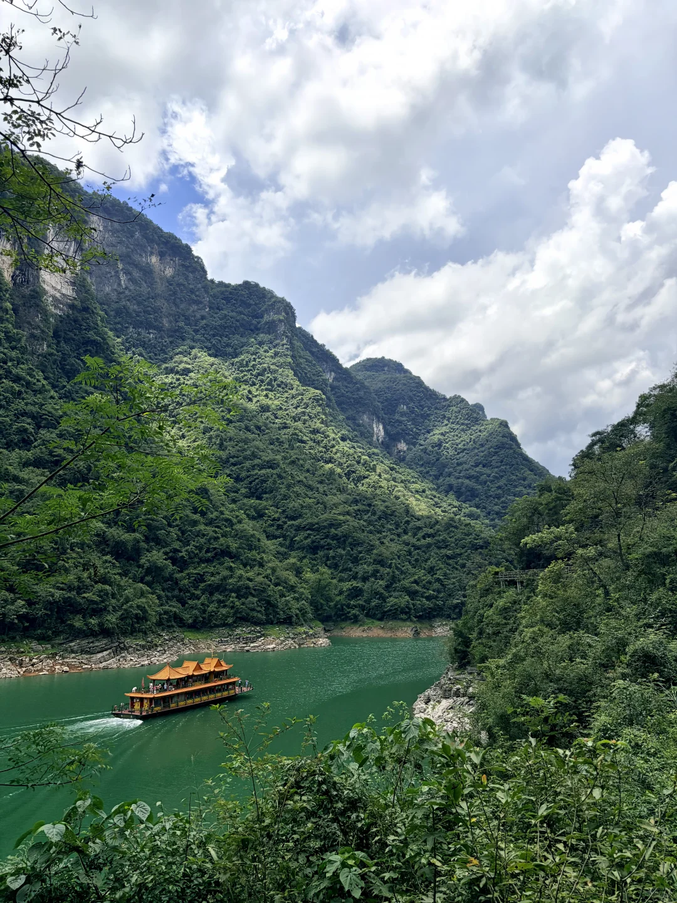
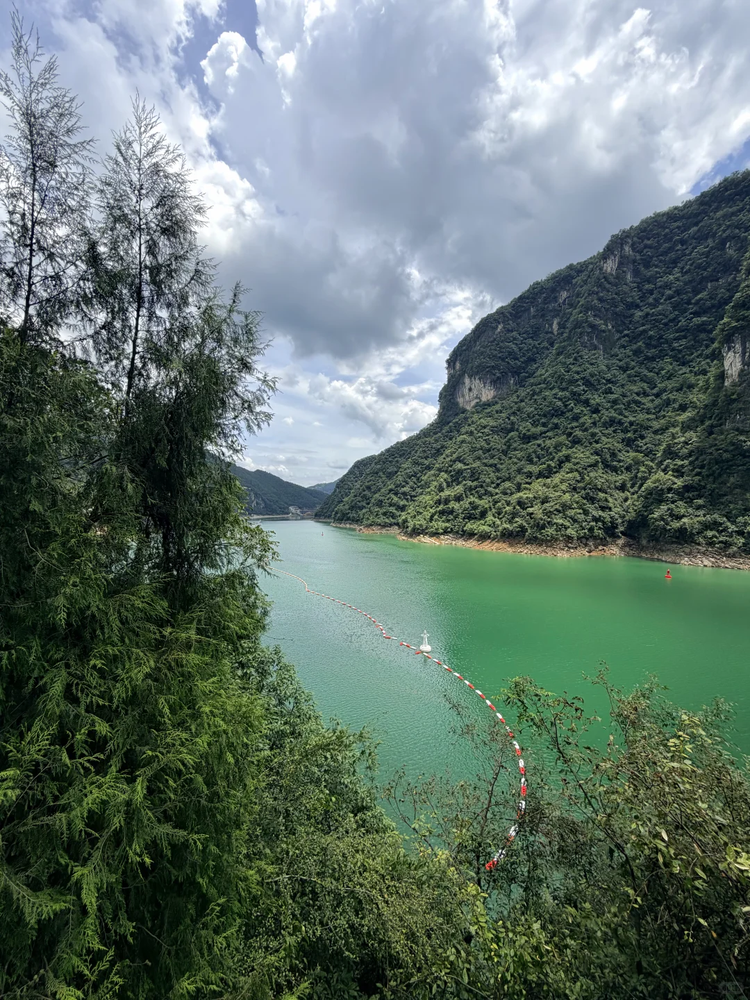
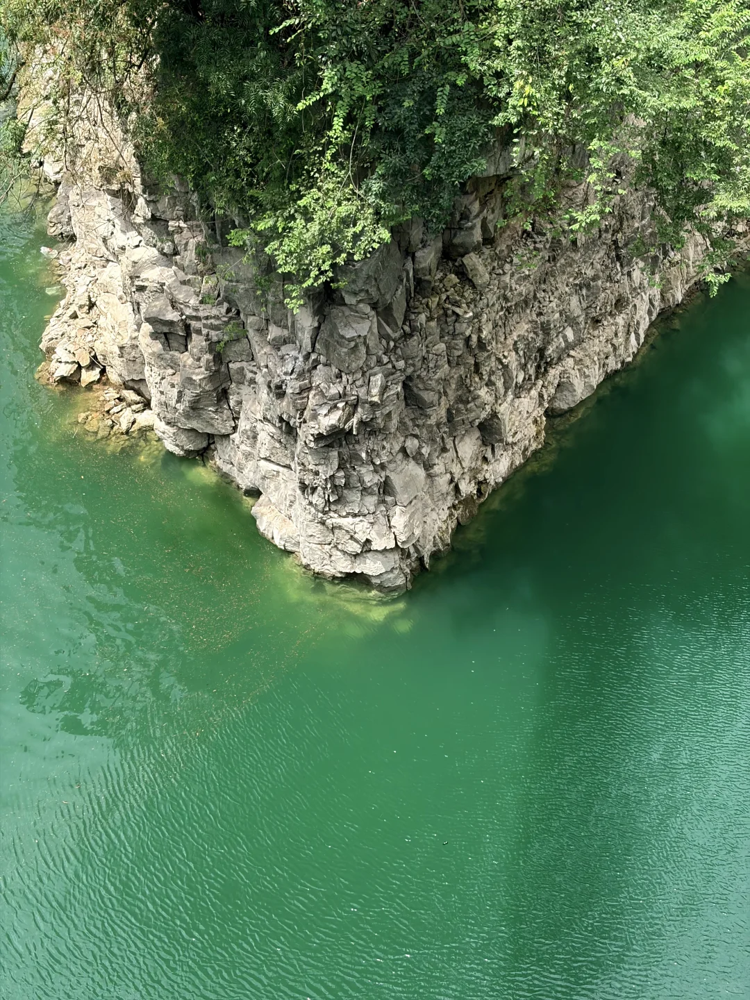
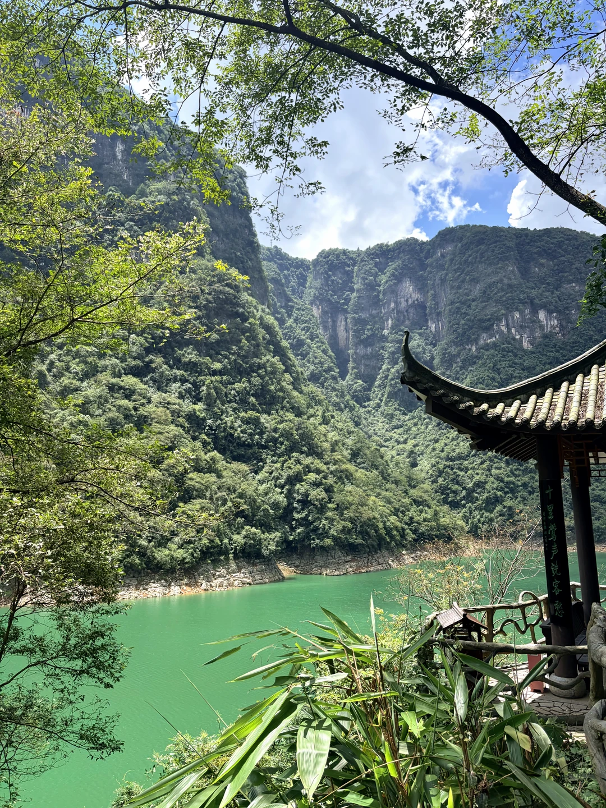
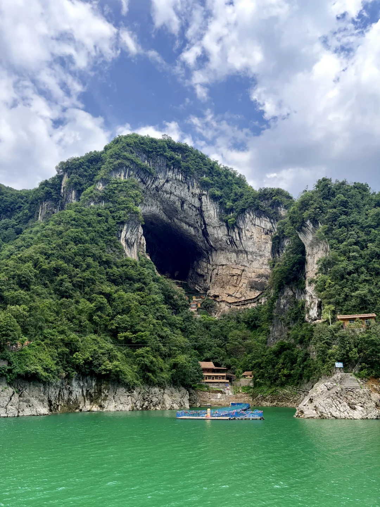
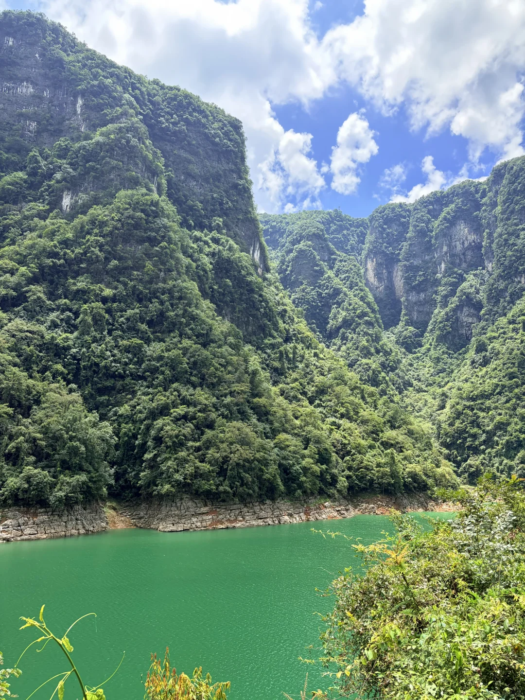
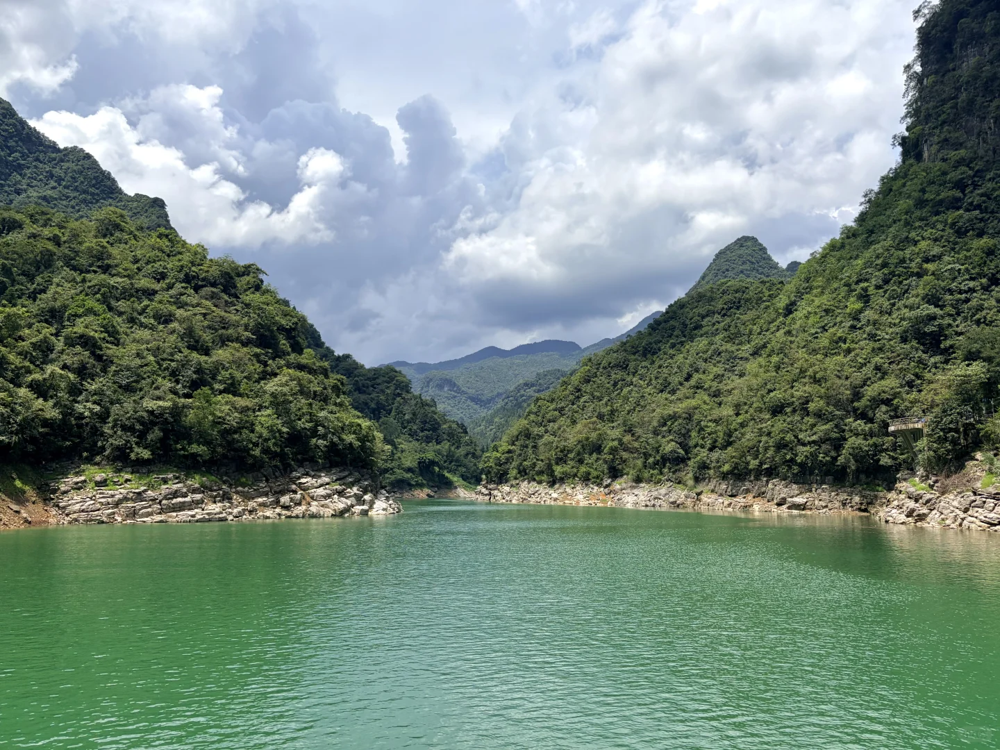

# 暴雨前一天的清江画廊

- 作者: March two-two
- 👍16 · 💬6 · ⭐5 · 图 8
- feed_id: 6a71cbc000000000060066c1

> [OCR] [?]

> [OCR] [?]

> [OCR] [?]

> [OCR] system

> [OCR] 十里莺声绕客愁

> [OCR] [?]

> [OCR] system

> [OCR] [?]

## 正文
本来还在吐槽太阳怎么这么大，怎么比武汉还热，
结果回程途中就大雨倾盆，今天已经闭园….
#宜昌[话题]# #旅游[话题]# #特种兵旅游[话题]# #清江画廊[话题]# #清江画廊b线[话题]# #三峡大坝[话题]# #三峡人家[话题]# #三峡[话题]# #摄影[话题]# #打卡[话题]#

---