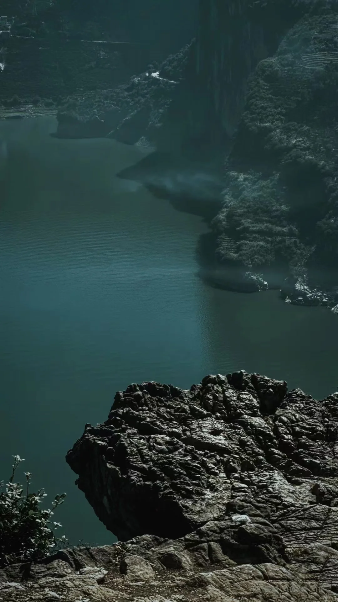

# 在宜昌找到了「恶魔之舌」

- 作者: Kk
- 👍15 · 💬8 · ⭐5 · 图 4
- feed_id: 6a72d18800000000320212b7

> [OCR] system

> [OCR] [?]

> [OCR] [?]

> [OCR] [?][?][?]

## 正文
站在百米悬崖边那块突出的岩石上，脚下就是碧绿的长江和牛肝马肺峡.
	
一块巨岩像鹰嘴一样伸向江心，无护栏、无门票、纯野生. 🚶徒步：停车后步行10-15分钟登顶，最后一段碎石路需手脚并用
	
#宜昌旅游[话题]# #宜昌周边游[话题]# #鹰嘴岩[话题]# #三峡[话题]# #秭归[话题]# #小众打卡地[话题]# #户外徒步[话题]# #悬崖拍照[话题]# #湖北旅游[话题]# #周末去哪儿[话题]# #自驾游[话题]#

---