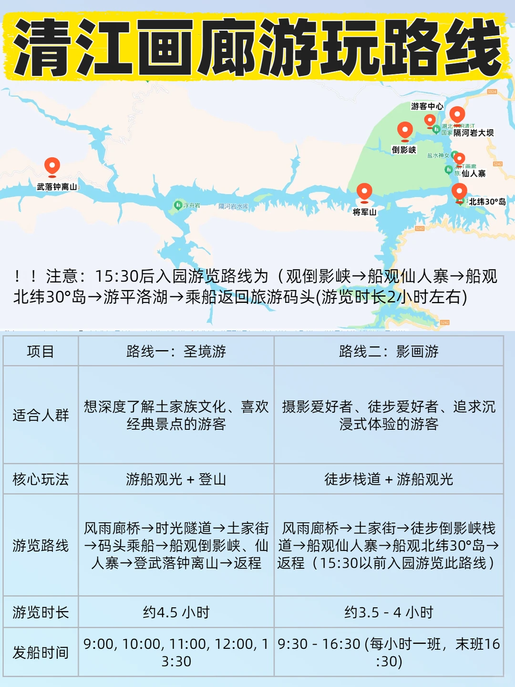
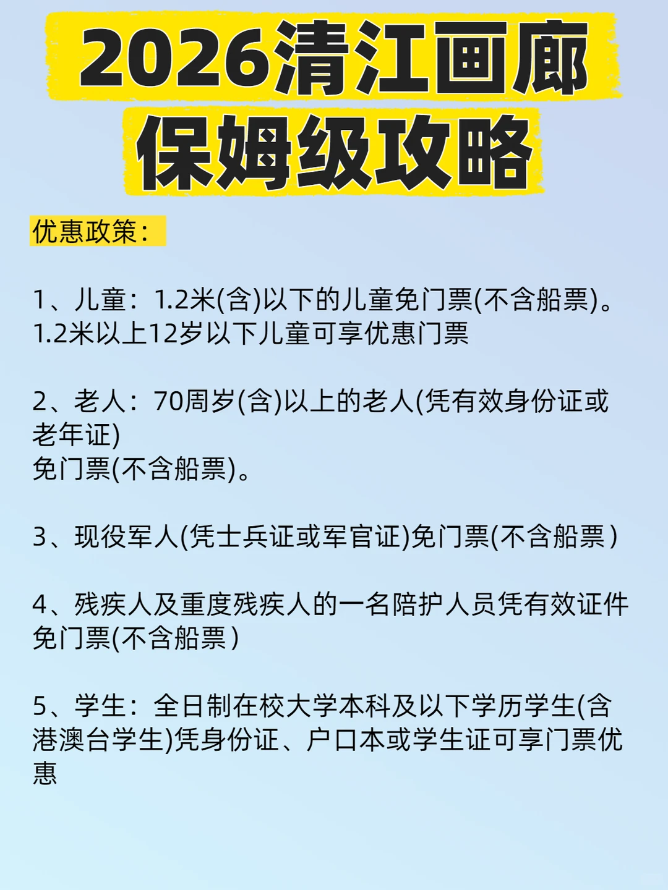
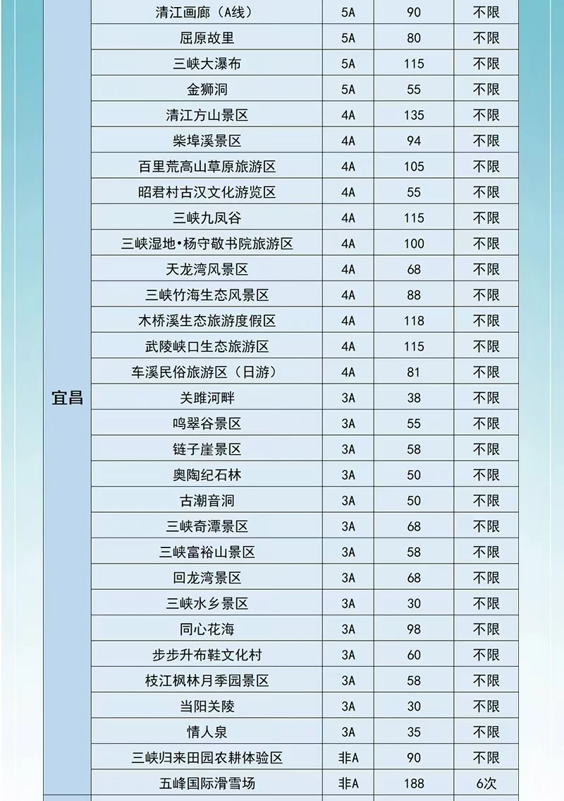

# 2026清江画廊保姆级攻略🔥看完轻松游玩！

- 作者: 惠游湖北
- 👍14 · 💬6 · ⭐22 · 图 6
- feed_id: 6a5dfc25000000000f029508

> [OCR] 2026清江画廊
保姆级攻略

> [OCR] 2026清江画廊
保姆级攻略

票价：门票90+船票55=145元（必买），湖北旅游惠民卡免门票

营业时间：08:00-17:30（16:30停止入园）

游玩时长：4-6小时

其他收费：非遗民俗演出《花咚咚的姐》98元（自选）《夷水丽川》VR体验58（自选）

交通：
①景区直通车：宜昌东站/三峡游客中心有景区直通车，建议提前去购票
②公交：在宜昌东站乘坐813路城际公交至长阳县城，再换乘8路公交直达景区
③自驾：导航“清江画廊游客中心”

《花咚咚的姐》演出时间：周一至周五:15:30
周六至周日:14:30、15:30

> [OCR] 清江画廊游玩路线

！！注意：15:30后入园游览路线为（观倒影峡→船观仙人寨→船观北纬30°岛→游平洛湖→乘船返回旅游码头(游览时长2小时左右)

项目 | 路线一：圣境游 | 路线二：影画游
---|---|---
适合人群 | 想深度了解土家族文化、喜欢经典景点的游客 | 摄影爱好者、徒步爱好者、追求沉浸式体验的游客
核心玩法 | 游船观光 + 登山 | 徒步栈道 + 游船观光
游览路线 | 风雨廊桥→时光隧道→土家街→码头乘船→船观倒影峡、仙人寨→登武落钟离山→返程 | 风雨廊桥→土家街→徒步倒影峡栈道→船观仙人寨→船观北纬30°岛→返程（15:30以前入园游览此路线）
游览时长 | 约4.5小时 | 约3.5 - 4小时
发船时间 | 9:00, 10:00, 11:00, 12:00, 13:30 | 9:30-16:30 (每小时一班，末班16:30)

> [OCR] 2026清江画廊
保姆级攻略

优惠政策：

1. 儿童：1.2米(含)以下的儿童免门票(不含船票)。
   1.2米以上12岁以下儿童可享优惠门票

2. 老人：70周岁(含)以上的老人(凭有效身份证或老年证)
   免门票(不含船票)

3. 现役军人(凭士兵证或军官证)免门票(不含船票)

4. 残疾人及重度残疾人的一名陪护人员凭有效证件
   免门票(不含船票)

5. 学生：全日制在校大学本科及以下学历学生(含港澳台学生)凭身份证、户口本或学生证可享门票优惠

> [OCR] 清江画廊夏日免费活动

①泡泡迎宾
活动时间：2026年7月19日至8月31日(每周六、周日)
营业时间：09:20-11:20
地点：清江画廊旅游码头站房广场、风雨楼区域
亮点：泡泡枪持续喷射高密度泡泡，营造梦幻氛围。主持人驻场互动，官宣开泼，带动现场氛围。

②嬉水小游戏
活动时间：2026年7月19日至8月31日(每周六、周日)
营业时间：09:20-11:20
地点：清江画廊旅游码头站房广场、风雨楼区域
亮点：猜拳定胜负-水瓢轻泼，三局两胜。蒙眼传水接力-比拼终点水量。水球大逃亡-圈内闪避水球，30秒极限挑战。纠错·泼水游戏-听指令抢水枪，射中即可赢取清江礼盒

③花家逐浪
活动时间：2026年7月19日至8月31日(每周六、周日)
游玩时间：10:20、11:20各一场，每场10-15分钟
地点：清江画廊旅游码头站房广场、风雨楼区域
亮点：消防水幕启动，漫天水雾笼罩全场。水枪对射、水瓢互泼、水球乱飞，尽享清凉夏日。

> [OCR] 宜昌
清江画廊（A线） 5A 90 不限
屈原故里 5A 80 不限
三峡大瀑布 5A 115 不限
金狮洞 5A 55 不限
清江方山景区 4A 135 不限
柴埠溪景区 4A 94 不限
百里荒高山草原旅游区 4A 105 不限
昭君村古汉文化游览区 4A 55 不限
三峡九凤谷 4A 115 不限
三峡湿地·杨守敬书院旅游区 4A 100 不限
天龙湾风景区 4A 68 不限
三峡竹海生态风景区 4A 88 不限
木桥溪生态旅游度假区 4A 118 不限
武陵峡口生态旅游区 4A 115 不限
车溪民俗旅游区（日游） 4A 81 不限
关雎河畔 3A 38 不限
鸣翠谷景区 3A 55 不限
链子崖景区 3A 58 不限
奥陶纪石林 3A 50 不限
古潮音洞 3A 50 不限
三峡奇潭景区 3A 68 不限
三峡富裕山景区 3A 58 不限
回龙湾景区 3A 68 不限
三峡水乡景区 3A 30 不限
同心花海 3A 98 不限
步步升布鞋文化村 3A 60 不限
枝江枫林月季园景区 3A 58 不限
当阳关陵 3A 30 不限
情人泉 3A 35 不限
三峡归来田园农耕体验区 非A 90 不限
五峰国际滑雪场 非A 188 6次

## 正文
🎟️票价：门票90+船票55=145元（必买），湖北旅游惠民卡免门票
⏰️营业时间：08:00-17:30（16:30停止入园）
🕛️游玩时长：4-6小时
💰️其他收费：非遗民俗演出《花咚咚的姐》98元（自选）《夷水丽川》VR体验58（自选）
‼️图6为湖北旅游惠民卡免门票景点
	
🚞交通：
①景区直通车：宜昌东站/三峡游客中心有景区直通车，建议提前去购票
②公交：在宜昌东站乘坐813路城际公交至长阳县城，再换乘8路公交直达景区
③自驾：导航“清江画廊游客中心”
	
💃《花咚咚的姐》演出时间：周一至周五:15:30；周六至周日:14:30、15:30
	
⚠️清江画廊注意事项：
1、游船上选择二层甲板，视野更佳。拍摄倒影峡时，坐在船右侧更容易出片
2、一定要穿舒适的鞋子
3、夏季太阳比较晒注意做好防中暑措施
4、如果要玩景区内的夏日泼水节活动，一定要自备水枪和一套干的换洗衣服
	
#宜昌旅游[话题]# #清江画廊[话题]# #清江画廊攻略[话题]# #清江画廊🎨[话题]# #清江画廊旅游[话题]# #清江画廊攻略[话题]# #清江画廊游玩攻略[话题]#

---