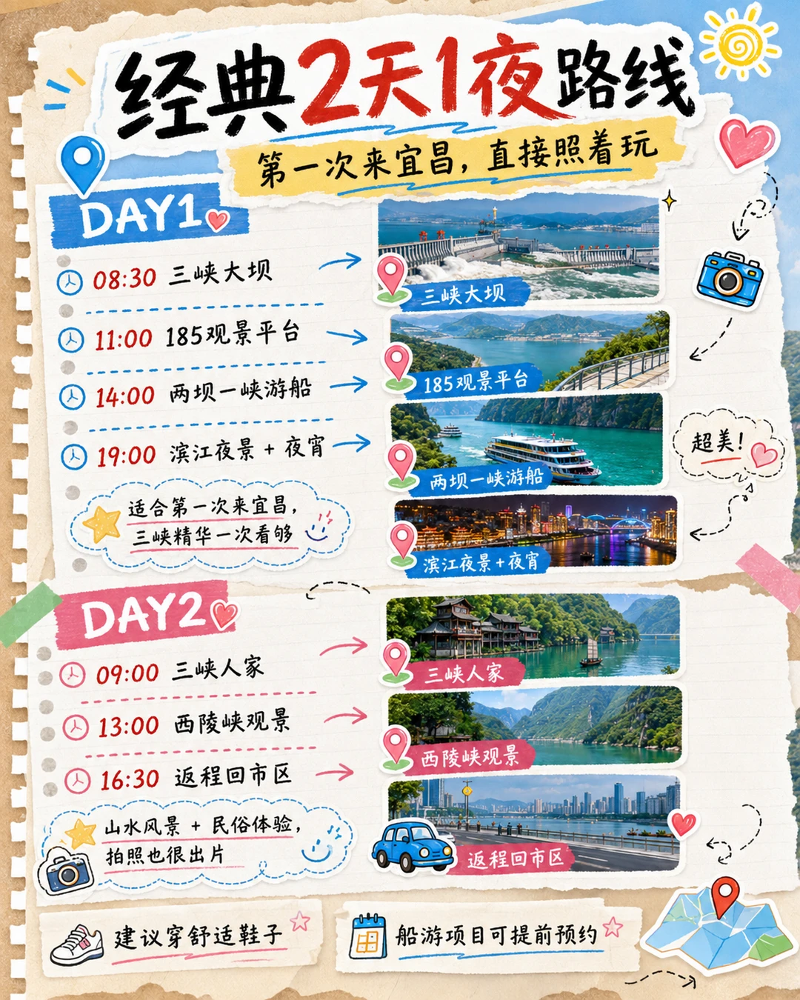
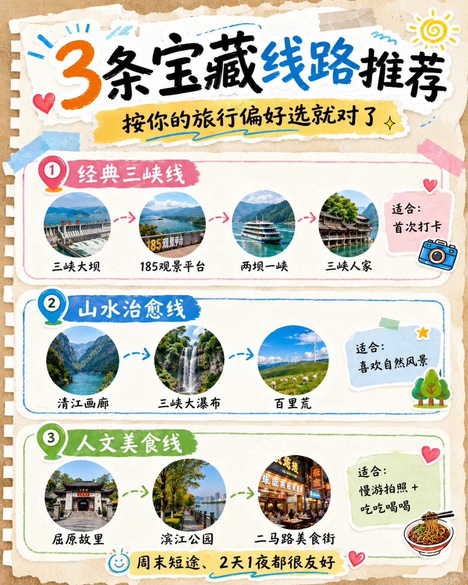
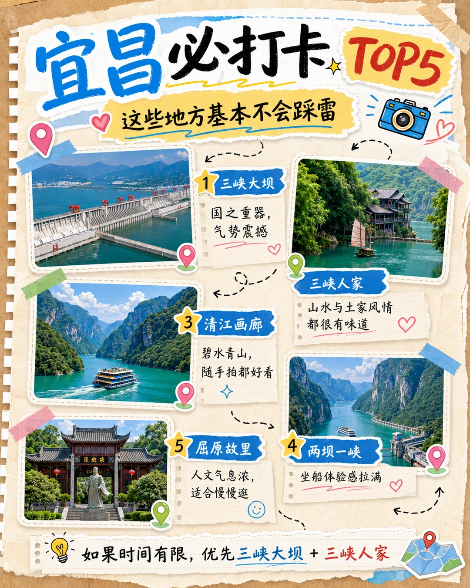
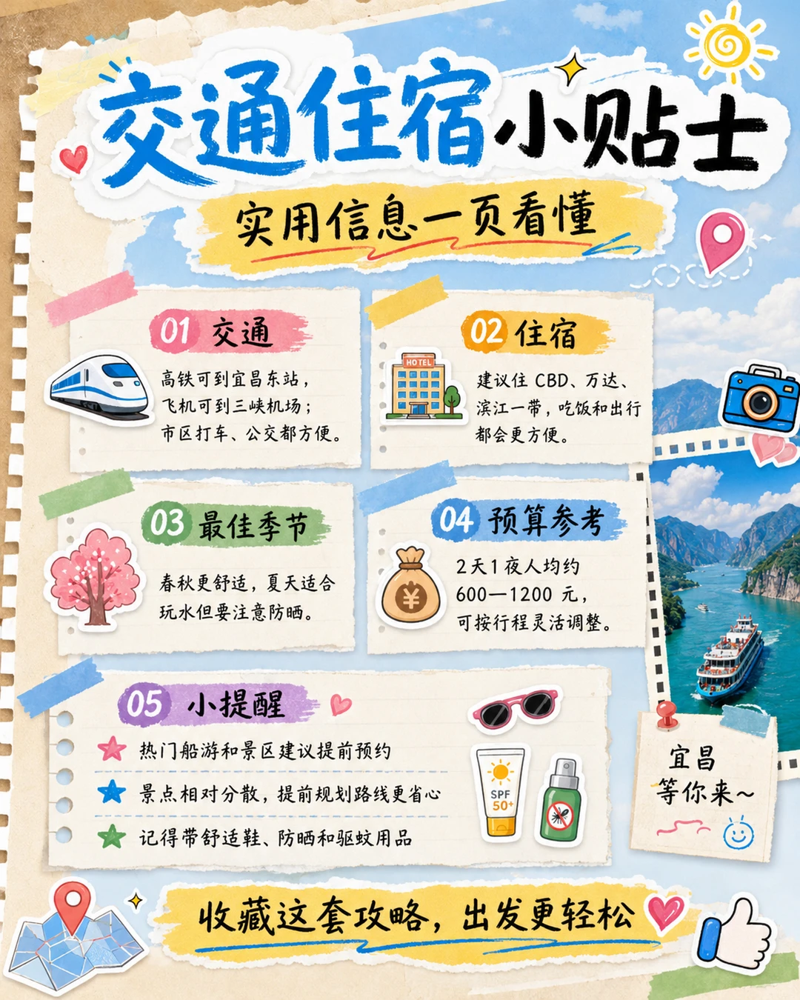

# 第一次来宜昌怎么玩？这条2天1夜路线直接抄

- 作者: 像素流浪师
- 👍12 · 💬 · ⭐25 · 图 6
- feed_id: 6a2a681c000000001503cbad

> [OCR] 宜昌旅游攻略
2天1夜吃喝玩乐路线

宜昌必打卡
山水壮美
人文风情
美食吃不停

三峡大坝
三峡人家
清江画廊
两坝一峡

出发吧！去宜昌～
凉虾
红油小面

旅行小贴士
建议春秋出行
携带轻便衣物
记得带上好胃口！

> [OCR] 经典2天1夜路线
第一次来宜昌,直接照着玩

DAY1❤️
08:30 三峡大坝
11:00 185观景平台
14:00 两坝一峡游船
19:00 滨江夜景+夜宵
适合第一次来宜昌,
三峡精华一次看够

DAY2❤️
09:00 三峡人家
13:00 西陵峡观景
16:30 返程回市区
山水风景 + 民俗体验,
拍照也很出片

建议穿舒适鞋子
船游项目可提前预约

> [OCR] 3条宝藏线路推荐
按你的旅行偏好选就对了

① 经典三峡线
三峡大坝 → 185观景平台 → 两坝一峡 → 三峡人家
适合：首次打卡

② 山水治愈线
清江画廊 → 三峡大瀑布 → 百里荒
适合：喜欢自然风景

③ 人文美食线
屈原故里 → 滨江公园 → 二马路美食街
适合：慢游拍照 + 吃吃喝喝

周末短途、2天1夜都很友好

> [OCR] 宜昌必打卡 TOP5
这些地方基本不会踩雷

1 三峡大坝
国之重器，
气势震撼

2 [?]
山水与土家风情
都很有味道

3 清江画廊
碧水青山,
随手拍都好看

4 两坝一峡
坐船体验感拉满

5 屈原故里
人文气息浓,
适合慢慢逛

如果时间有限,优先三峡大坝 + 三峡人家

> [OCR] 宜昌必吃清单
来都来了，这几样别错过

1. 凉虾
冰冰甜甜，夏天超适合

2. 红油小面
香辣开胃，一口就上头

3. 萝卜饺子
外皮酥香，内里软糯

4. 肥鱼火锅
鲜香过瘾，聚餐很满足

5. 土家腊肉
咸香下饭，很有地方风味

美食街区可关注二马路一带

> [OCR] 交通住宿小贴士
实用信息一页看懂

01 交通
高铁可到宜昌东站，
飞机可到三峡机场；
市区打车、公交都方便。

02 住宿
建议住 CBD、万达、
滨江一带，吃饭和出行都会更方便。

03 最佳季节
春秋更舒适，夏天适合
玩水但要注意防晒。

04 预算参考
2天1夜人均约
600-1200元，
可按行程灵活调整。

05 小提醒
热门船游和景区建议提前预约
景点相对分散，提前规划路线更省心
记得带舒适鞋、防晒和驱蚊用品

宜昌等你来～

收藏这套攻略，出发更轻松

## 正文
Day 1
三峡大坝 → 185观景平台 → 两坝一峡游船 → 滨江夜景+夜宵
Day 2
三峡人家 → 西陵峡观景 → 回市区吃美食
必打卡景点：
三峡大坝：第一次来宜昌必去，气势真的很震撼。
三峡人家：山水和民俗结合，很适合拍照。
清江画廊：水很清，山很绿，随手拍都好看。
两坝一峡：坐船看峡江风光，体验感拉满。
屈原故里：适合慢慢逛，感受人文气息。
必吃美食：
凉虾、红油小面、萝卜饺子、肥鱼火锅、土家腊肉。
想吃得方便，可以去二马路一带逛逛。
实用建议：
住市区会更方便；
热门景区和船游建议提前预约；
夏天注意防晒，走景区一定穿舒服的鞋。
宜昌真的适合想逃离城市、看山看水、吃点当地美食的人。
收藏起来，下次出发直接用！
#毕业旅行第一站[话题]# #宜昌旅游[话题]##宜昌旅游攻略[话题]##宜昌美食[话题]##三峡大坝[话题]##周末去哪玩[话题]##暑假[话题]##吃货友好旅行[话题]##干啥都顺旅行季[话题]#

---