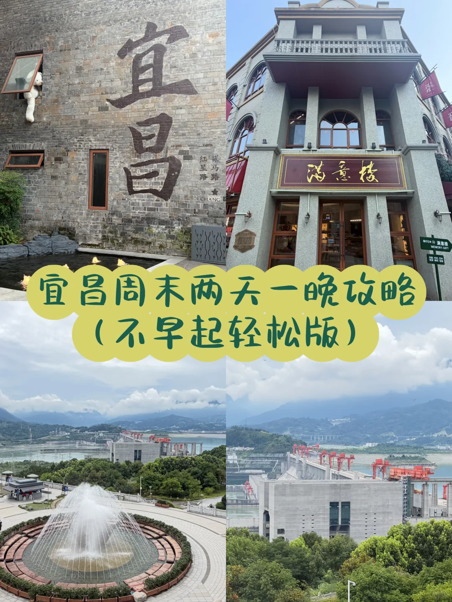
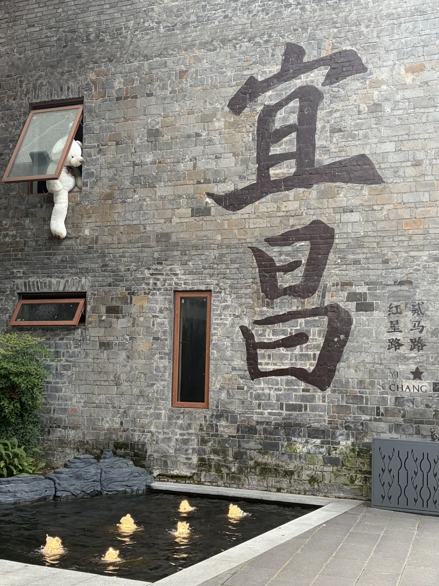
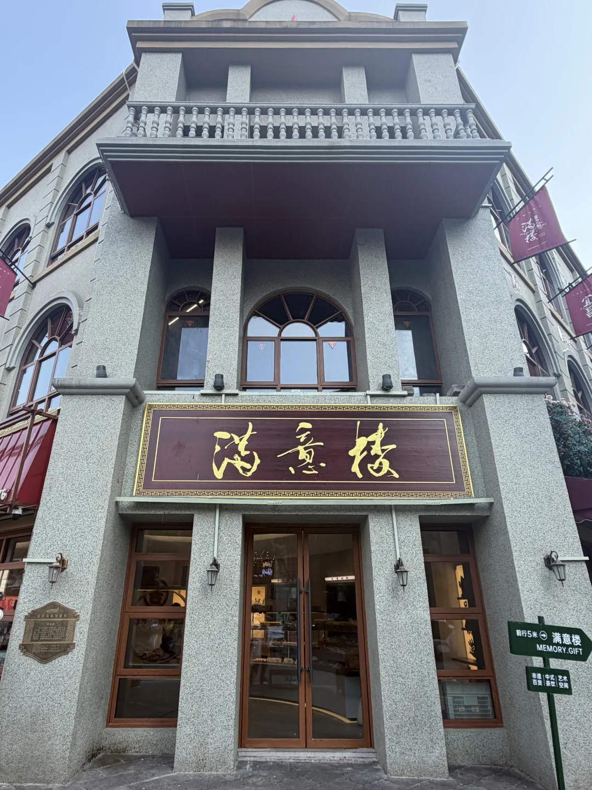
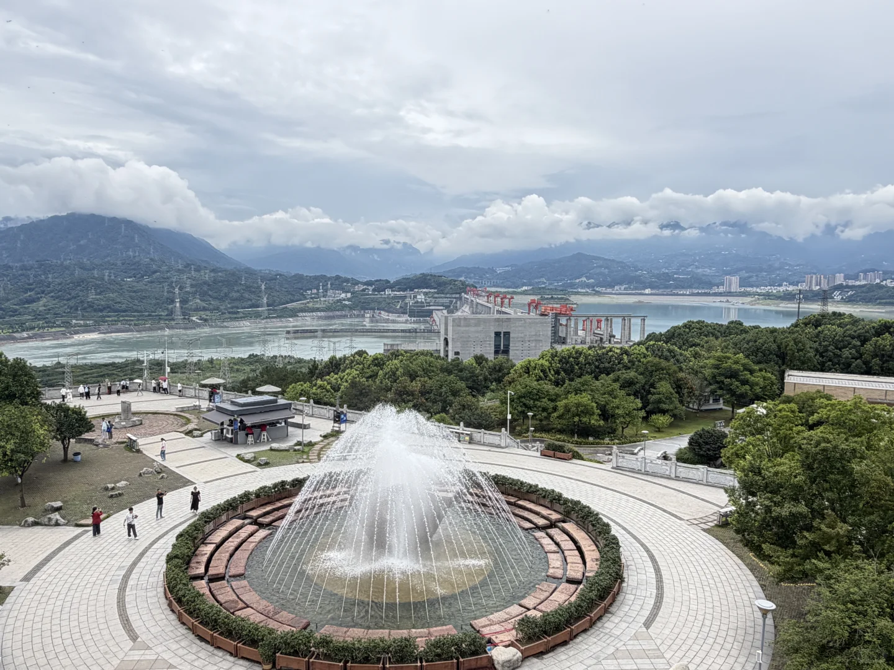
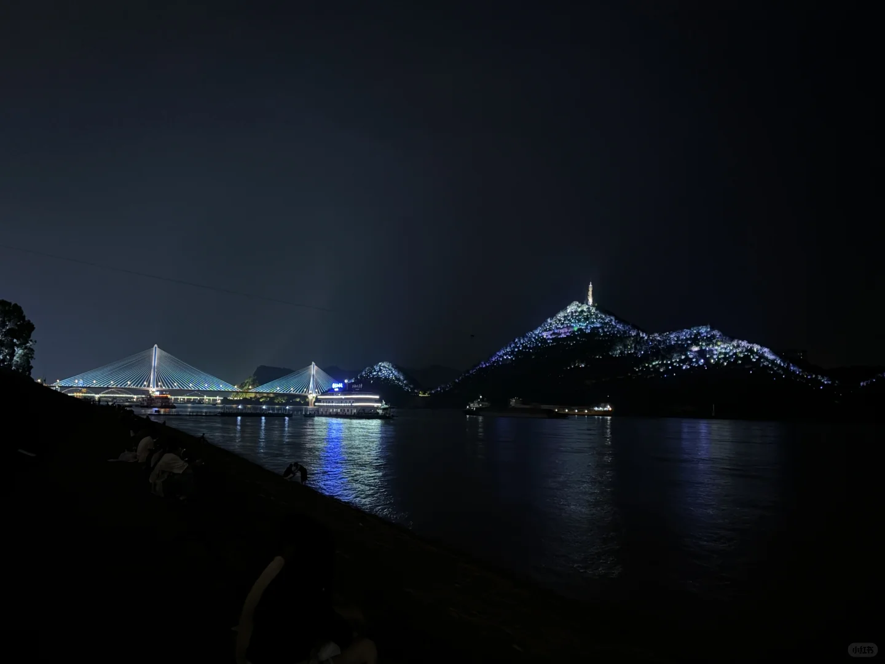

# ⛰️宜昌周末两天一晚打卡攻略（不早起轻松版）

- 作者: 爱吃西瓜的momo🍉
- 👍12 · 💬5 · ⭐19 · 图 7
- feed_id: 6a64abc1000000001002a6b4

> [OCR] 宜昌
满意楼
红星路
YICHANG
MEMORY.GIFT
宜昌周末两天一晚攻略
(不早起轻松版)

> [OCR] 宜昌
红星路
YI CHANG

> [OCR] 满意楼
前行5米 满意楼
MEMORY.GIFT
非遗 | 中式 | 艺术
百货 | 茶饮 | 空间

> [OCR] [?]

> [OCR] [?]

> [OCR] 小红书

> [OCR] 小红书

## 正文
⭐第一天：宜昌过早-三峡大坝-滨江公园
1️⃣早上睡到自然醒，大概10点左右出门，打车去【胡记包子】排队买牛肉包，路边小摊也有卖萝卜饺子也顺便买了个吃吃，买完包子大概走400米去【方妈面馆】，吃了一碗招牌花面
[回招呼]方妈面馆室内有开空调，可以坐着吃比较凉快！
2️⃣早餐吃饱后打车去【三峡大坝】，提前带好身份证，在网上买好35块钱游览车票就可以了，不需要预约，直接刷身份证就能进
⛰️三峡大坝的游览路线是固定的，去不同的观景台之间需要坐车，景区全程玩下来至少大概3个小时，步数1万以上，夏天会比较晒，建议穿舒服的鞋子戴好防晒用品～
3️⃣三峡大坝回来之后先回酒店洗了个澡，然后打车出门去【憨哥鱼庄】吃肥鱼，肥鱼真的很鲜嫩很好吃，吃饱了刚好步行去【滨江公园】散散步，晚上夜景很好看，吹吹风超级凉快~
	
⭐第二天：二马路历史文化街区-宜昌博物馆
1️⃣第二天也是睡得比较晚，大概11点出门，中午去吃了一家【自己人宜昌菜】，应该是连锁店，有很多宜昌当地特色菜，整体感觉味道服务都还不错
2️⃣吃完饭打车去二马路逛了逛，有一些可以打卡拍照的地方
3️⃣二马路逛完去宜昌博物馆逛了逛，外面天气比较热，博物馆里有空调也比较凉快（不想去博物馆随便找个商场也可以）
4️⃣逛完之后去万达广场附近找了一家足疗按摩店，缓解一下两天的疲惫，晚餐就在店里简单吃了一点，然后就打车去机场返程啦~
	
⭐周末这个行程超级轻松，打工人友好，周五晚上的飞机到宜昌，周日晚上的飞机返程，周末两天时间非常充裕~
⭐住宿推荐住在市区或者沿江都可以，宜昌市区本身也不算特别大，打车去哪里也都很方便
⭐宜昌景点必看的就是【三峡大坝】，另外还有【三峡人家】其实也在同一条路线上，但是早上实在起不来所以就只选了一个景点，如果能够早起的也可以把三峡大坝和三峡人家安排在同一天~
	
#宜昌[话题]# #宜昌旅游[话题]# #宜昌旅游攻略[话题]# #宜昌三峡大坝[话题]# #三峡大坝[话题]# #三峡大坝旅游[话题]# #宜昌二马路[话题]# #宜昌博物馆[话题]# #宜昌周末游[话题]# #宜昌美食[话题]#

---