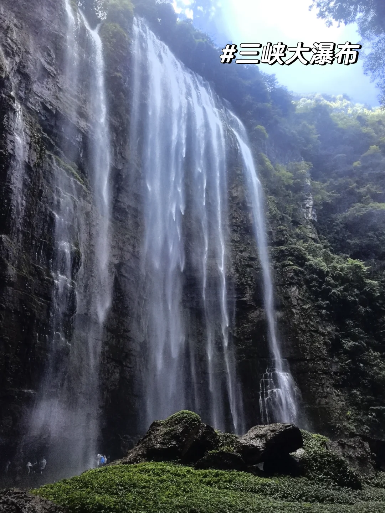
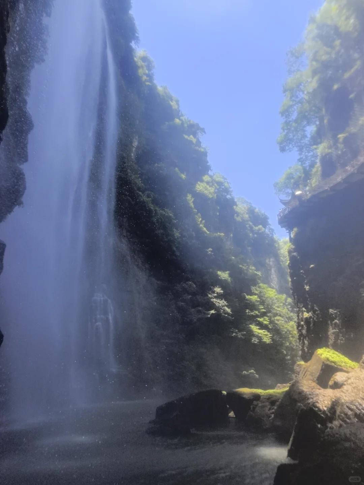
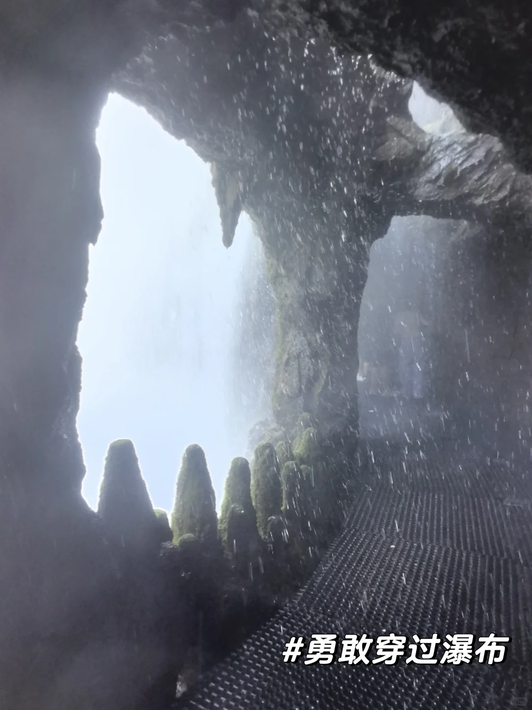
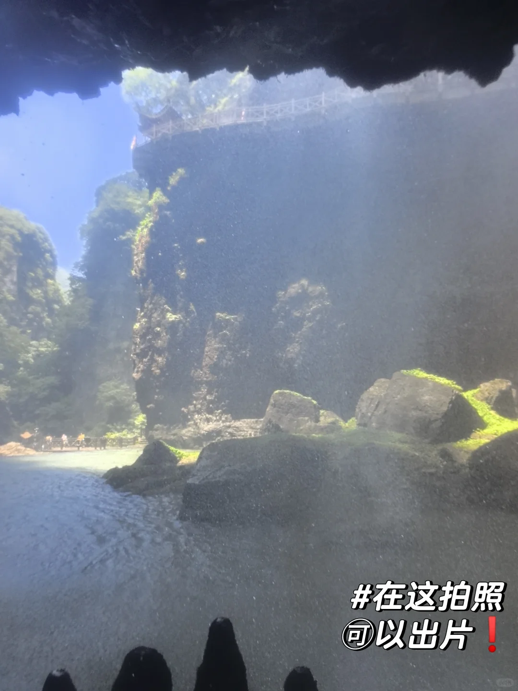
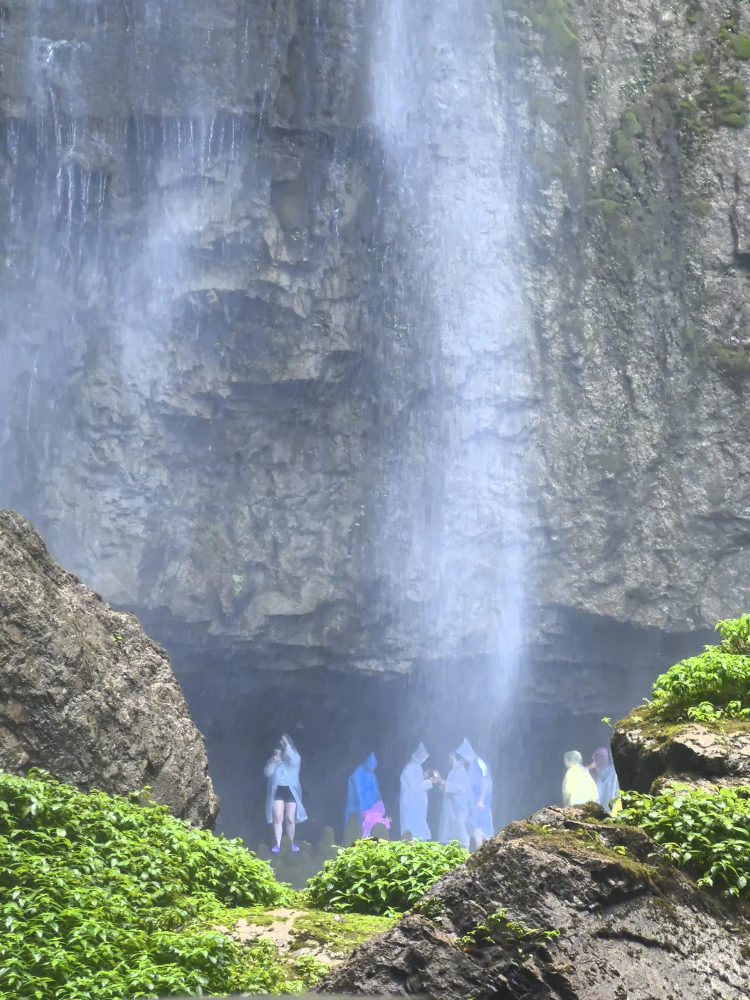
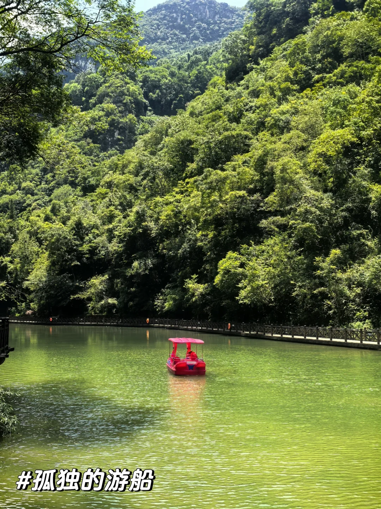
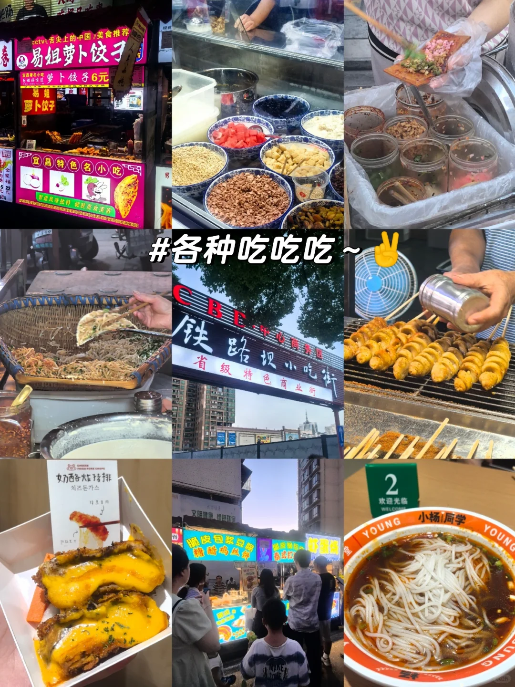
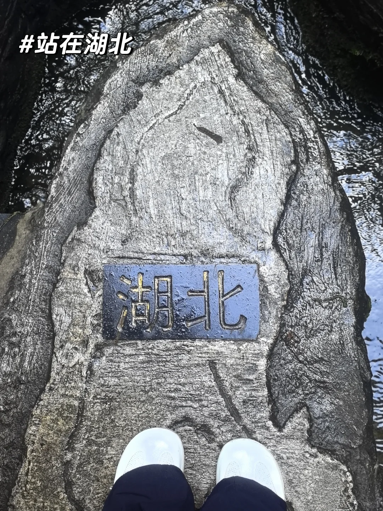

# 宜昌丨进山看大瀑布，市区逛夜市江边吹晚风

- 作者: 蟹珍珠
- 👍12 · 💬2 · ⭐8 · 图 9
- feed_id: 6a639950000000000f03db1b

> [OCR] #三峡大瀑布

> [OCR] HUCN

> [OCR] #勇敢穿过瀑布

> [OCR] #在这拍照
可以出片！

> [OCR] system

> [OCR] #孤独的游船

> [OCR] 易姐萝卜饺子
宜昌特色名小吃
cctv/舌尖上的中国/美食推荐
萝卜饺子6元
#各种吃吃吃~✌️
CBE·中心商务区
铁路坝小吃街
省级特色商业街
奶酪炸猪排
치즈돈까스
文明健康 绿色环保
欢迎光临 WELCOME
YOUNG 小杨/同学 YOUNG

> [OCR] #滨江公园对面的磨基山

> [OCR] #站在湖北
湖北

## 正文
先远后近❗️轻松不赶路✨
完美一天[派对R]
📍路线：三峡大瀑布➡️铁路坝小吃街➡️滨江公园
	
🌊【白天｜三峡大瀑布】
🏨住的自贸区（三峡云朵酒店，挺好），去大瀑布40分钟左右
🎫门票115｜观光车往返20（建议直接买，少走4公里❗️路上景色一般）
⏰8:00‑16:30入园，16:30就停止检票啦
一定要体验穿瀑布！超级有意思‼️
💸景区自费物价参考
▪️一次性薄雨衣：5r（水压大容易破，买厚些的❗️）
▪️鞋套：入口1r，停车场边5r[笑哭R]
▪️观瀑电梯（比较一般）：35r单程
▪️手机防水袋：5r
✅小提示
▪️带一套换洗衣服、防滑鞋子，走完瀑布基本全身都会打湿❗️夏天进山避暑真的巨凉快
▪️带小朋友的可以带些玩具，可以踩水玩
	
🍢【傍晚｜铁路坝小吃街】
7点左右到的，好热闹
🅿️导航新华书店停车场，出来就是小吃街，超近
🔥跟着推荐买的小吃
✅易姐萝卜饺子🥟，原味6r，不惊艳，比较一般，好像是宜昌特色小吃，油炸的大饺子[笑哭R]
✅王氏凉虾🥤，小杯3r，大杯5r，冰冰凉凉的，凉虾做的QQ弹弹的，好吃[点赞R]
✅顶顶糕，3r，米粉蒸的糕点，口味选择比较多，♨️热的好吃，放凉了不太行
	
🌃【晚上｜滨江公园】
不用硬走完一整条江滩❗️
直接导航➡️双亭广场
沿着江边步道散散步，吹吹长江的风
逛累了可以直接在江边台阶坐着歇会儿
	
[私信R]两坝一峡还没去，咨询导游介绍大坝上🈶60度，有点子害怕[哭惹R]
[私信R]宜昌景点有点分散有点远
#宜昌一日游[话题]# #三峡大瀑布[话题]# #宜昌滨江公园[话题]# #铁路坝小吃街[话题]# #宜昌旅游攻略[话题]# #湖北周边游[话题]# #宜昌[话题]#

---