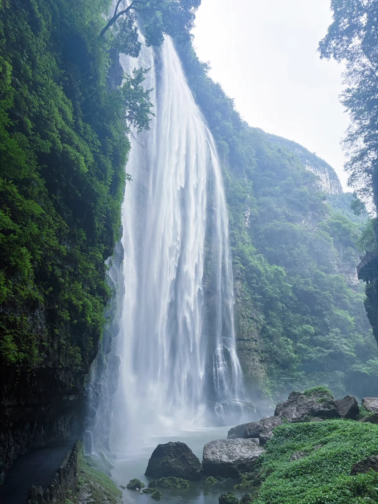
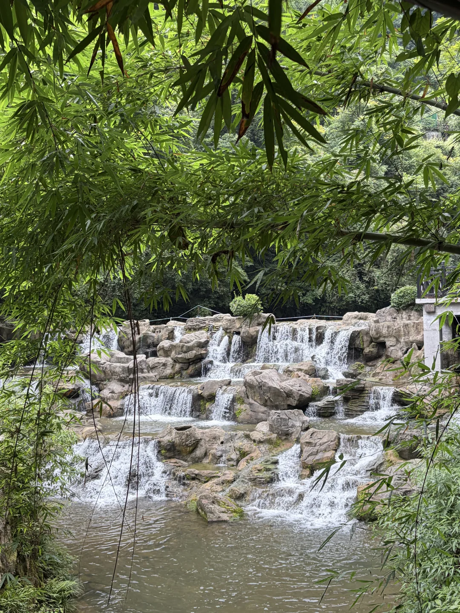
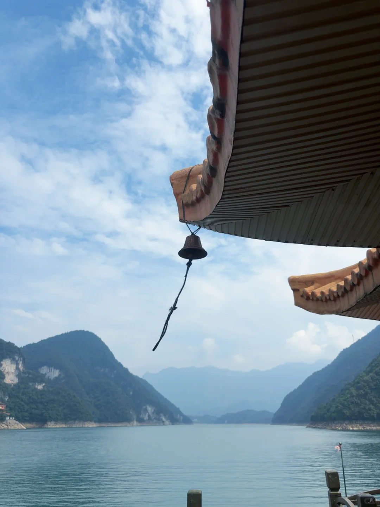
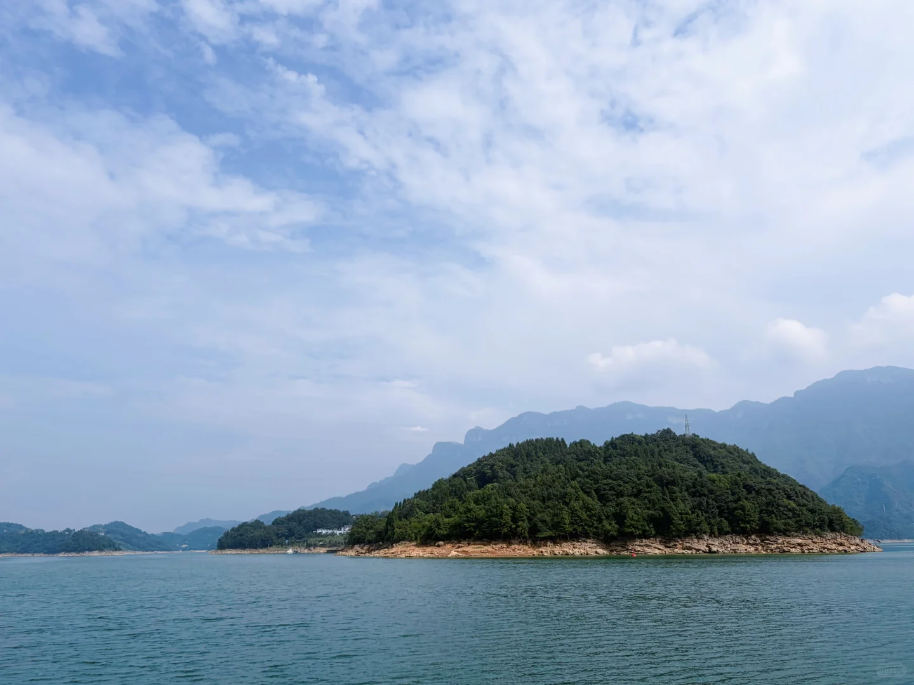
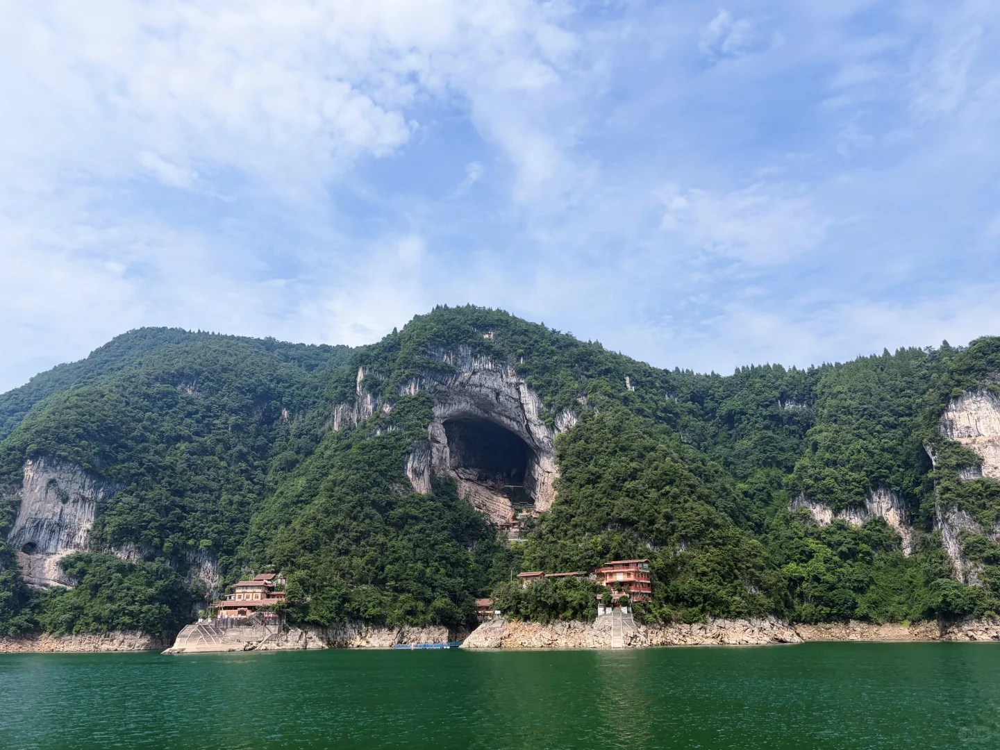
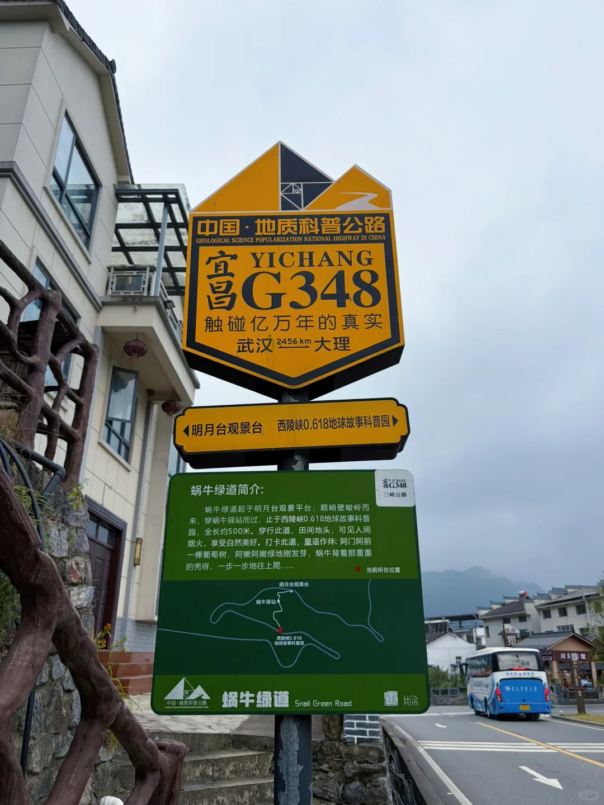
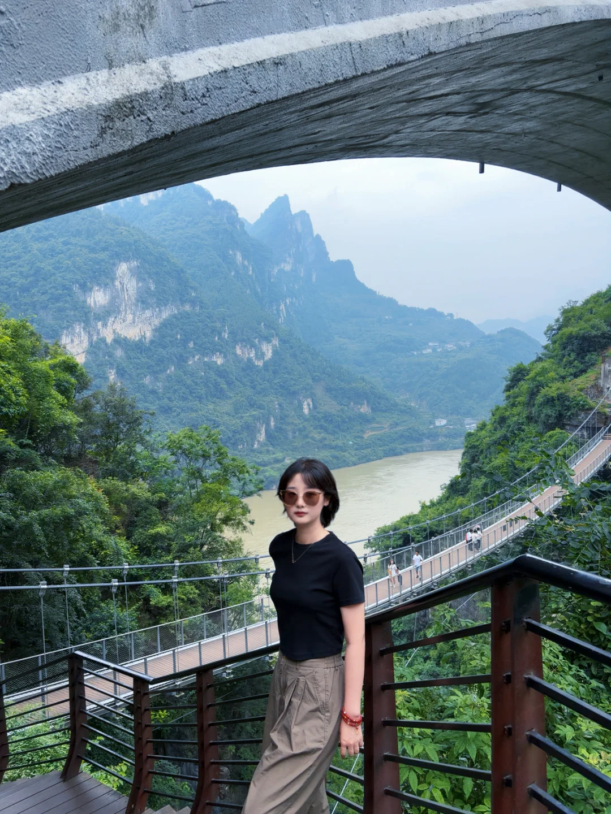
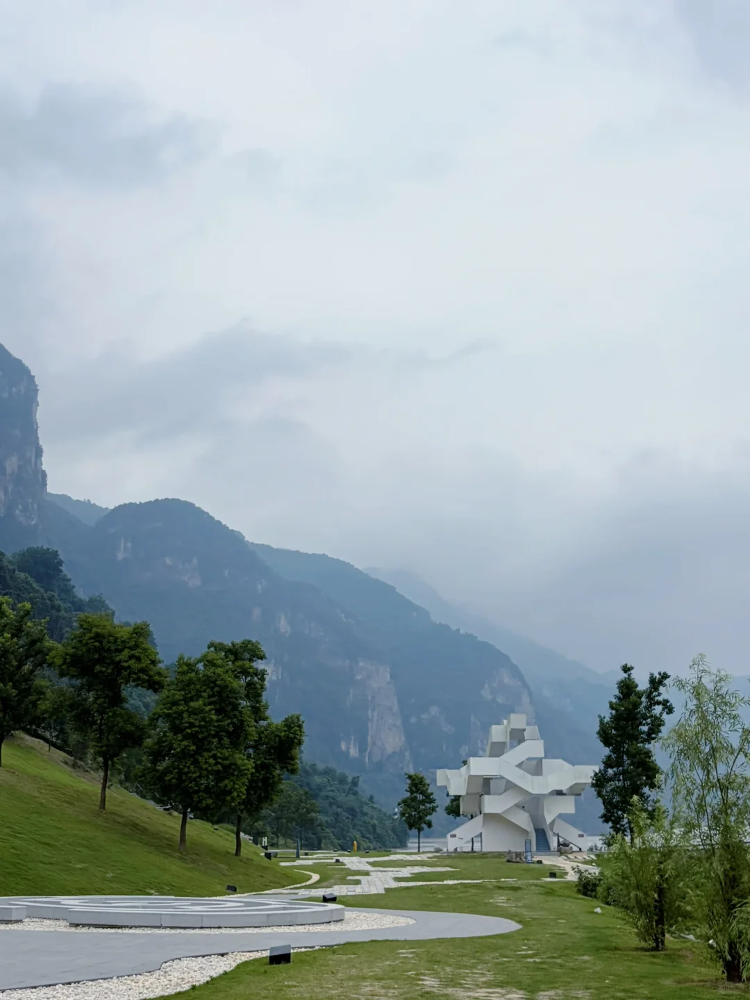
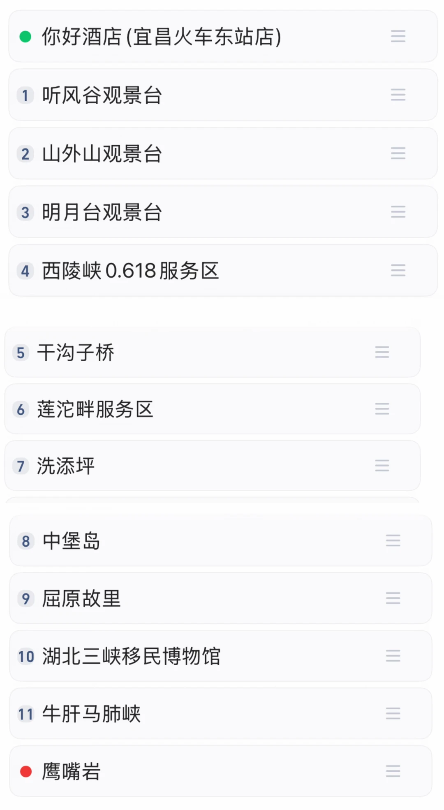

# 宜昌自驾三天两夜，附路线图在最后

- 作者: 小李ok的啦
- 👍11 · 💬9 · ⭐6 · 图 12
- feed_id: 6a4d0199000000002101b410

> [OCR] system

> [OCR] [?]

> [OCR] [?]

> [OCR] system

> [OCR] system

> [OCR] [?]

> [OCR] 中国·地质科普公路
GEOLOGICAL SCIENCE POPULARIZATION NATIONAL HIGHWAY IN CHINA
宜昌YICHANG
触碰亿万年的真实
武汉2456km大理

明月台观景台 西陵峡0.618地球故事科普园

蜗牛绿道简介:
蜗牛绿道起于明月台观景平台，顺峭壁峻岭而来，穿蜗牛驿站而过，止于西陵峡0.618地球故事科普园，全长约500米。穿行此道，田间地头，可见人间烟火，享受自然美好。打卡此道，童谣作伴: 阿门阿前一棵葡萄树，阿嫩阿嫩绿地刚发芽，蜗牛背着那重重的壳呀，一步一步地往上爬……

当前所在位置

明月台观景平台
蜗牛驿站
西陵峡0.618地球故事科普园

> [OCR] [?]

> [OCR] [?]

> [OCR] [?]

> [OCR] 你好酒店(宜昌火车东站店)
1 听风谷观景台
2 山外山观景台
3 明月台观景台
4 西陵峡0.618服务区
5 干沟子桥
6 莲沱畔服务区
7 洗添坪
8 中堡岛
9 屈原故里
10 湖北三峡移民博物馆
11 牛肝马肺峡
鹰嘴岩

## 正文
[一R]三峡大瀑布，夯，淋的非常之爽，p1.2
[二R]清江画廊，b线，夯，美丽，清江水绿绿的p3-6
在景区官方买的清江小鱼干夯爆了，好吃
[三R]自驾G348，没赶上好天气，还闷闷的，所以主观上一般[叹气R]p7-12
关于自驾，有一些山路和弯道，需要慢点开，鹰嘴岩最后没去，网友说特别不好开，很多急弯，新手不建议，也要多熟悉一下租的车，下大雨了就改行程，不要硬挑战哈，山路过弯还是有不少的#视听长江遇见知音湖北[话题]# #佛系旅游篇[话题]# #宜昌[话题]# #三峡[话题]# #G348[话题]# #清江画廊[话题]# #小众游玩路线[话题]# #看山看水看世界[话题]# #向全世界安利自驾[话题]# #周边游[话题]#

---