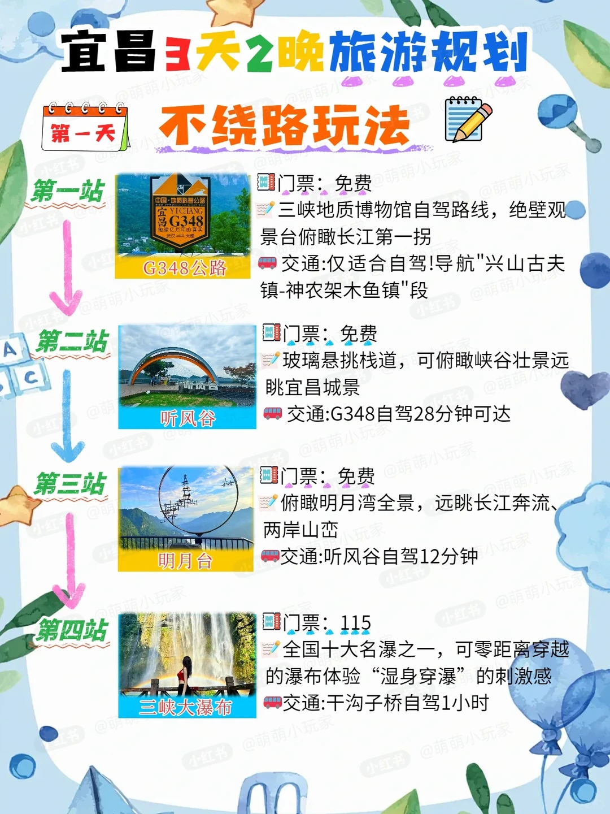
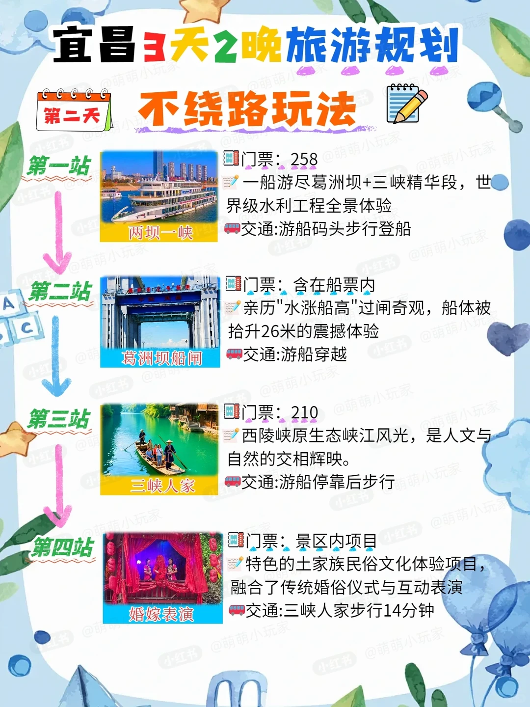
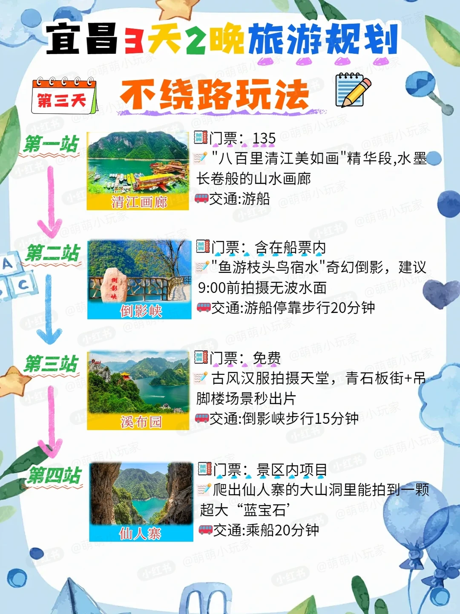

# 宜昌 3 天 2 晚不绕路保姆级攻略✨

- 作者: 萌萌小玩家
- 👍11 · 💬2 · ⭐13 · 图 5
- feed_id: 69d6f89e000000001f006b48

> [OCR] 宜昌3天2晚旅游规划
不绕路玩法

第一天

第一站
三峡地质博物馆自驾路线，绝壁观景台俯瞰长江第一拐
门票：免费
交通:仅适合自驾!导航"兴山古夫镇-神农架木鱼镇"段

第二站
玻璃悬挑栈道，可俯瞰峡谷壮景远眺宜昌城景
门票：免费
交通:G348自驾28分钟可达

第三站
俯瞰明月湾全景，远眺长江奔流、两岸山峦
门票：免费
交通:听风谷自驾12分钟

第四站
全国十大名瀑之一，可零距离穿越的瀑布体验“湿身穿瀑”的刺激感
三峡大瀑布
门票：115
交通:干沟子桥自驾1小时

> [OCR] 宜昌3天2晚旅游规划
不绕路玩法

第一站
门票：258
一船游尽葛洲坝+三峡精华段，世界级水利工程全景体验
交通:游船码头步行登船

第二站
门票：含在船票内
亲历"水涨船高"过闸奇观，船体被抬升26米的震撼体验
交通:游船穿越

第三站
门票：210
西陵峡原生态峡江风光，是人文与自然的交相辉映。
交通:游船停靠后步行

第四站
门票：景区内项目
特色的土家族民俗文化体验项目，
融合了传统婚俗仪式与互动表演
交通:三峡人家步行14分钟

> [OCR] 宜昌3天2晚旅游规划
不绕路玩法

第一站
门票：135
"八百里清江美如画"精华段,水墨长卷般的山水画廊
交通:游船

第二站
门票：含在船票内
"鱼游枝头鸟宿水"奇幻倒影，建议9:00前拍摄无波水面
交通:游船停靠步行20分钟

第三站
门票：免费
古风汉服拍摄天堂,青石板街+吊脚楼场景秒出片
交通:倒影峡步行15分钟

第四站
门票：景区内项目
爬出仙人寨的大山洞里能拍到一颗超大“蓝宝石”
交通:乘船20分钟

> [OCR] 宜昌3天2晚旅游规划
不绕路玩法

【美食推荐】

早餐特色🍜
萝卜饺子：脆壳裹嫩萝卜丝，蘸酸甜辣酱正合味
红油小面：筋道碱水面淋辣油，一口唤醒清晨味

正餐必尝🍲
长江肥鱼火锅：鲜嫩无刺肉，奶白似乳汤
腊蹄子锅：烟熏腊蹄肉，慢炖高山薯
豆浆煮黄骨鱼：豆香融鱼鲜，非遗老吃法

宵夜小吃🍜
凉虾:红糖水+米浆制成的消暑神器
炕土豆:外焦里糯，撒辣椒粉与孜然
糖炒板栗:焦糖香包裹的街头零嘴

> [OCR] 宜昌3天2晚旅游规划
不绕路玩法

【住宿区域推荐】

万?附?:
优点：对面是三峡游客中心，可直接参加两坝一峡游、夜游长江；楼下万达商业街人气旺，宜昌民宿酒店集中。
缺点：老宜昌元素少，美食多为连锁品牌，停车贵。

CBD附?
优点：宜昌最繁华商业区，有百家美食的小吃街；周边有儿童公园、夷陵广场等地标，去三峡人家、三游洞等景区可在夷陵广场乘车。
缺点：人流量大，停车极不方便且贵。

解放路附?
优点：紧邻滨江公园可看一线江景，是宜昌历史步行街及在建仿古街所在地；聚集朱哥板栗、郑信记凉虾等名小吃总店及关妈餐馆、把把烧等特色美食，还有知名老酒吧；地处万达、CBD、儿童公园中间，交通便捷，停车方便不堵车。
缺点：以美食休闲为主，商业逛街内容少。

宜昌东站附?
优点：周边有五一广场、香山福久源等商圈，赶火车方便；距离宜昌规划馆、博物馆较近。
缺点：离中心城区远，可游玩地点少。

## 正文
第一次来宜昌的宝子直接抄作业！这份不绕路的 3 天 2 晚玩法，把三峡、清江、瀑布一网打尽，懒人直接照着走就行👇
📅 Day1 三峡风光 + 瀑布震撼
✅ G348 公路（免费）
自驾必冲！导航「兴山古夫镇 - 神农架木鱼镇」段，在绝壁观景台俯瞰长江第一拐，公路大片随手拍
✅ 听风谷（免费）
G348 自驾 28 分钟直达，玻璃悬挑栈道超震撼，峡谷全景 + 宜昌城景尽收眼底
✅ 明月台（免费）
听风谷自驾 12 分钟就到，俯瞰明月湾全景，看长江奔涌、山峦叠翠
✅ 三峡大瀑布（门票 115r）
全国十大名瀑！零距离穿瀑超刺激，感受 “湿身” 的快乐，记得带换洗衣物
📅 Day2 两坝一峡 + 土家风情
✅ 两坝一峡游船（门票 258r）
一船解锁葛洲坝 + 三峡精华段，沉浸式体验世界级水利工程
✅ 葛洲坝船闸（含在船票内）
亲眼见证 “水涨船高”，船体抬升 26 米的震撼，太绝了
✅ 三峡人家（门票 210 r）
原生态峡江风光，山水间藏着土家风情，人文自然双在线
✅ 婚嫁表演（景区内项目）
沉浸式看土家传统婚俗，互动感拉满，超有氛围感
📅 Day3 清江画廊 + 秘境打卡
✅ 清江画廊（门票 135 r）
“八百里清江美如画”，乘船游水墨山水长卷，治愈感拉满
✅ 倒影峡（含在船票内）
“鱼游枝头鸟宿水” 的奇幻倒影，9:00 前拍无波水面，出片率 100%
✅ 溪布园（免费）
古风汉服拍照天堂！青石板街 + 吊脚楼，随手拍都是古风大片
✅ 仙人寨（景区内项目）
爬进大山洞，解锁超大 “蓝宝石” 江景，视野绝了
🏨 住宿区域怎么选？
万达附近：近三峡游客中心，参团方便，商业繁华
CBD 附近：宜昌核心商圈，美食小吃扎堆，出行便利
解放路附近：一线江景，老字号美食聚集地，交通便捷
宜昌东站附近：赶火车方便，适合早到晚走的行程
宜昌真的把山水浪漫玩到了极致！这份攻略帮你避开所有弯路，快 @你的旅游搭子冲吧🚗
#宜昌旅游[话题]# #宜昌攻略[话题]#  #三峡旅游[话题]#  #3天2晚攻略[话题]#  #湖北旅游[话题]#  #宜昌美食[话题]# #清江画廊[话题]#  #三峡大瀑布[话题]#

---