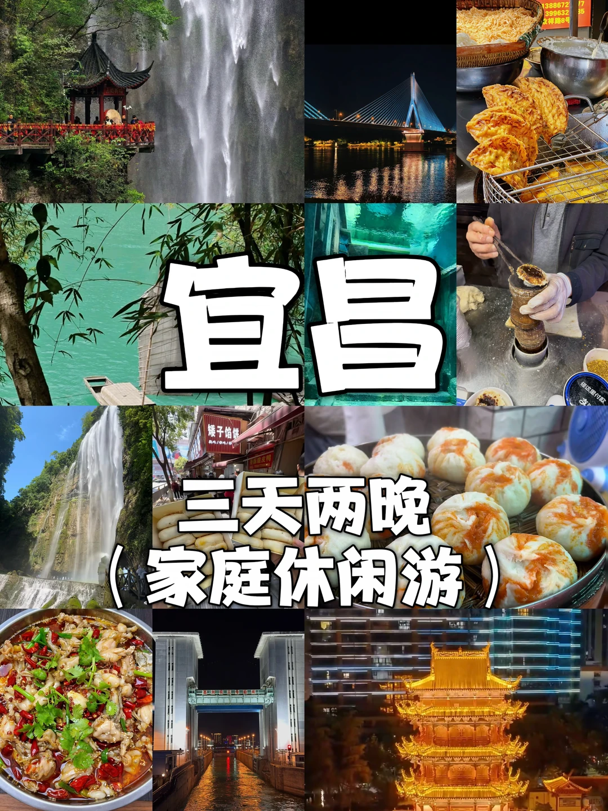
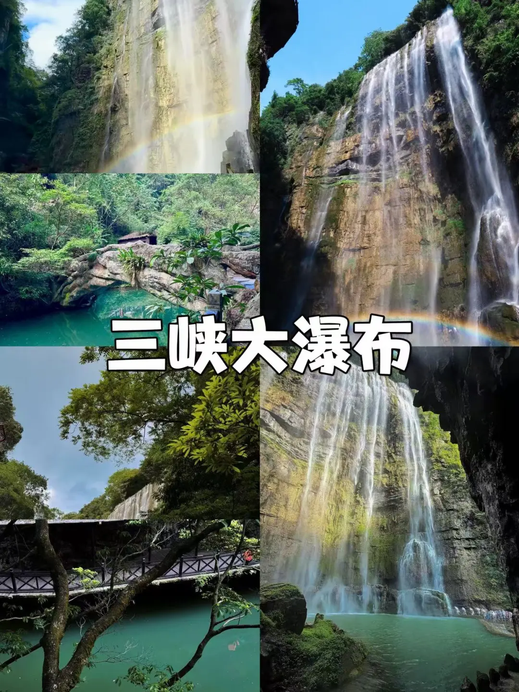
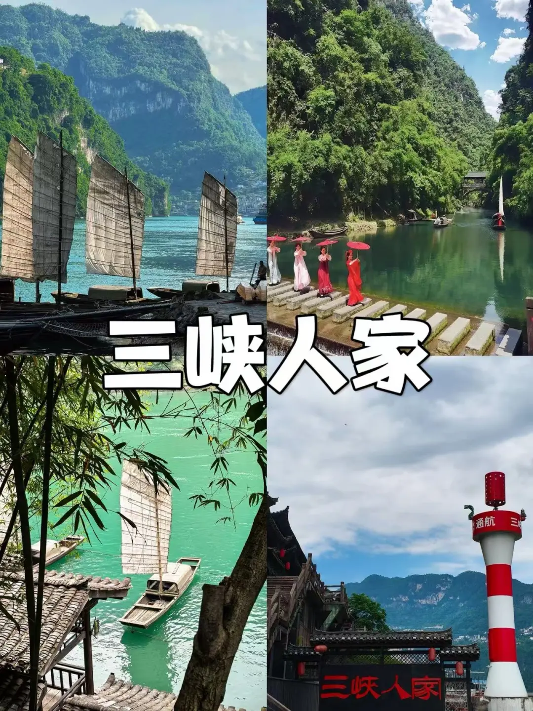
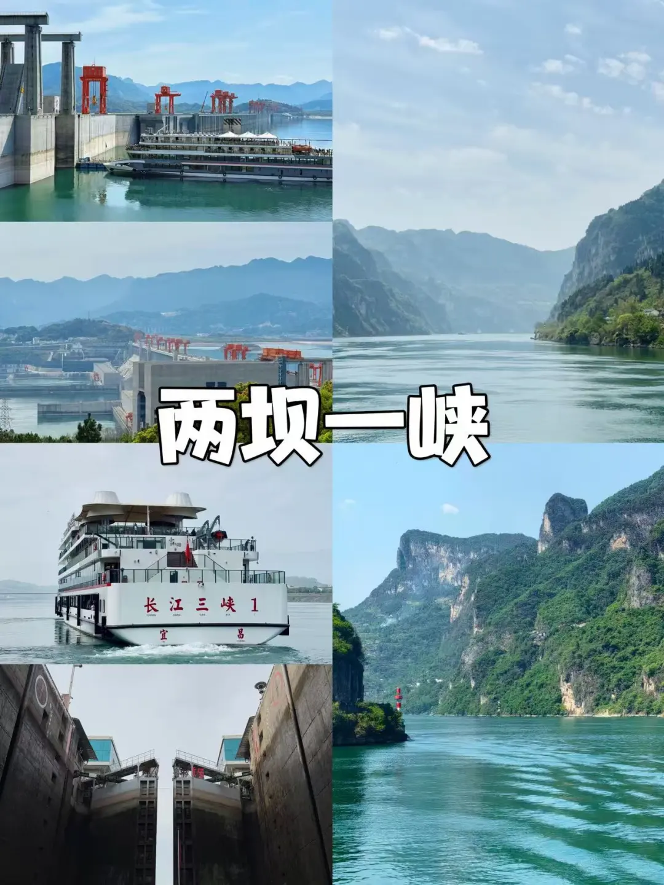
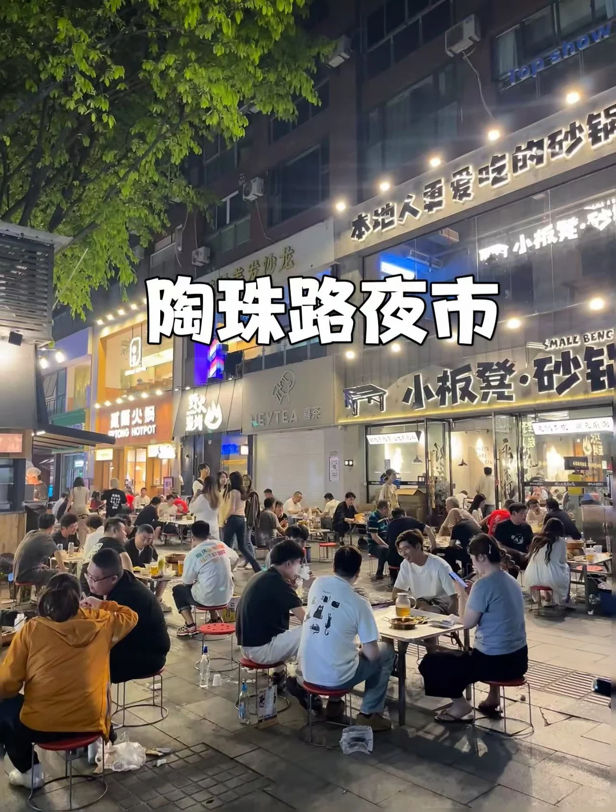
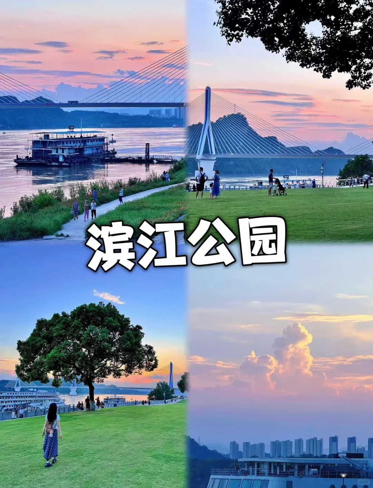

# 假期去哪玩｜3天2晚宜昌保姆级攻略🚗

- 作者: 精彩国际旅行社
- 👍10 · 💬3 · ⭐21 · 图 7
- feed_id: 6a2913ed0000000036000ff5

> [OCR] 宜昌
三天两晚
(家庭休闲游)

> [OCR] 三峡大瀑布

> [OCR] 三峡人家

> [OCR] 两坝一峡
长江三峡1
宜昌

> [OCR] 清江肥鱼
萝卜饺子
红油小面
美蛙鱼头
矮子馅饼
顶顶糕

> [OCR] 陶珠路夜市
本地人更爱吃的砂锅
小板凳·砂锅
万丽火锅
HOTPOT
HEYTEA 喜茶
SMALL BENG

> [OCR] 滨江公园

## 正文
✨假期还在纠结去哪玩？直接来宜昌玩转三峡！经典路线集齐自然山水、大国工程、土家民俗，搭配本地夜市小吃，全程纯玩不踩雷，情侣、闺蜜、家庭出游都适配，省心可直接抄作业📸
	
📍坐标：湖北宜昌
🚗出行：正规空调大巴/商务车，市区定点接送、一人一座，出行省心安全
🏨住宿建议：优选万达、九码头、均瑶商圈，近接车点与夜市，吃住出行超方便
	
Day1 清凉避暑｜三峡大瀑布
	
上午抵达宜昌办理入住休整，下午打卡5A三峡大瀑布。景区森林覆盖率96%，是天然避暑氧吧，纯玩2.5小时。
	
沿溪徒步满眼绿意，必走网红穿瀑栈道，穿行水帘之下，晴天极易遇见彩虹。建议备好雨衣、防滑鞋，体力不足可自选20元景区电瓶车。
	
✅美食安排：午餐打卡农家乐，尝三峡肥鱼火锅、土家腊肉炒笋；傍晚逛陶珠路夜市，吃非遗凉虾、萝卜饺子、炕土豆，感受地道市井烟火。
💡小贴士：玩水易湿衣，记得备一套换洗衣物。
	
Day2 壮阔之行｜两坝一峡船游
	
一日畅游长江，打卡葛洲坝、三峡大坝两大世界级工程，含家常中餐，行程轻松不赶路，两种玩法任选：
	
✅新手首选【船去车回】：九码头登船，穿越葛洲坝见证水涨船高，船游西陵峡画廊风光。下船深度游览三峡大坝，打卡坛子岭、185平台、截流纪念园，俯瞰震撼大坝全景。
	
✅休闲优选【车去船回】：上午陆上逛大坝，下午乘船返程，体验水降船低，傍晚江景氛围感拉满。
	
✅美食安排：含团队中餐，游船零食自理；晚餐打卡铁路坝小吃街，吃红油小面、烤猪蹄，饭后沿江吹风看夜景，惬意十足。
💡小贴士：江面风大紫外线强，备好防晒、墨镜与薄外套。
	
Day3 民俗收官｜三峡人家
	
沉浸式体验巴楚土家风情！船游西陵峡，途经兵书宝剑峡、灯影峡，两岸奇峰险峻、山水秀美。
	
打卡5A三峡人家，错落吊脚楼、清幽龙进溪氛围感十足，可观赏渔家作业、溪边浣衣原生态景致。登巴王寨看网红灯影石，免费观看土家歌舞、皮影戏、山歌互动，深度感受峡江民俗文化。体力不足可自选30元索道上山。
	
✅美食安排：景区周边自理午餐，品尝土家特色菜；返程可带矮子馅饼、顶顶糕当伴手礼。
	
📝出行实用贴士
	
1.穿搭：穿运动鞋、速干衣，玩水备换洗衣物，全程做好防晒
2.必吃：凉虾、萝卜饺子、红油小面、三峡肥鱼、土家腊味
3.夜市：陶珠路本地人常去，铁路坝新潮热闹、紧邻商圈
	
#宜昌旅游攻略[话题]# #宜昌三天两晚[话题]# #三峡大瀑布[话题]#  #两坝一峡[话题]##三峡人家[话题]# #亲子游[话题]# #湖北旅游[话题]# #一站式旅游[话题]#

---