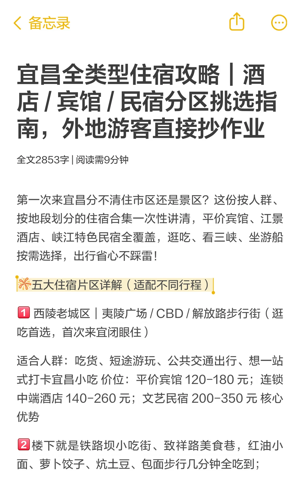
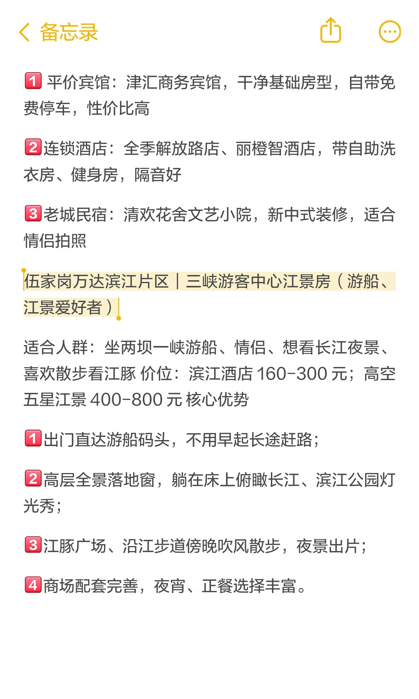
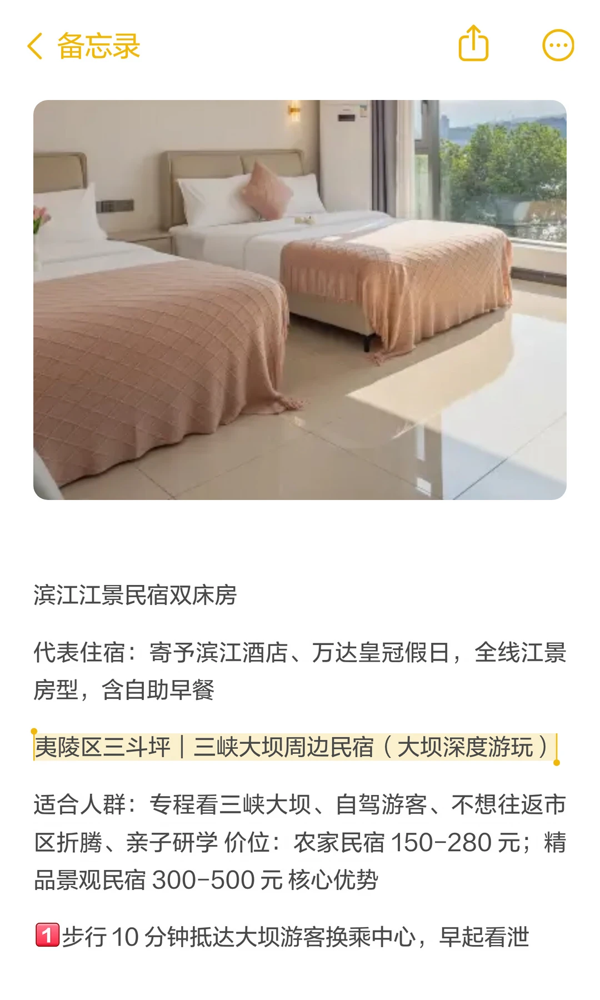
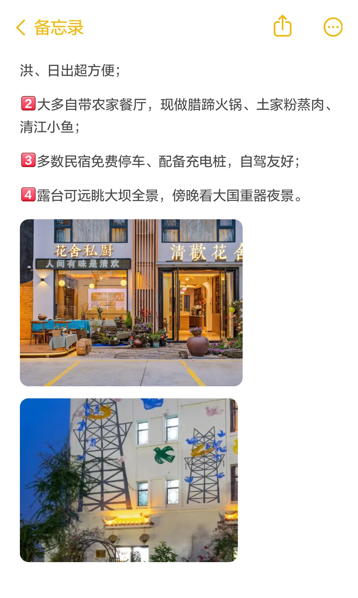
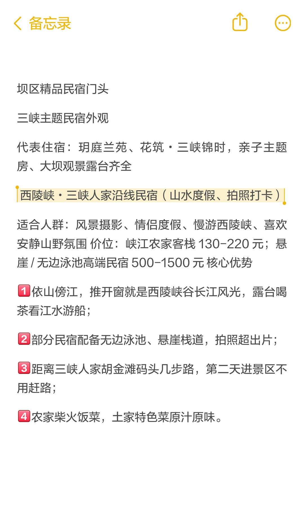
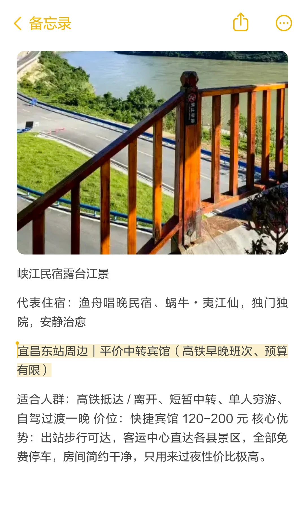
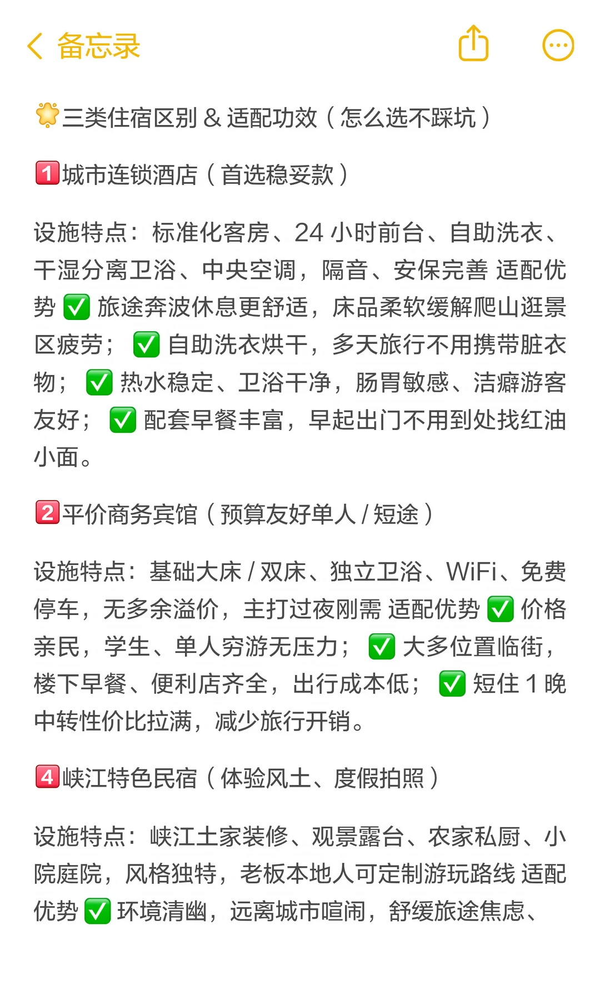
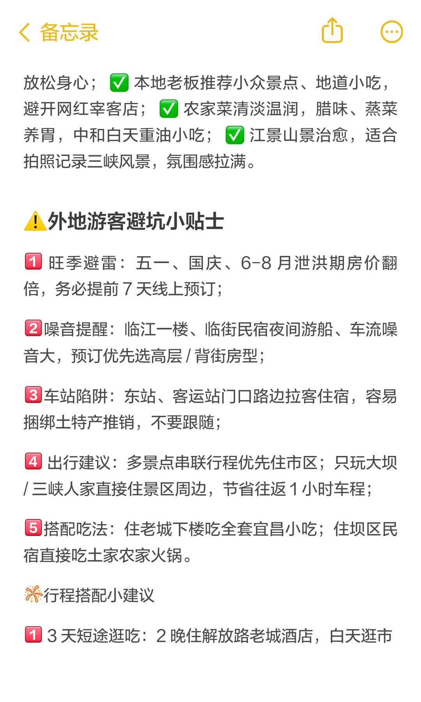

# 宜昌全类型住宿攻略｜酒店 / 宾馆 / 民宿分

- 作者: 宜昌向导
- 👍10 · 💬 · ⭐16 · 图 10
- feed_id: 6a427191000000000702683c

> [OCR] 宜昌全类型住宿攻略 | 酒店/宾馆/民宿分区挑选指南，外地游客直接抄作业

全文2853字 | 阅读需9分钟

第一次来宜昌分不清住市区还是景区？这份按人群、按地段划分的住宿合集一次性讲清，平价宾馆、江景酒店、峡江特色民宿全覆盖，逛吃、看三峡、坐游船按需选择，出行省心不踩雷！

五大住宿片区详解（适配不同行程）

1 西陵老城区 | 夷陵广场 / CBD / 解放路步行街 ( 逛吃首选，首次来宜闭眼住 )

适合人群：吃货、短途游玩、公共交通出行、想一站式打卡宜昌小吃
价位：平价宾馆 120-180 元；连锁中端酒店 140-260 元；文艺民宿 200-350 元 核心优势

2 楼下就是铁路坝小吃街、致祥路美食巷，红油小面、萝卜饺子、炕土豆、包面步行几分钟全吃到

> [OCR] 3 商超、药店、便利店密集，生活补给超方便；
4 三峡游客中心、长途客运站近，拼车去三峡大坝、清江画廊、三峡人家集散便捷；
5 解放路夜市、陶珠路夜宵一条街，晚上吃小龙虾、铁板烤鱼氛围感拉满。
市区连锁酒店客房
代表住宿推荐

> [OCR] 备忘录

1 平价宾馆：津汇商务宾馆，干净基础房型，自带免费停车，性价比高

2 连锁酒店：全季解放路店、丽橙智酒店，带自助洗衣房、健身房，隔音好

3 老城民宿：清欢花舍文艺小院，新中式装修，适合情侣拍照

伍家岗万达滨江片区 | 三峡游客中心江景房（游船、
江景爱好者）

适合人群：坐两坝一峡游船、情侣、想看长江夜景、喜欢散步看江豚 价位：滨江酒店160-300元；高空五星江景400-800元 核心优势

1 出门直达游船码头，不用早起长途赶路；
2 高层全景落地窗，躺在床上俯瞰长江、滨江公园灯光秀；
3 江豚广场、沿江步道傍晚吹风散步，夜景出片；
4 商场配套完善，夜宵、正餐选择丰富。

> [OCR] 滨江江景民宿双床房

代表住宿：寄予滨江酒店、万达皇冠假日，全线江景房型，含自助早餐

夷陵区三斗坪 | 三峡大坝周边民宿（大坝深度游玩）

适合人群：专程看三峡大坝、自驾游客、不想往返市区折腾、亲子研学
价位：农家民宿150-280元；精品景观民宿300-500元核心优势

1. 步行10分钟抵达大坝游客换乘中心，早起看泄

> [OCR] <备忘录>

洪、日出超方便;

2 大多自带农家餐厅,现做腊蹄火锅、土家粉蒸肉、清江小鱼;

3 多数民宿免费停车、配备充电桩，自驾友好;

4 露台可远眺大坝全景，傍晚看大国重器夜景。

花舍私厨
人间有味是清欢

> [OCR] 坝区精品民宿门头

三峡主题民宿外观

代表住宿：玥庭兰苑、花筑·三峡锦时，亲子主题房、大坝观景露台齐全

西陵峡·三峡人家沿线民宿（山水度假、拍照打卡）

适合人群：风景摄影、情侣度假、慢游西陵峡、喜欢安静山野氛围 价位：峡江农家客栈130-220元；悬崖/无边泳池高端民宿500-1500元 核心优势

①依山傍江，推开窗就是西陵峡谷长江风光，露台喝茶看江水游船；
②部分民宿配备无边泳池、悬崖栈道，拍照超出片；
③距离三峡人家胡金滩码头几步路，第二天进景区不用赶路；
④农家柴火饭菜，土家特色菜原汁原味。

> [OCR] 峡江民宿露台江景

代表住宿：渔舟唱晚民宿、蜗牛·夷江仙，独门独院，安静治愈

宜昌东站周边 | 平价中转宾馆（高铁早晚班次、预算有限）

适合人群：高铁抵达/离开、短暂中转、单人穷游、自驾过渡一晚 价位：快捷宾馆120-200元 核心优势：出站步行可达，客运中心直达各县景区，全部免费停车，房间简约干净，只用来过夜性价比极高。

> [OCR] 备忘录

三类住宿区别 & 适配功效（怎么选不踩坑）

1 城市连锁酒店 (首选稳妥款)

设施特点：标准化客房、24小时前台、自助洗衣、干湿分离卫浴、中央空调，隔音、安保完善 适配优势 √ 旅途奔波休息更舒适，床品柔软缓解爬山逛景区疲劳；√ 自助洗衣烘干，多天旅行不用携带脏衣物；√ 热水稳定、卫浴干净，肠胃敏感、洁癖游客友好；√ 配套早餐丰富，早起出门不用到处找红油小面。

2 平价商务宾馆 (预算友好单人 / 短途)

设施特点：基础大床/双床、独立卫浴、WiFi、免费停车，无多余溢价，主打过夜刚需 适配优势 √ 价格亲民，学生、单人穷游无压力；√ 大多位置临街，楼下早餐、便利店齐全，出行成本低；√ 短住1晚中转性价比拉满，减少旅行开销。

4 峡江特色民宿 (体验风土、度假拍照)

设施特点：峡江土家装修、观景露台、农家私厨、小院庭院，风格独特，老板本地人可定制游玩路线 适配优势 √ 环境清幽，远离城市喧闹，舒缓旅途焦虑

> [OCR] 备忘录

放松身心；本地老板推荐小众景点、地道小吃，
避开网红宰客店；
农家菜清淡温润，腊味、蒸菜养胃，中和白天重油小吃；
江景山景治愈，适合拍照记录三峡风景，氛围感拉满。

外地游客避坑小贴士

1. 旺季避雷：五一、国庆、6-8月泄洪期房价翻倍，务必提前7天线上预订；

2. 噪音提醒：临江一楼、临街民宿夜间游船、车流噪音大，预订优先选高层/背街房型；

3. 车站陷阱：东站、客运站门口路边拉客住宿，容易捆绑土特产推销，不要跟随；

4. 出行建议：多景点串联行程优先住市区；只玩大坝/三峡人家直接住景区周边，节省往返1小时车程；

5. 搭配吃法：住老城下楼吃全套宜昌小吃；住坝区民宿直接吃土家农家火锅。

行程搭配小建议

1. 3天短途逛吃：2晚住解放路老城酒店，白天逛市

> [OCR] 区、夜游江边；
2 三峡大坝一日游：前一晚住三斗坪民宿，次日一早进景区；
3 游船 + 峡谷度假：一晚万达江景酒店坐游船，一晚西陵峡民宿看山水；
4 高铁中转：抵达 / 离开当天住东站周边平价宾馆。

## 正文
#民宿推荐[话题]# #经济型酒店[话题]# #住宿推荐[话题]# #性价比高酒店[话题]# #独特住宿体验[话题]# #一站式酒店[话题]# #民宿风向标[话题]# #出去玩住哪里[话题]# #吃喝玩乐住[话题]#

---