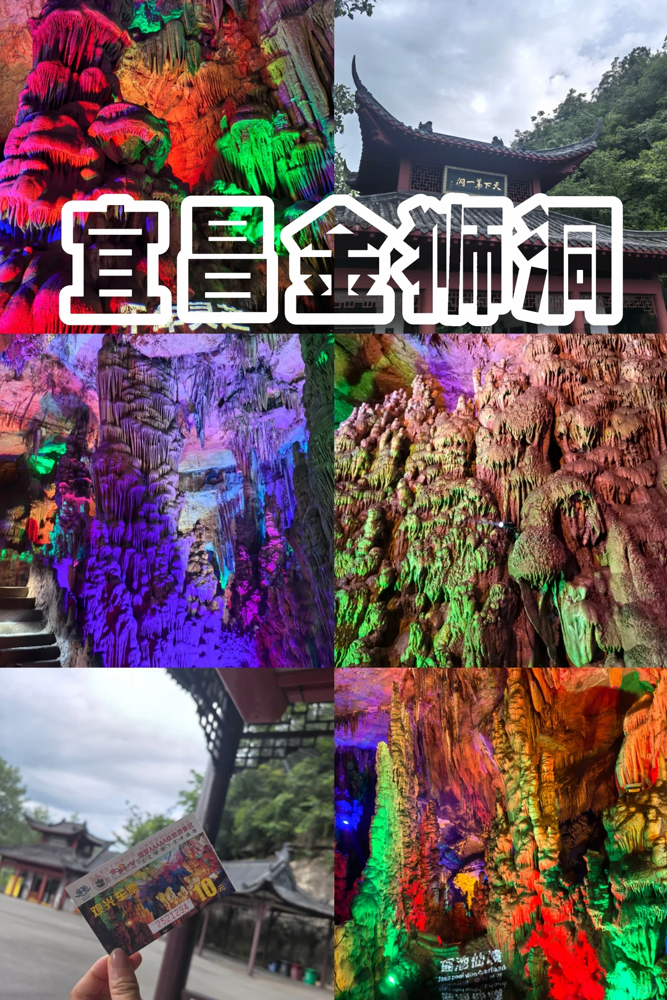
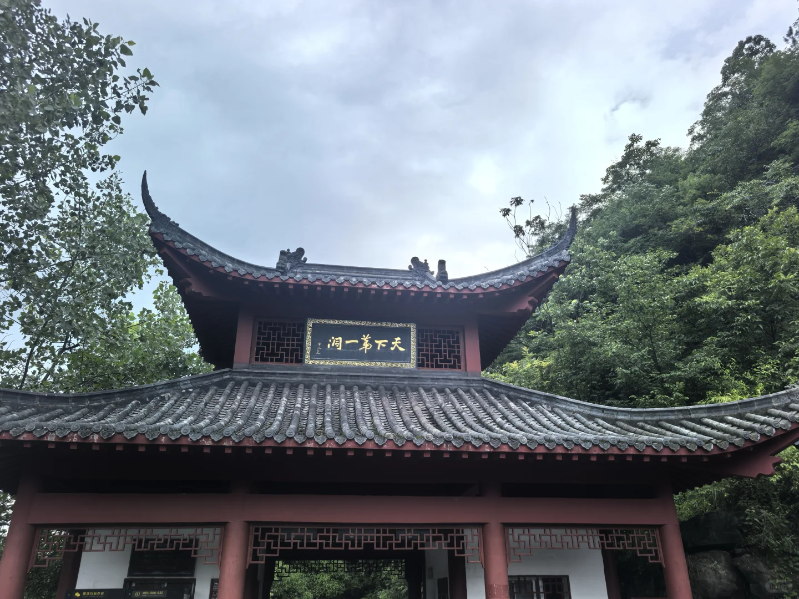
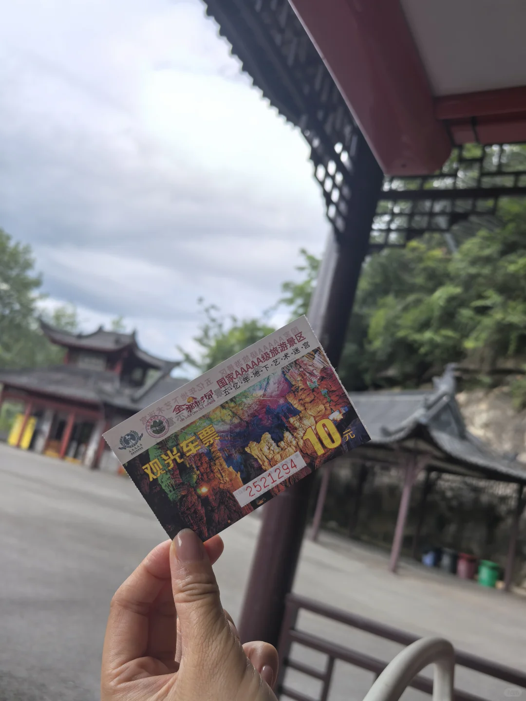
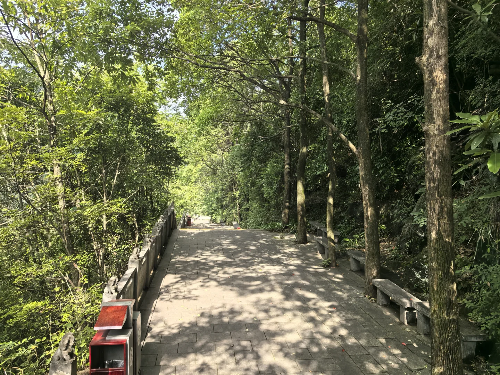
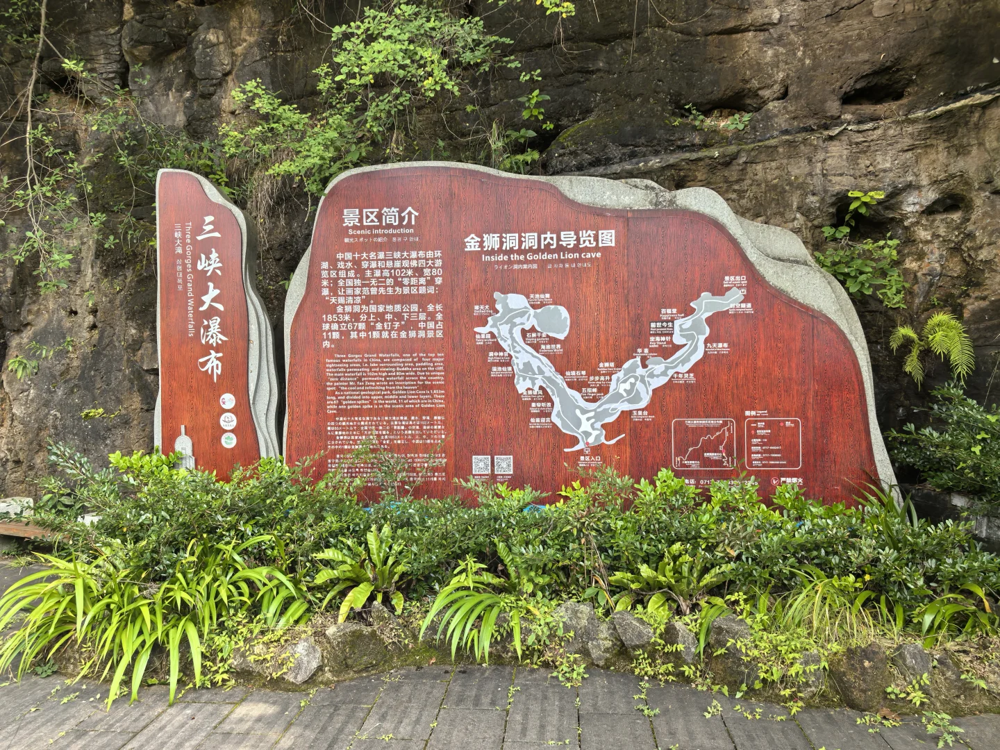
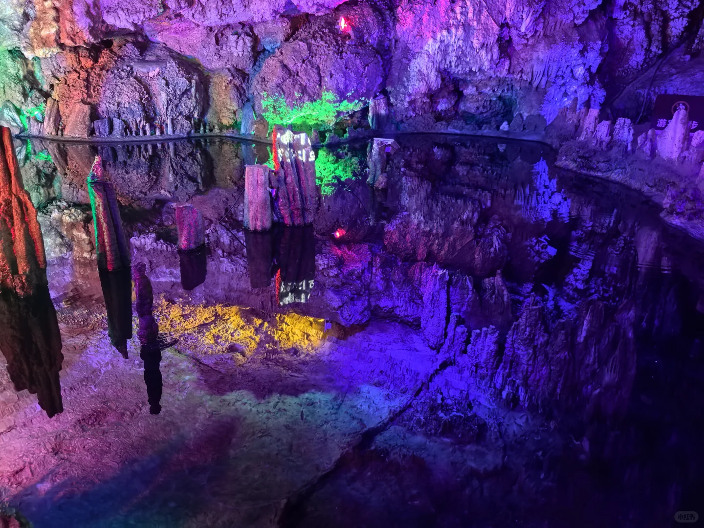
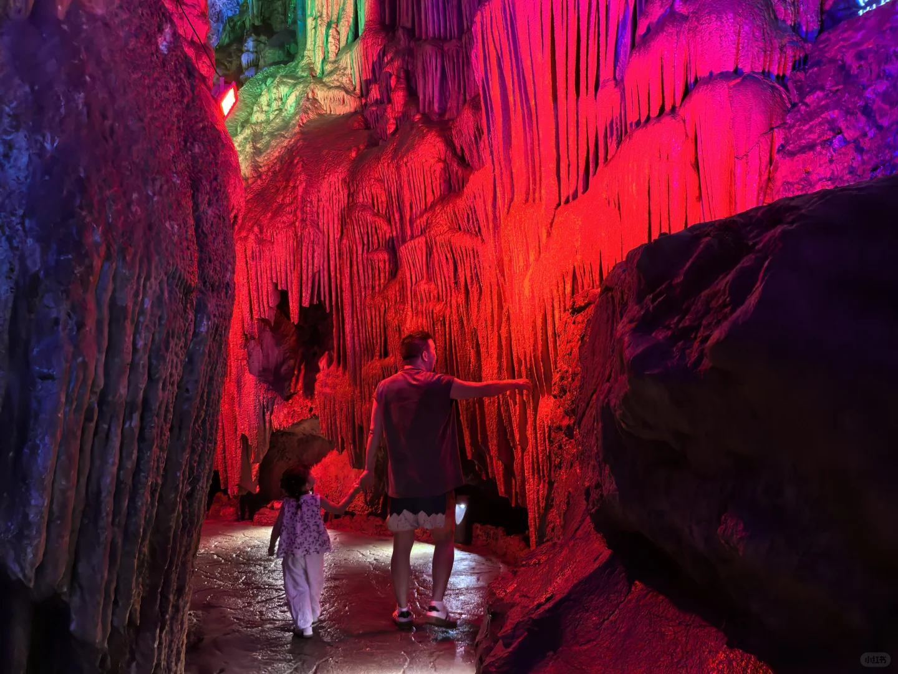
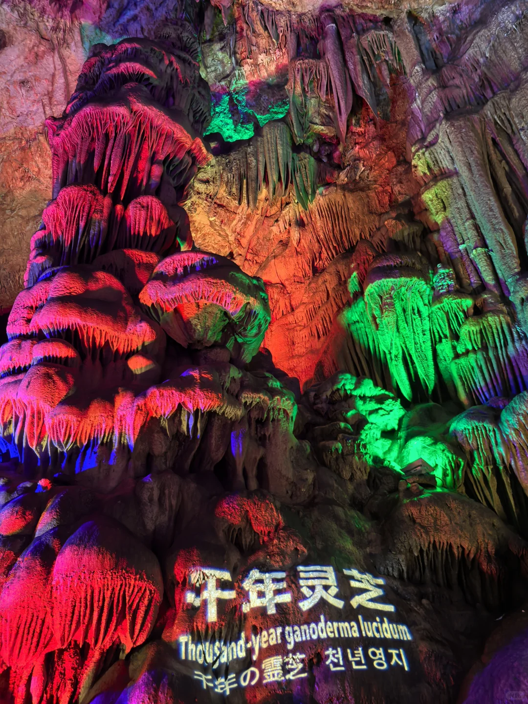
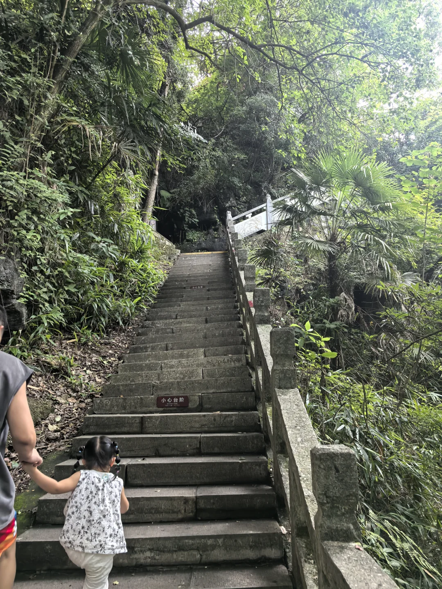

# 宜昌金狮洞︱40min直达18℃空调房

- 作者: 传说彩虹山住着一位彩虹公主
- 👍10 · 💬3 · ⭐8 · 图 9
- feed_id: 6a4b498d000000001702b144

> [OCR] 宜昌金狮洞
观光车票
10元
2521294

> [OCR] 天下第一洞

> [OCR] 观光车票
国家AAAAA级旅游景区
五亿年地下艺术迷宫
10元
2521294

> [OCR] [?]

> [OCR] 三峡大瀑布
Three Gorges Grand Waterfalls

景区简介
Scenic introduction

中国十大名胜三峡大瀑布由环湖、戏水、穿瀑和悬崖观佛四大游览区组成。主瀑高102米，宽80米；全国独一无二的“零距离”穿瀑，让画家范曾先生为景区题词：“天赐清凉”。

金狮洞为国家地质公园，全长1853米，分上下两层，全球确认67颗“金钉子”，中国占4颗。其中1颗就在金狮洞景区内。

金狮洞洞内导览图
Inside the Golden Lion cave

> [OCR] 小红书

> [OCR] 小红书

> [OCR] 千年灵芝
Thousand-year ganoderma lucidum
千年の靈芝  천년영지

> [OCR] 小心台阶

## 正文
❄️ 宜昌市区出发40min｜闯入18℃的“天然空调房”！夏天不知道去哪儿遛娃避暑？金狮洞真的太适合了！市区出发一脚油门就到，洞里洞外简直是两个世界🌬️
	
📍地点：宜昌市夷陵区金狮洞乡🚗
🎫门票：挂牌价55元/人（湖北旅游惠民卡免门票！）
🚌景交车：往返10元/人
⏰开放时间：8:30-16:30
🕐建议游玩：洞内游览约1小时，加上景交车全程1.5小时足够
	
🌟洞里看什么
金狮洞全长1200多米，分上中下三层，洞内恒温18℃，夏天进去待久了甚至觉得冷，记得带件薄外套！
钟乳石千姿百态，有威风凛凛的石狮、千年灵芝、仙果园等各种奇观。灯光一打，整个洞像个地下艺术宫殿。
最惊艳的是“瑶池倒影”，倒影逼真，站在那儿恍惚分不清哪边是真哪边是影！随手一拍就是“地心秘境”大片。
	
📸拍照建议：洞内光线较暗，建议穿亮色衣服更出片。
🍜周边联动：金狮洞离情人泉和三峡大瀑布很近，三个景点可以一天搞定！时间充裕的话顺路一起玩，性价比超高。
夏天不知道去哪儿，就来金狮洞躲清凉吧！
#宜昌旅游[话题]# #宜昌周边游[话题]# #宜昌金狮洞[话题]# #夏日避暑[话题]# #溶洞奇观[话题]# #湖北旅游惠民卡[话题]# #周末去哪儿[话题]# #感受大自然的鬼斧神工[话题]#

---