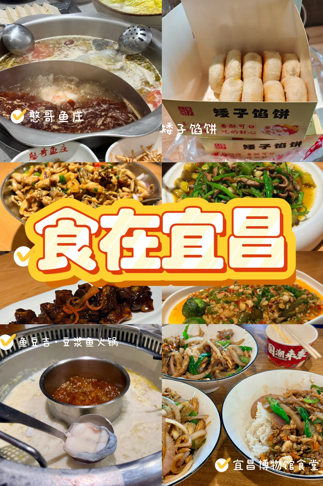
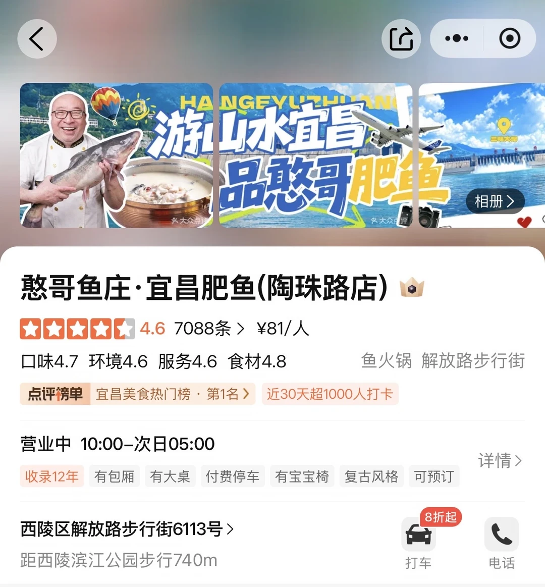
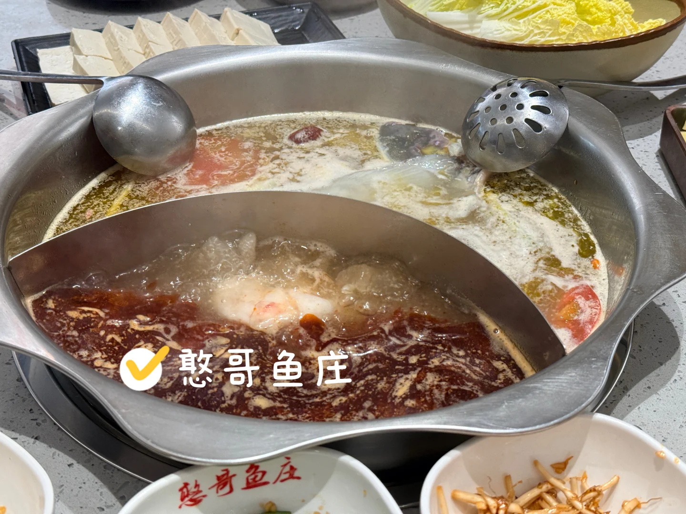
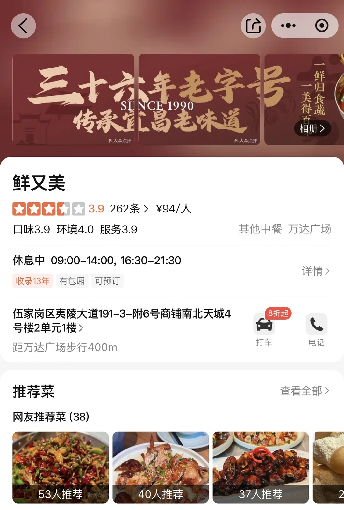
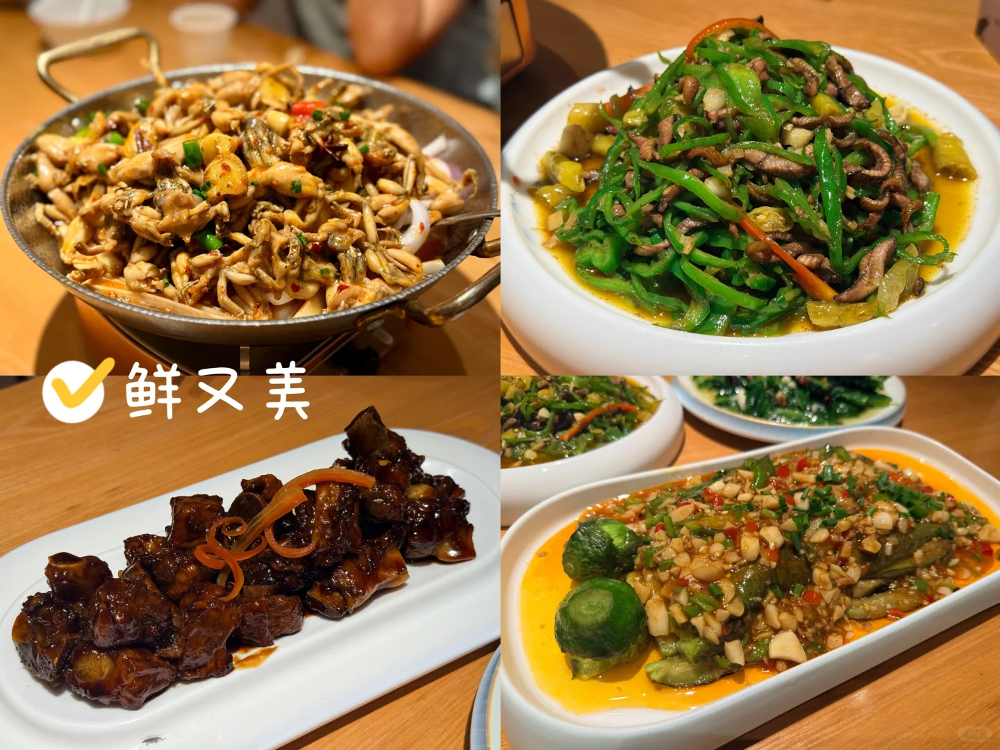
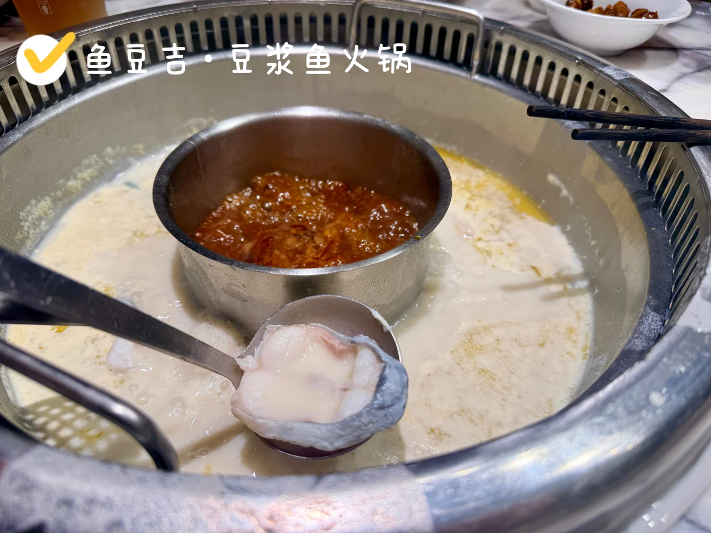
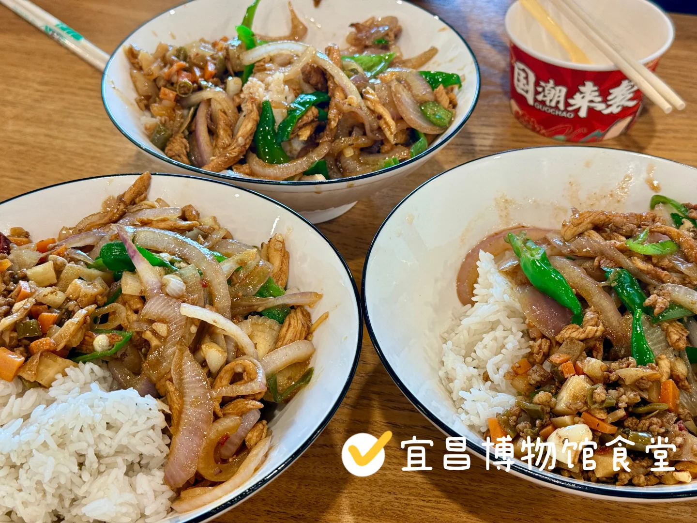
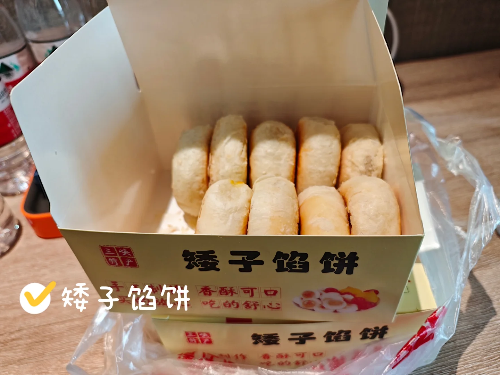
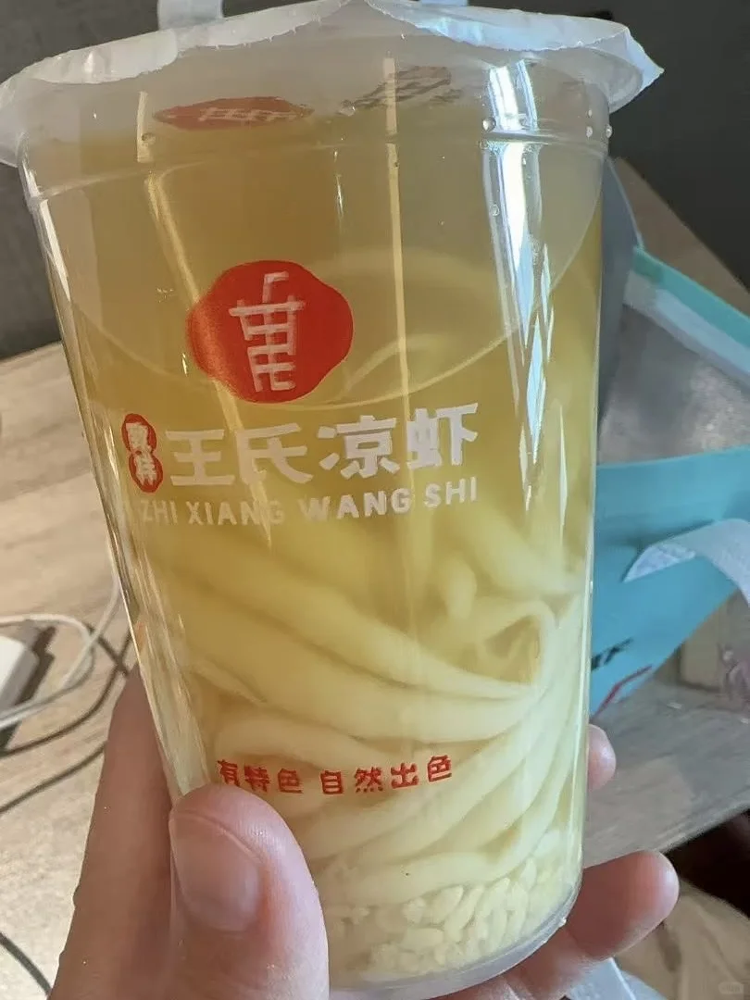

# 食在宜昌

- 作者: 思茗Astrid
- 👍10 · 💬3 · ⭐8 · 图 10
- feed_id: 6a65e3710000000011013d36

> [OCR] 憨哥鱼庄
矮子馅饼
食在宜昌
鱼豆吉·豆浆鱼火锅
宜昌博物馆食堂

> [OCR] <返回
游山水宜昌
品憨哥肥鱼
相册>
憨哥鱼庄·宜昌肥鱼(陶珠路店)
4.6 7088条 > ¥81/人
口味4.7 环境4.6 服务4.6 食材4.8
鱼火锅 解放路步行街
点评榜单 宜昌美食热门榜 · 第1名 >
近30天超1000人打卡
营业中 10:00-次日05:00
收录12年 有包厢 有大桌 付费停车 有宝宝椅 复古风格 可预订
西陵区解放路步行街6113号 >
距西陵滨江公园步行740m
8折起
打车
电话

> [OCR] 憨哥鱼庄
憨哥鱼庄

> [OCR] 三十六年老字号
SINCE 1990
传承宜昌老味道

鲜又美
★★★☆☆ 3.9 262条 > ¥94/人
口味3.9 环境4.0 服务3.9
其他中餐 万达广场

休息中 09:00-14:00, 16:30-21:30
收录13年 有包厢 可预订

伍家岗区夷陵大道191-3-附6号商铺南北天城4号楼2单元1楼>
距万达广场步行400m

打车 电话
8折起

推荐菜
网友推荐菜 (38)
查看全部>

53人推荐
40人推荐
37人推荐

> [OCR] 鲜又美

> [OCR] 小吃榜

鱼豆吉·豆浆鱼火锅(宜昌万达店) 🏰
大众点评 必吃榜 2026
★★★☆ 4.4 3758条 > ¥93/人
口味4.4 环境4.4 服务4.4 食材4.6
鱼火锅

心吃榜 2026年上榜餐厅 >
近30天381人打卡

营业中 10:00-21:30
收录10年 有大桌 付费停车 有宝宝椅 免费Wi-Fi 可预订
详情>

伍家岗区沿江大道万达广场三楼（万达影城正对面）
位于万达广场内
打车 电话
8折起

商场 万达广场>

> [OCR] 鱼豆吉·豆浆鱼火锅

> [OCR] 国潮来表
宜昌博物馆食堂

> [OCR] 三峡特产
矮子馅饼
手工制作 香酥可口 吃的舒心
矮子馅饼

> [OCR] 王氏凉虾
ZHI XIANG WANG SHI
有特色 自然出色

## 正文
自从当年来宜昌参加完朋友的婚礼，朋友带着我们吃吃喝喝了两天，我就对宜昌菜念念不忘——江团鱼真的太美味了！于是这次恩施游玩结束后，迅速转场，专程来宜昌二刷这些美食。
📍憨哥鱼庄
落地第一餐，回味我的爱——肥鱼火锅！点了四人套餐，鸳鸯锅。辣锅真的很香，店员帮忙调的小料和鱼肉非常搭配，鲜美！不过注意，小料上方的凉菜拼盘不是免费的。
📍鲜又美
朋友之前带我们吃的，说是一家吃青蛙的店。卤味蛙很香很入味，但终究不如牛蛙肥美，青蛙比较紧致劲道，没那么入味，所以吃到后面有点腻了。但风味茄子非常美味，强烈推荐！
📍鱼豆吉·豆浆鱼火锅
豆浆锅底挺香的，尤其是搭配豆皮和豆花，美味😋辣锅就很一般了，不推荐。四个人点了双人套餐，结果还没能吃完，分量真的很大！
📍宜昌博物馆员工食堂
没想到吧，逛完博物馆上顶楼食堂，已经“收摊”了。员工大姐说还可以给我们炒盖浇饭，一份20元——意外的好吃！吃完继续逛展咯～
📍矮子馅饼
本地特色，口味很丰富，口感很酥脆。外卖更快，现场排队要很久。不过外卖只能一盒一盒买。
📍王氏凉虾
解暑神器，一如既往地软糯好喝！
	
#宜昌美食[话题]# #宜昌美食推荐[话题]# #宜昌吃什么[话题]# #宜昌[话题]#

---