# 武汉自驾宜昌周末两天游玩路线

- 作者: 小小酥
- 👍9 · 💬2 · ⭐9 · 图 12
- feed_id: 6a684085000000000301c76f

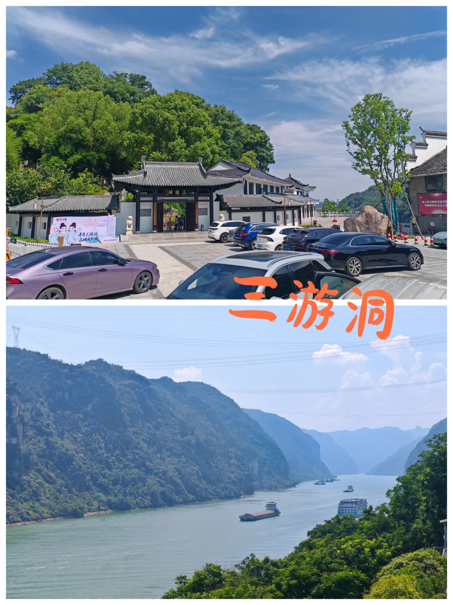
> [OCR] 三游洞
二游洞
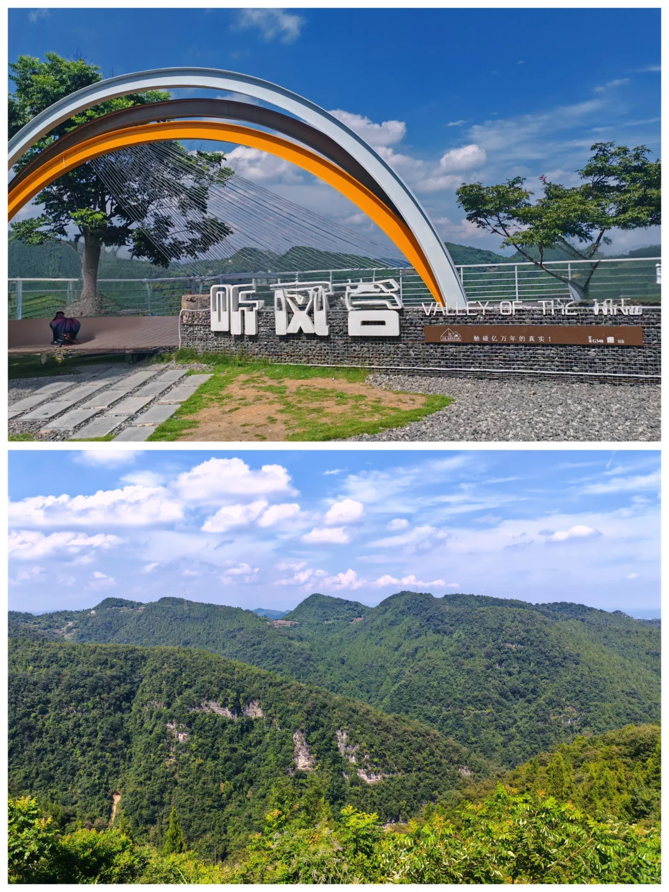
> [OCR] 听风台
VALLEY OF THE WIND
触碰亿万年的真[?]
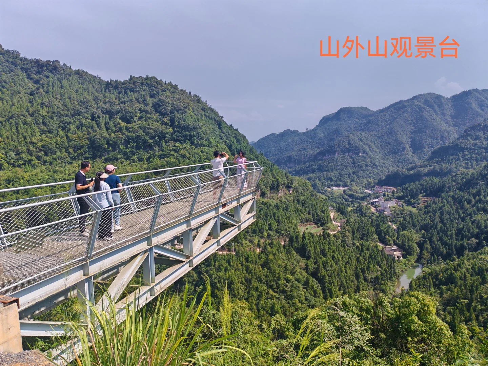
> [OCR] 山外山观景台
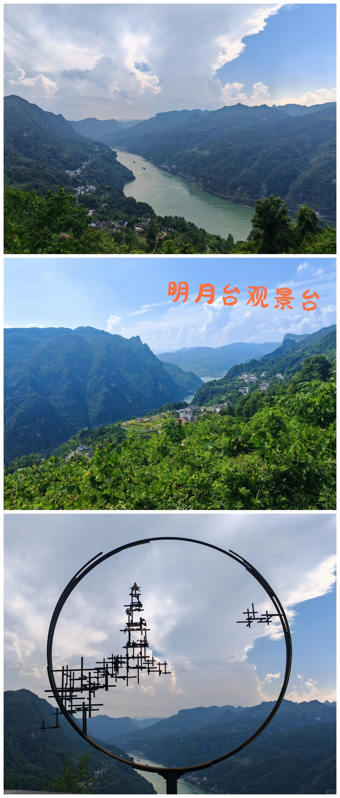
> [OCR] 明月台观景台
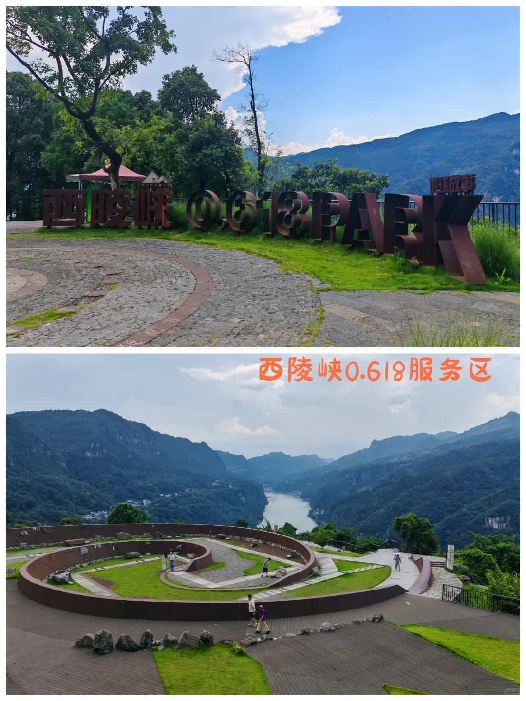
> [OCR] 西陵峡0.618PARK
西陵峡0.618服务区
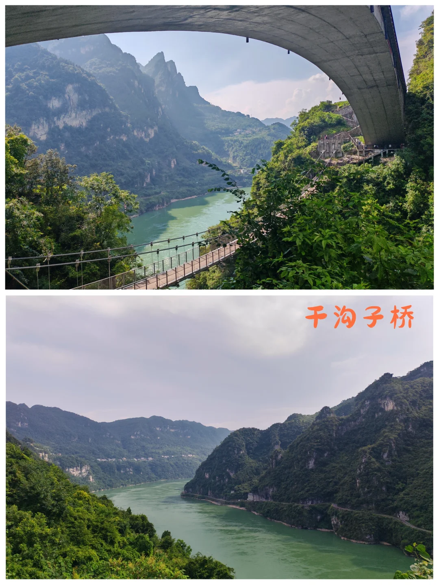
> [OCR] 干沟子桥
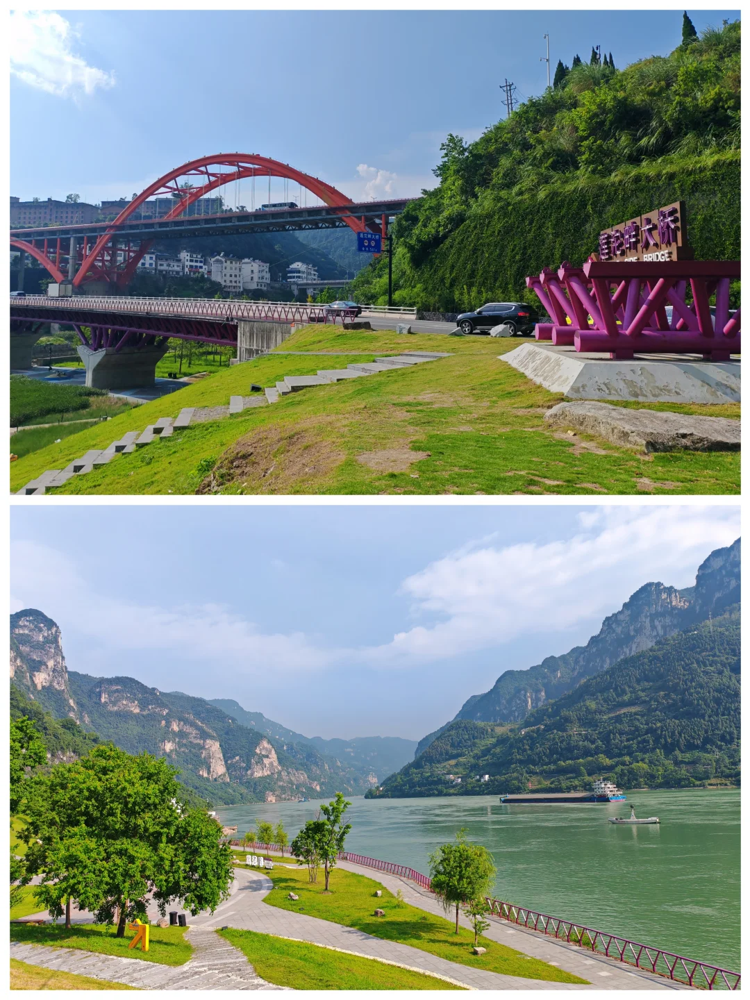
> [OCR] 莲花大桥
LILIA BRIDGE
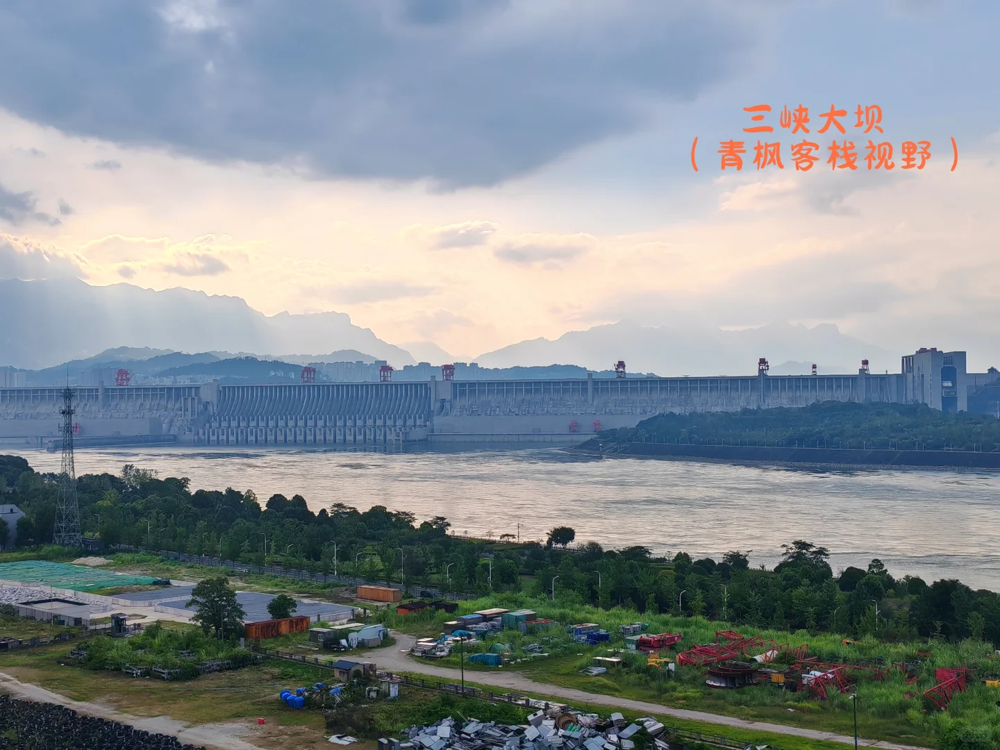
> [OCR] 三峡大坝
(青枫客栈视野)
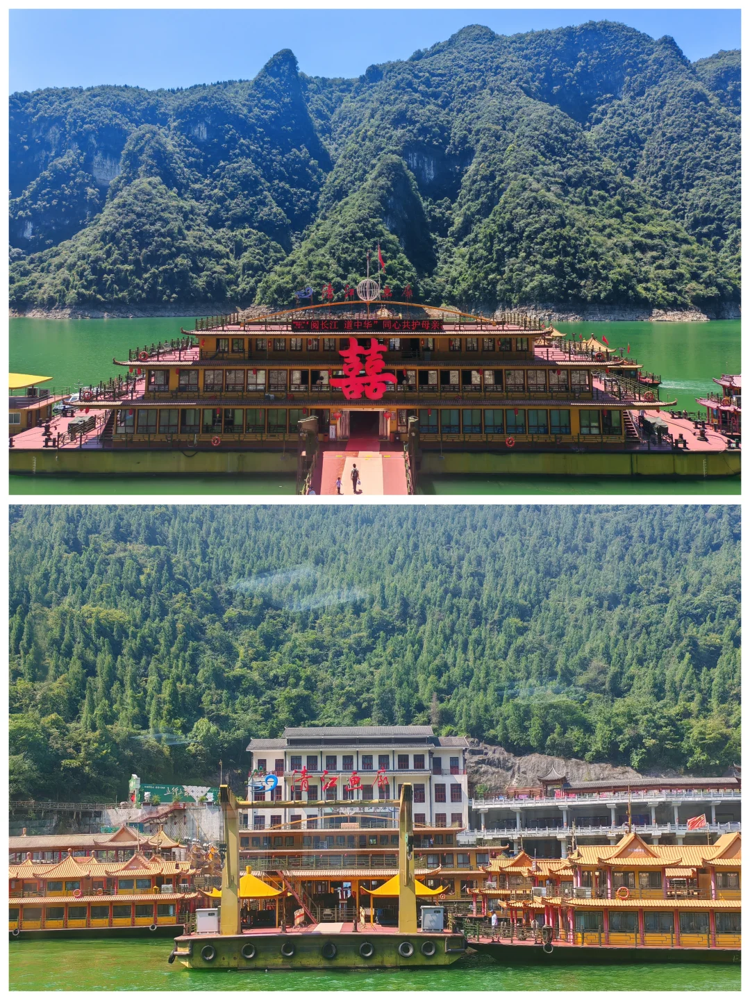
> [OCR] [?]
[?]
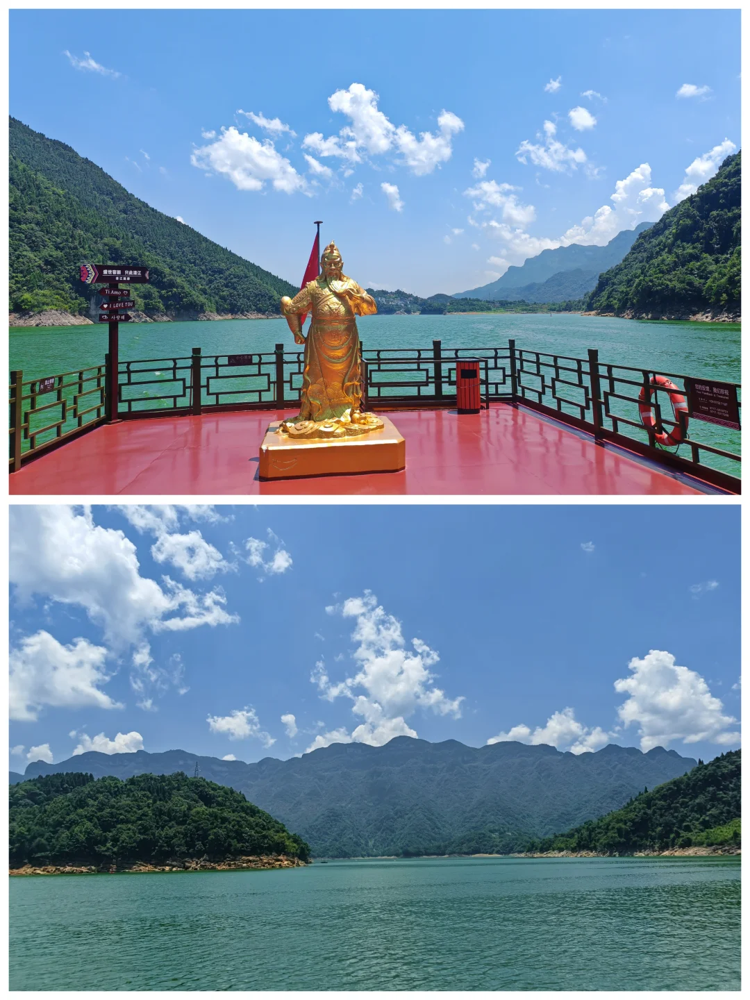
> [OCR] [天]
LOVE YOU
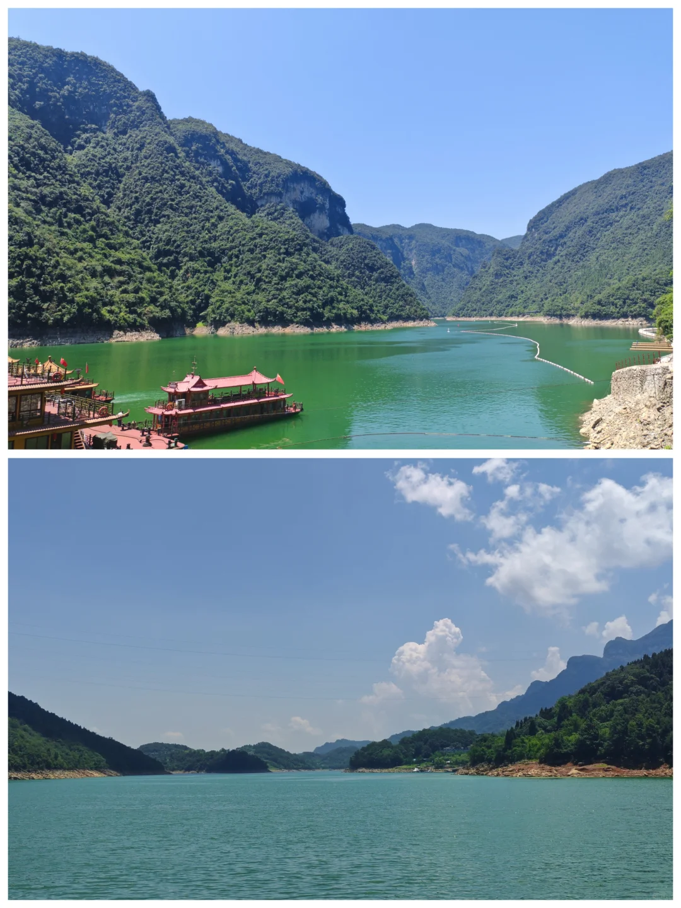
> [OCR] system
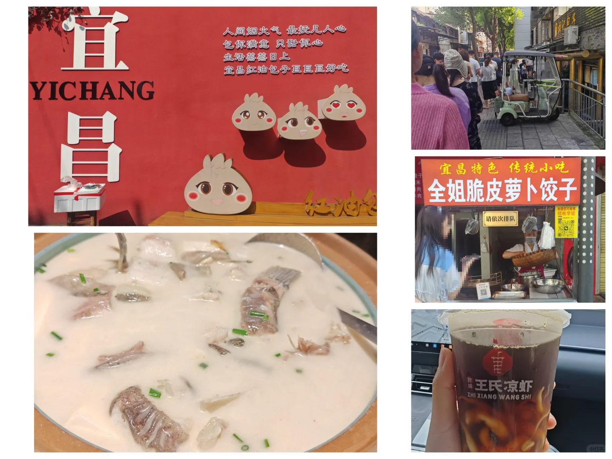
> [OCR] 宜昌
YICHANG
人间烟火气 最抚凡人心
包你满意 只甜你心
生活蒸蒸日上
宜昌红油包子巨巨巨好吃

全姐脆皮萝卜饺子
请依次排队

王氏凉虾
ZHI XIANG WANG SHI

## 正文
[打卡R]第一天：武汉出发→G348国道一日游
三游洞景区-听风谷观景台-山外山观景台-明月台观景台-西陵峡0.618服务区-干沟子桥-莲沱畔服务区（莲沱畔大桥）-清风客栈（宜昌店）-三峡大坝观景平台-湖北三峡移民博物馆-鹰嘴岩-酒店-万达广场(自己人•宜昌菜）
[向右R]因为时间有限三峡大坝观景平台，移民博物馆和鹰嘴岩都没去成。
[向右R]山外山观景平台风景一般，如果赶时间可以不用停留。
[向右R]想看三峡大坝建议去三峡大坝观景平台，清风客栈位置太远了。
[向右R]晚餐：万达广场【自己人•宜昌菜】，吃了本地的宜昌肥鱼，口感还不错，鱼肉鲜嫩Q弹，汤比较鲜美，配上豆腐，浓郁的豆奶味。
	
[打卡R]第二天：酒店出发-袁姐一家萝卜饺子-致祥王氏凉虾（解放路店）-胡记包子-方妈面馆（福绥横路店）-清江画廊-返程
[向右R]袁姐一家萝卜饺子关门了，随便选了一家，胡记包子排队人多，赶时间没吃上，随便选了一家包子店。方妈面馆味道还不错，口味都属于偏辣的。
[向右R]清江画廊距离市区比较远，开车大概一个小时。清江画廊有圣境游和影画游，普遍选择圣境游，坐船去再坐船回。影画游需要徒步，看自己需求。圣境游一个小时一趟船，需提前20分钟购票，往返大约3个小时。
整体游览感受，风景还行，不过比较无聊，主要在船上看看风景。
	
[两颗心R]TIPS:
[一R]如果时间精力充足，第二天可以起早，选择两坝一峡游玩，玩两坝一峡分半日和一日游，如果选择半日游，早上8点半之前需要到三峡游客中心，从宜昌港九码头出发，途径葛洲坝和三峡大坝，体验水涨船高，终点到三斗坪码头，返程需要自己回去。具体的游玩时间看购票软件通知，考虑到起早，就放弃玩两坝一峡。
[二R]三峡大瀑布：也在计划中去游玩的一个景点，因为时间太短，且不想爬山，就放弃了。
[三R]三峡人家没有在计划游玩的范畴，因为7月份去的，天气太热了，不想徒步。
	
如果想在宜昌多玩几个景点，建议还是安排3-4天时间。

---