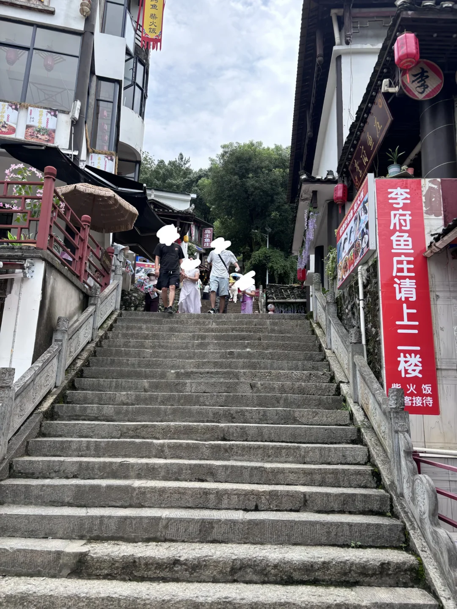

# 我将痛斥清江画廊‼️

- 作者: 鱼崽碎碎念
- 👍9 · 💬35 · ⭐3 · 图 1
- feed_id: 6a5c66370000000011013d20

> [OCR] 李府鱼庄请上二楼
紫火饭客接待

## 正文
来之前看到🍠说a线适合老人小孩走，路比较平，船进船出，船进船出是真的，路平在哪儿！🆘就是看到适合老人小孩我们才选的船行，因为脚摔了有伤，结果a 线都这样那b线得多累！[呃R]
如果大家比较喜欢爬山，不怕热，那么当我没说。如果春秋气温舒适凉爽那么也当我没说。
但谁家景点，一下船就是农家乐啊！然后一路上全是农家乐？？？没有夸张，全是！[捂嘴笑R]
下船后，沿山而上的阶梯全是农家乐，然后告诉你，山上有座庙，就没了！[呃R]
当然，如果你喜欢人在画中游的那一个小时船程，不爬山，也是可以的，但这个天，真的还是避雷。
前一天dd司机说如果我们是从四川来的，那这个景色可能我们不觉得好看，我们觉得景还是好看的，但吃相真的太难看了。
[微笑R]#一爬一个不吱声[话题]# #清江画廊[话题]# #宜昌清江画廊[话题]#

---