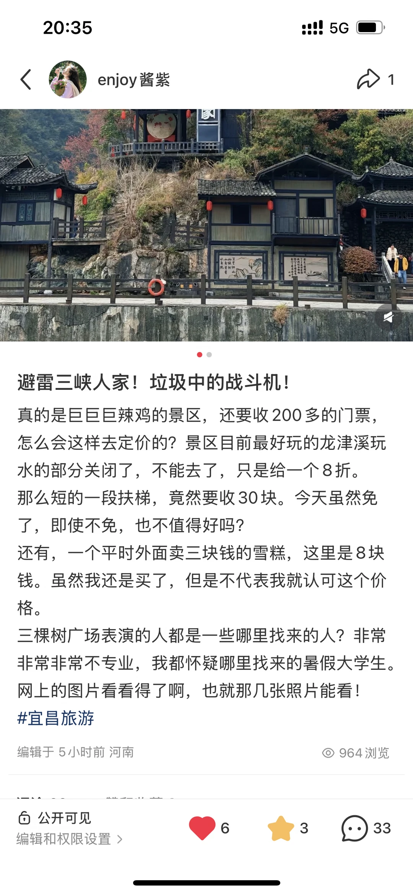

# 关于三峡人家！请大家认真看看！

- 作者: enjoy酱紫
- 👍8 · 💬32 · ⭐1 · 图 1
- feed_id: 6a772379000000002402e65c

> [OCR] 20:35
enjoy 酱紫
避雷三峡人家！垃圾中的战斗机！

真的是巨巨巨辣鸡的景区，还要收 200 多的门票，
怎么会这样去定价的？景区目前最好玩的龙津溪玩水的部分关闭了，不能去了，只是给一个8折。
那么短的一段扶梯，竟然要收30块。今天虽然免了，即使不免，也不值得好吗？
还有，一个平时外面卖三块钱的雪糕，这里是 8 块钱。虽然我还是买了，但是不代表我就认可这个价格。

三棵树广场表演的人都是些哪里找来的人？非常非常非常不专业，我都怀疑哪里找来的暑假大学生。
网上的图片看看得了啊，也就那几张照片能看！
#宜昌旅游

编辑于 5 小时前 河南
964 浏览

公开可见
编辑和权限设置 >
❤️ 6
🌟 3
💬 33

## 正文
作为一名博主，我其实看得懂三峡人家的营销笔记，我也是看了营销笔记去的。
用几张精修图，引流
我今天发的三峡人家的贴，无缘无故，进入我的主页都看不到。
想必是官方找人处理了。
希望大家不要再被骗！
#宜昌旅游[话题]#

---