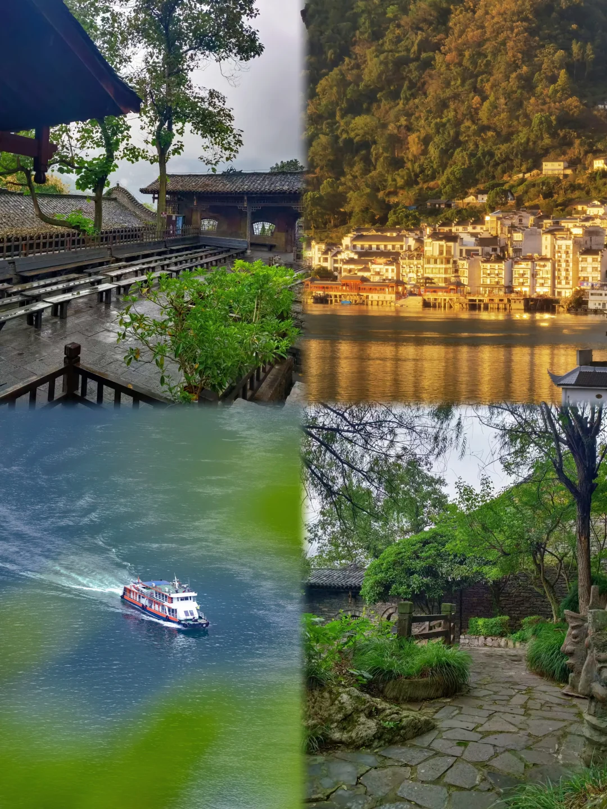
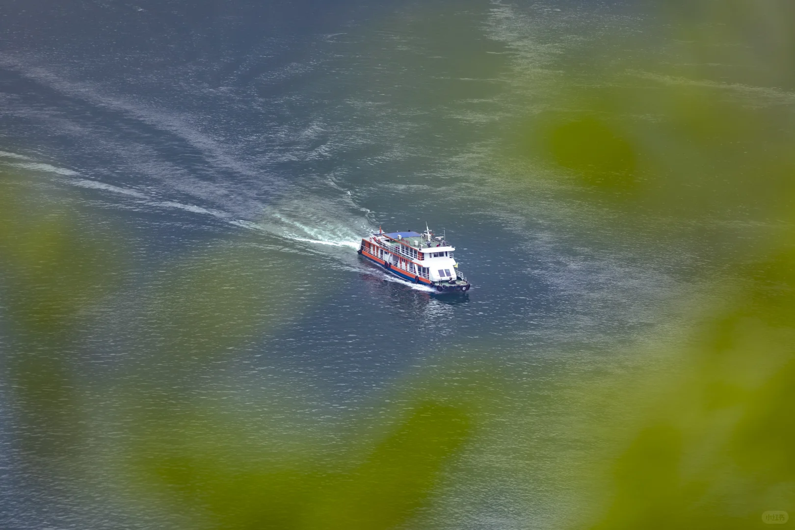
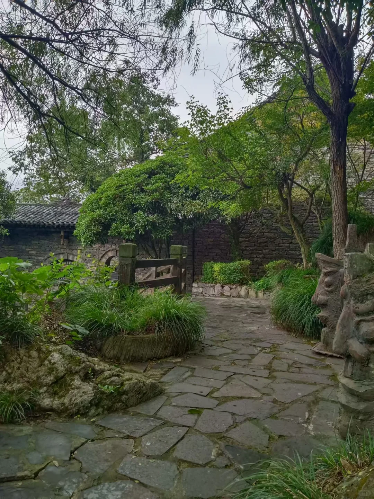
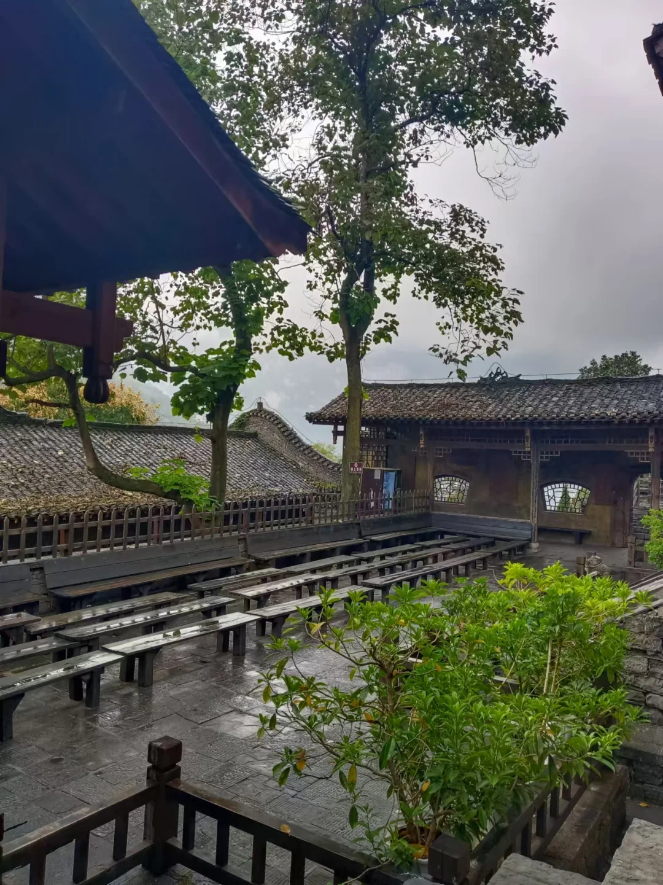
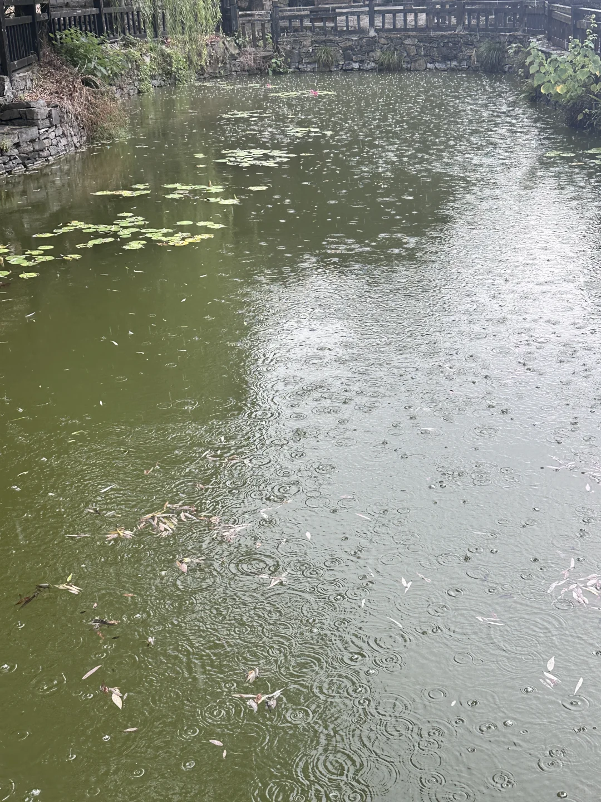

# 高温避暑怎么选｜三峡人家玩水+民俗我冲了

- 作者: Laughing  Sir
- 👍8 · 💬3 · ⭐4 · 图 6
- feed_id: 6a77122500000000290325a5

> [OCR] [?]
[?]

> [OCR] 小红书

> [OCR] 小红书

> [OCR] [?]

> [OCR] [?]

> [OCR] [?]

## 正文
最近武汉持续高温🥵，正好暑期带上全家老小，直奔宜昌三峡人家，扎进西陵峡的清凉世界
	
外界热浪滚滚，峡谷内维持在舒适 26℃，这里有山涧溪水、飞瀑、恒温溶洞层层降温，不用闷在空调房，拥抱大自然的凉快✌✌
	
乘船渡江进入景区后，入住景区内三峡人家大酒店，码头接送、行李寄存很贴心，特地挑选的江景房，晨起傍晚都能直面峡江风光！
	
走进龙津溪，浓荫蔽日避开了毒辣的太阳🌞溪流不深，不管大人小孩，都可以脱鞋踩进溪水里，戏水纳凉，美滋滋～
	
接着漫步到附近的黄龙瀑，奔涌的瀑布溅起水雾，站在旁边那叫一个凉快。周围林木茂盛，负氧离子满满，青山绿水，随手一拍都是大片！
	
太极猫洞溶洞不错哟，天然地下空调房，洞内温度宜人，岩壁配上光影好好看，路面平缓，老人游玩也毫无压力。
	
景区实景表演一定要看✨，峡江号子国家级非遗表演，重现古老船工生活；巴王寨的实景民俗歌舞、摆手舞、茅古斯轮番上演，娃儿看的很是投入。山水作舞台，沉浸式感受土家非遗文化，游玩同时还能涨见识，嘿嘿～
	
有山有水有演出，玩水消暑，感受民俗风情，全家夏日度假避暑真的没白来👍
	
📍三峡人家风景区
#船进三峡人家[话题]# #三峡人家[话题]##三峡人家旅游攻略[话题]##宜昌旅游[话题]##暑假去哪玩儿[话题]##湖北周边游[话题]##清凉一夏[话题]##旅游万粉扶持计划[话题]# #夏日玩水[话题]# #周末去哪儿[话题]#

---