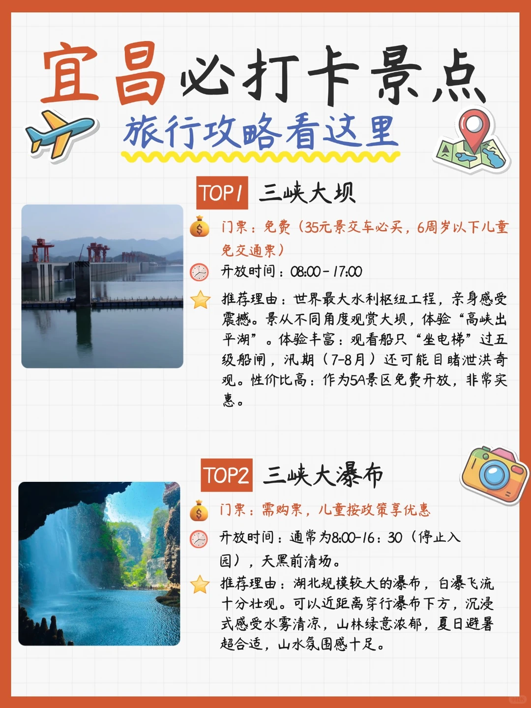
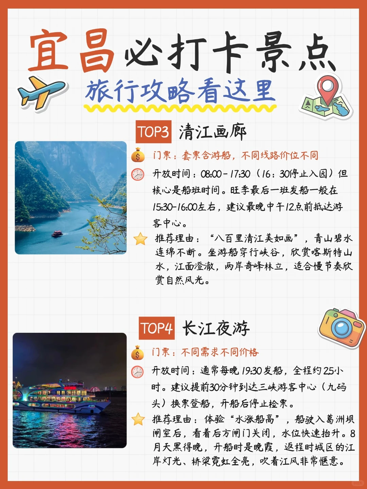
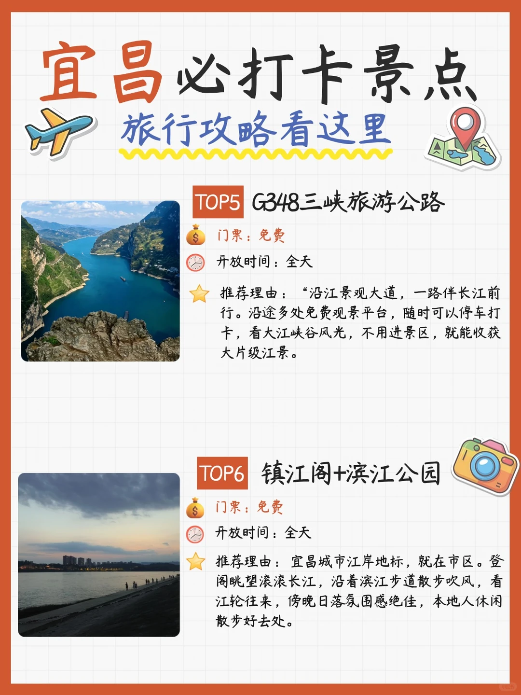
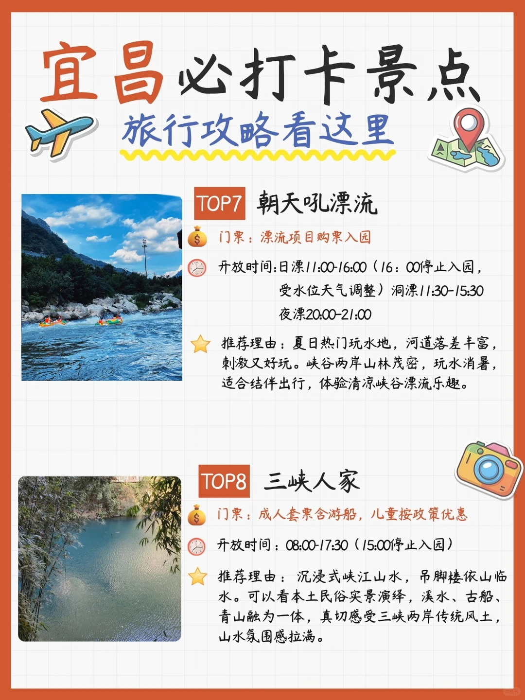
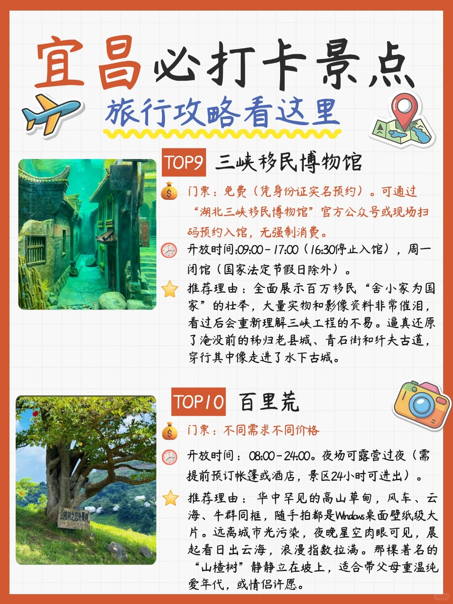

# 懒人版宜昌攻略🚗门票开放时间全扒给你

- 作者: 四季学知旅游行程管家小杰
- 👍9 · 💬 · ⭐22 · 图 5
- feed_id: 6a78748c000000002c0015fb

> [OCR] 宜昌必打卡景点
旅行攻略看这里

TOP1 三峡大坝
门票：免费（35元景交车必买，6周岁以下儿童免交通票）
开放时间：08:00-17:00
推荐理由：世界最大水利枢纽工程，亲身感受震撼。景从不同角度观赏大坝，体验“高峡出平湖”。体验丰富：观看船只“坐电梯”过五级船闸，汛期（7-8月）还可能目睹泄洪奇观。性价比高：作为5A景区免费开放，非常实惠。

TOP2 三峡大瀑布
门票：需购票，儿童按政策享优惠
开放时间：通常为8:00-16:30（停止入园），天黑前清场。
推荐理由：湖北规模较大的瀑布，白瀑飞流十分壮观。可以近距离穿行瀑布下方，沉浸式感受水雾清凉，山林绿意浓郁，夏日避暑超合适，山水氛围感十足。

> [OCR] 宜昌必打卡景点
旅行攻略看这里

TOP3 清江画廊
门票：套票含游船，不同线路价位不同
开放时间：08:00-17:30（16:30停止入园）但核心是船班时间。旺季最后一班发船一般在15:30-16:00左右，建议最晚中午12点前抵达游客中心。
推荐理由：“八百里清江美如画”，青山碧水连绵不断。坐游船穿行峡谷，欣赏喀斯特山水，江面澄澈，两岸奇峰林立，适合慢节奏欣赏自然风光。

TOP4 长江夜游
门票：不同需求不同价格
开放时间：通常每晚19:30发船，全程约25小时。建议提前30分钟到达三峡游客中心（九码头）换票登船，开船后停止检票。
推荐理由：体验“水涨船高”，船驶入葛洲坝闸室后，看着后方闸门关闭，水位快速抬升。8月天黑得晚，开船时是晚霞，返程时城区的江岸灯光、桥梁霓虹全亮，吹着江风非常惬意。

> [OCR] 宜昌必打卡景点
旅行攻略看这里

TOP5 G348三峡旅游公路
门票：免费
开放时间：全天
推荐理由：“沿江景观大道，一路伴长江前行。沿途多处免费观景平台，随时可以停车打卡，看大江峡谷风光，不用进景区，就能收获大片级江景。”

TOP6 镇江阁+滨江公园
门票：免费
开放时间：全天
推荐理由：宜昌城市江岸地标，就在市区。登阁眺望滚滚长江，沿着滨江步道散步吹风，看江轮往来，傍晚日落氛围感绝佳，本地人休闲散步好去处。

> [OCR] 宜昌必打卡景点
旅行攻略看这里

TOP7 朝天吼漂流
门票：漂流项目购票入园
开放时间:日漂11:00-16:00（16:00停止入园，
受水位天气调整）洞漂11:30-15:30
夜漂20:00-21:00
推荐理由：夏日热门玩水地，河道落差丰富，
刺激又好玩。峡谷两岸山林茂密，玩水消暑，
适合结伴出行，体验清凉峡谷漂流乐趣。

TOP8 三峡人家
门票：成人套票含游船，儿童按政策优惠
开放时间:08:00-17:30（15:00停止入园）
推荐理由：沉浸式峡江山水，吊脚楼依山临水。
可以看本土民俗实景演绎，溪水、古船，
青山融为一体，真切感受三峡两岸传统风土，
山水氛围感拉满。

> [OCR] 宜昌必打卡景点
旅行攻略看这里

TOP9 三峡移民博物馆
门票：免费（凭身份证实名预约）。可通过“湖北三峡移民博物馆”官方公众号或现场扫码预约入馆，无强制消费。
开放时间:09:00-17:00（16:30停止入馆），周一闭馆（国家法定节假日除外）。
推荐理由：全面展示百万移民“舍小家为国家”的壮举，大量实物和影像资料非常催泪，看过后会重新理解三峡工程的不易。逼真还原了淹没前的秭归老县城、青石街和纤夫古道，穿行其中像走进了水下古城。

TOP10 百里荒
门票：不同需求不同价格

开放时间: 08:00-24:00。夜场可露营过夜（需提前预订帐篷或酒店，景区24小时可进出）。
推荐理由：华中罕见的高山草甸，风车、云海、牛群同框，随手拍都是Windows桌面壁纸级大片。远离城市光污染，夜晚星空肉眼可见，晨起看日出云海，浪漫指数拉满。那棵著名的“山楂树”静静立在坡上，适合带父母重温纯爱年代，或情侣许愿。

## 正文
宜昌旅游这几个景点一定不要错过哟~
✅TOP1｜三峡大坝
🎫门票免费｜观光车35必买！6岁以下小朋友免
⏰08:00‑17:00
大国工程真的亲眼看才震撼！！
7‑8月汛期运气爆棚能碰到泄洪，看大船坐电梯过五级船闸，课本里的高峡出平湖就在眼前，来宜昌必打卡。
✅TOP2｜三峡大瀑布
🎫需要买票
⏰8:00‑16:30停止入园
夏天避暑天花板！可以直接从瀑布底下穿过去💦
✅TOP3｜清江画廊
🎫套票包含游船，不同线路价格不一样
⏰08:00‑17:30👉划重点！尽量中午12点前到！
晚了赶不上末班船！！
都说八百里清江美如画🚢，坐船游峡谷，青山绿水，慢悠悠晃着看风景，很解压。
✅TOP4｜长江夜游
🎫价位很多按需选
⏰19:30发船，全程2.5h，提前30分钟到码头换票！迟到停止检票，一定要体验葛洲坝“水涨船高”⚓。傍晚看晚霞，入夜看江边霓虹，江风一吹超级舒服。
✅TOP5｜G348三峡旅游公路
🎫免费｜⏰全天
沿江一路开，路边到处免费观景台，随时靠边停车拍长江峡谷，不用买门票也出大片📸
✅TOP6｜镇江阁+滨江公园
🎫免费｜⏰全天
就在宜昌市区，不用跑远！
傍晚来！！看日落绝了🌅，吹江风看江轮来来往往，本地人饭后散步的地方。
✅TOP7｜朝天吼漂流
🎫单独购票入园
⏰日漂11‑16点｜夜漂20‑21点
夏天来宜昌必冲🌊！！
落差大，玩着超刺激，记得带换洗衣服+手机防水袋，一定要跟朋友组队打水仗！
✅TOP8｜三峡人家
🎫套票含游船，儿童有优惠
⏰08:00‑17:30
吊脚楼、古船、峡江民俗表演，沉浸式感受三峡土著风情，适合喜欢人文山水的。
✅TOP9｜三峡移民博物馆
🎫免费！！务必带身份证实名预约
⏰09:00‑17:00，16:30停止进馆，周一闭馆（法定节假日除外）
想读懂三峡一定要来这里😭，实物影像很戳人，复原了被淹没的秭归老城，像走进水下古城。
✅TOP10｜百里荒
🎫门票分套餐，价格不等
⏰08:00‑24:00，可以露营过夜
华中高山草甸！风吹草甸，风车牛羊🐂
晚上没有光污染肉眼看星星✨，早上蹲日出云海，山楂树打卡点。
💢真心话小提醒
▪️博物馆不带身份证进不去，别跑空
▪️漂流一定备一套换的衣服，全身会湿透
▪️游船类项目别卡点！错过船班等于白跑
▪️长江夜游千万别迟到，开船就不给检票了
出发gogogo!!!
#宜昌旅游[话题]# #湖北周边游[话题]# #三峡旅游[话题]# #本地人做的攻略[话题]# #宜昌旅游攻略[话题]# #三峡大坝[话题]# #湖北宜昌必打卡景点[话题]#

---