# 宜昌清江画廊

- 作者: 不晚
- 👍8 · 💬6 · ⭐8 · 图 11
- feed_id: 6a686bb6000000000101e88a

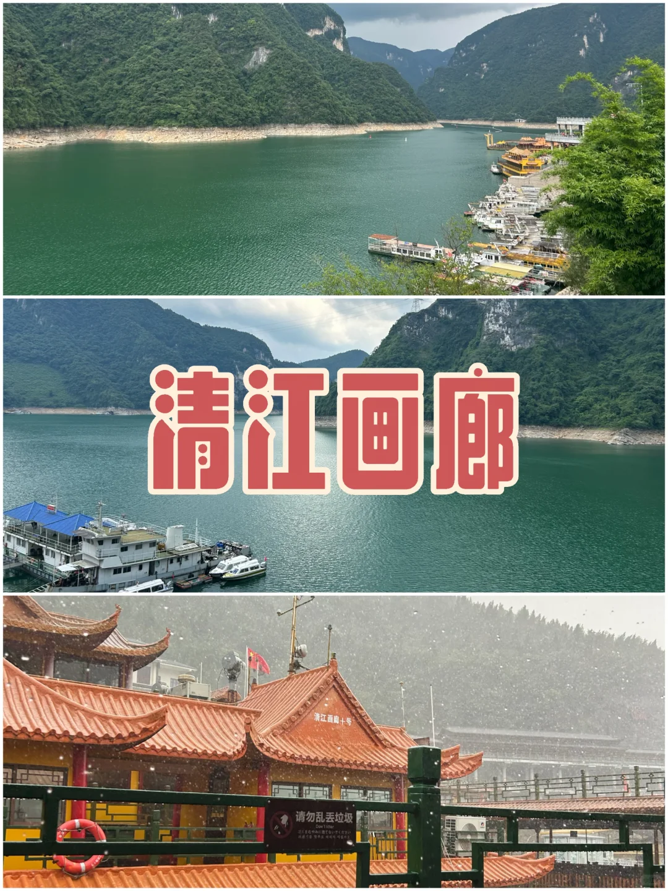
> [OCR] 清江画廊
请勿乱丢垃圾
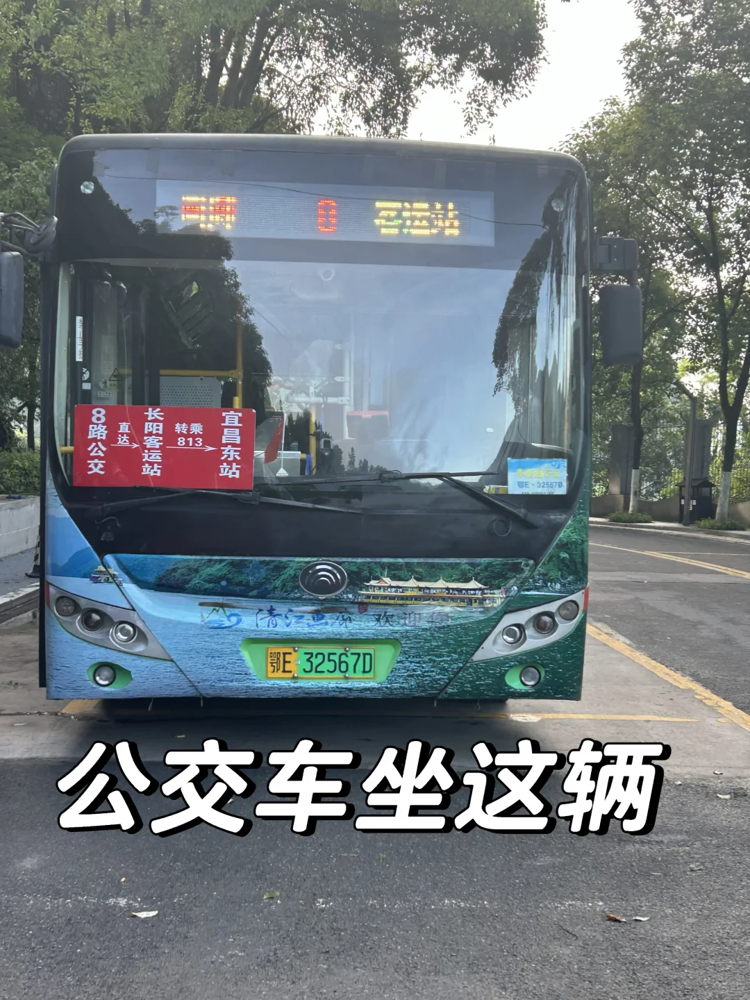
> [OCR] 8路
直达
长阳客运站
转乘
宜昌东站
公交车坐这辆
鄂E 32567D
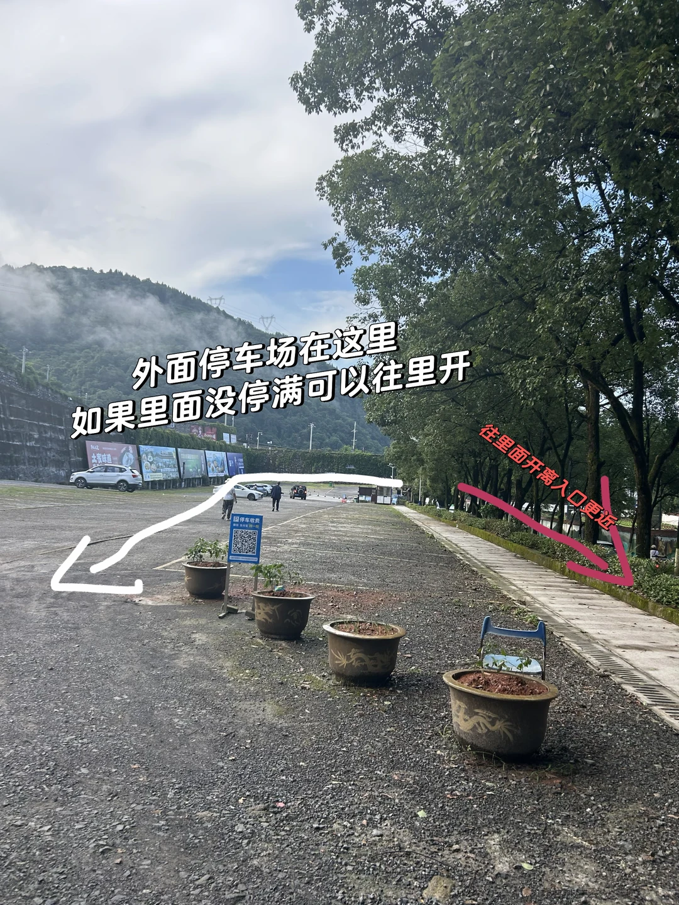
> [OCR] 外面停车场在这里
如果里面没停满可以往里开
往里面开离入口更近
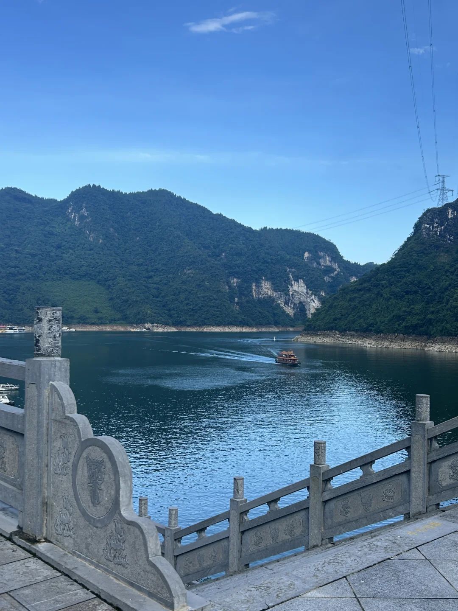
> [OCR] [?]
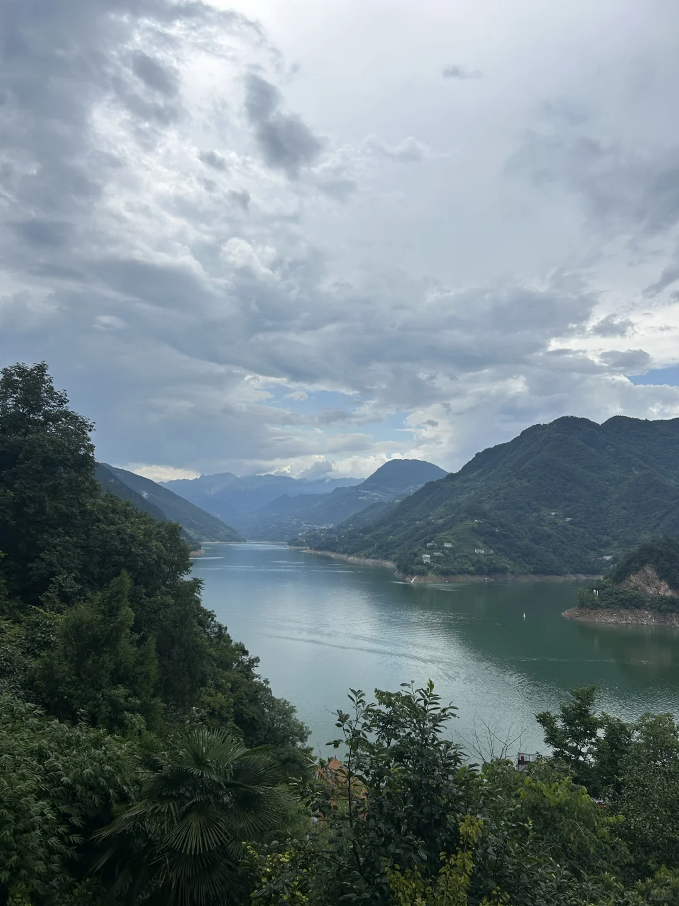
> [OCR] [?]
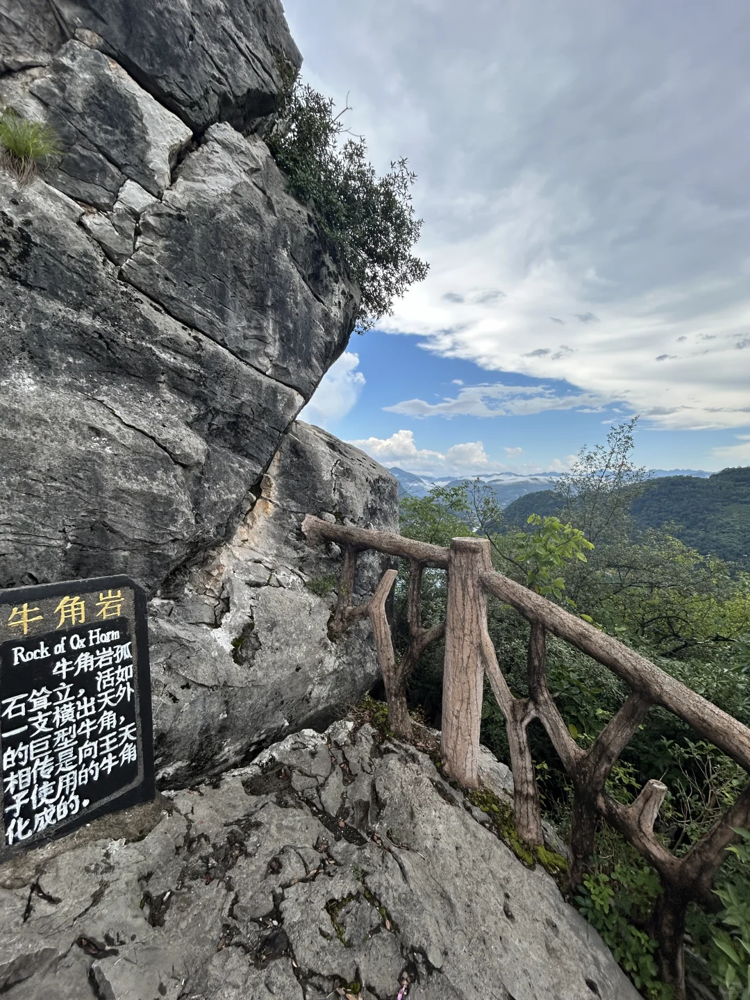
> [OCR] 牛角岩
Rock of Ox Horn
牛角岩孤石耸立，活如一支横出天外的巨型牛角，
相传是向王子使用的牛角化成的。
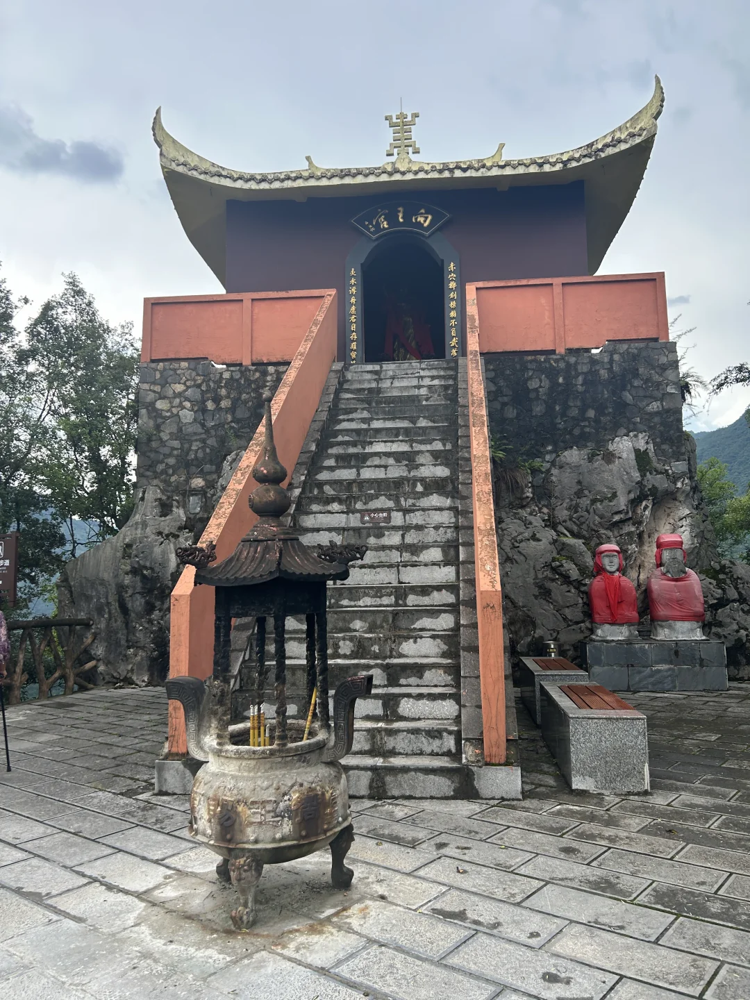
> [OCR] 向王宫
永清开康若目存[?]
赤穴神灵镇不贫安享
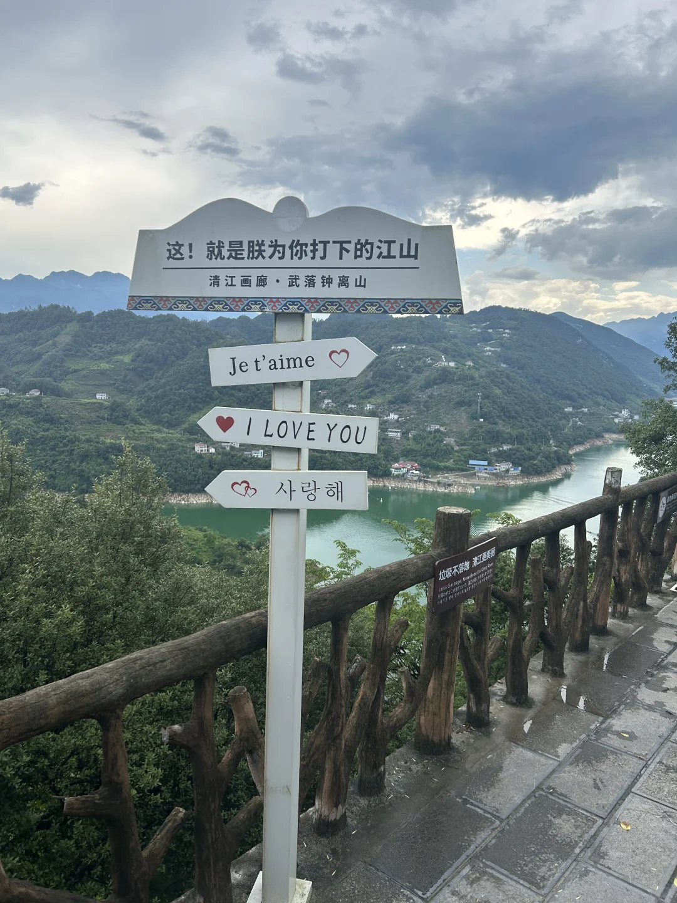
> [OCR] 这！就是朕为你打下的江山
清江画廊·武落钟离山
Je t'aime ❤️
❤️ I LOVE YOU
사랑해
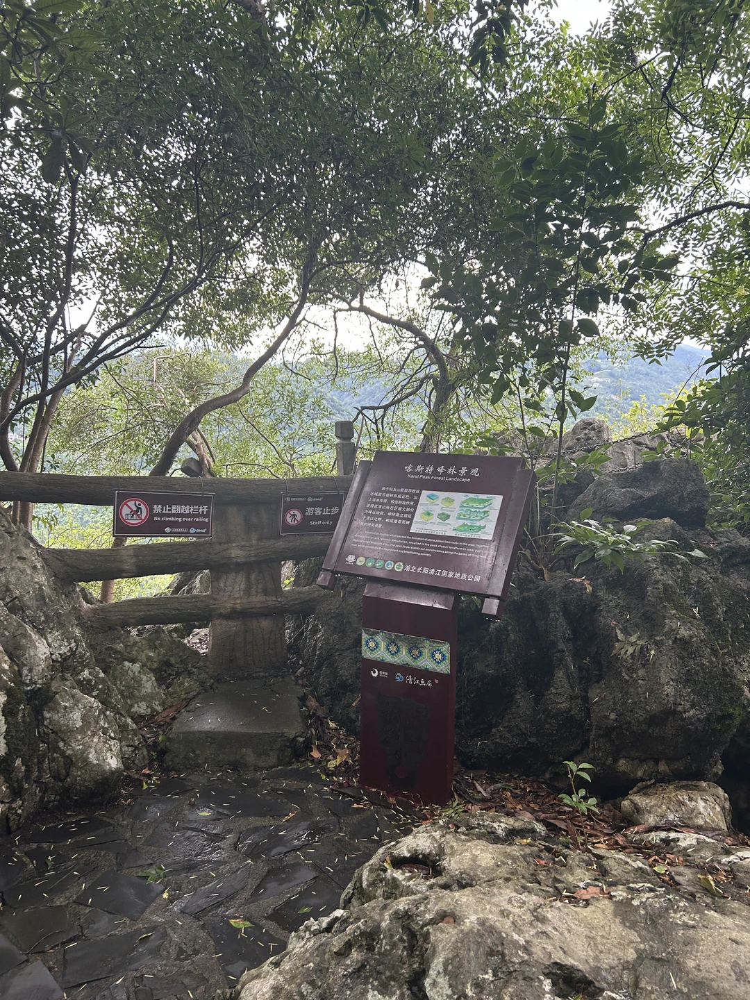
> [OCR] 禁止翻越栏杆
No climbing over railing

游客止步
Staff only

喀斯特峰林景观
Karst Peak Forest Landscape

湖北长阳清江国家地质公园
Hubei Changyang Qingjiang National Geological Park
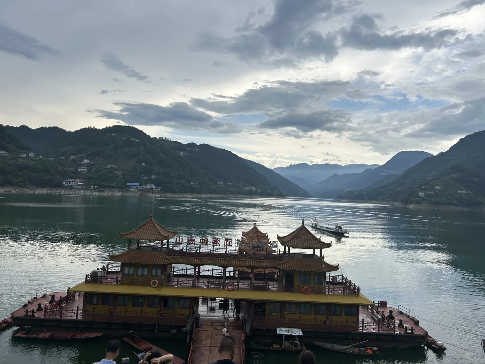
> [OCR] 山高水长风帆远
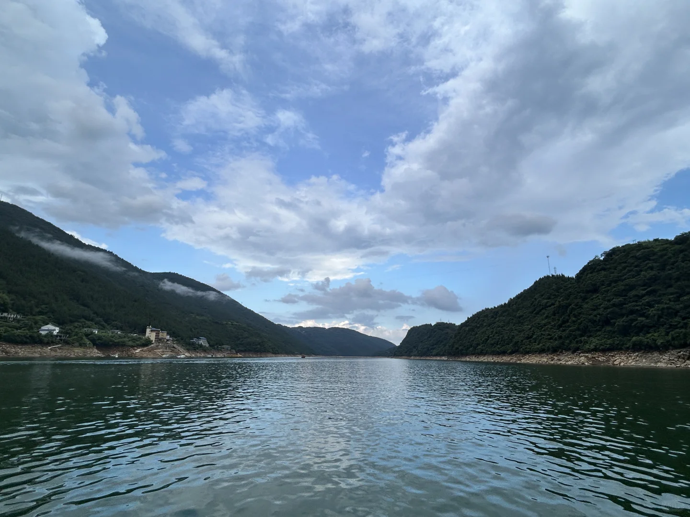
> [OCR] system

## 正文
🚌坐图2这一辆，可以到长阳客运站也可以到宜昌火车站，最后一班车就是5:00从船上下来的那一趟。
🚗自驾游，去晚了只能停在外面的停车场，如果去的早里面车位没有满，就可以停到里面的停车场，直接验票进去。外面停车场走进景区门口有1公里左右，验票走到船上面也有1公里。
A线
🌟爬山难度（半小时上下纯爬）
🌟山上面风景（台阶爬上去很多亭子，商业一条街，最上面风景也一般视野不开阔）
B线
🌟🌟🌟风景：悬棺是亮点，还有一个大的山洞，视野开阔。
🌟🌟🌟难度：爬完1小时，有船接回去，纯徒步沿路的风景还可以，体力消耗大，太晒了就不建议b线

---