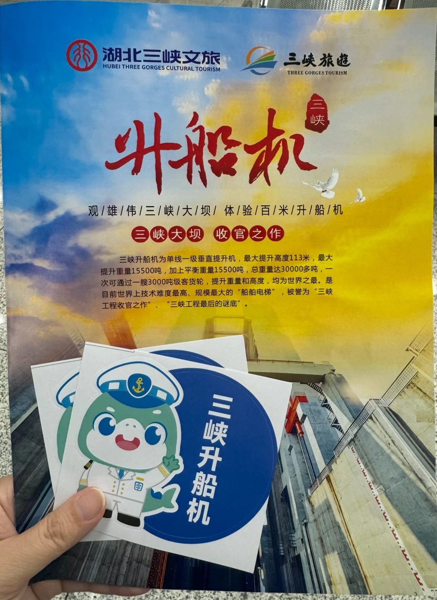

# 三峡大坝+升船机+两坝一峡游船 DIY版

- 作者: 爱做功课的红衣
- 👍7 · 💬5 · ⭐9 · 图 1
- feed_id: 6a76a319000000003301b1c1

> [OCR] 湖北三峡文旅
HUBEI THREE GORGES CULTURAL TOURISM
三峡旅游
THREE GORGE TOURISM

升船机
三峡
观/雄/伟/三/峡/大/坝/体/验/百/米/升/船/机
三峡大坝 收官之作

三峡升船机为单线一级垂直提升机，最大提升高度113米，最大提升重量15500吨，加上平衡重量15500吨，总重量达30000多吨，一次可通过一艘3000吨级客货轮，提升重量和高度，均为世界之最。是目前世界上技术难度最高、规模最大的“船舶电梯”，被誉为“三峡工程收官之作”、“三峡工程最后的谜底”。

三峡升船机

## 正文
想坐上行版的升船机（只有11:00跟17:00）
想陆上看三峡大坝（全域游不包含）
不想多花钱（688那个臻享全域游）
还得赶上晚上八点宜昌东的火车
于是在研究两周之后给自己搞出一个极限计划
1️⃣8:00之前赶到三峡大坝，赶第一波进大坝
2️⃣10:00左右回到换乘中心
3️⃣10:30到三斗坪码头
4️⃣11:00坐升船机
5️⃣13:00到茅坪港
6️⃣14:00搭乘两坝一峡游船
7️⃣17:30抵达三峡游客中心（宜昌市内）
	
但这是极限版方案，两个小时逛不完三峡大坝或者升船机排个队就没法接上下一程了，所以仅供参考，要做好衔接不上放弃部分行程的准备‼️
	
我们当天就是早上出门晚了，所有的计划全部打乱，最后是直接坐11:00的升船机到茅坪港，茅坪港步行十分钟左右到三峡移民博物馆（看上去像水下的那个），也算意外打卡新景点了～因为后面计划从重庆坐一次完整的三峡邮轮，所以跳过两坝一峡也不算遗憾～
	
如果大家当天不急着离开宜昌，相对更合理的方案是下面这版
1️⃣8:00左右三峡游客中心乘船（宜昌市内）
2️⃣12:00左右到达三斗坪码头
3️⃣12:00-13:30午餐+休息
4️⃣13:30游览三峡大坝
5️⃣16:30抵达三斗坪码头
6️⃣17:00搭乘升船机
7️⃣19:00抵达茅坪港
8️⃣打车返回宜昌市区
	
DIY版本的大体费用如下
两坝一峡半日游 168
升船机 168
三峡大坝景区大巴车票 35
总计 370
	
以上仅含船票或景区内费用，不包含景点之间的交通费用，所以只适合3-4人一起出行的行程，因为三峡大坝到宜昌市区打车也要100左右，单人出行的话可能没有那么划算
	
最后，三峡大坝夏天真的好热啊，如果没有执念不建议去陆上参观，坐升船机也是搭乘游船过三峡大坝，可以在船上远观大坝，感觉也够了
	
#三峡大坝[话题]# #两坝一峡[话题]# #升船机[话题]#
#宜昌旅游[话题]# #三峡游轮[话题]#

---