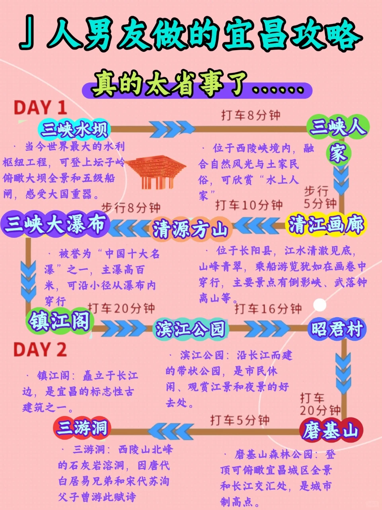
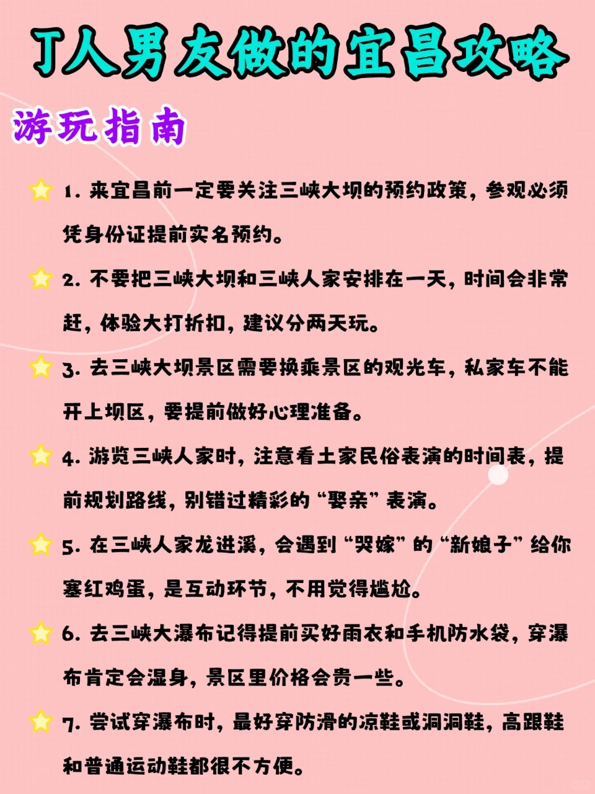
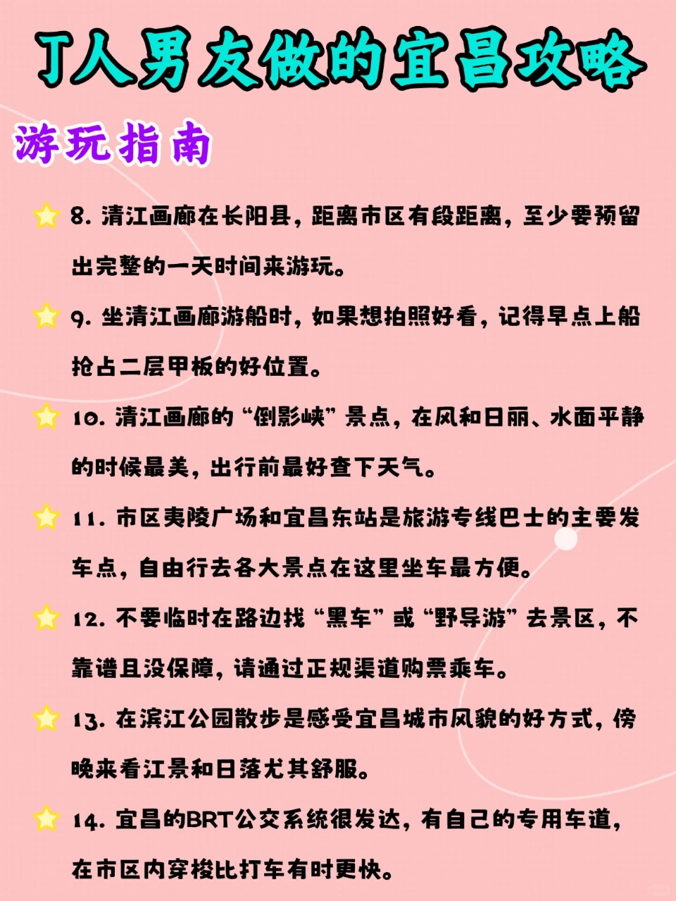
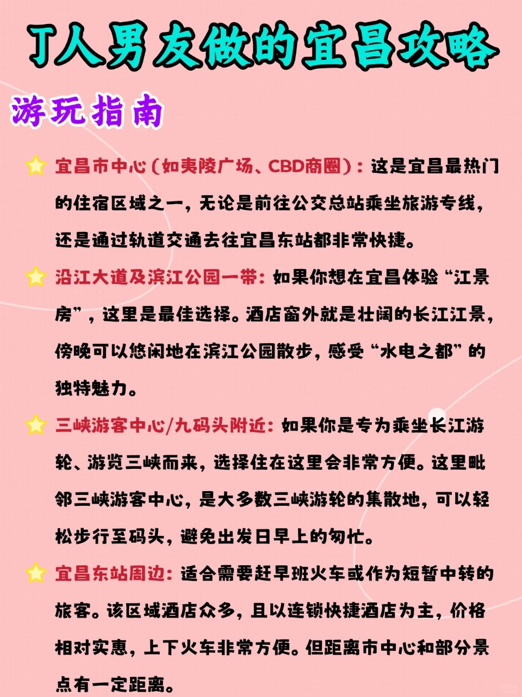
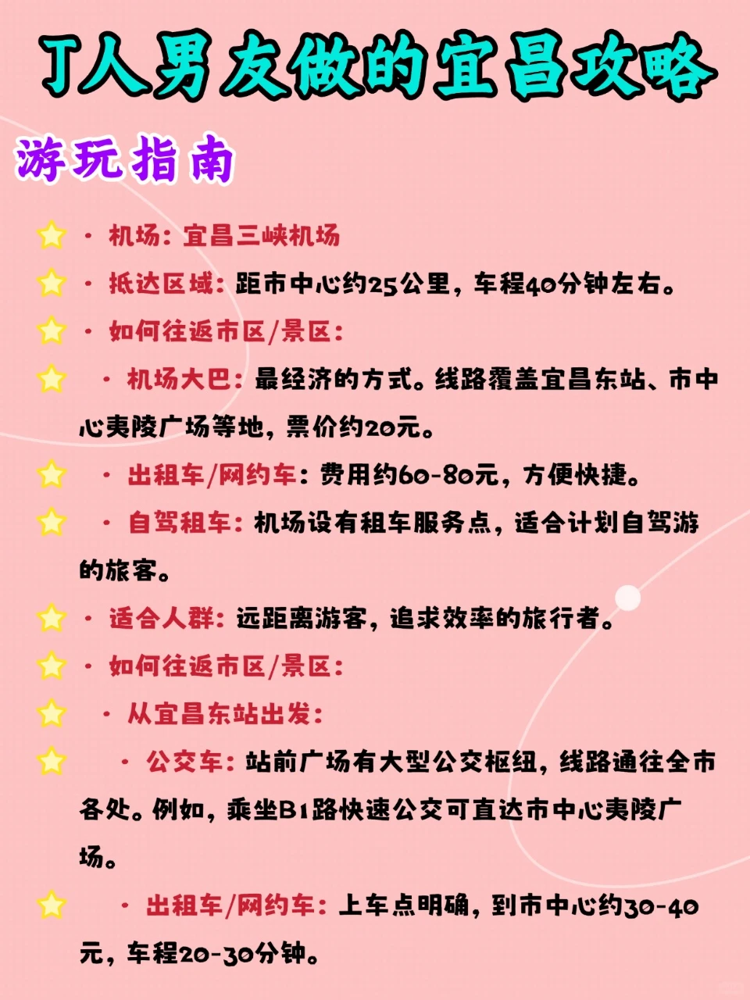
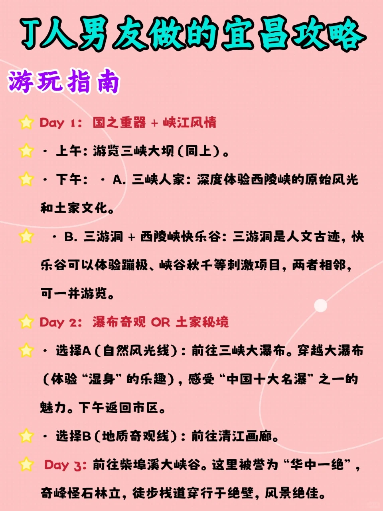

# 宜昌小众玩法｜不挤人！山水治愈之旅

- 作者: 宗寺始
- 👍7 · 💬 · ⭐13 · 图 6
- feed_id: 6961c4dc0000000022022176

> [OCR] 人男友做的宜昌攻略
真的太省事了……

DAY 1

三峡水坝
· 当今世界最大的水利枢纽工程，可登上坛子岭俯瞰大坝全景和五级船闸，感受大国重器。
打车8分钟
三峡人家
· 位于西陵峡境内，融合自然风光与土家民俗，可欣赏“水上人家”
步行5分钟

三峡大瀑布
· 被誉为“中国十大名瀑”之一，主瀑高百米，可沿小径从瀑布内穿行
打车20分钟
清源方山
打车10分钟
清江画廊
· 位于长阳县，江水清澈见底，山峰青翠，乘船游览犹如在画卷中穿行，主要景点有倒影峡、武落钟离山等。
打车16分钟

镇江阁
打车5分钟
滨江公园
昭君村
打车20分钟

三游洞
· 三游洞：西陵山北峰的石灰岩溶洞，因唐代白居易兄弟和宋代苏洵父子曾游此赋诗
磨基山

> [OCR] J人男友做的宜昌攻略

游玩指南

1. 来宜昌前一定要关注三峡大坝的预约政策, 参观必须凭身份证提前实名预约。

2. 不要把三峡大坝和三峡人家安排在一天，时间会非常赶，体验大打折扣，建议分两天玩。

3. 去三峡大坝景区需要换乘景区的观光车，私家车不能开上坝区, 要提前做好心理准备。

4. 游览三峡人家时, 注意看土家民俗表演的时间表, 提前规划路线, 别错过精彩的“娶亲” 表演。

5. 在三峡人家龙进溪, 会遇到“哭嫁”的“新娘子”给你塞红鸡蛋，是互动环节, 不用觉得尴尬。

6. 去三峡大瀑布记得提前买好雨衣和手机防水袋, 穿瀑布肯定会湿身, 景区里价格会贵一些。

7. 尝试穿瀑布时, 最好穿防滑的凉鞋或洞洞鞋，高跟鞋和普通运动鞋都很不方便。

> [OCR] J人男友做的宜昌攻略
游玩指南

8. 清江画廊在长阳县, 距离市区有段距离, 至少要预留出完整的一天时间来游玩。

9. 坐清江画廊游船时，如果想拍照好看，记得早点上船抢占二层甲板的好位置。

10. 清江画廊的“倒影峡”景点，在风和日丽、水面平静的时候最美, 出行前最好查下天气。

11. 市区夷陵广场和宜昌东站是旅游专线巴士的主要发车点，自由行去各大景点在这里坐车最方便。

12. 不要临时在路边找“黑车”或“野导游”去景区，不靠谱且没保障，请通过正规渠道购票乘车。

13. 在滨江公园散步是感受宜昌城市风貌的好方式, 傍晚来看江景和日落尤其舒服。

14. 宜昌的BRT公交系统很发达，有自己的专用车道，在市区内穿梭比打车有时更快。

> [OCR] J人男友做的宜昌攻略

游玩指南

★ 宜昌市中心(如夷陵广场、CBD商圈)：这是宜昌最热门的住宿区域之一,无论是前往公交总站乘坐旅游专线,
还是通过轨道交通去往宜昌东站都非常快捷。

★ 沿江大道及滨江公园一带: 如果你想在宜昌体验“江景房”,这里是最佳选择。酒店窗外就是壮阔的长江江景,
傍晚可以悠闲地在滨江公园散步，感受“水电之都”的独特魅力。

★ 三峡游客中心/九码头附近：如果你是专为乘坐长江游轮、游览三峡而来,选择住在这里会非常方便。这里毗邻三峡游客中心,是大多数三峡游轮的集散地,可以轻松步行至码头,避免出发日早上的匆忙。

★ 宜昌东站周边: 适合需要赶早班火车或作为短暂中转的旅客。该区域酒店众多，且以连锁快捷酒店为主,价格相对实惠,上下火车非常方便。但距离市中心和部分景点有一定距离。

> [OCR] T人男友做的宜昌攻略

游玩指南

• 机场：宜昌三峡机场

• 抵达区域：距市中心约25公里，车程40分钟左右。

• 如何往返市区/景区：

• 机场大巴：最经济的方式。线路覆盖宜昌东站、市中心夷陵广场等地，票价约20元。

• 出租车/网约车：费用约60-80元，方便快捷。

• 自驾租车：机场设有租车服务点，适合计划自驾游的旅客。

• 适合人群：远距离游客，追求效率的旅行者。

• 如何往返市区/景区：

• 从宜昌东站出发：

• 公交车：站前广场有大型公交枢纽，线路通往全市各处。例如，乘坐B1路快速公交可直达市中心夷陵广场。

• 出租车/网约车：上车点明确，到市中心约30-40元，车程20-30分钟。

> [OCR] J人男友做的宜昌攻略

游玩指南

Day 1：国之重器 + 峡江风情
· 上午: 游览三峡大坝(同上)。
· 下午:
A. 三峡人家: 深度体验西陵峡的原始风光和土家文化。
B. 三游洞 + 西陵峡快乐谷: 三游洞是人文古迹, 快乐谷可以体验蹦极、峡谷秋千等刺激项目, 两者相邻, 可一并游览。

Day 2：瀑布奇观 OR 土家秘境
· 选择A(自然风光线): 前往三峡大瀑布。穿越大瀑布 (体验“湿身”的乐趣), 感受“中国十大名瀑”之一的魅力。下午返回市区。
· 选择B(地质奇观线): 前往清江画廊。

Day 3: 前往柴埠溪大峡谷。这里被誉为 “华中一绝”, 奇峰怪石林立, 徒步栈道穿行于绝壁, 风景绝佳。

## 正文
别再只冲三峡大坝啦！宜昌这些小众宝藏地，人少景美还省钱，整理超全攻略👇
🌟核心玩法（2天悠闲版）
1.	清江画廊：早9点游船出发，看两岸青山如黛，登仙人寨喂猕猴，倒影峡拍水墨大片，选游船二层甲板视野绝佳。
2.	柴埠溪大峡谷：徒步青云梯，打卡玻璃栈道，雨后的云海堪称仙境，下山坐索道俯瞰森林超震撼。
3.	三峡大瀑布：穿一次性雨衣溯溪而行，近距离感受瀑布飞流直下的清凉，晴天下午2点阳光折射超美。
4.	滨江步道夜游：吹江风看灯光秀，逛西坝夜市，喝一杯宜昌凉虾，感受慢生活的惬意。
🚌交通指南
•	外部：高铁直达宜昌东站，出站后可直接换乘景区直通车，比自驾更省心。
•	市内：优先选公交或共享单车，老城区景点密集，打车容易堵车；去清江画廊建议报一日游小团，含往返交通超划算。
•	景区间：清江画廊到柴埠溪无直达车，可拼车或转乘长阳县城大巴，提前规划好时间。
🏨住宿指南
•	老城便利党：住解放路步行街附近，周边小吃多，步行可达滨江步道，性价比高。
•	山水景观党：选长阳清江岸边民宿，推窗见江景，清晨能听鸟鸣醒来，体验感拉满。
•	小众清静党：柴埠溪景区门口农家乐，价格实惠，老板会推荐徒步小众路线。
❌避坑指南
1.	三峡大瀑布别穿拖鞋，溯溪路段石头滑，带双防滑运动鞋更稳妥。
2.	清江画廊游船别坐一楼，视野被挡，加20元升舱费超值得。
3.	别买景区门口的“野生猕猴桃”，大多是外地运来的，口感差还贵。
4.	柴埠溪别雨后立刻徒步，山路湿滑有风险，等半天再出发更安全。
5.	夜市别跟风买网红小吃，很多是外地同款，尝尝本地凉虾、萝卜饺子就够了。
宜昌的美，藏在每一处山水里，避开人潮，才能真正感受这份治愈～
#宜昌小众游[话题]# #湖北周边游[话题]# #宜昌旅游攻略[话题]# #周末出逃计划[话题]# #治愈系旅行[话题]#

---