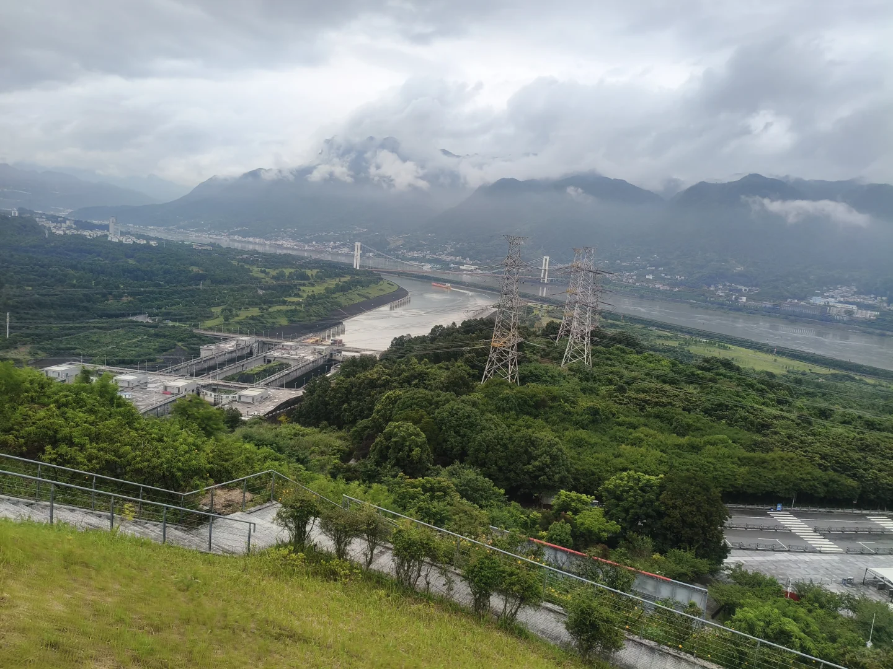
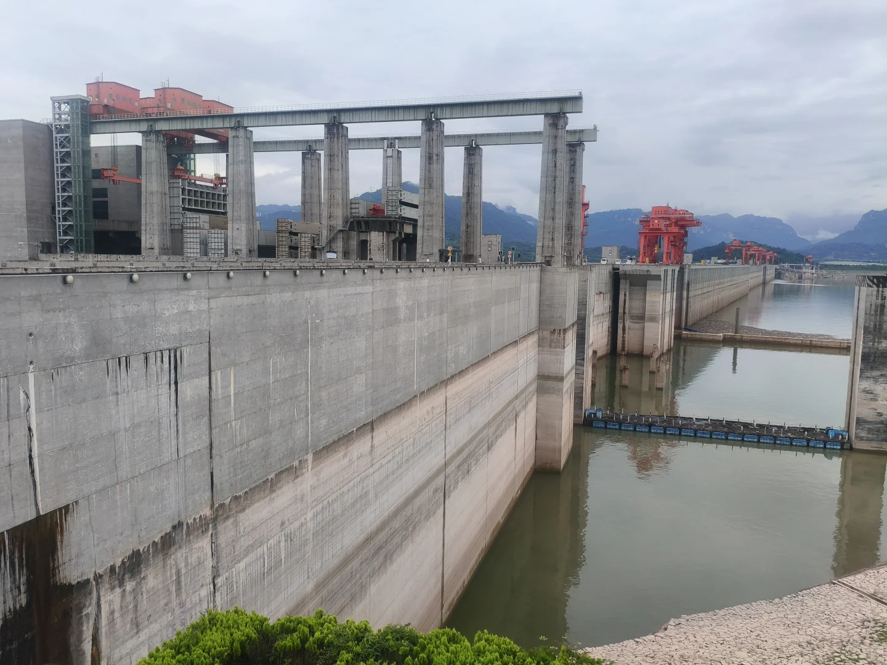

# 三峡大坝究竟有多震撼？

- 作者: 小希的自律成长日记
- 👍6 · 💬7 · ⭐4 · 图 3
- feed_id: 6a682584000000000f03cb68

> [OCR] 三峡大坝究竟
有多震撼?

> [OCR] [?]

> [OCR] [?]

## 正文
那次上午坐完两坝一峡游船后就打车去了三峡大坝旅游区，淡季人很少大厅空荡荡的。
课本里的超级工程，亲身站在面前，那种震撼感真的无法替代！
整个景区最精髓的就是三个不同高度看大坝
每个视角看到的风景完全不一样，层层递进越看越惊叹！
🔹最高｜坛子岭（俯瞰全景）
整个景区制高点！
站在这里能把大坝、船闸、高峡平湖全部收进眼里
终于真切体会到什么叫「截断巫山云雨，高峡出平湖」
视野巨开阔，拍照巨出片！
🔹中层｜185 观景台（平视大坝）
和坝顶齐平的高度！
不用抬头也不用低头，平视整座巨型大坝
近距离看清工程细节，超级壮观！
🔹最低｜截流纪念园（仰视坝底｜重点最震撼❗）
站在下游抬头仰望整座大坝，气势直接拉满
	
在这里摸到了8 亿年前的天然花岗岩基石🌍
真的不敢想象！这是我整场最被打动的地方！
这是当年修大坝从江底挖出来的原生基石
亿万年地壳运动、江水冲刷留下来的石头
上面还有勘探钻孔的痕迹
一边是亿万年山河沉淀，一边是大国基建奇迹
站在这儿瞬间感觉特别治愈，心生敬畏！
逛完之后去了三峡工程博物馆
慢慢走一圈，把大坝的修建历史、工程原理、截流故事都看懂了，比看书直观太多！
整体逛下来最大感受：
这不只是一个景点，是实实在在的国之重器🇨🇳
震撼、治愈、又特别自豪！
💡超实用游玩小贴士
提前看看《大三峡》纪录片，了解大坝建造历史。
景区免费入园，只需要提前预约，观光车必买（20 元 / 人），三个景点距离很远，走路根本逛不完
游玩顺序：坛子岭→185 平台→截流纪念园，顺路不走回头路
尽量阴天去！否则在水泥地上走很热很晒。
#三峡大坝 #宜昌旅游 #三峡旅游 #湖北旅游 #国内小众旅行 #亲子游攻略 #三峡大坝攻略 #高峡出平湖 #周末去哪儿

---