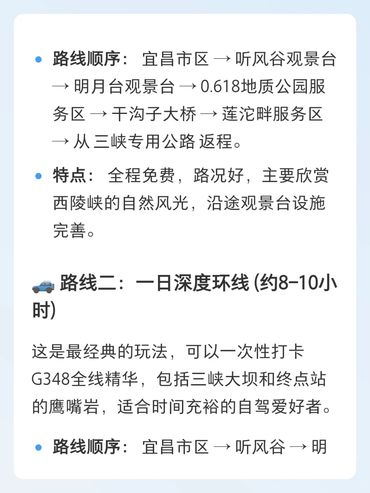
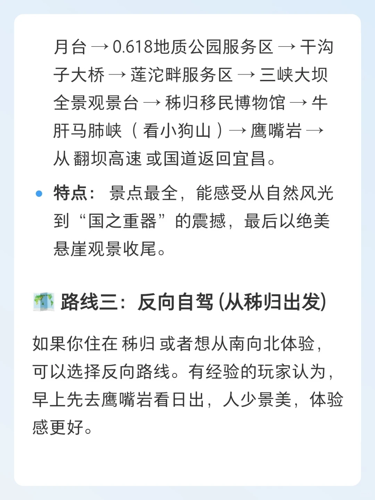
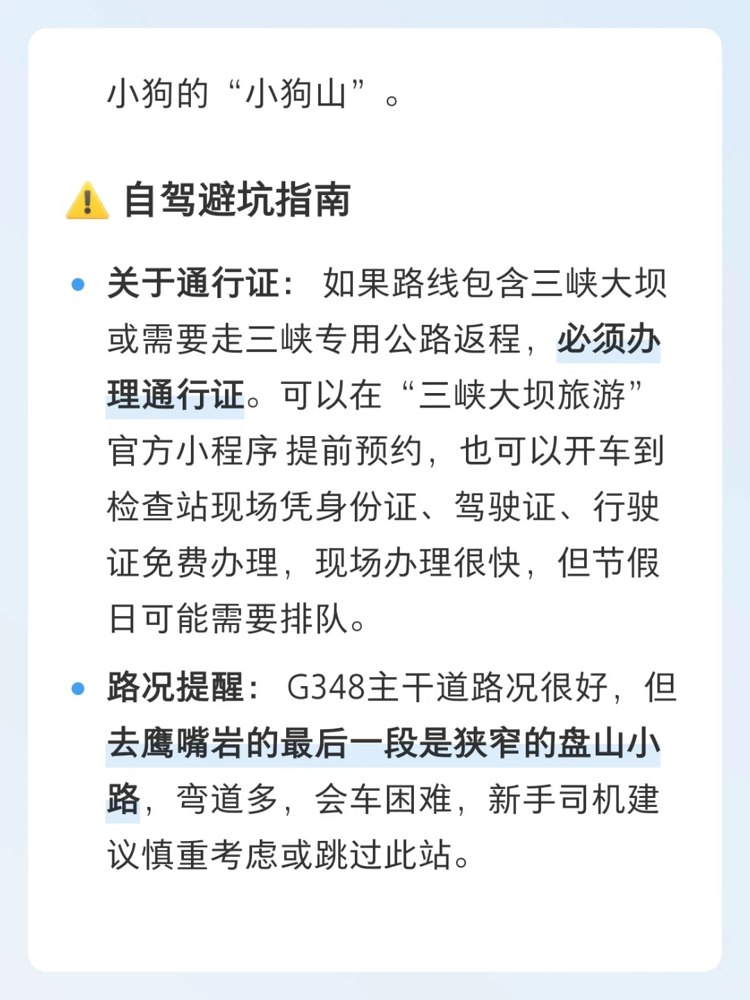
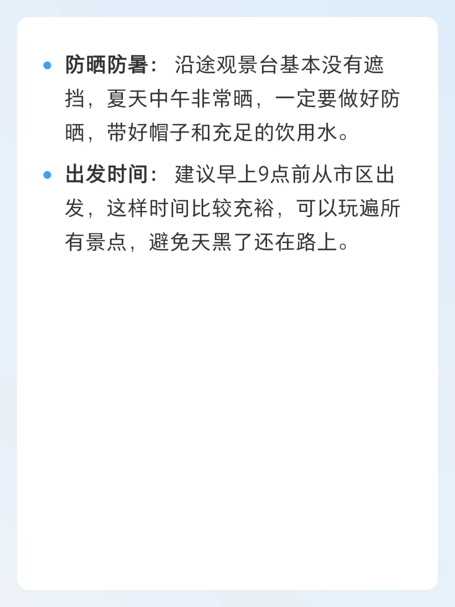

# 宜昌g348自驾路线图顺序

- 作者: inghui
- 👍6 · 💬 · ⭐27 · 图 8
- feed_id: 6a790c9e000000003302d39f

> [OCR] 当我在小红书搜索

宜昌g348自驾路线图顺序

问一问 的总结是...

> [OCR] 宜昌g348自驾路线图顺序

ai总结小红书和全网内容生成 🧑‍🦰👩‍🌾

好的，宜昌G348国道的自驾路线顺序来啦！这条被誉为“宜昌最美国道”的公路，全程沿着西陵峡悬崖而建，左手青山，右手碧水，风景超赞。

这里为你整理了两种主流路线和一条反向路线，可以根据自己的时间和喜好来选择。

🚗 路线一：精华快线 (约2-3小时)

这条路线适合时间紧张或者只想体验核心峡江风光的朋友，全程不走回头路，高效打卡精华观景台。

> [OCR] - 路线顺序：宜昌市区 → 听风谷观景台
→ 明月台观景台 → 0.618地质公园服务区 → 干沟子大桥 → 莲沱畔服务区
→ 从三峡专用公路返程。
- 特点：全程免费，路况好，主要欣赏西陵峡的自然风光，沿途观景台设施完善。

🚗 路线二：一日深度环线 (约8-10小时)

这是最经典的玩法，可以一次性打卡G348全线精华，包括三峡大坝和终点站的鹰嘴岩，适合时间充裕的自驾爱好者。
- 路线顺序：宜昌市区 → 听风谷 → 明

> [OCR] 月台→0.618地质公园服务区→干沟子大桥→莲沱畔服务区→三峡大坝全景观景台→秭归移民博物馆→牛肝马肺峡（看小狗山）→鹰嘴岩→从翻坝高速或国道返回宜昌。
特点：景点最全，能感受从自然风光到“国之重器”的震撼，最后以绝美悬崖观景收尾。

路线三：反向自驾(从秭归出发)
如果你住在秭归或者想从南向北体验，可以选择反向路线。有经验的玩家认为，早上先去鹰嘴岩看日出，人少景美，体验感更好。

> [OCR] - 路线顺序：从秭归县城出发→鹰嘴岩
  →牛肝马肺峡→莲沱畔服务区→干沟子大桥→0.618地质公园→明月台
  →听风谷→返回宜昌市区。
- 特点：可以错开部分车流，先体验最精华的鹰嘴岩，行程更从容。

✨沿途亮点打卡

- 听风谷观景台：行程的仪式感起点，
  有一个伸向山谷的玻璃观景台，风大的时候能听到山谷的回响。
- 明月台观景台：G348的“门面担当”，有巨大的“三峡”字样打卡墙
  和圆形取景框，是拍摄西陵峡江景的

> [OCR] 绝佳位置。
- 0.618地质公园服务区：一个天然的地
    质博物馆，步道按年代排列着不同时期的岩石和化石，科普又出片。
- 干沟子大桥：建于1973年的老桥，新旧两桥并排，形成了独特的“星空之眼”景观，工业风十足。
- 莲沱畔服务区：由废弃船厂改造的网红服务区，标志性的白色“探索风车”建筑非常出片，江边还有大草坪可以露营野餐。
- 鹰嘴岩：全程的压轴彩蛋，站在悬崖顶端可以俯瞰整个西陵峡的S型江弯，视野无敌。从这里还能看到对岸酷似

> [OCR] 小狗的“小狗山”。

自驾避坑指南

• 关于通行证：如果路线包含三峡大坝或需要走三峡专用公路返程，必须办理通行证。可以在“三峡大坝旅游”官方小程序提前预约，也可以开车到检查站现场凭身份证、驾驶证、行驶证免费办理，现场办理很快，但节假日可能需要排队。

• 路况提醒：G348主干道路况很好，但去鹰嘴岩的最后一段是狭窄的盘山小路，弯道多，会车困难，新手司机建议慎重考虑或跳过此站。

> [OCR] - 防晒防暑：沿途观景台基本没有遮挡，夏天中午非常晒，一定要做好防晒，带好帽子和充足的饮用水。
- 出发时间：建议早上9点前从市区出发，这样时间比较充裕，可以玩遍所有景点，避免天黑了还在路上。

## 正文
#小红书搜索[话题]# #万能的小红书[话题]# #问一问[话题]#

---