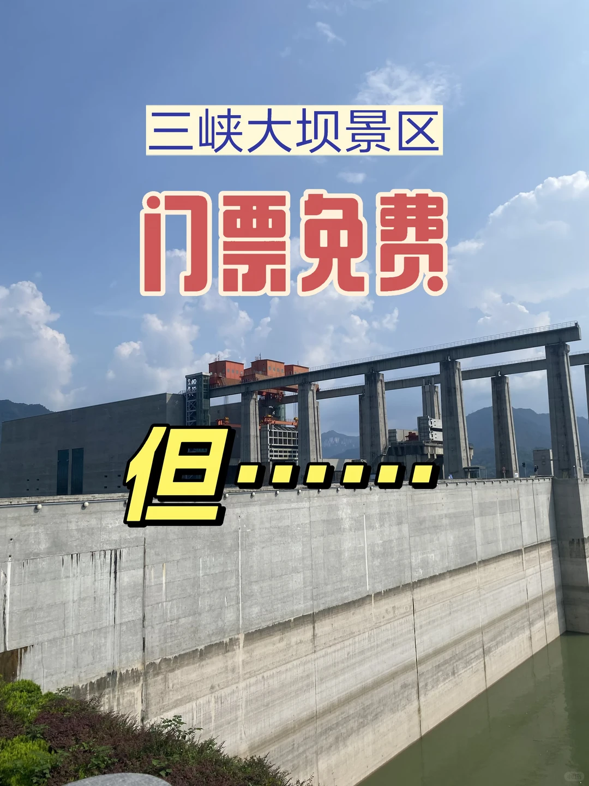
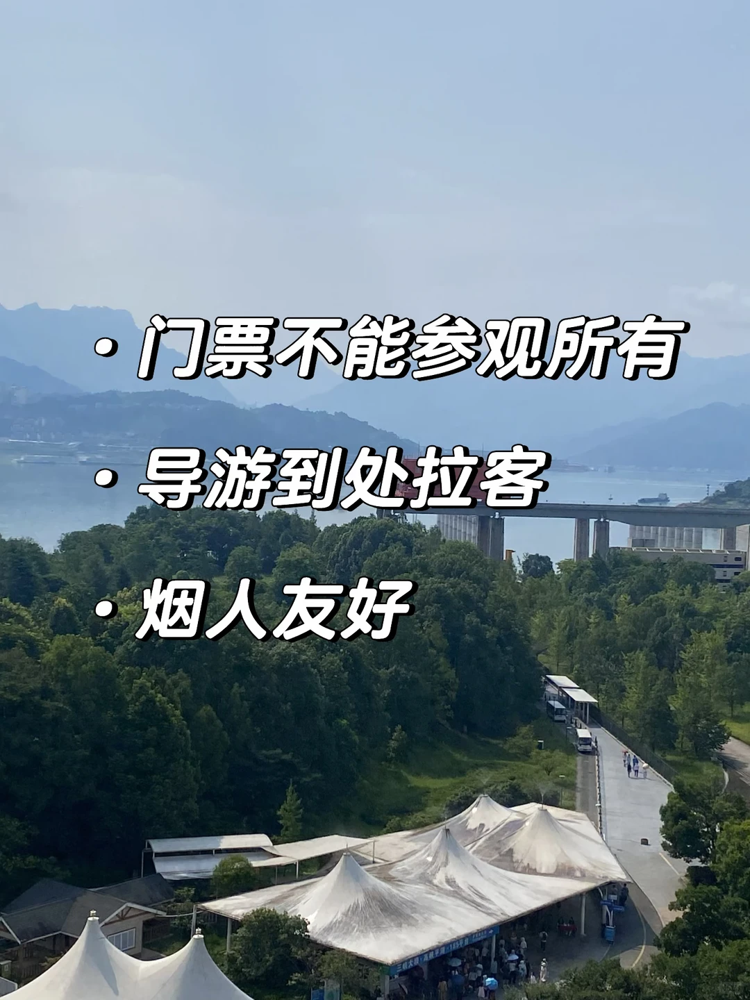

# 这是三峡大坝景区的避雷帖

- 作者: 小红薯薯
- 👍5 · 💬13 · ⭐ · 图 2
- feed_id: 6a7458a8000000003400f79d

> [OCR] 三峡大坝景区
门票免费
但......

> [OCR] · 门票不能参观所有
· 导游到处拉客
· 烟人友好

## 正文
（当然除了缺点 其他方面很优秀，只是想提一些景区乱象，优点放另一篇帖子里说）
门票免费，但大巴车收费，中途还有电瓶车收费，最后体验馆收费。没做攻略根本不知道这么多零碎的收费点，很拉低体验
	
标语是有的[黄金薯R]防止黑心导游拉客，实际上是一点不劝阻的。离景区很远就有导游拉客，进了景区停车场，导游直接成群出现，一直到售票处才没有拉客的
	
没有🚭标识，特别多人吸烟🚬 三峡大坝里烟雾缭绕，还得提防别被烟头烫到。只能说这里真的是烟人友好🤝烟人必来打卡的景区
	
#三峡大坝景区[话题]#

---