# 今天的清江画廊A线版

- 作者: AAA.铛师傅纯手工高梁饴～
- 👍5 · 💬7 · ⭐ · 图 13
- feed_id: 6a7491570000000024026b7c

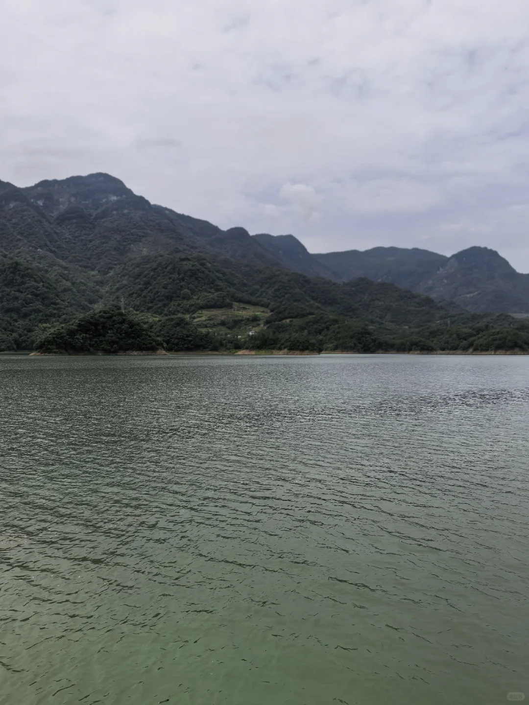
> [OCR] [?]
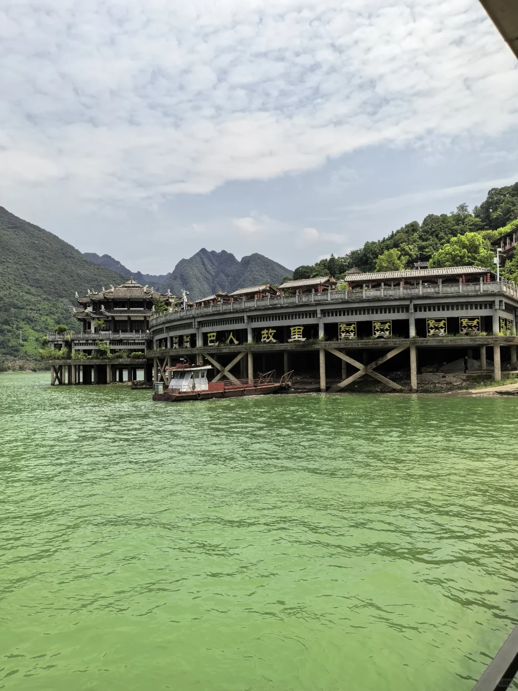
> [OCR] 巴人故里
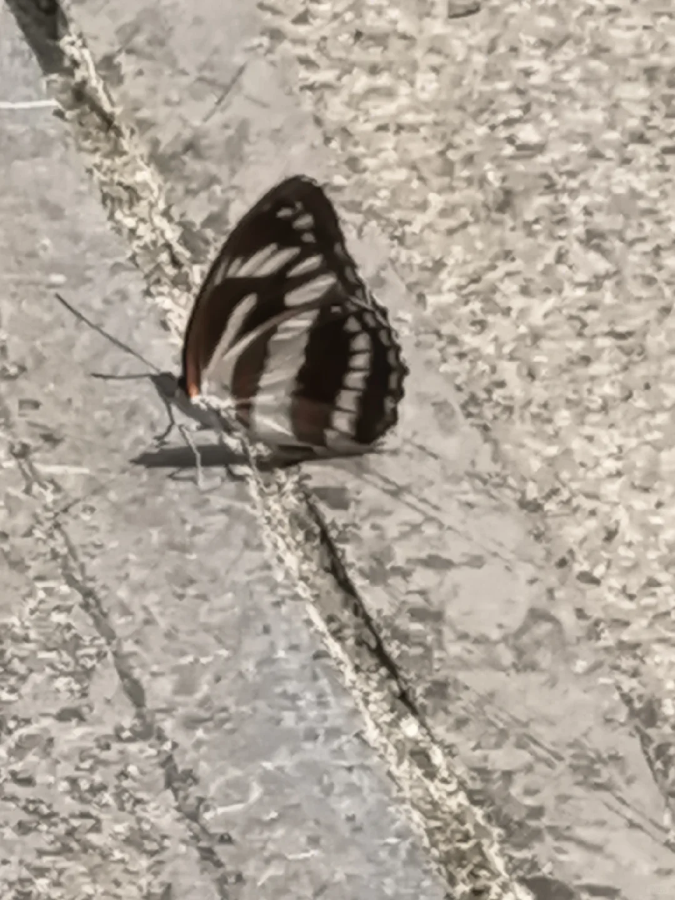
> [OCR] system
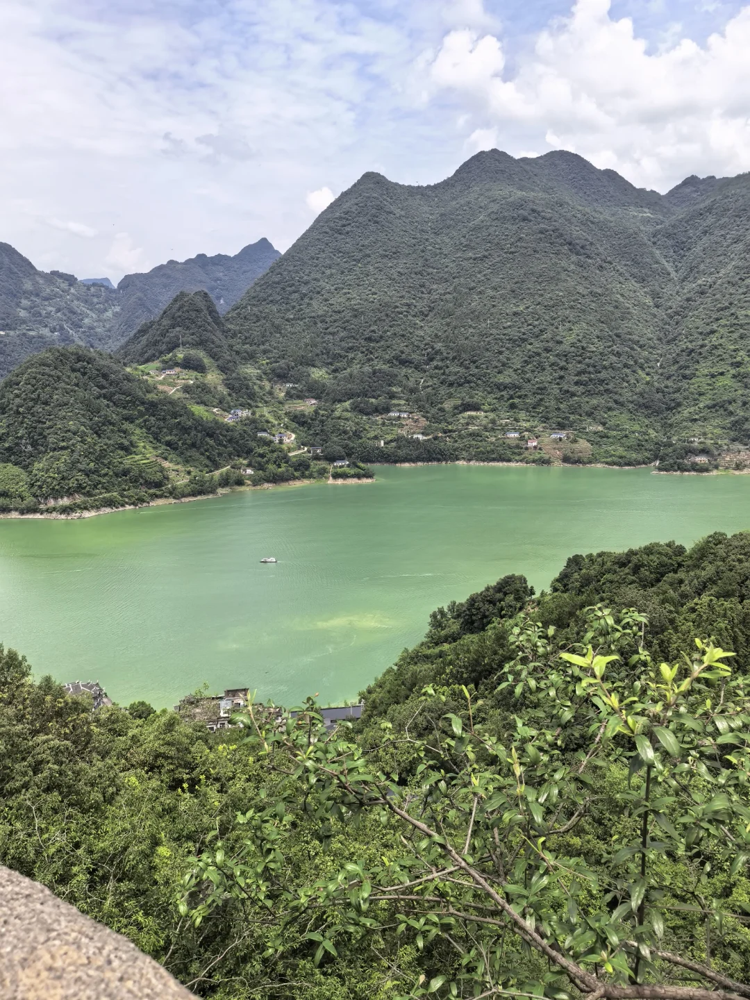
> [OCR] system
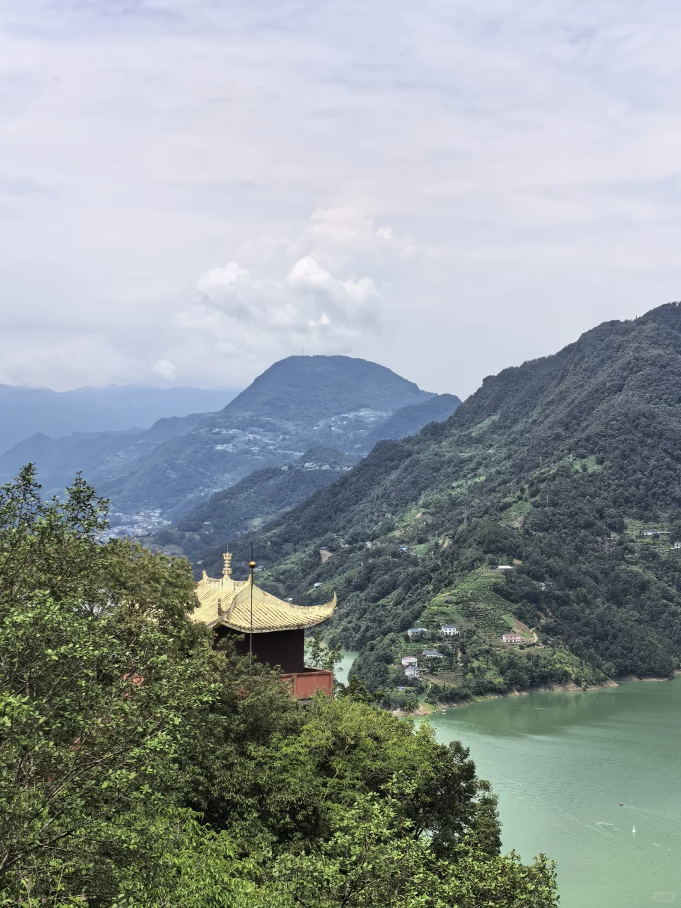
> [OCR] [?]
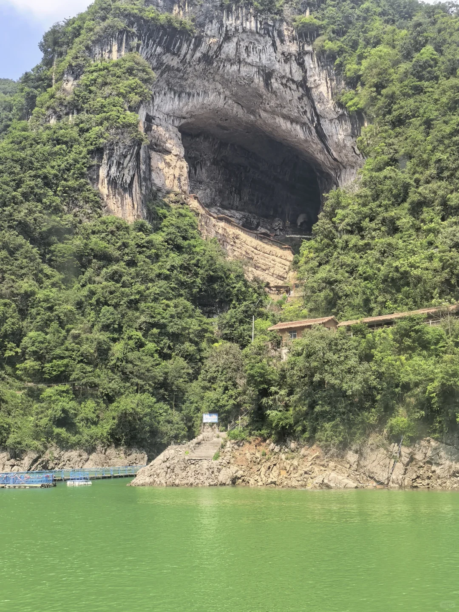
> [OCR] [?]
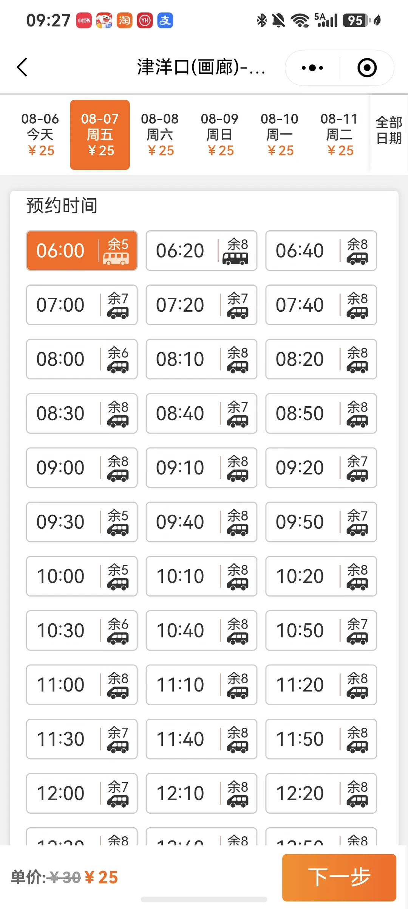
> [OCR] 09:27 小红书 淘宝 YH 支
津洋口(画廊)-...
< 全部日期
08-06 今天 ¥25
08-07 周五 ¥25
08-08 周六 ¥25
08-09 周日 ¥25
08-10 周一 ¥25
08-11 周二 ¥25
预约时间
06:00 余5 [车]
06:20 余8 [车]
06:40 余8 [车]
07:00 余7 [车]
07:20 余7 [车]
07:40 余8 [车]
08:00 余6 [车]
08:10 余8 [车]
08:20 余8 [车]
08:30 余8 [车]
08:40 余7 [车]
08:50 余8 [车]
09:00 余8 [车]
09:10 余8 [车]
09:20 余7 [车]
09:30 余5 [车]
09:40 余8 [车]
09:50 余7 [车]
10:00 余5 [车]
10:10 余8 [车]
10:20 余8 [车]
10:30 余6 [车]
10:40 余8 [车]
10:50 余7 [车]
11:00 余8 [车]
11:10 余8 [车]
11:20 余8 [车]
11:30 余7 [车]
11:40 余8 [车]
11:50 余8 [车]
12:00 余7 [车]
12:10 余8 [车]
12:20 余8 [车]
单价：¥30 ¥25
下一步
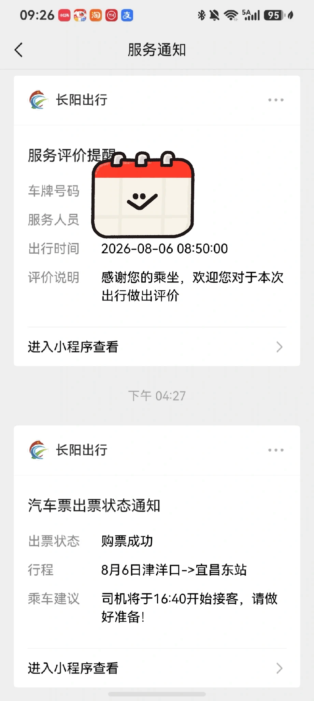
> [OCR] 09:26 小红书 淘宝 支付宝 服务通知

长阳出行

服务评价提醒
车牌号码
服务人员
出行时间 2026-08-06 08:50:00
评价说明 感谢您的乘坐，欢迎您对于本次出行做出评价

进入小程序查看 > 下午 04:27

长阳出行

汽车票出票状态通知
出票状态 购票成功
行程 8月6日津洋口->宜昌东站
乘车建议 司机将于16:40开始接客，请做好准备！

进入小程序查看 >
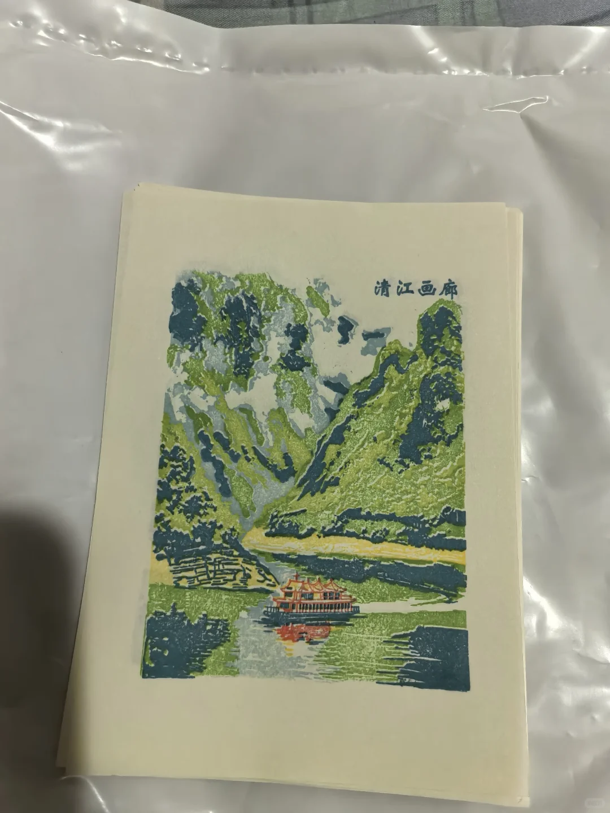
> [OCR] 清江画廊
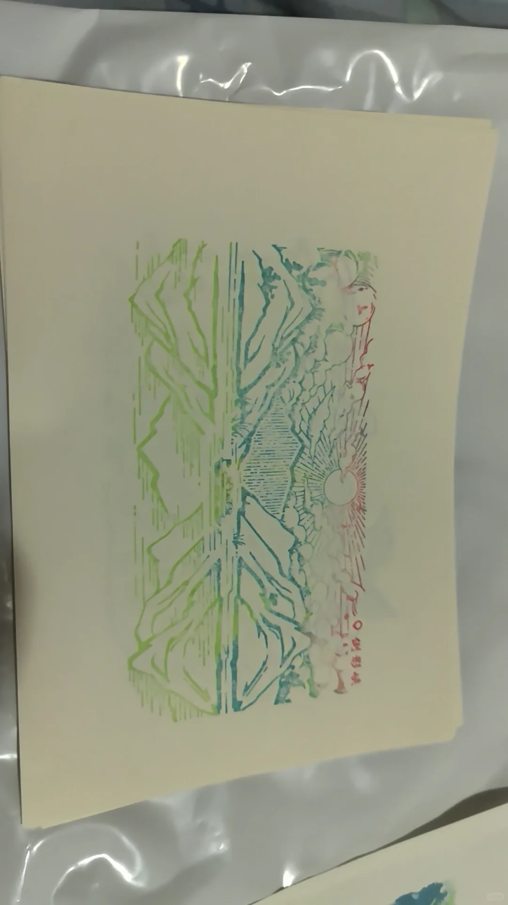
> [OCR] [?]
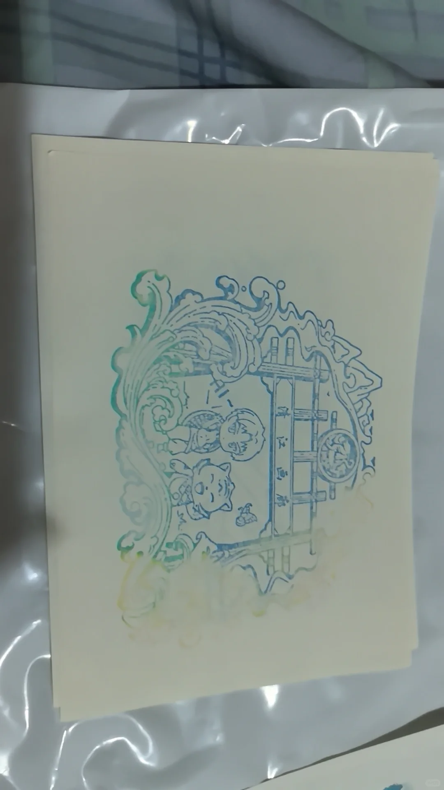
> [OCR] 清江画舫
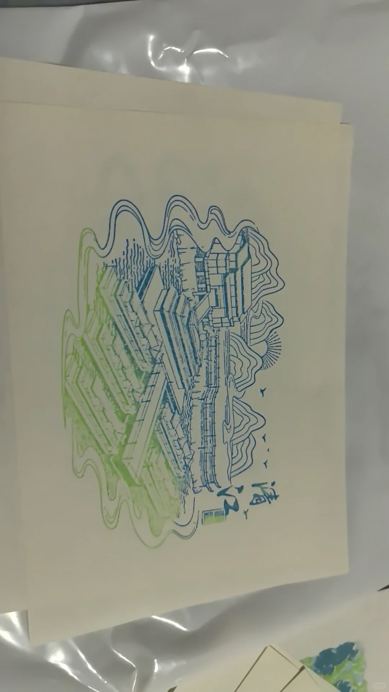
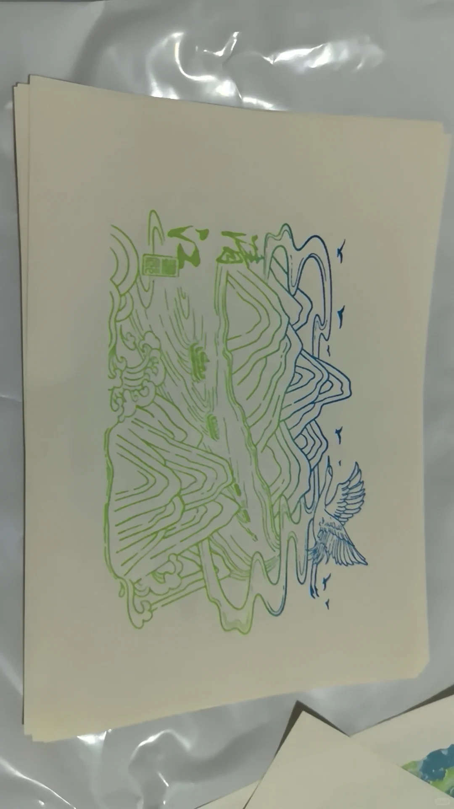

## 正文
昨天晚上的大雨让今天的行程变的不确定 所以没有提前订票（小bug）
早上六点多看天气预报 大概没有雨 准备赌一把便出发了 七点半多一点点到达三峡游客中心 准备买车票发现只剩一张！可是我和我妈一起去 想来想去 打车？报一日游的团？还是最终选择了去宜昌东站坐方便居民的小巴士（p7p8）十分钟一趟单程票价35 等了没一会车就来了 这时候很担心能不能按原计划行动（关系到表演能不能看上）好在十点二十左右到达清江画廊门口 坐了单程10元的摆渡车到渡口 拐来拐去上了船 找到靠窗的位置 等待11点发船 10：50左右发船了 一小时船程 然后开始爬长长的楼梯和山（爬过香山 这个不在话下）上山50分钟 在顶上拍拍照 歇一下 下山20分钟 然后上船等2点开船 依旧提前十分钟发船 三点零几分到看花咚咚表演的地方 四点零几分结束 去文创店逛逛 （p9到p13 仅消费三元明信片盖的漂亮章 不清晰和不好看的没拍）再拍拍照 约上返程车 到兴发广场吃了晚饭 坐公交车回家。
小tips：
1 三峡游客中心到车票没买上 可以在 长阳出行上买 车次更多
2到达景区门口后要坐摆渡车到渡口 这样能尽快抢到靠窗的位置看风景（十点四十亲测几乎没有好位置了）返程可以不坐 因为确实没多远 还能拍拍照
3花咚咚表演从3：15开始就有暖场活动了 所以尽可能在三点到达 要不然人很多找不到好位置（甚至没位置）演出到四点零几分结束 然后可以自愿上台和演员合影
4在4：20左右时 从花咚咚表演那个楼出来 还没到长廊的时候 白色石头扶手开始喷水雾 挺好看的
5登顶后可以不在牛角岩和每次只能上8人的观景台上拍照俯瞰（人暴多不说而且路很滑很陡很危险）登上向王庙后绕到临江一侧也有漂亮风景（更安全而且没人）
6看见厕所就去吧 山顶没有

---