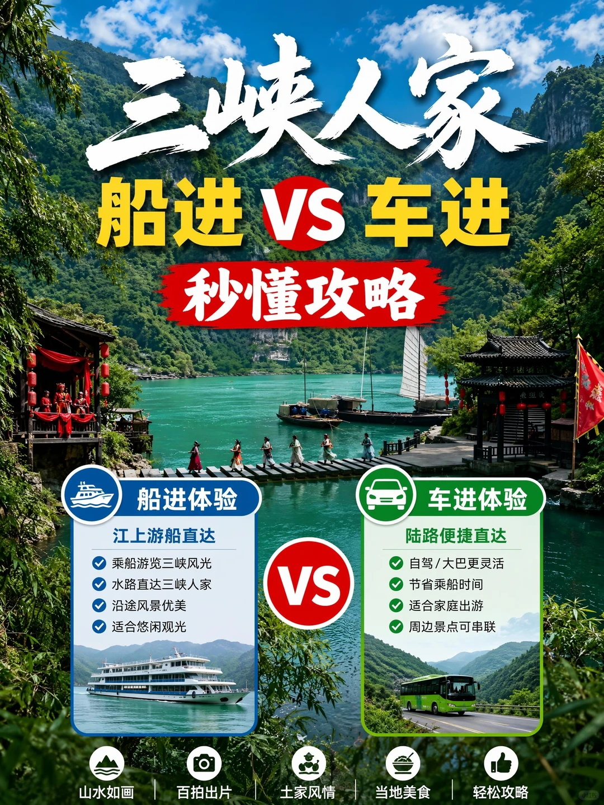

# 三峡人家船进和车进哪个好看完这篇攻略秒懂

- 作者: 宜昌博雅丨旅游
- 👍4 · 💬 · ⭐11 · 图 1
- feed_id: 6a61cddc0000000005039d9b

> [OCR] 三峡人家
船进 VS 车进
秒懂攻略

船进体验
江上游船直达
乘船游览三峡风光
水路直达三峡人家
沿途风景优美
适合悠闲观光

VS

车进体验
陆路便捷直达
自驾/大巴更灵活
节省乘船时间
适合家庭出游
周边景点可串联

山水如画 | 百拍出片 | 土家风情 | 当地美食 | 轻松攻略

## 正文
谁来宜昌还在乱选三峡人家入园方式？
90%游客都选错路线，排队、浪费钱、走重复路程😭
一文把2种船进+车进全部讲透，按需挑选不踩坑！
🚢 船进三峡人家（分两大版本）
版本①：过葛洲坝船闸线路｜388元/人（最贵顶配）
✅ 适合人群：没去过两坝一峡、想体验水涨船高、想看葛洲坝过闸奇观
✅ 行程亮点：乘船穿越葛洲坝船闸，沉浸式打卡西陵峡风光，直达三峡人家，一站式集齐船闸+峡谷+土家风情
❌ 不推荐：已经去过两坝一峡的朋友，风景高度重复
版本②：西陵峡口专线船（不过葛洲坝）官网258元/人
从西陵峡口码头登船，专属游船直达三峡人家，原汁原味饱览西陵峡两岸青山
船舱分二等座/一等座/特等座，舒适度任选，主打安静观景、拍照出片
适合偏爱慢节奏、只想单纯坐船逛景区的游客
🚗 车进三峡人家｜跟团198元/人（性价比天花板）
市区集合出发，抵达三峡王家坪换乘中心，先坐景区观光大巴，再换乘内部摆渡船入园
✅ 优点：价格最低、班次多、灵活自由，日常平日本首选
⚠️ 缺点：需要两段换乘，节假日（五一/十一）人流量爆炸，换乘排队超级耗时间
👉 旺季强烈优先选船进，躲开超长队伍
📅 按行程天数精准抄作业
1天单日行程👉 首选【过葛洲坝船闸+三峡人家】，一天解锁两大王牌体验
带老人小孩、怕换乘奔波👉 优先西陵峡口船进船出
前一天已经玩过两坝一峡👉 直接冲车进车出，不用重复游览西陵峡
不管船进还是车进，景区内部龙进溪、土家婚嫁表演、吊脚楼全部都能正常打卡
根据自己的行程、预算、同行人员选择就OK～
需要订票、规划一日行程可以滴滴我✨
#三峡人家 #宜昌旅游 #三峡人家攻略 #宜昌一日游 #三峡旅游 #宜昌自由行 #葛洲坝船闸 #暑假宜昌游玩#浪漫生活的记录者[话题]# #三峡人家[话题]# #葛洲坝船闸[话题]#

---