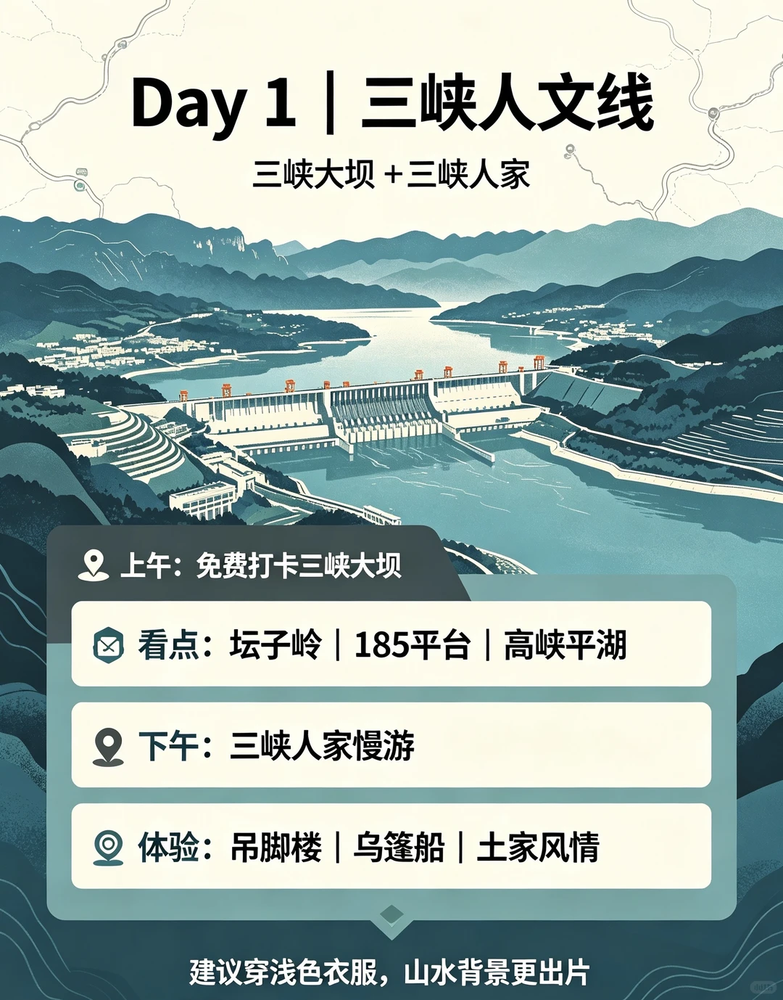
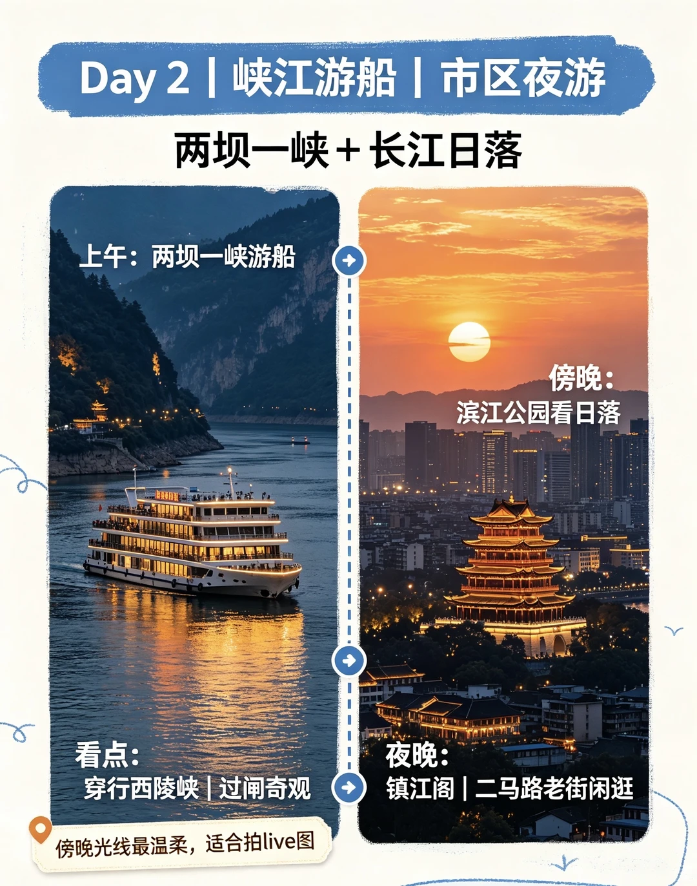
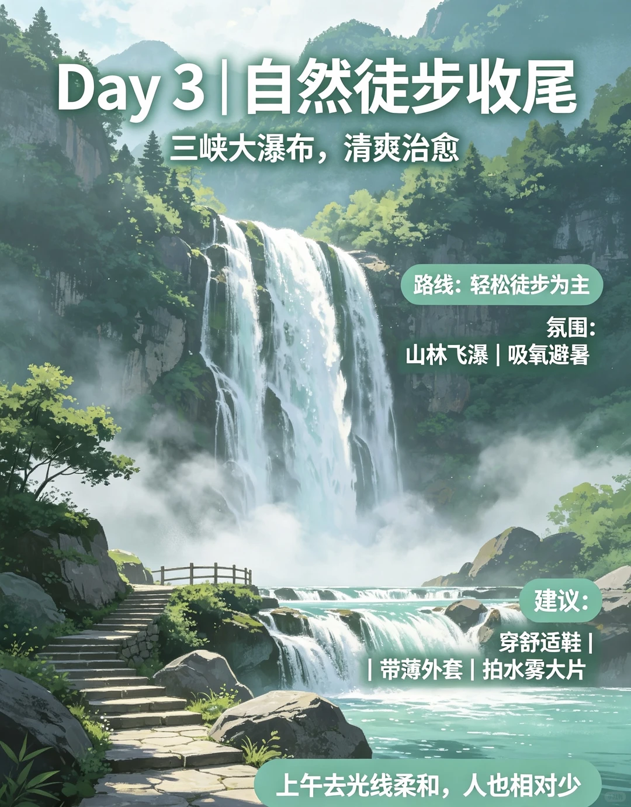
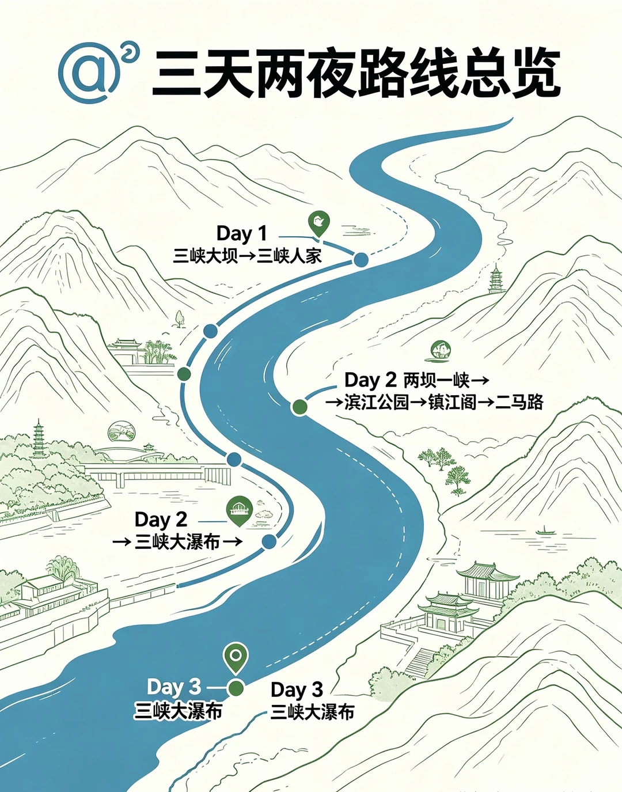
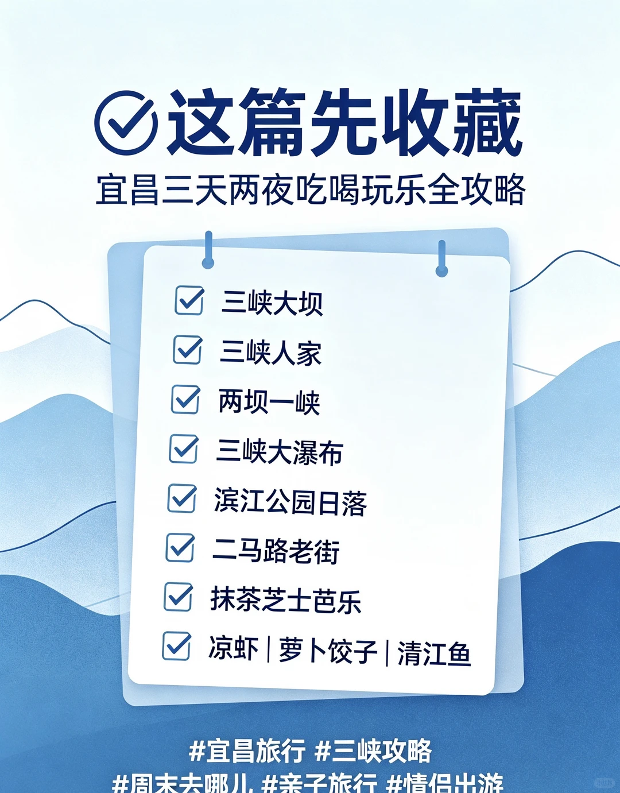

# 宜昌3天2夜保姆级攻略！快码住‼️

- 作者: 魅力楚天
- 👍4 · 💬 · ⭐5 · 图 9
- feed_id: 6a6e03d8000000002701f538

> [OCR] 三天两夜游宜昌
吃喝玩乐全攻略快码住

三峡之美，半在宜昌
周末短途 | 亲子情侣 | 山水松弛感

> [OCR] Day 1 | 三峡人文线
三峡大坝 + 三峡人家

📍 上午：免费打卡三峡大坝
🗺️ 看点：坛子岭 | 185平台 | 高峡平湖

📍 下午：三峡人家慢游

📍 体验：吊脚楼 | 乌篷船 | 土家风情

建议穿浅色衣服，山水背景更出片

> [OCR] Day 2 | 峡江游船 | 市区夜游

两坝一峡 + 长江日落

上午：两坝一峡游船

看点：
穿行西陵峡 | 过闸奇观

傍晚光线最温柔，适合拍live图

傍晚：
滨江公园看日落

夜晚：
镇江阁 | 二马路老街闲逛

> [OCR] Day 3 | 自然徒步收尾
三峡大瀑布, 清爽治愈

路线: 轻松徒步为主
氛围:
山林飞瀑 | 吸氧避暑

建议:
穿舒适鞋 |
| 带薄外套 | 拍水雾大片

上午去光线柔和，人也相对少

> [OCR] 《宜昌必尝美味清单》
山水之旅也可以很好吃

真茶屋·抹茶芝士芭乐
抹茶清香+芭乐果香，咸香奶盖清爽不腻

萝卜饺子 清江鱼
芭乐果香，咸香奶盖清爽不腻

凉虾

土家腊肉

> [OCR] 三天两夜路线总览
Day 1
三峡大坝→三峡人家
Day 2
两坝一峡→
滨江公园→镇江阁→二马路
Day 2
三峡大瀑布→
Day 3
三峡大瀑布
Day 3
三峡大瀑布

> [OCR] #出发前先看这页
——少走弯路,体验更舒服——

交通：
市区打车方便,
景点间提前规划

门票：
三峡大坝免费，
预约信息提前确认

穿搭：
舒适鞋+薄外套
+防晒

拍摄：
山水用竖构图，江面留白更有氛围

雨天注意防滑，晴日注意防晒

> [OCR] 宜昌随手拍都很出片
山水壮阔，节奏松弛

高峡平湖
西陵峡
滨江夜景

长江日落

老门头
老街慢逛

水雾瀑布

> [OCR] 这篇先收藏
宜昌三天两夜吃喝玩乐全攻略

三峡大坝
三峡人家
两坝一峡
三峡大瀑布
滨江公园日落
二马路老街
抹茶芝士芭乐
凉虾 | 萝卜饺子 | 清江鱼

#宜昌旅行 #三峡攻略
#周末去哪儿, #亲子旅行 #情侣出游

## 正文
都说三峡之美，半在宜昌！
藏在长江边的宝藏小城，山水壮阔、节奏超松弛，
太适合周末短途游、情侣约会、亲子出行啦～
	
整理好了超省心游玩路线，直接抄作业！
	
Day1 主打人文三峡
免费逛三峡大坝，打卡坛子岭、185平台，沉浸式看高峡平湖的壮阔风光。
再逛三峡人家，乌篷船、吊脚楼氛围感拉满，感受地道土家风情。
	
Day2 解锁峡江夜景
必坐两坝一峡游船，穿行绝美西陵峡，亲眼见证船只过闸的震撼奇观。
傍晚去滨江公园等一场长江日落，夜游镇江阁、二马路老街，惬意又舒服。
	
Day3 治愈自然徒步
收官打卡三峡大瀑布，穿梭山林之间，吸氧避暑、清凉治愈，结束完美旅程！
	
来宜昌一定要吃本地特色！
强推真茶屋抹茶芝士芭乐，果香混着抹茶清香，咸香奶盖清爽不腻。
还有凉虾、萝卜饺子、清江鱼、土家腊肉，每一样都不容错过～
	
#宜昌旅游[话题]# #宜昌三天两夜[话题]# #宜昌攻略[话题]# #三峡大坝[话题]# #三峡大瀑布[话题]# #周末去哪儿[话题]#

---