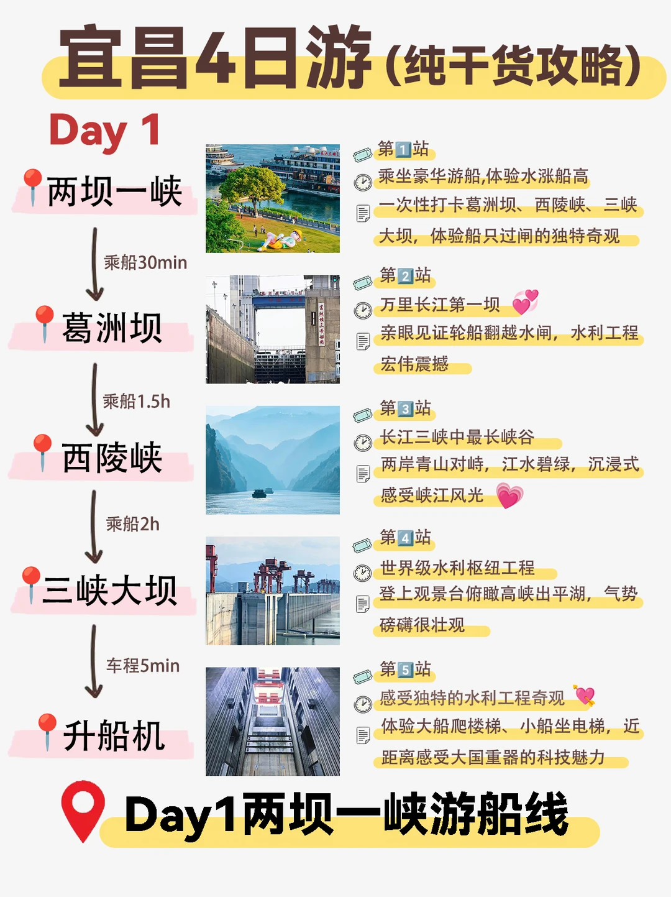
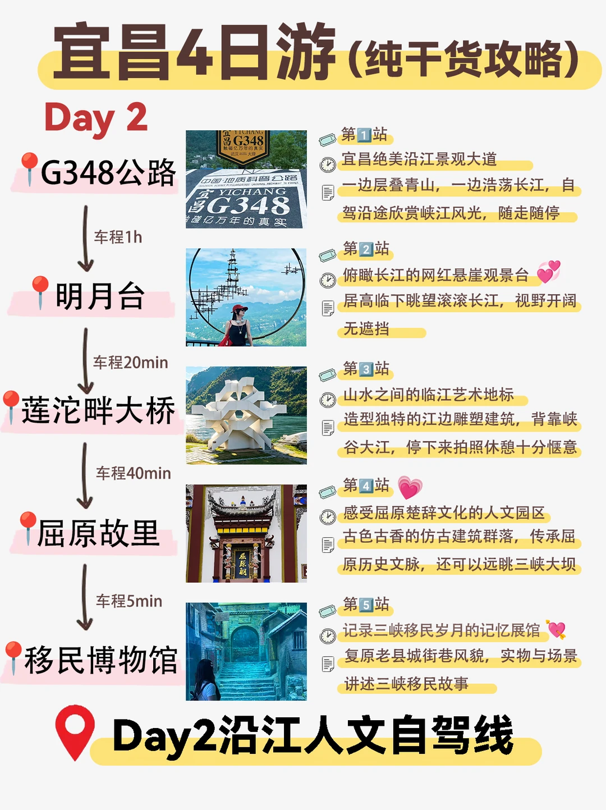
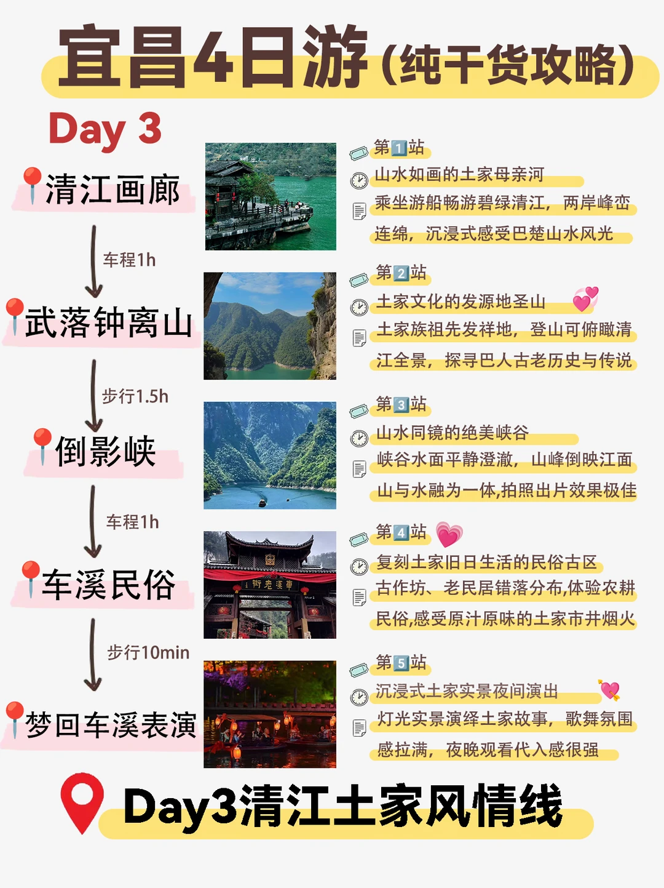
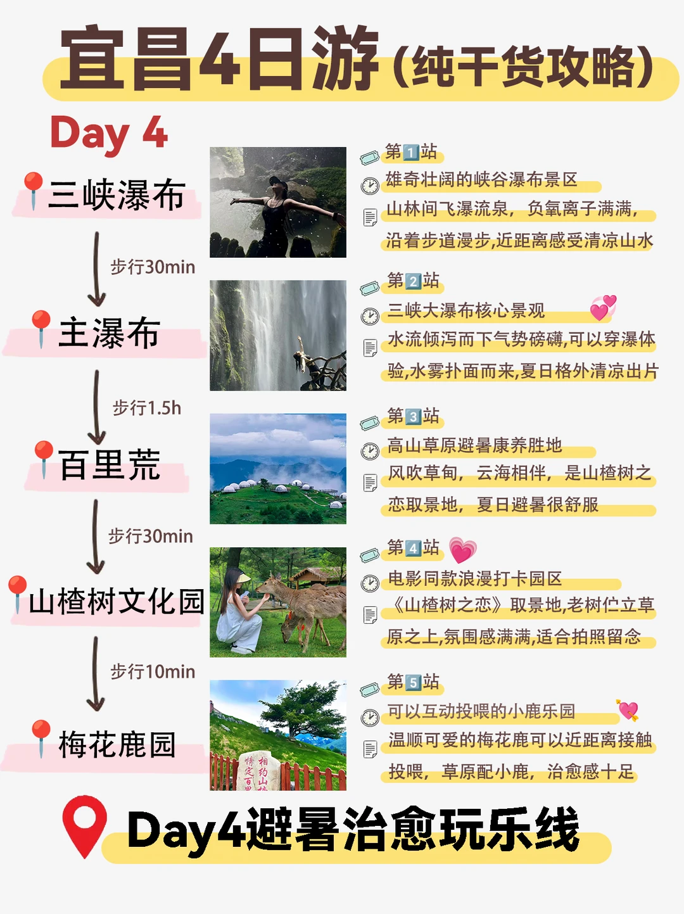

# 宜昌4日不绕路攻略✨山水人文一次玩够

- 作者: 跟着楚渝行去旅行
- 👍4 · 💬 · ⭐13 · 图 4
- feed_id: 6a75382a00000000250012f3

> [OCR] 宜昌4日游（纯干货攻略）
Day 1
两坝一峡

第1站
乘坐豪华游船,体验水涨船高
一次性打卡葛洲坝、西陵峡、三峡大坝，体验船只过闸的独特奇观

第2站
万里长江第一坝
亲眼见证轮船翻越水闸，水利工程宏伟震撼

第3站
长江三峡中最长峡谷
两岸青山对峙，江水碧绿，沉浸式感受峡江风光

第4站
世界级水利枢纽工程
登上观景台俯瞰高峡出平湖，气势磅礴很壮观

第5站
感受独特的水利工程奇观
体验大船爬楼梯、小船坐电梯，近距离感受大国重器的科技魅力

Day1两坝一峡游船线

> [OCR] 宜昌4日游(纯干货攻略)
Day 2
G348公路
车程1h
明月台
车程20min
莲沱畔大桥
车程40min
屈原故里
车程5min
移民博物馆
第1站
宜昌绝美沿江景观大道
一边层叠青山，一边浩荡长江，自驾沿途欣赏峡江风光，随走随停
第2站
俯瞰长江的网红悬崖观景台
居高临下眺望滚滚长江，视野开阔无遮挡
第3站
山水之间的临江艺术地标
造型独特的江边雕塑建筑，背靠峡谷大江，停下来拍照休憩十分惬意
第4站
感受屈原楚辞文化的人文园区
古色古香的仿古建筑群落，传承屈原历史文脉，还可以远眺三峡大坝
第5站
记录三峡移民岁月的记忆展馆
复原老县城街巷风貌，实物与场景讲述三峡移民故事
Day2沿江人文自驾线

> [OCR] 宜昌4日游（纯干货攻略）
Day 3

第1站
山水如画的土家母亲河
乘坐游船畅游碧绿清江，两岸峰峦连绵，沉浸式感受巴楚山水风光

第2站
土家文化的发源地圣山
土家族祖先发祥地，登山可俯瞰清江全景，探寻巴人古老历史与传说

第3站
山水同镜的绝美峡谷
峡谷水面平静澄澈，山峰倒映江面，山与水融为一体,拍照出片效果极佳

第4站
复刻土家旧日生活的民俗古区
古作坊、老民居错落分布,体验农耕民俗,感受原汁原味的土家市井烟火

第5站
沉浸式土家实景夜间演出
灯光实景演绎土家故事，歌舞氛围感拉满，夜晚观看代入感很强

Day3清江土家风情线

> [OCR] 宜昌4日游(纯干货攻略)
Day 4
三峡瀑布
步行30min
主瀑布
步行1.5h
百里荒
步行30min
山楂树文化园
步行10min
梅花鹿园

第1站
雄奇壮阔的峡谷瀑布景区
山林间飞瀑流泉，负氧离子满满，
沿着步道漫步,近距离感受清凉山水

第2站
三峡大瀑布核心景观
水流倾泻而下气势磅礴,可以穿瀑体验,
水雾扑面而来,夏日格外清凉出片

第3站
高山草原避暑康养胜地
风吹草甸，云海相伴，是山楂树之恋取景地，
夏日避暑很舒服

第4站
电影同款浪漫打卡园区
《山楂树之恋》取景地,老树伫立草原之上,
氛围感满满,适合拍照留念

第5站
可以互动投喂的小鹿乐园
温顺可爱的梅花鹿可以近距离接触投喂，
草原配小鹿，治愈感十足

Day4避暑治愈玩乐线

## 正文
暑假来宜昌直接抄这份现成路线！
游船、峡谷、高山草原、土家夜景全都安排好，节奏舒服不赶路🌊
.
🗓️Day1｜两坝一峡游船线
乘船体验水涨船高，打卡葛洲坝、西陵峡、三峡大坝，近距离观赏升船机，感受大国重器的震撼风光
.
🗓️Day2｜沿江人文自驾线
自驾G348最美沿江公路，打卡明月台、莲沱畔大桥，走访屈原故里、三峡移民博物馆，品读三峡历史故事
.
🗓️Day3｜清江土家风情线
游船漫游清江画廊，登上武落钟离山，打卡倒影峡山水美景，傍晚去车溪，看沉浸式实景演出《梦回车溪》
.
🗓️Day4｜避暑治愈玩乐线
逛三峡大瀑布，穿越水帘清凉玩水，去往百里荒高山草原，打卡山楂树取景地，和小鹿温柔互动，治愈感拉满
.
💡出行小tips
▫️游船、热门景区门票建议提前预约
▫️玩水徒步备好防滑鞋、防晒用品
▫️自驾行程自由度更高，沿途随时停下拍照
.
#宜昌旅游[话题]#   #湖北旅游攻略[话题]#  #两坝一峡[话题]#  #清江画廊[话题]#  #暑假去哪儿玩[话题]#  #三峡大瀑布[话题]# #湖北周边游[话题]# #旅游攻略[话题]# #旅行推荐官[话题]# #小众游玩路线[话题]#

---