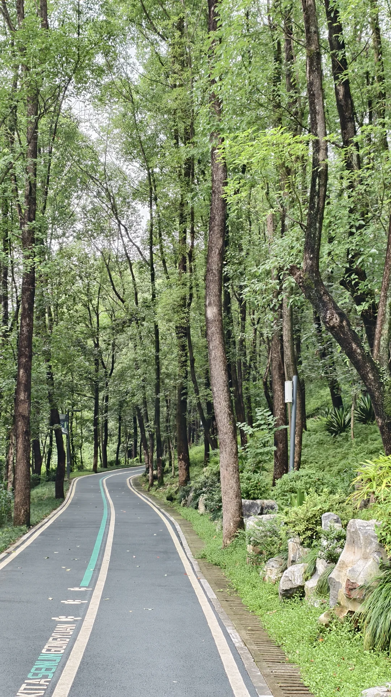
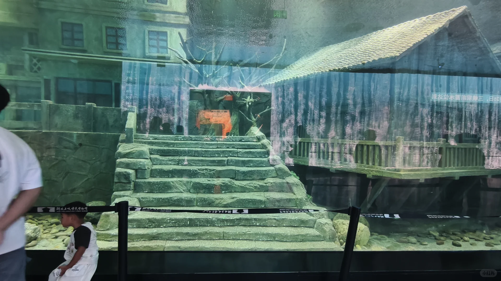
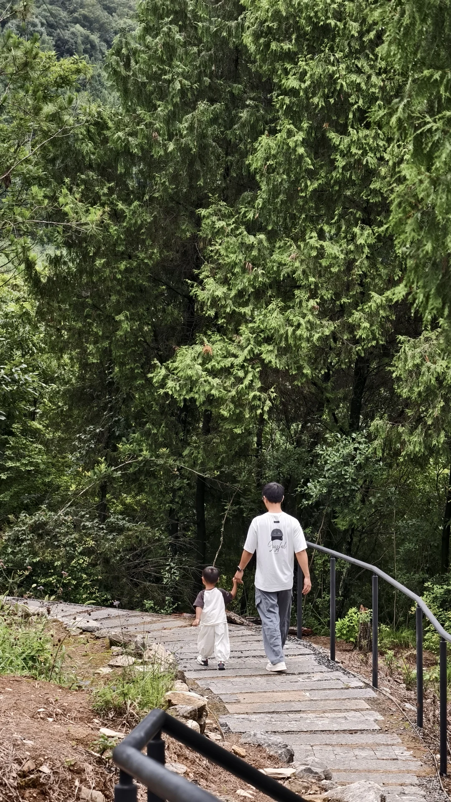
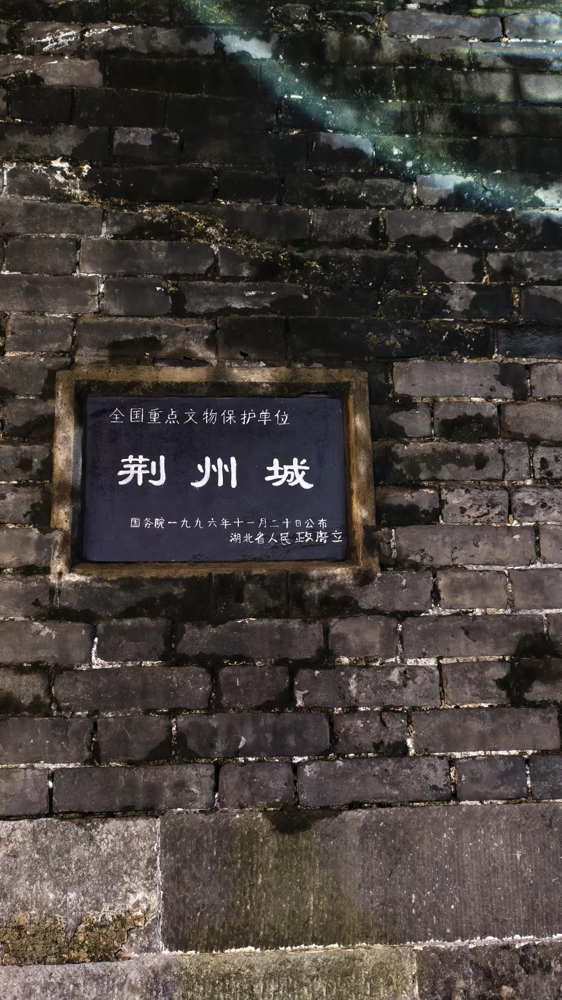
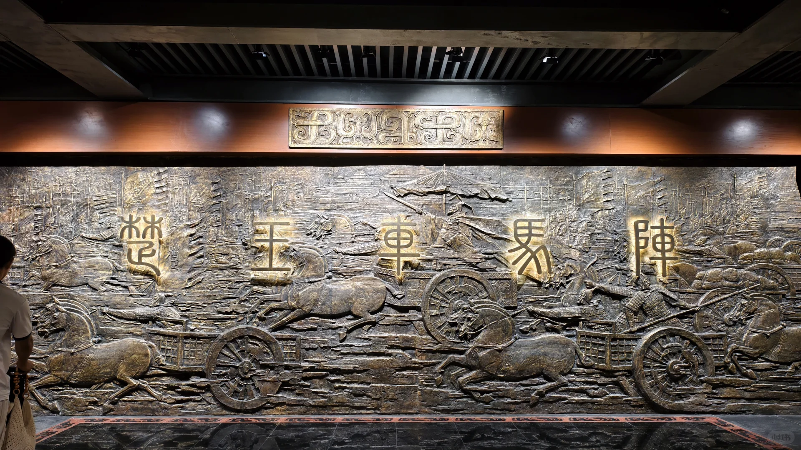
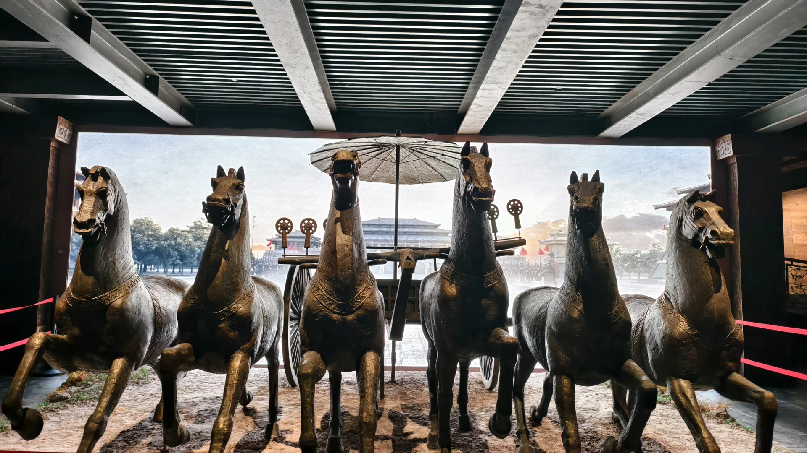
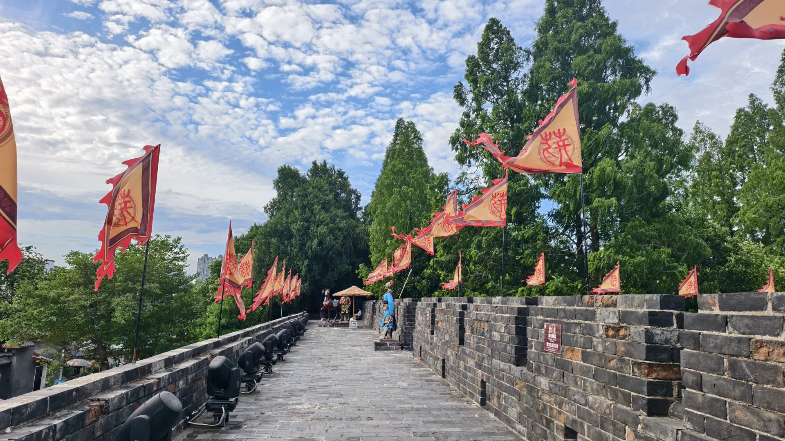

# 省内亲子宜昌荆州自驾

- 作者: 冰瞳
- 👍4 · 💬6 · ⭐11 · 图 13
- feed_id: 6a4a46200000000011010b7f

> [OCR] “
自驾收官
一家三口四天三晚
花费2200
武汉→宜昌→荆州→
武汉
”

> [OCR] ZHANGE

> [OCR] KITA SENJINGUOYUAN

> [OCR] 湖北土家移民博物馆
小红书

> [OCR] Soyful

> [OCR] [?]

> [OCR] KINGLEI

> [OCR] 张居正故居
上相太师一德辅三朝功光日月

> [OCR] 全国重点文物保护单位
荆州城
国务院一九九六年十一月二十日公布
湖北省人民政府立

> [OCR] 楚王车马阵

> [OCR] [?]

> [OCR] [?]

## 正文
四天三晚 花费2200
吃好喝好玩好超详细攻略
先说路程：
day1：武汉到宜昌，因为出门较晚，又在最美服务区潜江休息了近四十分钟，到宜昌已经下午四五点了，去民宿放了行李就去夜市逛了下，吃了晚饭就回去休息。
day2：去了最美公路g348，看得风景其实和三峡人家的差不多，只不过我们是在山上看的。公路最后一站是移民博物馆，真的很震撼，也是一直想去的。结束才下午四点，所以又回市区去了小溪塔森林公园，真的巨巨巨吸氧。推荐，还有儿童游乐园。
day3：去了清江画廊。这里提示大家，可以买一个江汉年卡，有清江画廊门票，只需要补一个船票就可以，这个年卡可以玩所有荆州的景区。
day4：去了荆州楚王车马阵→古城墙→游船→张居正故居→关帝庙。其实前一天晚上就去了城墙看夜景，白天又去看了白天的景色，楚王车马阵真的很壮观，只是还没开发完，非常值得一看。
晚上返回武汉。
住宿：两天住宜昌民宿，一天荆州酒店。喜欢房间大的选民宿，我这次住的民宿真的超好，很干净很新很大。
餐饮：大众点评找的排名靠前的基本不会翻车。
特别提醒：买一个江汉年卡#一家三口旅游[话题]# #带着孩子去旅行[话题]# #带着全家去旅行[话题]# #带着一岁多的宝宝旅游[话题]# #适合亲子旅游的地方[话题]# #特种兵穷游[话题]# #亲子游[话题]# #带娃去旅行[话题]# #自驾游[话题]# #自驾游路线[话题]#

---