# 13元坐船看清江画廊

- 作者: 小红薯639F10E2
- 👍4 · 💬2 · ⭐9 · 图 12
- feed_id: 6a72085900000000350147d8

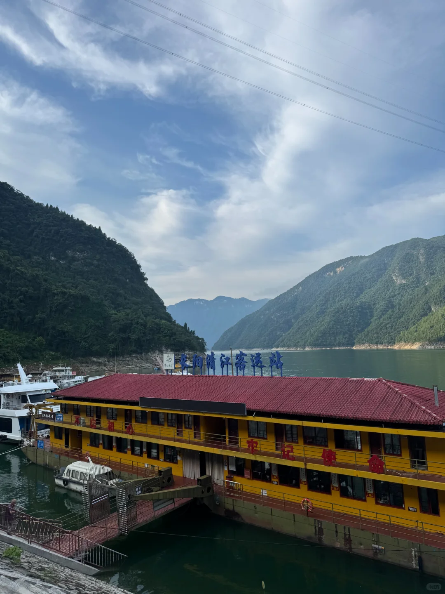
> [OCR] 东河清江客运站
不忘初心  牢记使命
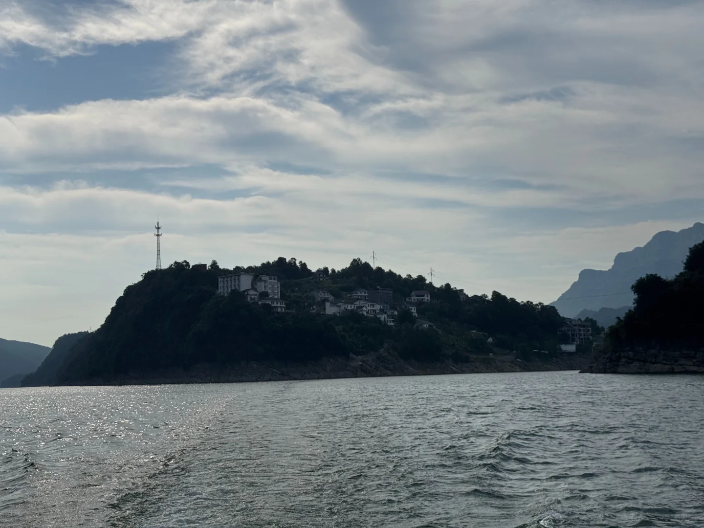
> [OCR] [?]
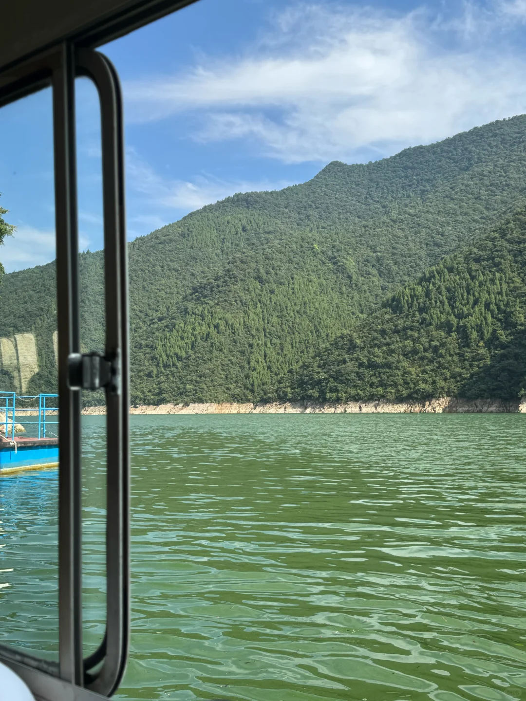
> [OCR] [?]
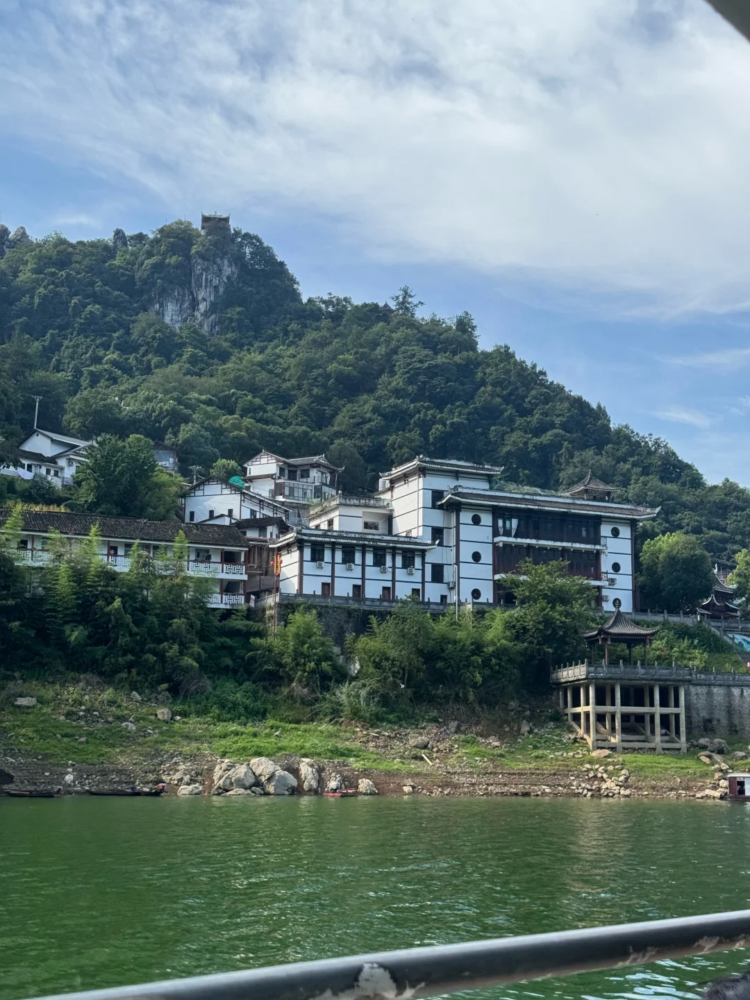
> [OCR] [?]
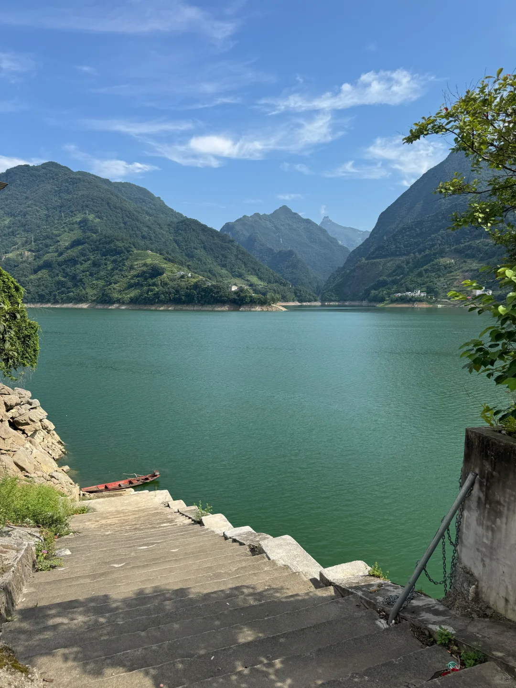
> [OCR] system
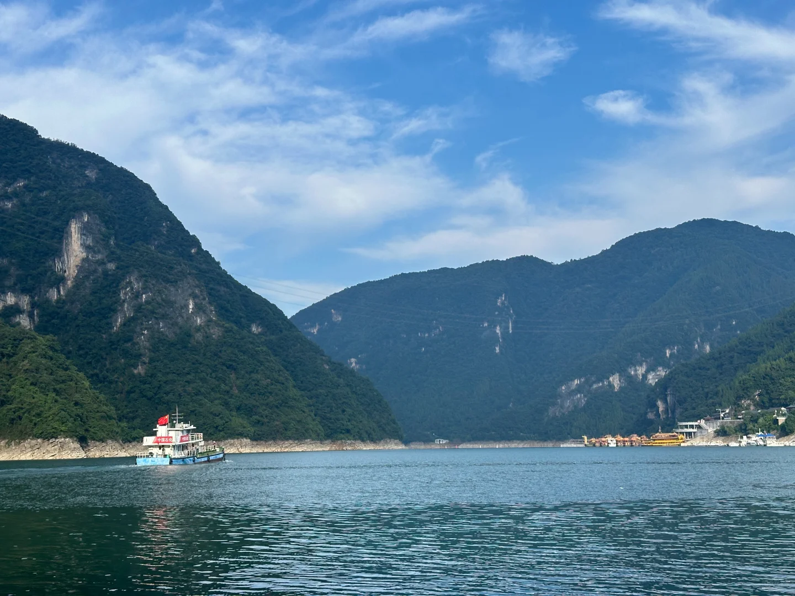
> [OCR] 中国石柱
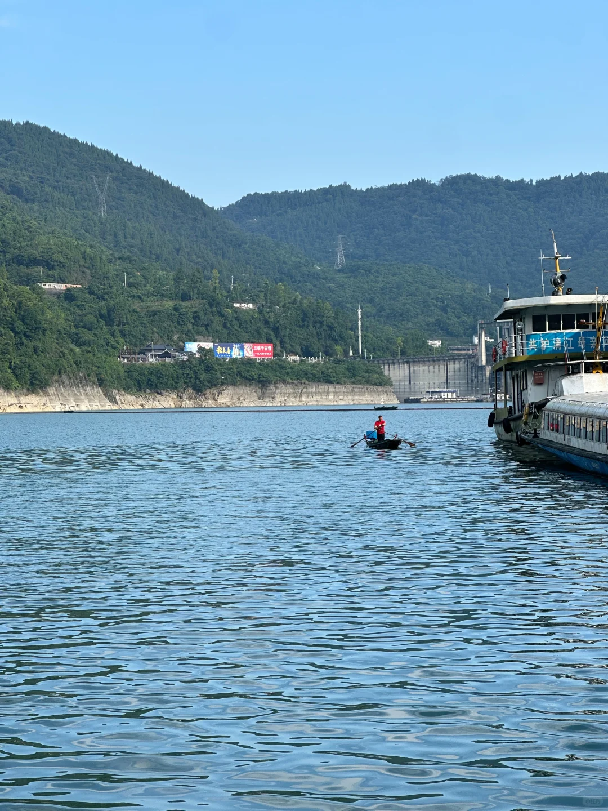
> [OCR] 共护清江平安
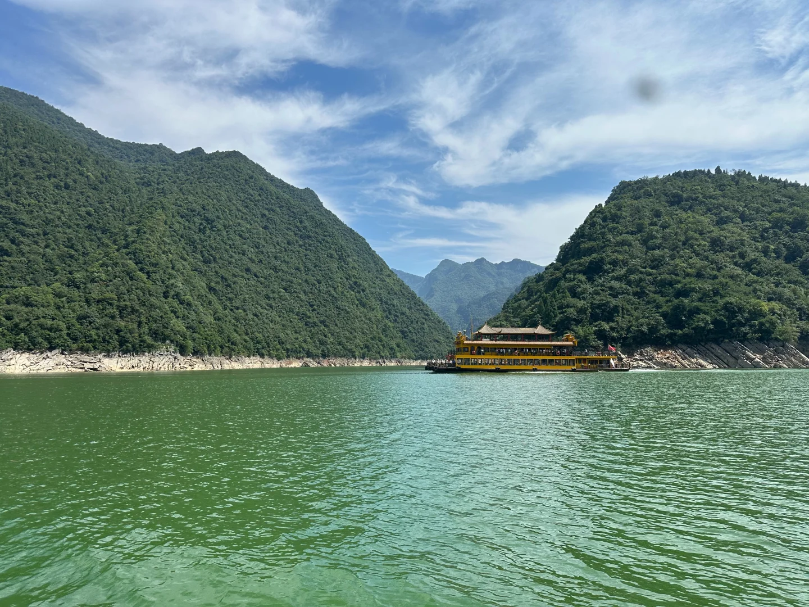
> [OCR] [?]
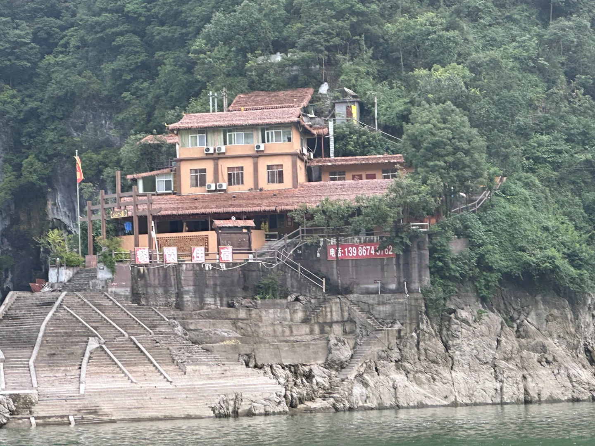
> [OCR] 餐 住 宿
电话：13986745762
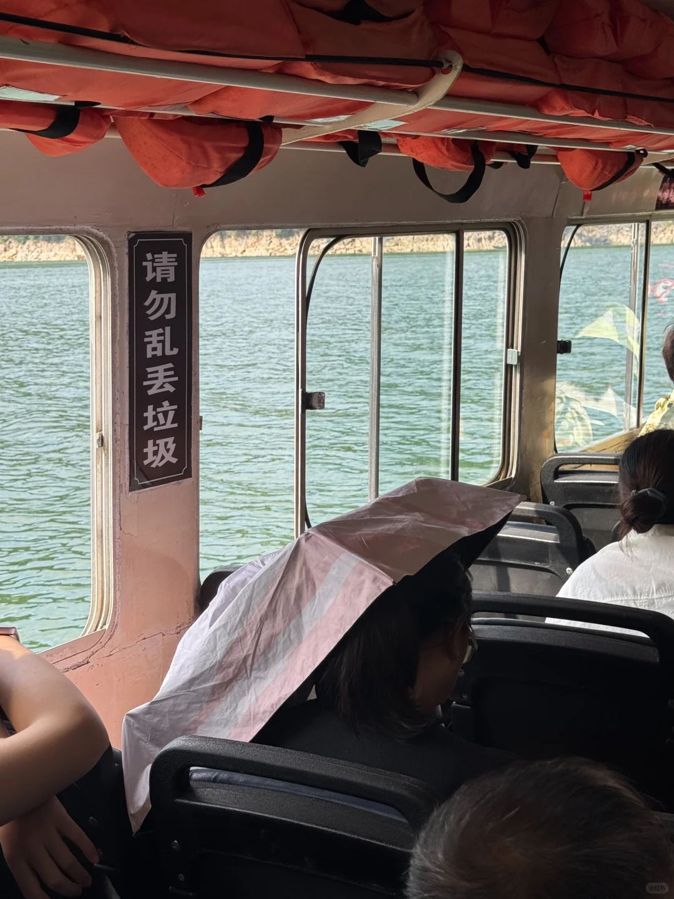
> [OCR] 请勿乱丢垃圾
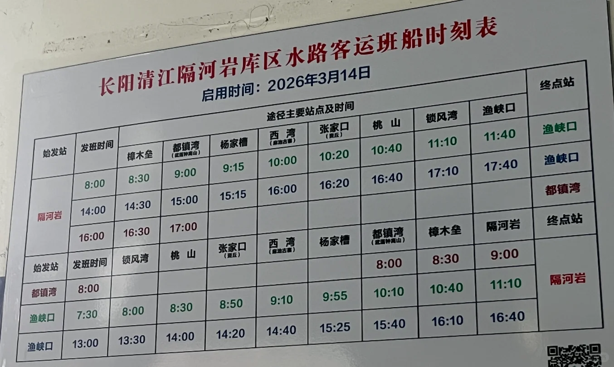
> [OCR] 长阳清江隔河岩库区水路客运班船时刻表
启用时间：2026年3月14日
途径主要站点及时间
始发站 发班时间 樟木垒 都镇湾(武当钟离山) 杨家槽 西湾(麻迪古寨) 张家口(黄丘) 桃 山 锁风湾 渔峡口 终点站
隔河岩 8:00 8:30 9:00 9:15 10:00 10:20 10:40 11:10 11:40 渔峡口
14:00 14:30 15:00 15:15 16:00 16:20 16:40 17:10 17:40 渔峡口
16:00 16:30 17:00
始发站 发班时间 锁风湾 桃 山 张家口(黄丘) 西湾(麻迪古寨) 杨家槽 都镇湾(武当钟离山) 樟木垒 隔河岩 终点站
都镇湾 8:00
渔峡口 7:30 8:00 8:30 8:50 9:10 9:55 10:10 10:40 11:10 隔河岩
渔峡口 13:00 13:30 14:00 14:20 14:40 15:25 15:40 16:10 16:40
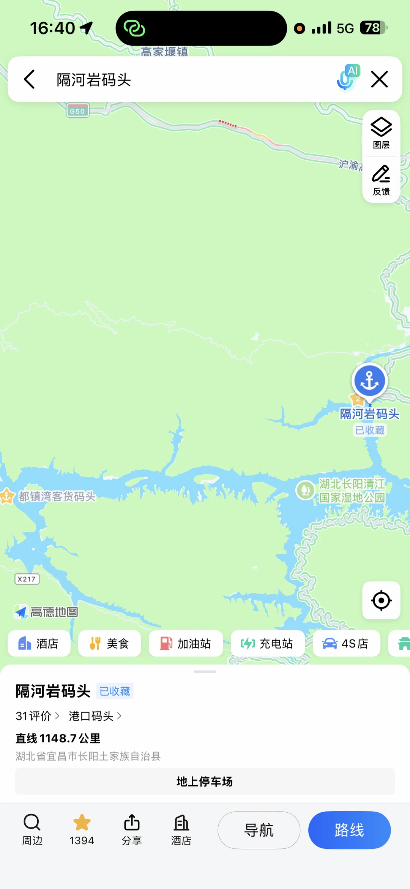
> [OCR] 16:40
高家堰镇
< 隔河岩码头
×
图层
反馈
G50
沪渝高速
隔河岩码头
已收藏
都镇湾客货码头
湖北长阳清江国家湿地公园
X217
高德地图
酒店
美食
加油站
充电站
4S店
地上停车场
隔河岩码头 已收藏
31评价 > 港口码头 >
直线 1148.7 公里
湖北省宜昌市长阳土家族自治县
导航
路线
周边
1394 分享 酒店

## 正文
长阳清江画廊，发现了一条很适合慢慢看的水路。
从隔河岩码头坐班船到都镇湾，不是景区常规游船，当地水路客运。一路沿着清江走，两岸是山、水、村落和码头，节奏很慢，也更有生活感。
	
我比较推荐坐早上这班：
🚢 隔河岩码头出发：8:00
📍 到达都镇湾：约9:00
💰 船票：13元/人左右
🔁 返程可参考：10:10 从都镇湾方向返航，到隔河岩约11:10
这样安排的好处是： 上午光线舒服，不晒得太狠；到都镇湾后还能稍微走走看看，再坐返程船回来，半天时间刚刚好。
和景区游船不一样，这条线没有太强的“打卡流程”，更像是在清江上坐一段真正的交通船。风景不是那种一眼惊艳的大景点，会有本地居民加入，很适合体验当地居民的生活。
	
✅ 适合谁 想体验清江水路的人 不想只走常规景区线的人 喜欢小众路线、慢慢看风景的人 自驾到隔河岩附近，想顺路坐船的人
⚠️ 注意 班船时间会受天气和航道影响，可能有10-30分钟误差 出发前最好提前确认当天船班 不要把行程卡得太死 如果第一次来清江画廊，景区常规线会更稳，景区穿环境应该更好一些。
我觉得这段不是“必打卡”，但很适合普通上班族周末换个方式放空。
不用赶景点，就坐在船上看清江、看山、看码头慢慢经过。 有时候旅行不一定要去很远，换一种交通方式，就已经很有意思了。
#清江画廊[话题]#  #隔河岩码头[话题]#  #都镇湾[话题]#  #长阳旅游[话题]#  #宜昌旅游[话题]#  #湖北旅行[话题]#  #湖北自驾游[话题]#  #小众旅行地[话题]#  #周末去哪儿[话题]#  #普通上班族周末户外[话题]#

---