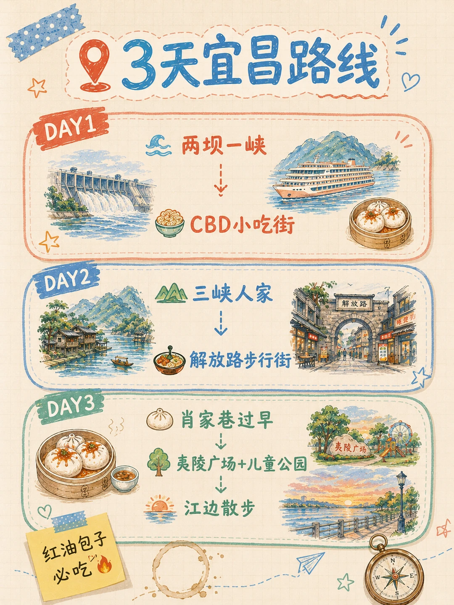
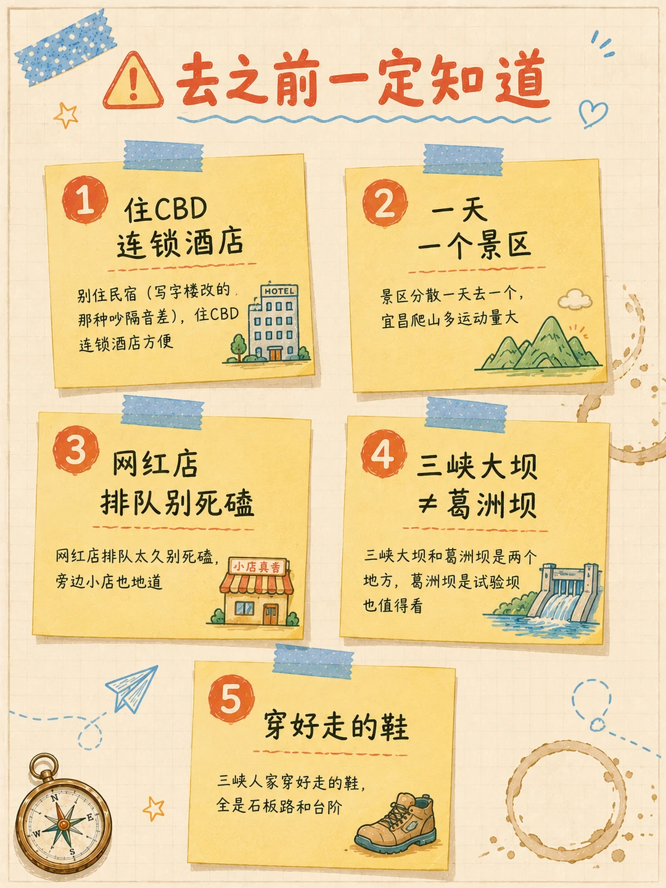

# 宜昌3天攻略，周末就能冲🔥

- 作者: 白云不太贤
- 👍4 · 💬1 · ⭐7 · 图 6
- feed_id: 6a4a39130000000007013b72

> [OCR] 三峡风光
西陵峡
巫峡
宜昌3天攻略
红油包子配三峡大坝
宜昌
红油包子
皮薄馅多·香辣过瘾❤️
三峡大坝
国之重器·震撼壮观
地道美食
热辣鲜香·暖心暖胃
宜昌

> [OCR] 3天宜昌路线

DAY1 两坝一峡
CBD小吃街

DAY2 三峡人家
解放路步行街

DAY3 肖家巷过早
夷陵广场+儿童公园
江边散步

红油包子必吃

> [OCR] 宜昌为什么值得去

两坝一峡
游轮过葛洲坝超震撼

三峡人家
比市区低5-8℃

CBD小吃街
王氏凉虾 萝卜饺子
5块凉虾实现快乐

> [OCR] 宜昌必吃TOP5

1. 红油包子
牛肉馅 | 4元

2. 萝卜饺子
5元

3. 王氏凉虾
5元

4. 肥鱼火锅
人均80

5. 铁板烧
人均50

> [OCR] 去之前一定知道

1. 住CBD
连锁酒店
别住民宿（写字楼改的，
那种吵隔音差），住CBD
连锁酒店方便

2. 一天
一个景区
景区分散一天去一个，
宜昌爬山多运动量大

3. 网红店
排队别死磕
网红店排队太久别死磕，
旁边小店也地道

4. 三峡大坝
≠葛洲坝
三峡大坝和葛洲坝是两个地方，葛洲坝是试验坝
也值得看

5. 穿好走的鞋
三峡人家穿好走的鞋，
全是石板路和台阶

> [OCR] 宜昌最让我意外的
不是三峡大坝
而是4块钱一个的
红油包子

你会为了
红油包子来宜昌吗？

## 正文
宜昌真的被低估了，有世界级三峡大坝，有山水如画的三峡人家，还有让人上头的红油包子和烟火气老街，消费不高，周末打趟高铁就够了🍜
	
📍3天这样安排
Day1 两坝一峡（游轮+三峡大坝，全天）
选船去车回或车去船回，游轮过葛洲坝水涨船高超震撼，西陵峡这段风景最好，两岸青山如画。
下午三峡大坝坛子岭+185观景台，国之重器真的看得起鸡皮疙瘩。傍晚回市区CBD小吃街，王氏凉虾5块一杯，萝卜饺子必吃🥟
Day2 三峡人家（全天）
在西陵峡里面，比市区低5-8度。龙进溪沿溪水走超凉快，看土家妹子和瀑布，婚嫁表演。上午10:30和下午2:30各一场别错过。
下午沿G348国道回市区，沿途观景点风景绝了。
晚上解放路步行街觅食
Day3 市区逛吃
上午肖家巷过早，红油包子必点（牛肉馅油渗皮那种，4块一个），金果条、麻原米线、酱香饼都安排上。
下午夷陵广场+儿童公园，傍晚江边散步吹风看晚霞🌇
	
🍜 美食推荐
📍红油包子：肖家巷那家，牛肉馅油渗皮微辣，4块一个
📍萝卜饺子：路边摊5块一个，油炸略腻但萝卜清爽
📍王氏凉虾：红糖米酒味，5块一杯，CBD小吃街
📍肥鱼火锅：清江鱼做的，汤奶白没刺，人均80
📍铁板烧：素菜比肉好吃，配花饭和冰镇汽水，人均50
📍清江野鱼：走的时候超市买几包当特产
	
💰 预算
高铁武汉出发约100（远距离400-500），住宿人均150/晚，门票两坝一峡258+三峡人家150，吃饭人均150/天 → 总计人均1000-1500（周边）/ 2000-2500（远距离）
	
⚠️ 避雷
1. 别住民宿（写字楼改的那种吵隔音差），住连锁酒店方便
2. 景区分散一天去一个，宜昌爬山多运动量大
3. 网红店排队太久别死磕，旁边小店也地道
4. 三峡大坝和葛洲坝是两个地方，葛洲坝是试验坝也值得看
5. 三峡人家穿好走的鞋，全是石板路和台阶
	
🚗 交通
动车到宜昌东站，BRT两块钱到市区（25分钟）。机场到市区约45分钟，有机场大巴
	
#宜昌旅游[话题]# #宜昌美食[话题]# #红油包子[话题]# #三峡大坝[话题]# #周末去哪儿[话题]#  #湖北旅游[话题]# #武汉周边[话题]#

---