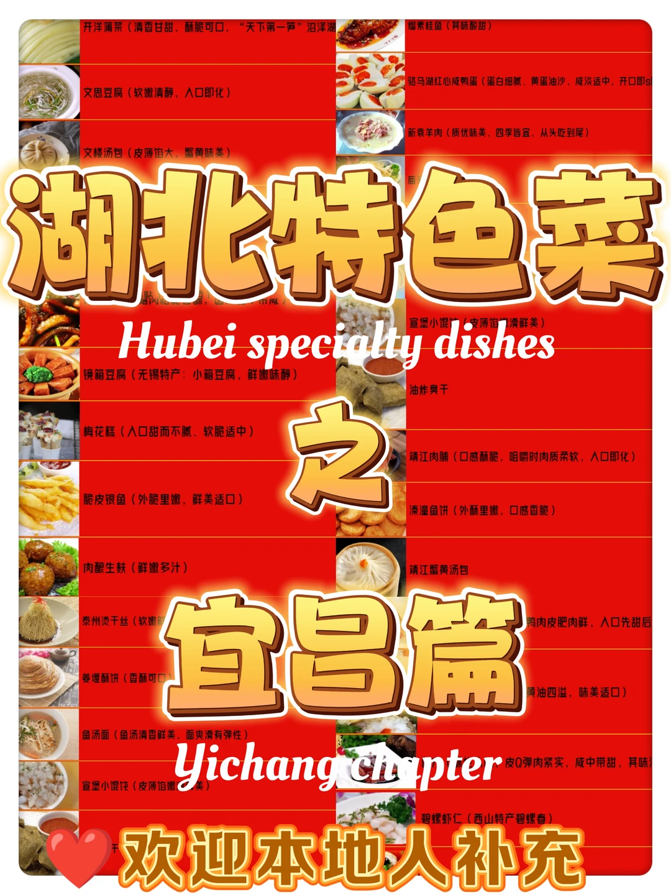
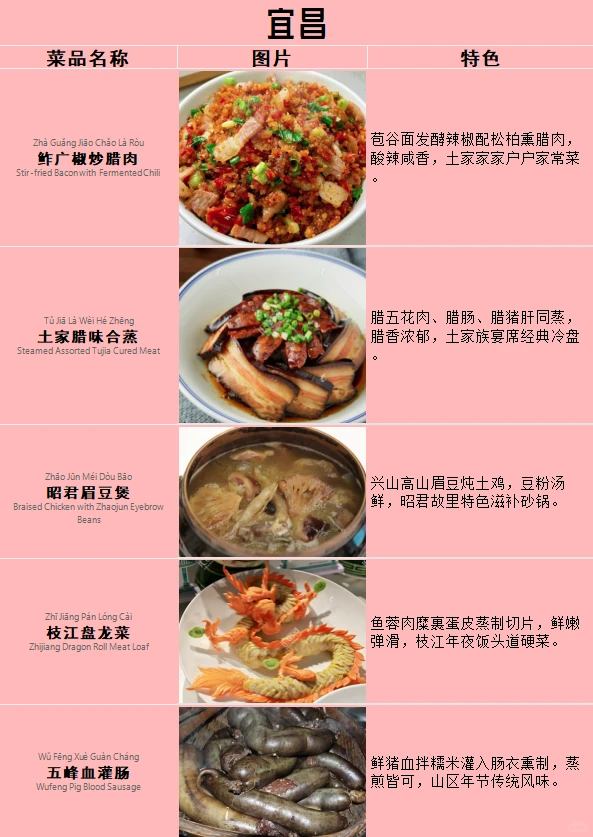
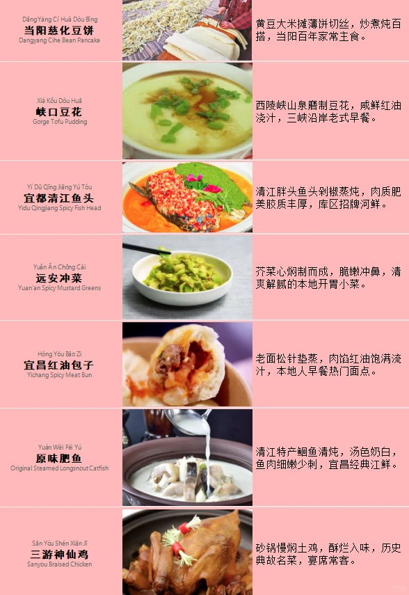
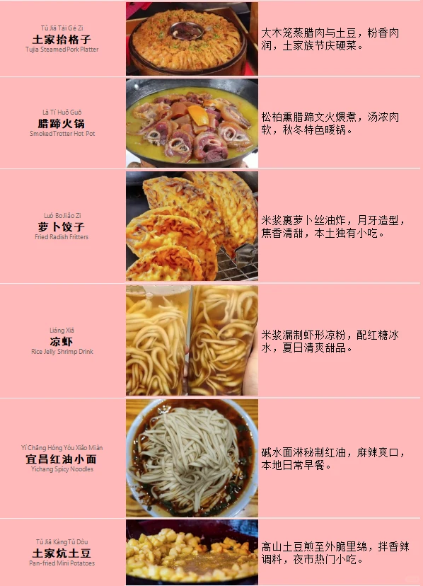

# 湖北特色菜5——宜昌Yichang篇

- 作者: 旅了个游
- 👍4 · 💬 · ⭐1 · 图 5
- feed_id: 6a28d34a0000000006023ccb

> [OCR] 开洋蒲菜（清香甘甜，酥脆可口，“天下第一笋”沼泽湖）
文思豆腐（软嫩清醇，入口即化）
文楼汤包（皮薄馅大，蟹黄味美）
镜箱豆腐（无锡特产：小箱豆腐，鲜嫩味醇）
梅花糕（入口甜而不腻、软脆适中）
脆皮银鱼（外脆里嫩，鲜美适口）
肉酿生麸（鲜嫩多汁）
泰州烫干丝（软嫩可口）
姜堰酥饼（香酥可口）
鱼汤面（鱼汤清香鲜美，面爽滑有弹性）
宣堡小馄饨（皮薄馅嫩，味美）
[?]素桂鱼（其味酸甜）
骆马湖红心咸鸭蛋（蛋白细腻、黄蛋油沙，咸淡适中，开口即s]
新袁羊肉（质优味美，四季皆宜，从头吃到尾）
宣堡小馄饨（皮薄馅嫩，味美）
[?]蟹黄汤包
[?]肉肥肉鲜，入口先甜后
[?]弹肉紧实，咸中带甜，其味
欢迎本地人补充

> [OCR] 宜昌

菜品名称 | 图片 | 特色
---|---|---
Zhà Guǎng Jiāo Cháo Là Ròu | 茄谷面发酵辣椒配松柏熏腊肉，酸辣咸香，土家家家户户家常菜。
Stir-fried Bacon with Fermented Chili |
Tǔ Jiā Là Wèi Hé Zhēng | 腊五花肉、腊肠、腊猪肝同蒸，腊香浓郁，土家族宴席经典冷盘
Steamed Assorted Tujia Cured Meat |
Zhào Jūn Méi Dòu Bāo | 兴山高山眉豆炖土鸡，豆粉汤鲜，昭君故里特色滋补砂锅。
Braised Chicken with Zhaojun Eyebrow Beans |
Zhī Jiāng Pán Lóng Cài | 鱼蓉肉糜裹蛋皮蒸制切片，鲜嫩弹滑，枝江年夜饭头道硬菜。
Zhijiang Dragon Roll Meat Loaf |
Wǔ Fēng Xuè Guàn Cháng | 鲜猪血拌糯米灌入肠衣熏制，蒸煎皆可，山区年节传统风味。
Wufeng Pig Blood Sausage |

> [OCR] 当阳慈化豆饼
Dangyang Ci He Dou Bing
黄豆大米摊薄饼切丝，炒煮炖百搭，当阳百年家常主食。

峡口豆花
Gorge Tofu Pudding
西陵峡山泉磨制豆花，咸鲜红油浇汁，三峡沿岸老式早餐。

宜都清江鱼头
Yidu Qingjiang Spicy Fish Head
清江胖头鱼头剁椒蒸炖，肉质肥美胶质丰厚，库区招牌河鲜。

远安冲菜
Yuan'an Spicy Mustard Greens
芥菜心焖制而成，脆嫩冲鼻，清爽解腻的本地开胃小菜。

宜昌红油包子
Yichang Spicy Meat Bun
老面松针垫蒸，肉馅红油饱满流汁，本地人早餐热门面点。

原味肥鱼
Original Steamed Longsnout Catfish
清江特产鮰鱼清炖，汤色奶白，鱼肉细嫩少刺，宜昌经典江鲜。

三游神仙鸡
Sanyou Braised Chicken
砂锅慢焖土鸡，酥烂入味，历史典故名菜，宴席常客。

> [OCR] 土家抬格子
Tujia Steamed Pork Platter

大木笼蒸腊肉与土豆, 粉香肉润, 土家族节庆硬菜。

腊蹄火锅
Smoked Trotter Hot Pot

松柏熏腊蹄文火煨煮，汤浓肉软，秋冬特色暖锅。

萝卜饺子
Fried Radish Fritters

米浆裹萝卜丝油炸，月牙造型，
焦香清甜, 本土独有小吃。

凉虾
Rice Jelly Shrimp Drink

米浆漏制虾形凉粉，配红糖冰水，夏日清爽甜品。

宜昌红油小面
Yichang Spicy Noodles

碱水面淋秘制红油，麻辣爽口，
本地日常早餐。

土家坑土豆
Pan-fried Mini Potatoes

高山土豆煎至外脆里绵, 拌香辣调料, 夜市热门小吃。

> [OCR] Dǐng Dīng Gāo
顶顶糕
Bamboo Steamed Rice Cake

竹筒蒸米糕夹红糖，松软香甜，
老式街边点心。

Yuǎn Ān Ní Qí Ū Huǒ Guō
远安泥鳅火锅
Yuan'an Loach Hot Pot

稻田泥鳅鲜焖，鲜辣浓郁，远安
乡土特色锅菜。

## 正文
[喝奶茶R]欢迎世界各地的朋友们来到宜昌旅游！！品尝当地的美食！！！
欢迎本地人补充纠错！我会努力更正的！！！
#宜昌[话题]#  #本地人带你吃[话题]#  #烟火气小吃[话题]#  #舌尖上的美家乡美食[话题]#   #本地人爱吃的店[话题]#  #宜昌美食[话题]#  #宜昌旅游[话题]#  #chinatravel[话题]#  #宜昌旅游攻略[话题]#  #宜昌旅行[话题]# [哇R]
[皱眉R]Welcome to Yichang!
Marvel at the grand Three Gorges scenery and savor delicious local specialties!

---