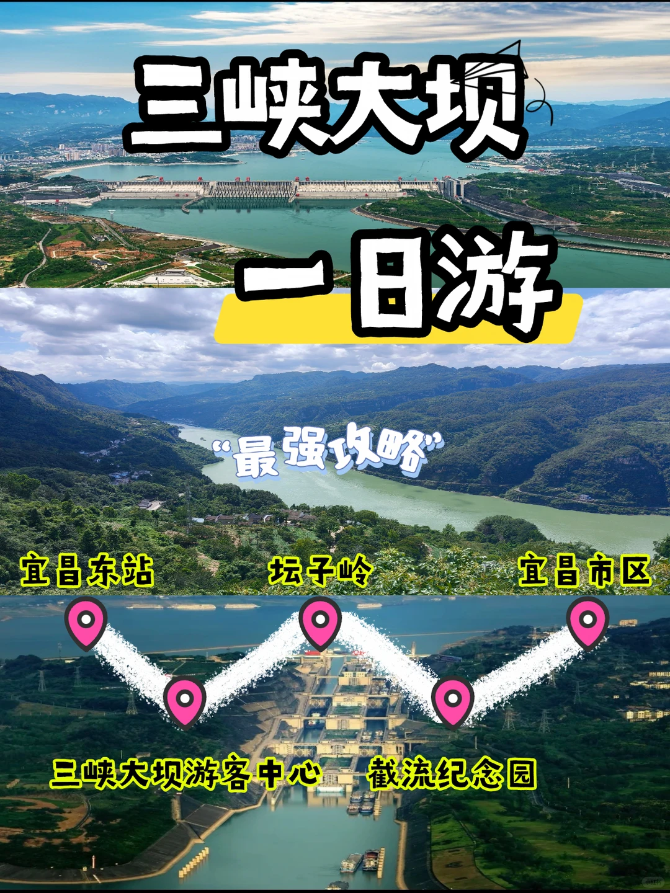

# 来宜昌怎么能不去感受国之重器！

- 作者: 跟着咩咩去旅行
- 👍3 · 💬 · ⭐4 · 图 1
- feed_id: 69a90731000000001a01d25d

> [OCR] 三峡大坝
一日游
“最强攻略”
宜昌东站 坛子岭 宜昌市区
三峡大坝游客中心 截流纪念园

## 正文
来宜昌怎么能不去看三峡大坝！
这份超省心攻略，新手直接冲👇
	
🚗自驾路线
从宜昌东站出发导航至三峡大坝游客中心，约50分钟
	
🚌公共路线
宜昌东站坐809-2路大巴直达景区，17元/人，约1小时
	
省心路线
报市区／东站一日游的专线，怎么去怎么回，不用自己操心
	
🚶‍♀️三峡大坝 精华打卡路线
第一站坛子岭＋185平台，这里就是坝区最高的点，可以360°俯瞰大坝全貌、五级船闸和西陵峡
第二站截流纪念园
看巨型工程车和截流石，还原1997年大江截流的壮观场面，工业风大片
	
贴心小提示[耶R]
必带身份证！刷证入园，没带真的进不去
​观光车35元/人，景区内接驳全靠它，这个钱一点也省不了
​上午9-11点人少光线好，避开旅行团高峰
​山顶风大，记得带件薄外套，防晒也别忘了哈#宜昌旅行[话题]# #一起领略祖国的大好河山吧[话题]# #大国重器彰显大国力量[话题]# #五一这里来得值了[话题]# #小众但好玩的地方[话题]# #节假日小众的旅游景点[话题]# #宜昌三峡大坝旅游[话题]# #宜昌三峡旅游[话题]# #宜昌旅游推荐[话题]# #宜昌旅游攻略景点[话题]#

---