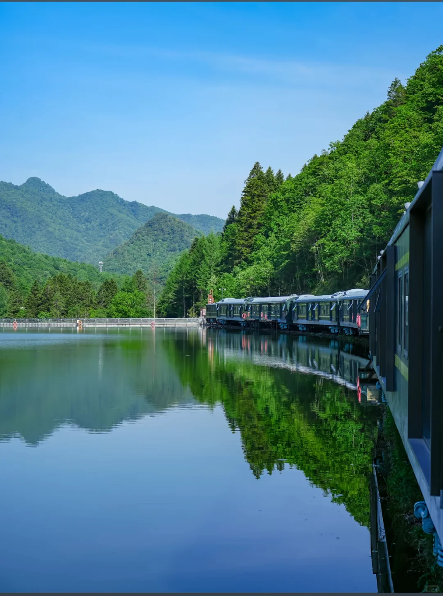
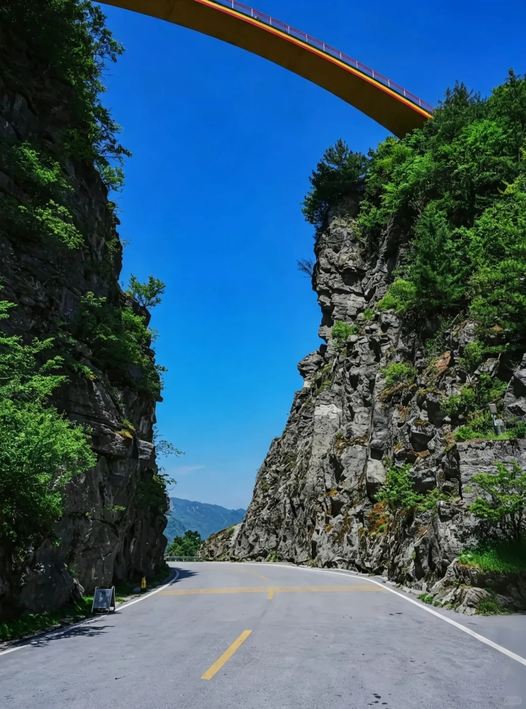
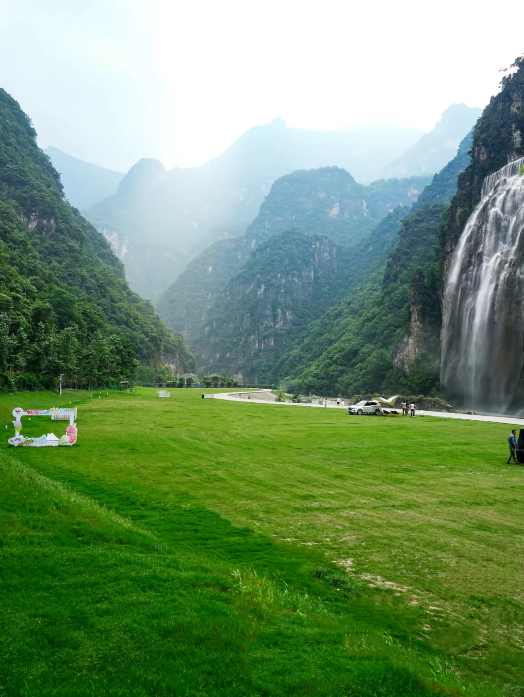
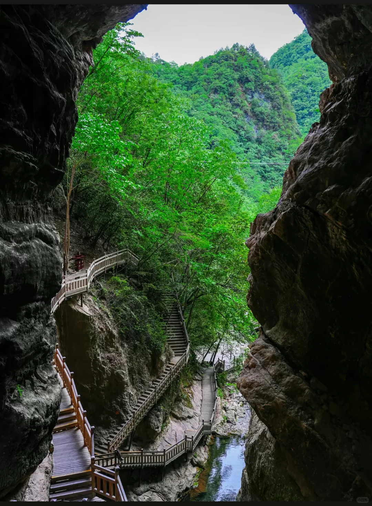
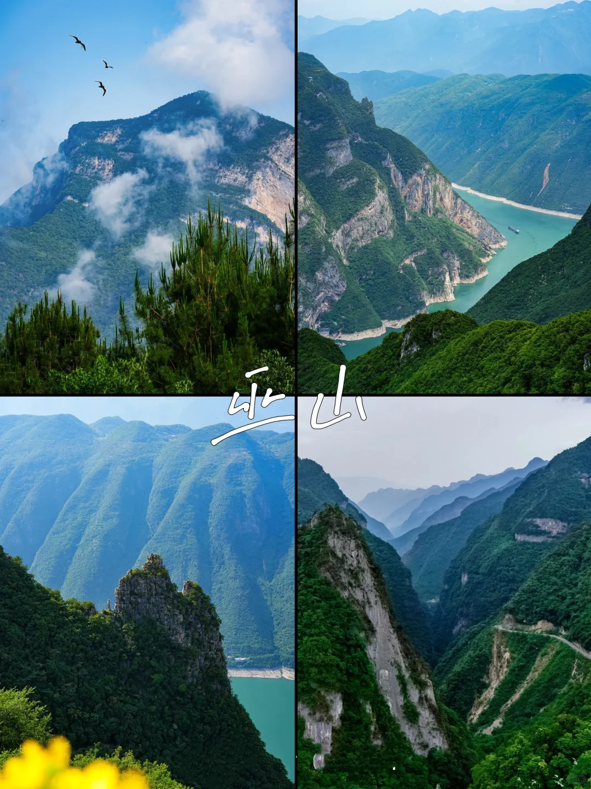
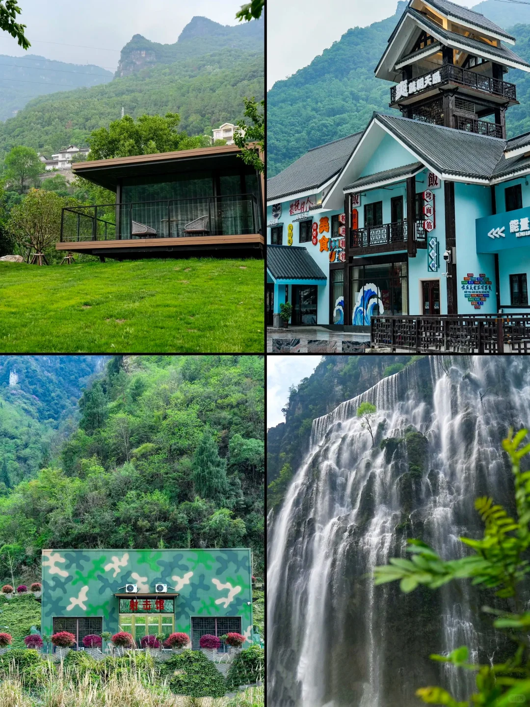

# 

- 作者: TNF打工人
- 👍3 · 💬2 · ⭐2 · 图 11
- feed_id: 6a758e370000000032032b2b

> [OCR] [?]

> [OCR] [?]

> [OCR] system

> [OCR] [?]

> [OCR] [?]

> [OCR] [?]

> [OCR] 畅游二龙山景区

> [OCR] 小红书

> [OCR] 美食
烤面筋
飯
烤
飯
能龍
[?]

> [OCR] 叶
草
芽
苔

## 正文
荆州出发🚗！宜昌23℃避暑秘境，特种兵一日游刚刚好！
这个暑假，荆州热到融化🔥！别在家吹空调了，跟我从荆州出发，自驾去宜昌找个不需要空调的夏天！
	
📍 一日游特种兵路线：
	
🌅 7:00-9:00 出发
荆州上高速一路向西，从平原驶入青山，心情瞬间开阔。暑假车多，早走早抢车位。
	
🌄 9:30-12:00 登高望远
直奔G348国道沿线的绝壁公路和悬空观景台（推荐明月台、听风谷）。脚下碧江如翡翠，游轮划过白色尾迹，“轻舟已过万重山”瞬间有了画面。山顶风超大，体感直降，凉快到不想走！
	
🍜 12:30-14:00 午餐休息
半山腰服务区吃顿农家菜，找棵大树或溪流边歇脚，听水声吹凉风，满血复活。
	
🏞️ 14:30-17:00 探秘峡谷
木质栈道穿梭森林巨石间，全程树荫不怕晒。必打卡高山瀑布，水雾扑面透心凉！运气好还能偶遇水上小火车，像闯进宫崎骏动画。
	
🌄 17:30后 返程
伴着落日回荆州，一天看遍山、水、林、瀑，暑气和班味儿全洗刷干净！
	
---
	
⚠️ 避坑指南（听劝版）：
	
1. 带外套！ 峡谷比市区冷很多，瀑布边风大水汽重，薄外套或防晒衣必备，别贪凉感冒。
2. 穿对鞋：全程木栈道+石阶上下坡，防滑运动鞋安排上，别穿高跟鞋，不然腿废掉。
3. 防晒防虫：山顶紫外线强，防晒霜、帽子、墨镜不能少。山里蚊虫多，驱蚊水花露水必须带！
4. 带干粮水：山里吃喝贵且不一定合胃口，备点巧克力、能量棒和足够的水，徒步消耗大。
5. 别贪多：选2-3个点玩透（观景台+瀑布+小火车）就够，带娃更得放慢节奏。
6. 安全第一：观景台拍照别翻护栏，走路别光看手机，看脚下！
	
从荆州出发，周末或暑假花一天来放空，真的超值！拉上搭子赶紧冲吧！🏃‍♀️💨

---