# 宜昌周末游｜地心谷A线全攻略

- 作者: 小时候
- 👍3 · 💬 · ⭐ · 图 16
- feed_id: 6a793e290000000022013d58

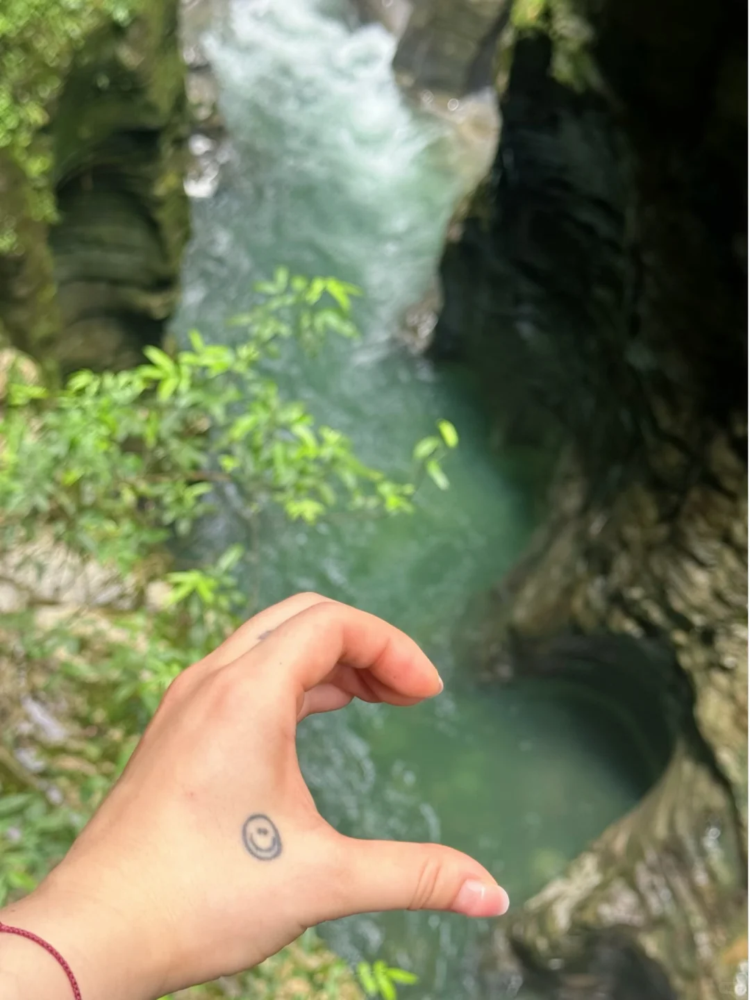
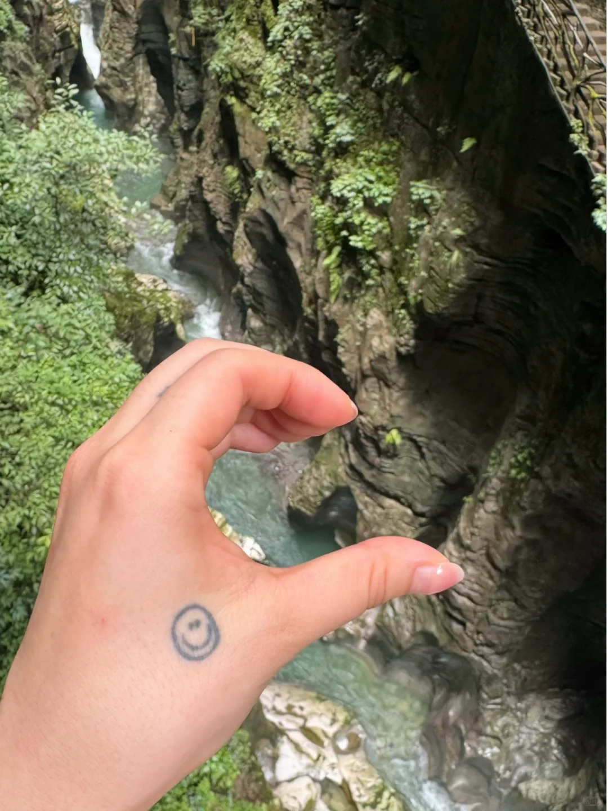
> [OCR] [?]
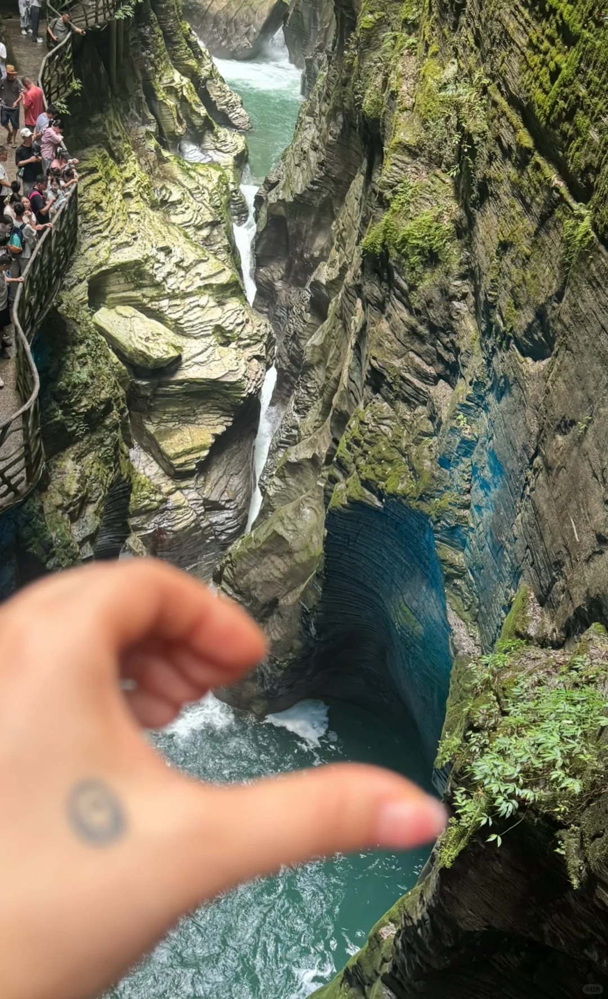
> [OCR] 小红书
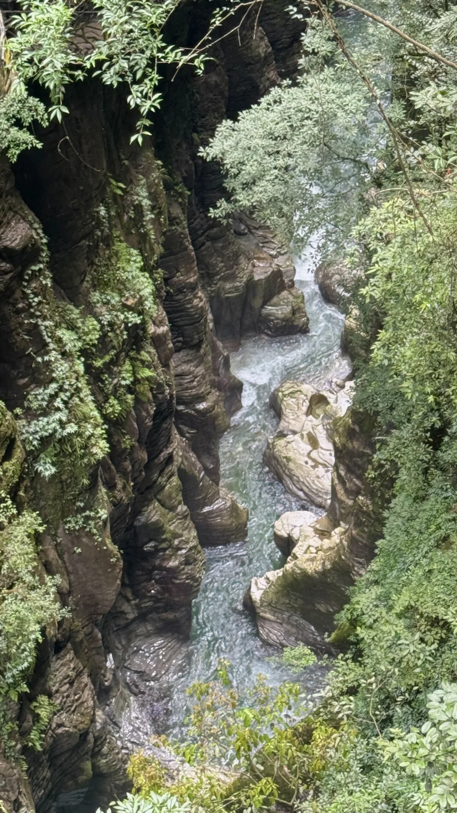
> [OCR] system
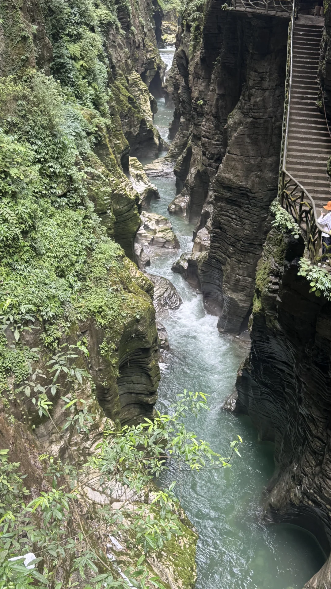
> [OCR] system
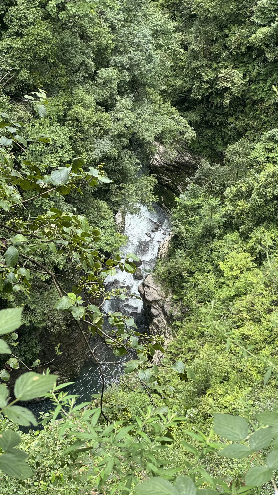
> [OCR] system
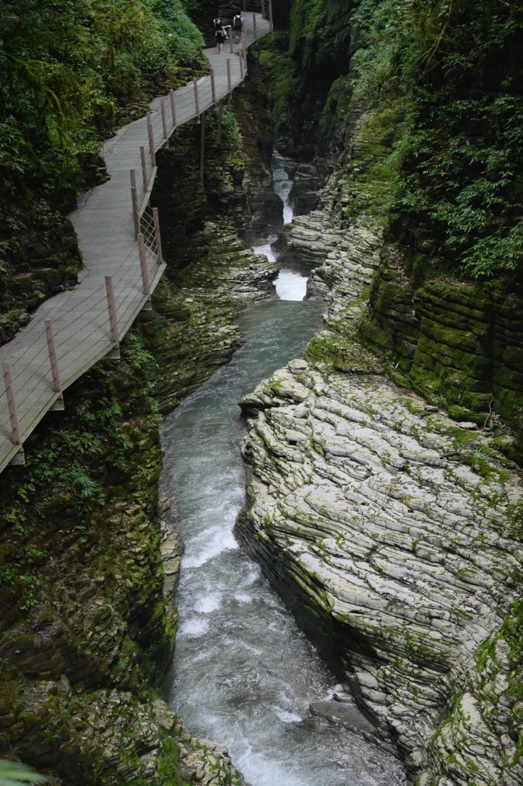
> [OCR] system

> [OCR] [?]
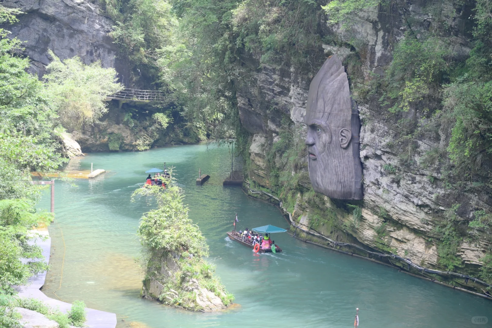
> [OCR] 小红书
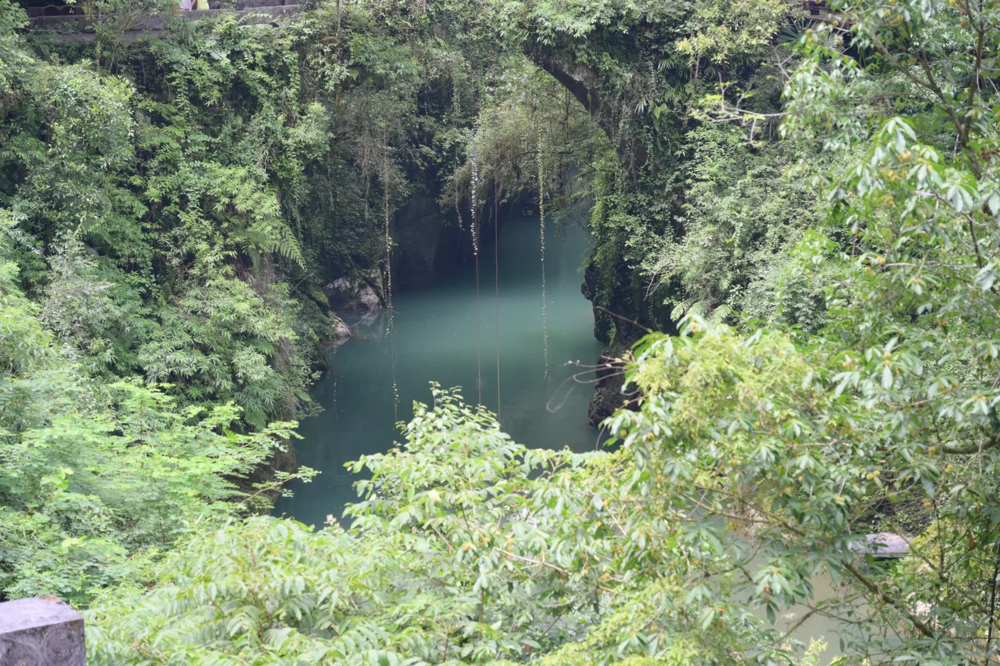
> [OCR] system
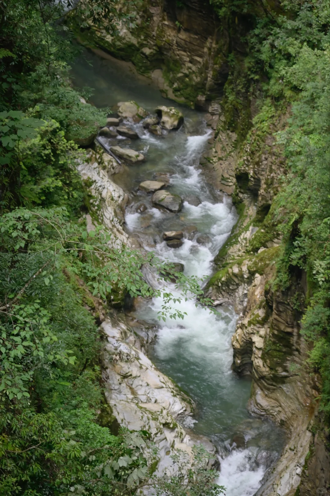
> [OCR] system
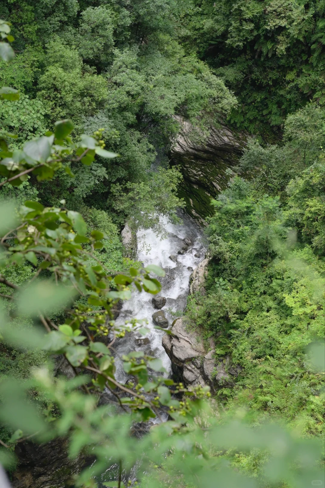
> [OCR] HIKE

> [OCR] 流光一瞬,已过万重山岳;
在此折叠时间,直抵地心深处.

> [OCR] system

> [OCR] 椒盐鸡，饭

> [OCR] [?]

## 正文
🚗【怎么去】
· 宜昌出发：动车直达「高坪站」，🚄70多分钟超方便，下车打个车几分钟就到景区门口
· 恩施出发：我们这次是从恩施自驾过去的，🚙大概1.5小时
---
👣【A线徒步路线（全程6km）】
入口 → 步云桥 → 佳音亭 → 八卦池 → 巨猿崖 → 日月门 → 地心门 → 天地桥 → 地之心 → 亲水区 → 巴盐古道 → 出口
	
全程不走回头路，顺着走就对了～
	
---
	
⏱【时长 & 难度】
· 游玩时长：约 2个半小时（走走停停拍照刚好）
· 海拔爬升：累计 300米
· 路况：中段基本都是平缓栈道，很好走～不过开头和结尾有一段爬升+台阶
	
💬 个人感受：我们走下来真没觉得多累，但中途碰到好几拨人都在吐槽“太难走了”[笑哭R] 可能每个人体力不一样，大家按自己节奏来就好！
---
🎫【门票 & 交通信息】
美团团购（推荐）：门票 + 往返景交车 = 85元/人
免票人群：仅需购买30元景区换乘车票即可入园。
	
📌【实用小Tips】
穿防滑舒适的鞋子，栈道有水汽会有点滑🪨
景区门口挺多农家饭馆，味道还不错👍
	
📅 游玩日期：2026.8.9
夏天去地心谷真的避暑绝绝子，山谷里凉风习习，完全不想出来～
#宜昌周末行[话题]# #地心谷[话题]# #宜昌徒步[话题]# #恩施周边游[话题]# #户外徒步[话题]# #避暑好去处[话题]# #湖北旅游[话题]# #周末去哪儿[话题]# #徒步路线推荐[话题]##好乐day惠出游[话题]#

---