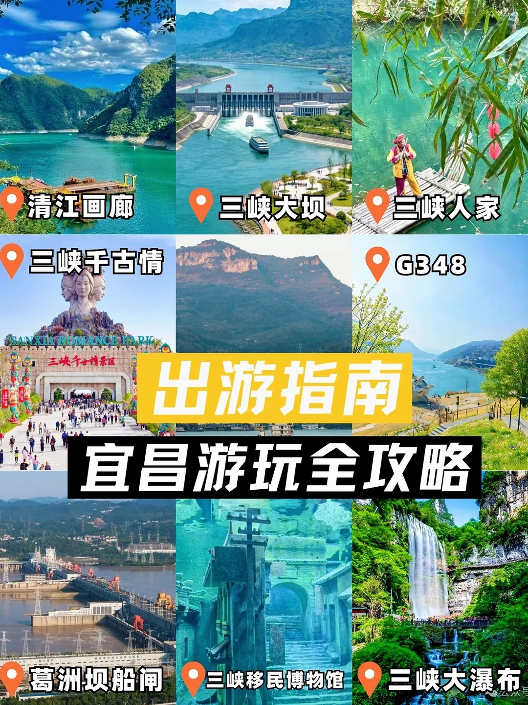
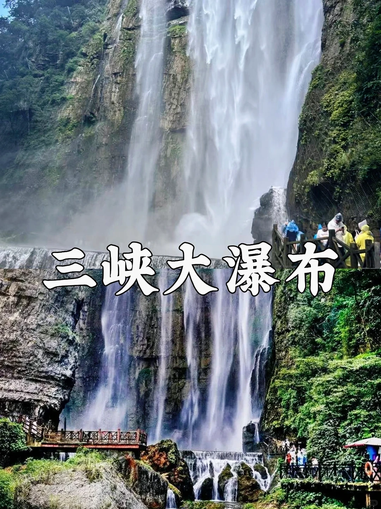
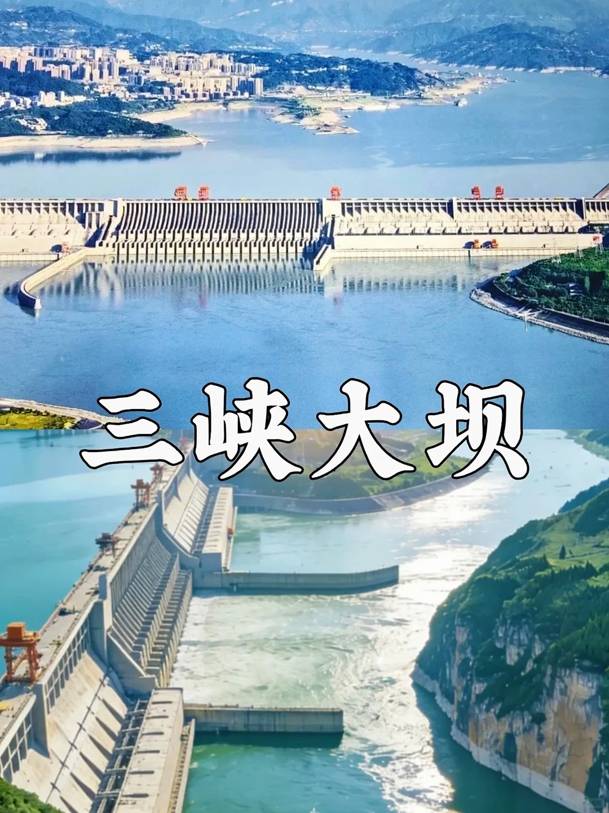
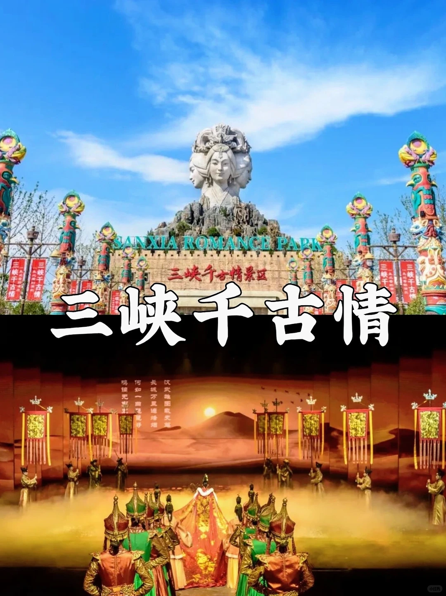
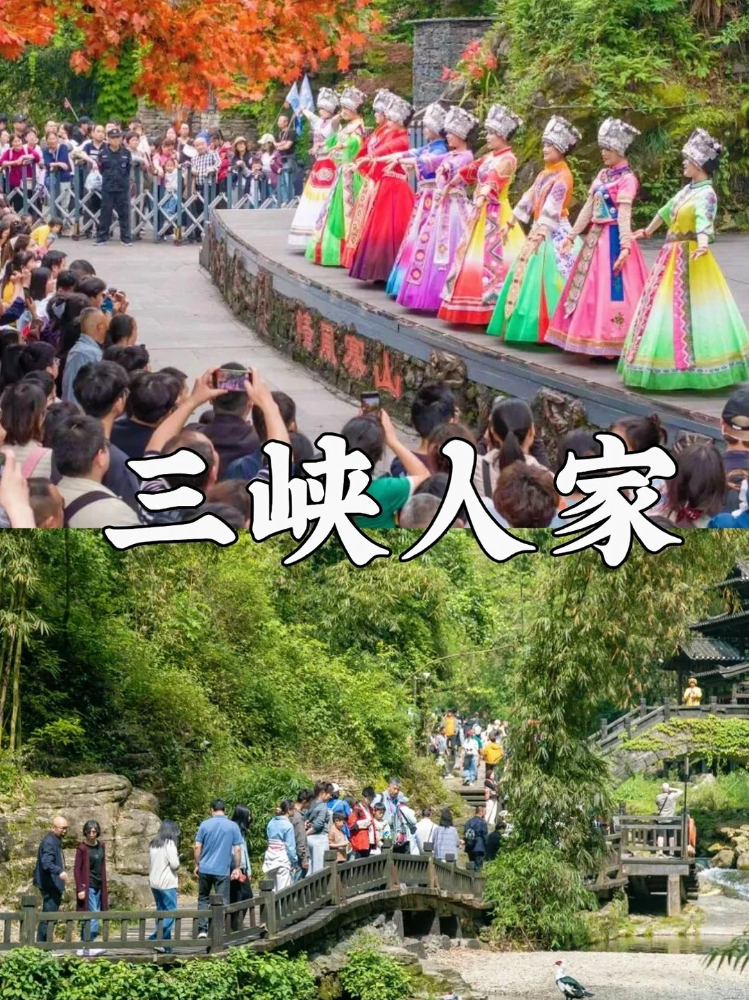

# 宜昌旅游｜本地人整理热门景点攻略

- 作者: 睿宝
- 👍3 · 💬 · ⭐1 · 图 6
- feed_id: 6a0d7a870000000038022bfb

> [OCR] 清江画廊
三峡大坝
三峡人家
三峡千古情
SANXIA ROMANCE PARK
三峡千古情园
出游指南
宜昌游玩全攻略
葛洲坝船闸
三峡移民博物馆
三峡大瀑布

> [OCR] 三峡大瀑布

> [OCR] 三峡大坝

> [OCR] SANXIA ROMANCE PARK
三峡千古情景区
三峡千古情
汉武地图载天[?]
长城万里追[?]
鸣笛无束彩
何如一曲琵琶声

> [OCR] 三峡人家

> [OCR] 清江画廊

## 正文
[蹲后续H]欢迎即将来宜昌的小泷包们～想来宜昌游玩还不懂选景点，这份实用攻略收好啦！最近刷到超多来宜游玩求助帖，整理了大家问得最多的热门景区，看完还有疑问尽管评论区提问，也欢迎大家晒出游美照互相参考[萌萌哒R]
	
📌一日游推荐
[一R]两坝一峡
游玩三峡大坝首选这条线，串联三峡大坝、葛洲坝与西陵峡东段，打卡大国重器，体验船闸通行、升船机，乘船漫游西陵峡，尽览江岸青山碧水，行程也可拆分自由游玩。
[二R]三峡人家
沉浸式感受地道土家风情，日常有各类民俗表演，特色土家婚嫁表演十分热闹，山水清幽景致绝美。龙进溪常有小猴出没，游玩务必保管好随身物品，注意出行安全。
[三R]清江画廊
这里游玩分圣境游、影画游，带老人小孩优先选圣境游，走路轻松不累。时间允许可观看《花咚咚的姐》，囊括山歌、南曲、哭嫁等正宗土家非遗节目，按需选择体验。
[四R]三峡千古情
亲子出游好去处，全天有多场趣味小演出，主剧场面恢弘震撼，演绎大禹治水、昭君出塞等本土经典故事，沉浸式领略三峡底蕴与荆楚文化。
	
📌半日游推荐
[一R]三峡大瀑布
主打特色穿瀑游玩，拍照出片氛围感十足，景区新增飞拉达项目，观景视野极佳。出行提前备好雨衣雨鞋，近距离游玩容易沾水，建议多备一套换洗衣物。
[三R]G348 最美沿江公路
适合自驾、包车出行，节假日极易堵车尽量错峰前往，出行前留意天气，避开大雨天与江水涨潮时段，不然水面混浊留遗憾喔。
[四R]三峡移民博物馆
可搭配三峡大坝、屈原故里顺路打卡，复刻老城街巷风貌，直观了解三峡移民历史。温馨提示：周一闭馆，16:30 停止入园，别跑空啦
	
全部推荐都是轻松不赶趟的深度游玩路线，觉得有用后续再更新更多宜昌游玩好去处～
#宜昌[话题]# #三峡人家[话题]# #三峡大坝[话题]# #清江画廊[话题]# #小众游玩路线[话题]# #小泷包[话题]# #宜昌旅游[话题]# #攻略[话题]# #宜昌旅游攻略[话题]# #值得一去的景点[话题]#

---