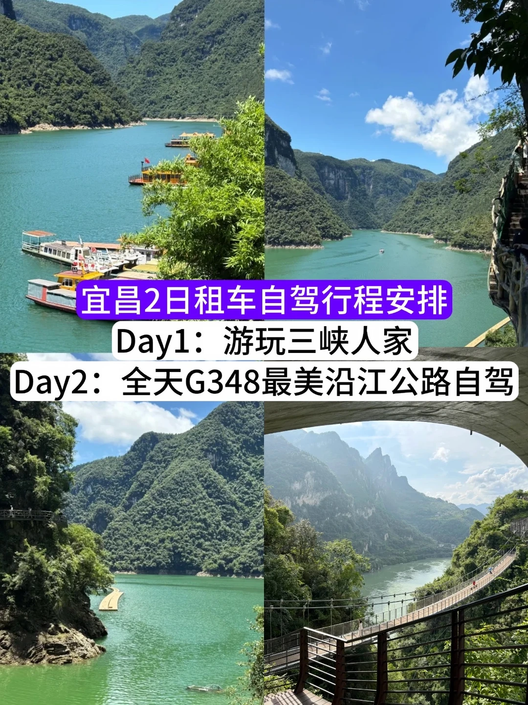
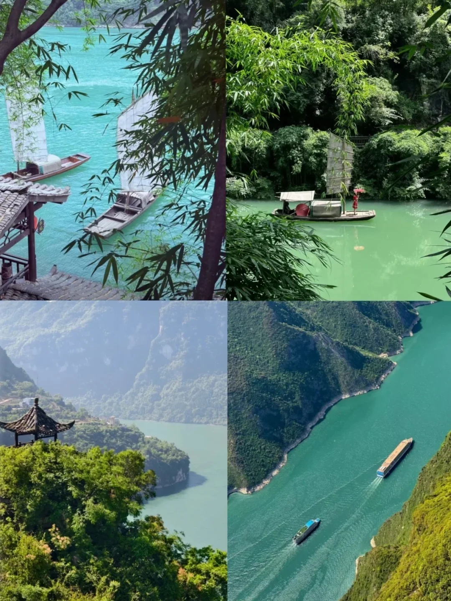
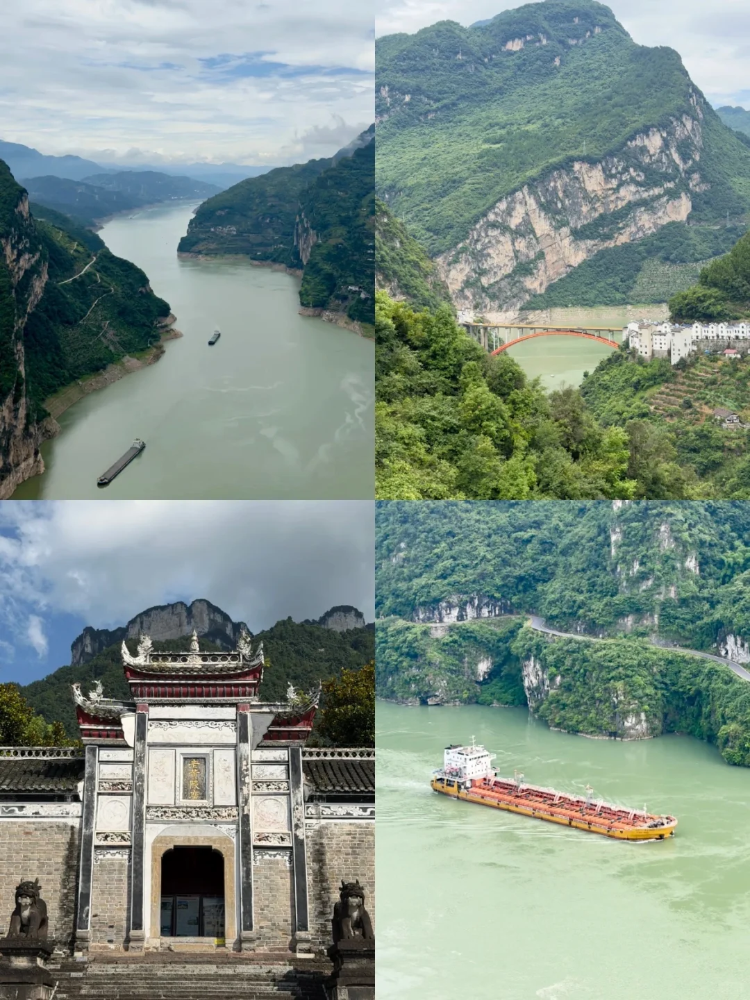
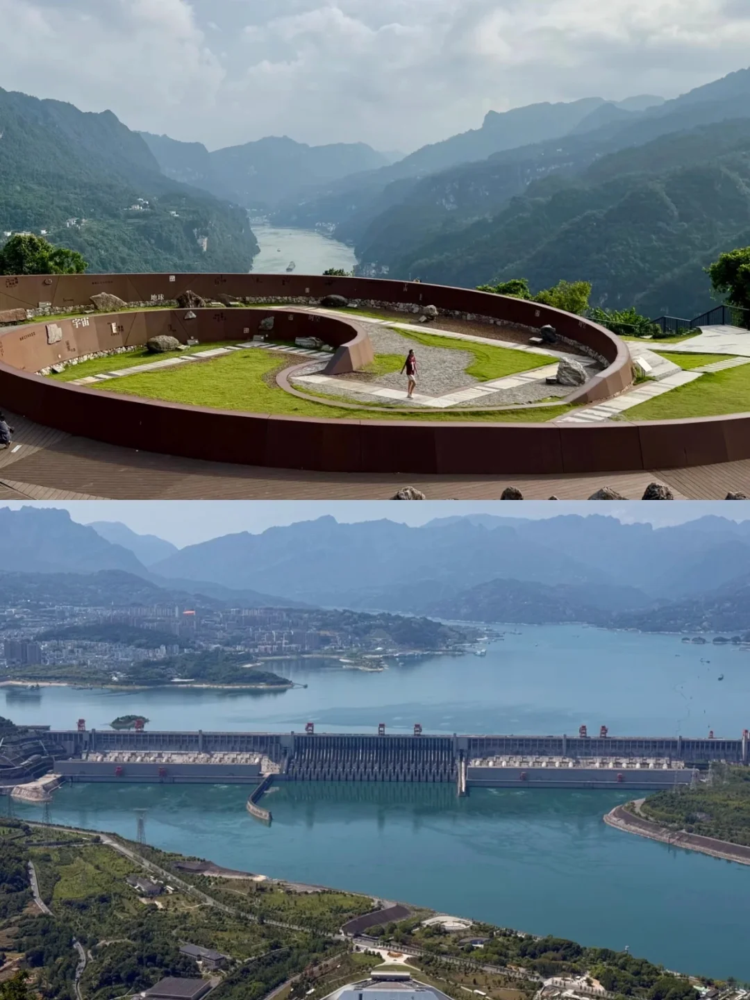
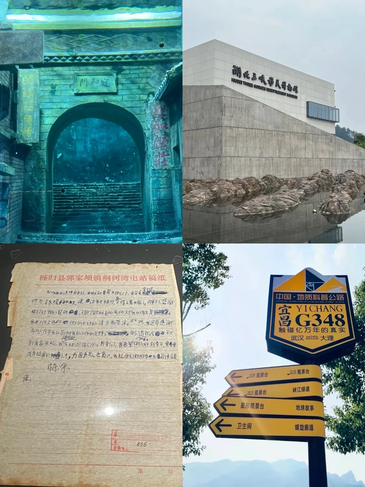
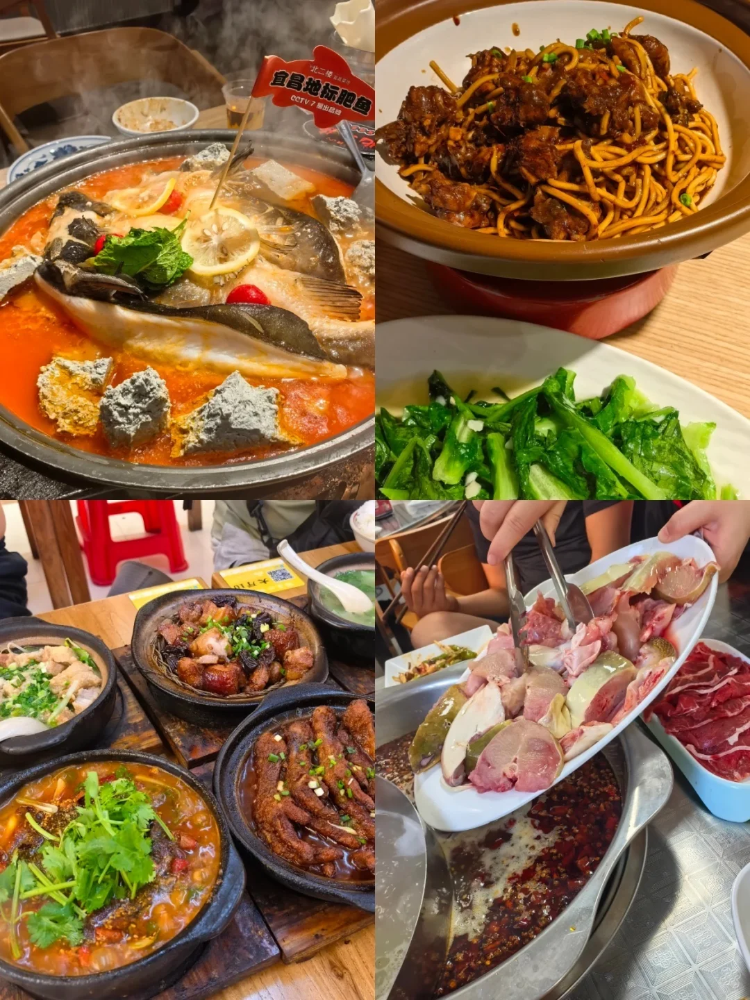

# 来宜昌怎么能不自驾G348公路呢？

- 作者: 1.
- 👍3 · 💬 · ⭐4 · 图 7
- feed_id: 6a7959940000000029031859

> [OCR] 宜昌2日租车自驾行程安排
Day1：游玩三峡人家
Day2：全天G348最美沿江公路自驾

> [OCR] [?]

> [OCR] 古武当山

> [OCR] 宇宙
地球
田
河空

> [OCR] 迎和門
湖北三峽移民博物館
HUBEI THREE GORCES RESETTLEMENT MUSEUM
秭归县郭家坝镇桐树湾电站稿纸
中国·地质科普公路
宜昌G348
触碰亿万年的真实
武汉km2456 大理
[?]
308观景台 315观景台
峡江绿道
星形观景台 地球故事
卫生间 螺旋廊道

> [OCR] 王氏凉虾
ZHI XIANG WANG SHI

> [OCR] 宜昌地标肥鱼
CCTV 7播出高峰

## 正文
去宜昌玩一定要租台车！沿着 G348 最美沿江公路自驾！全程超多免费江景点位，沿路吃吃喝喝超舒服，结合我的两日行程给你们捋明白👇
	
🚗前期租车小tips：
到达机场取车，我租的去哪er的大众朗逸，一天90就能拿下，这里山路弯道会很多，选一辆好开的车也很重要~
务必提前加满油！沿江沿途加油站不算密集，山路耗油比平地多；容易晕车的朋友一定要备好晕车药，弯弯绕绕超多
一定要晴天出行！阴天雾气太重，视野会大打折扣哦~
	
📅两日自驾行程安排
Day1：游玩三峡人家
早上8:30开车到夜明珠港停放车辆，9点准时登船坐船，航程约1小时直达三峡人家景区，务必记得 16 点之前就要往回返程
景区分两大片区慢悠悠逛：
✅巴王寨片区
自费30元坐左转索道登顶山顶，依次打卡灯影石、明月台、邀月亭、石令牌、铁匠铺、巴王宫，顺路走茶盐古道逛到三棵树广场。
9:30-14:30 这里有土家族歌舞表演，原汁原味民俗千万别错过，逛完往太极猫洞方向走即可
✅龙津溪自然风光片区
顺着诗画长廊漫步，走到鹊桥婚嫁楼，9:00-16:00 每小时都会上演土家婚嫁实景演出，看完往下逛黄龙瀑布、猴山，一路溪水清幽，逛完原路坐船返回黄柏河码头就结束一天行程啦
	
Day2：全天 G348 最美沿江公路自驾（全程约 5 小时车程，风景全程不收费）
8 点半从酒店出发→听风谷→山外山→明月台→西陵峡服务区→干沟子大桥→莲沱畔服务区→朱家湾检查站（这里需要提前备好通行证）→三峡移民博物馆→牛肝马肺峡→鹰嘴岩农家院→三峡大瀑布
	
🌟沿途必打卡宝藏点位：
牛肝马肺峡观景台：整条路线我最爱的地方！居高俯瞰浩荡长江，峡谷壮阔氛围感拉满，拍照巨震撼
莲沱畔、干沟子大桥：小众江边机位，人少清净，适合停下吹江风歇脚
三峡移民博物馆：顺路进去逛逛，了解三峡移民过往故事，免费参观很有意义
	
整体自驾下来轻松惬意，山水风光、人文民俗全都兼顾到，来宜昌玩千万别错过这条沿江绝美路线～
#宜昌租车[话题]# #租车[话题]# #宜昌自驾[话题]# #宜昌租车攻略[话题]# #G348最美沿江公路[话题]# #三峡旅游[话题]#

---