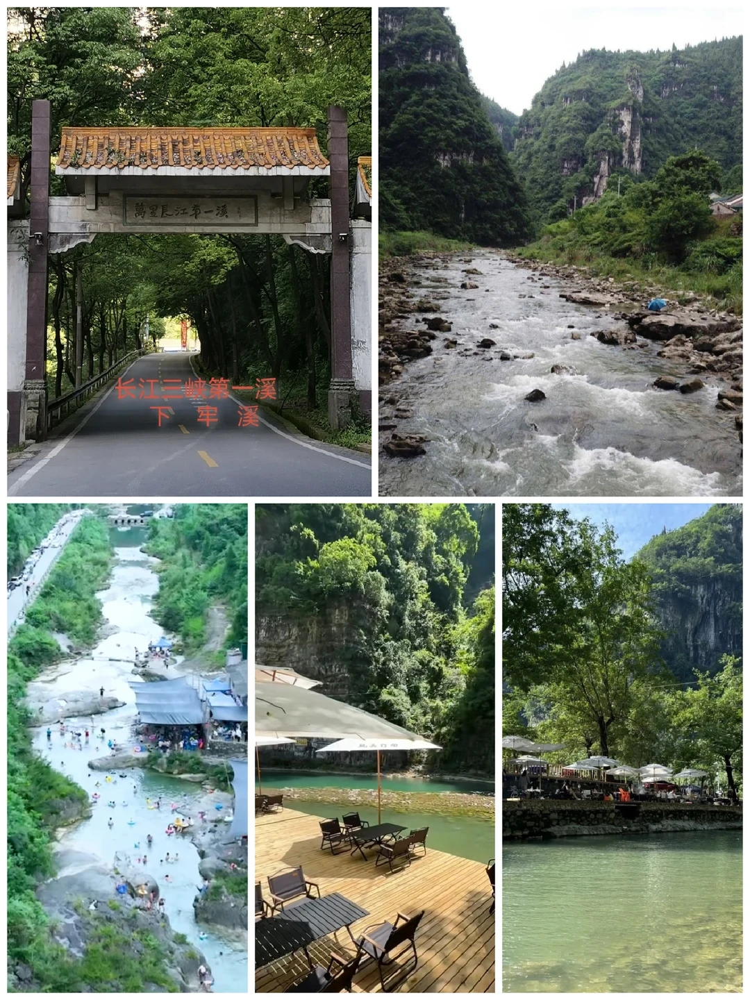

# 宜昌下牢溪/天然的避暑果冻溪

- 作者: 🌸范&夫俗子🌸
- 👍3 · 💬 · ⭐1 · 图 1
- feed_id: 6a576920000000002103fa76

> [OCR] 长江三峡第一溪
下牢溪

## 正文
谁懂啊！在宜昌高温天里，挖到了这片不用挤景区的溪谷秘境！从市区开车30分钟就到，免费玩水+森系大片+复古工业风，避暑遛弯拍照一站式搞定，还是《山楂树之恋》的取景地哦！果然没让人失望 ！
🌊 溪谷玩水超治愈
溪水清得能看见水底的鹅卵石和小鱼，踩进去瞬间降温5℃！浅滩特别适合光脚嬉戏、捞小鱼，深一点的地方还能玩桨板；两岸青山竹林，风里都是草木香，走在溪边步道，每一步都像在画里。
楚家山寨的风雨桥一定要拍！木质吊桥配峡谷绿意，站中间拍全景氛围感拉满。
🏭 809微度假小镇
溪谷旁的老军工厂房改造，斑驳红砖墙、复古标语、环形楼梯，工业风与山水碰撞超独特。崖顶茶吧能俯瞰下牢溪全景，天空泳池对着青山，随便拍都很出片；逛累了在小镇食堂吃顿农家菜，熏腊肉+峡口豆花，地道又满足。
住宿:首选CBD小吃街附近，我们订的是运七酒店(CBD小吃街店)，出门就是小吃街，从下牢溪返程回酒店可以在小吃街补充体力，美食品种很多，吃饱后和朋友们一起步行到江边吹吹江风，非常舒服。
📸 拍照&出行小贴士
穿搭：浅色系长裙/短袖，记得带溯溪鞋（石头滑）+替换衣物
最佳时间：上午10点前/傍晚，光线柔和不晒，夕阳洒水面绝美
交通：自驾导航“下牢溪”，市区约30分钟；停车有农户点位
温馨提示：周末人多，工作日更清净；带走垃圾，保护溪水
夏天的快乐，一半是空调给的，一半是下牢溪给的！来宜昌别只冲三峡大坝，一定要来这片溪谷，承包一整个夏天的清凉与治愈。
#宜昌运七酒店CBD中央大街店[话题]# #下牢溪攻略[话题]# #下牢溪玩水[话题]# #下牢溪打卡[话题]#

---