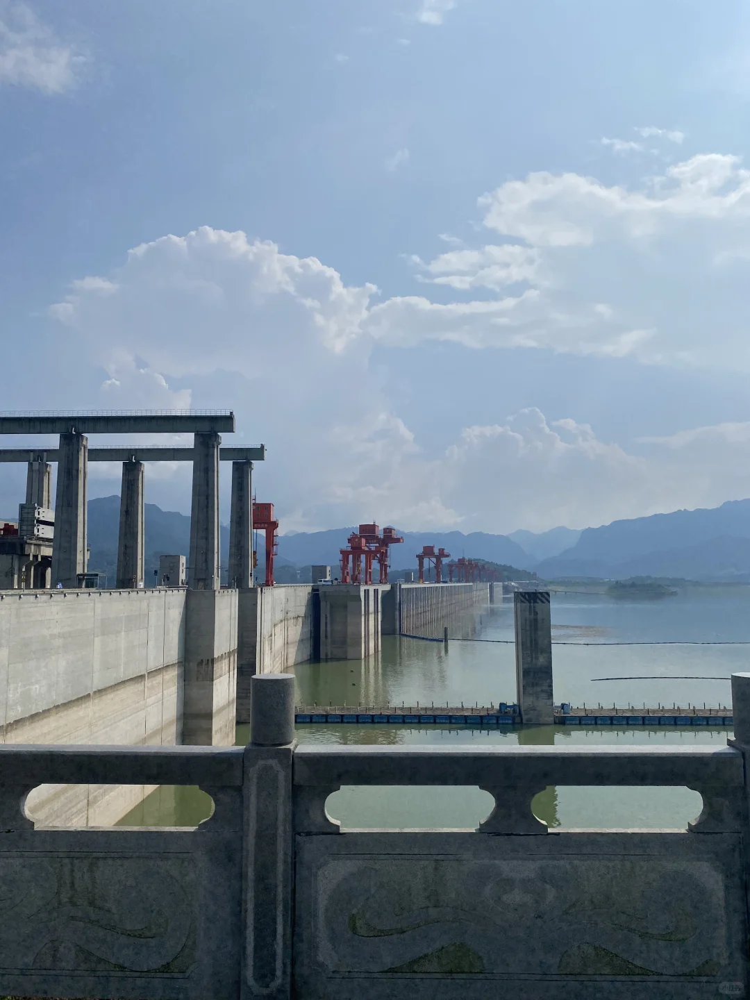
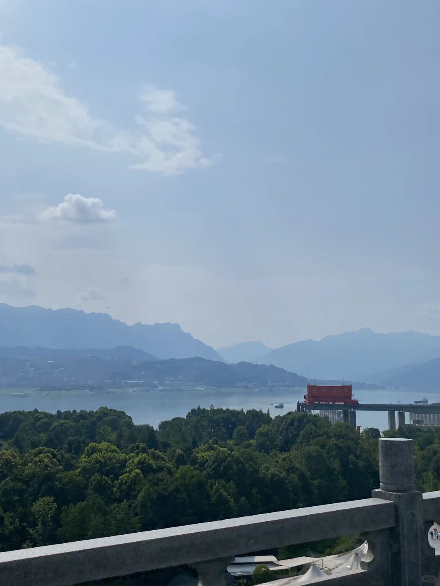
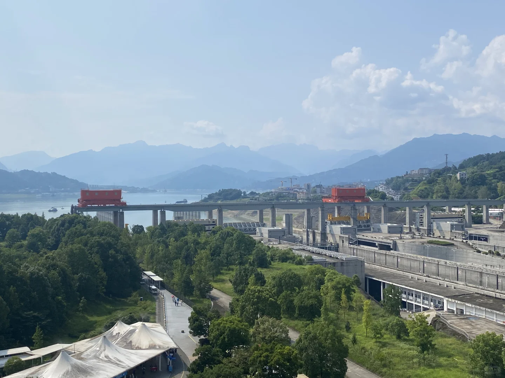
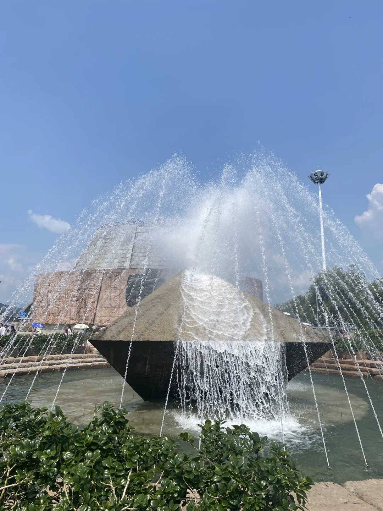
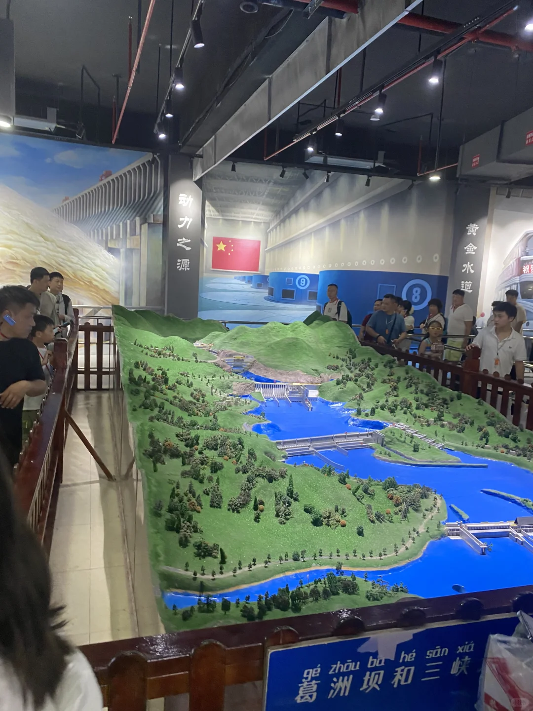
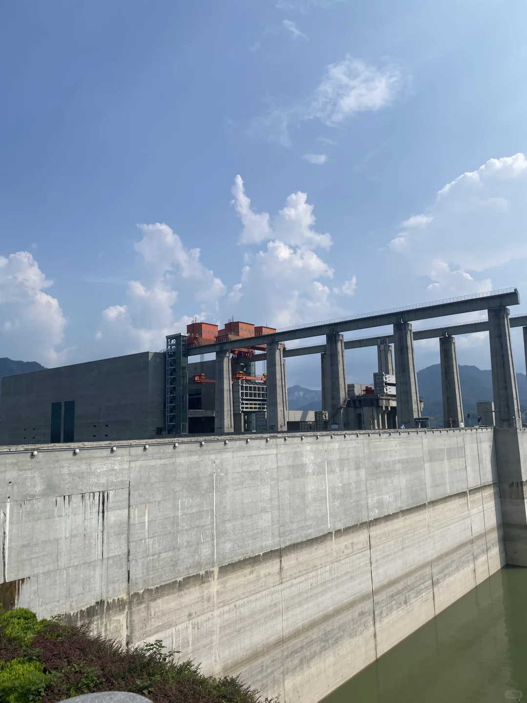
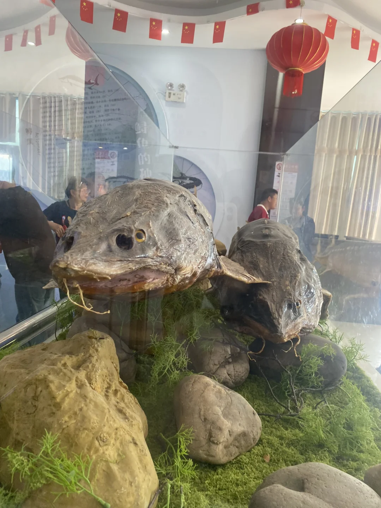
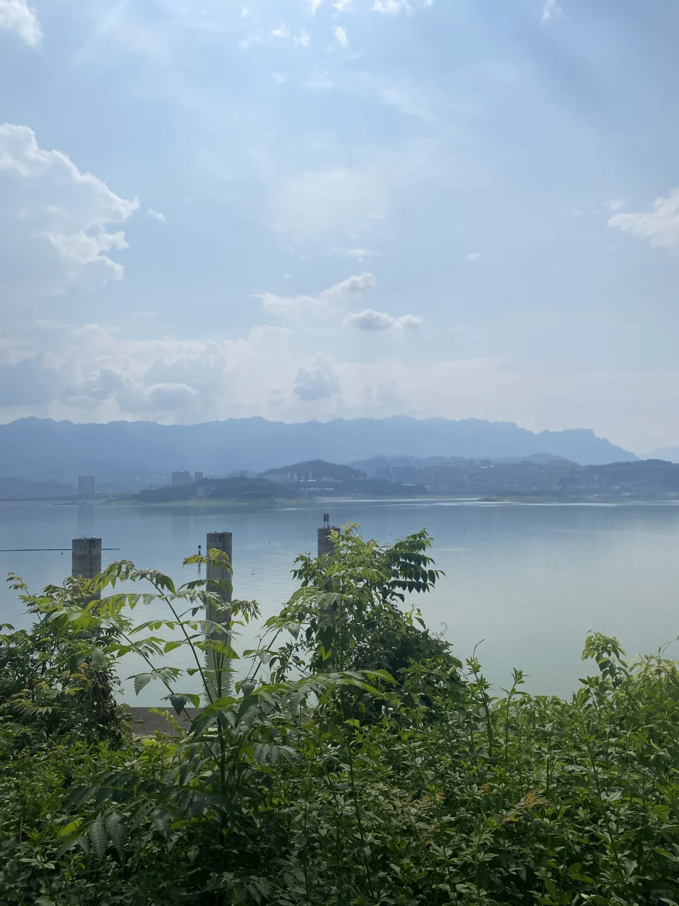

# 三峡大坝

- 作者: 小红薯薯
- 👍2 · 💬9 · ⭐1 · 图 8
- feed_id: 6a745fbc0000000028008e8d

> [OCR] [?]

> [OCR] WULERS

> [OCR] [?]

> [OCR] [?]

> [OCR] 动力之源
黄金水道
gé zhōu bā hé sān xiá

> [OCR] [?][?]

> [OCR] 鲜
[?]

> [OCR] [?]

## 正文
三峡大坝才是真正的绿水青山吧！气势磅礴，天气好的时候特别值得来。夏天来最好带上防晒装备还有小风扇
	
🎞️可以提前看一下央视的纪录片，参观时更有感觉
	
几个让我意想不到的优点：
[折叠椅R] 休息区真的很多，随处可见，有降温设备，维护的也很棒，像我这种有点洁癖又很容易累的人，可以随处大小坐，希望全国赶快推广好吗[皱眉R]
	
🚻卫生间也很多，路很平整，绿化也很好，围栏不影响观景，很美观。处处都很干净，从来没见过基础设施这么好的景区
	
🚍大巴车一直有，不需要等待多久，人差不多就开走，司机也特别温和有礼貌
	
#三峡大坝[话题]# #三峡大坝旅游[话题]# #三峡大坝景区[话题]#

---