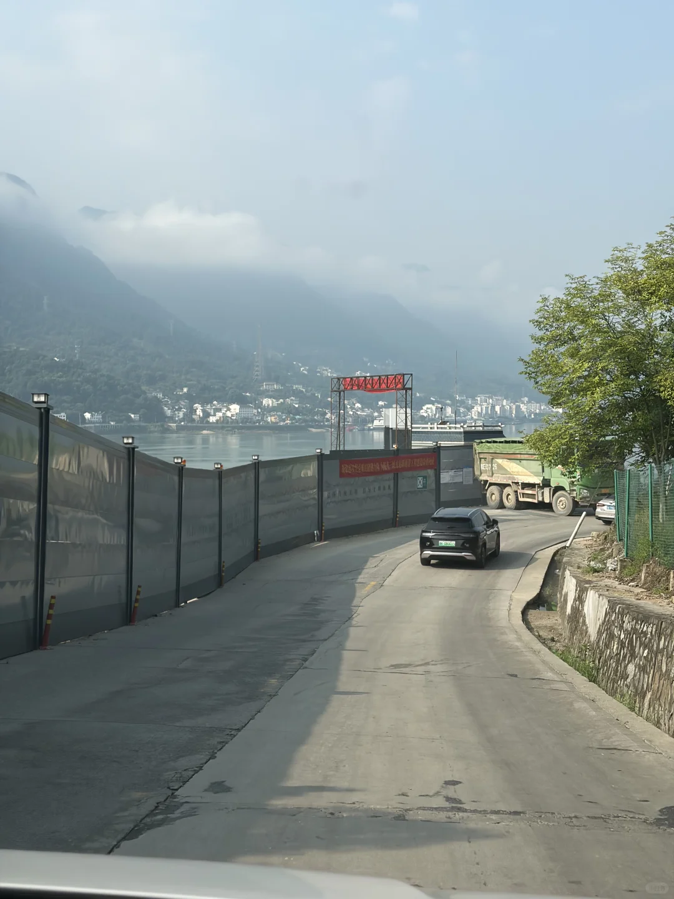
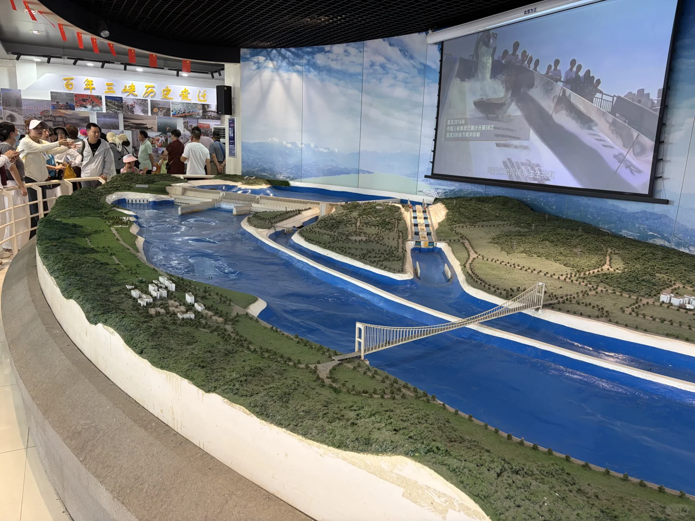
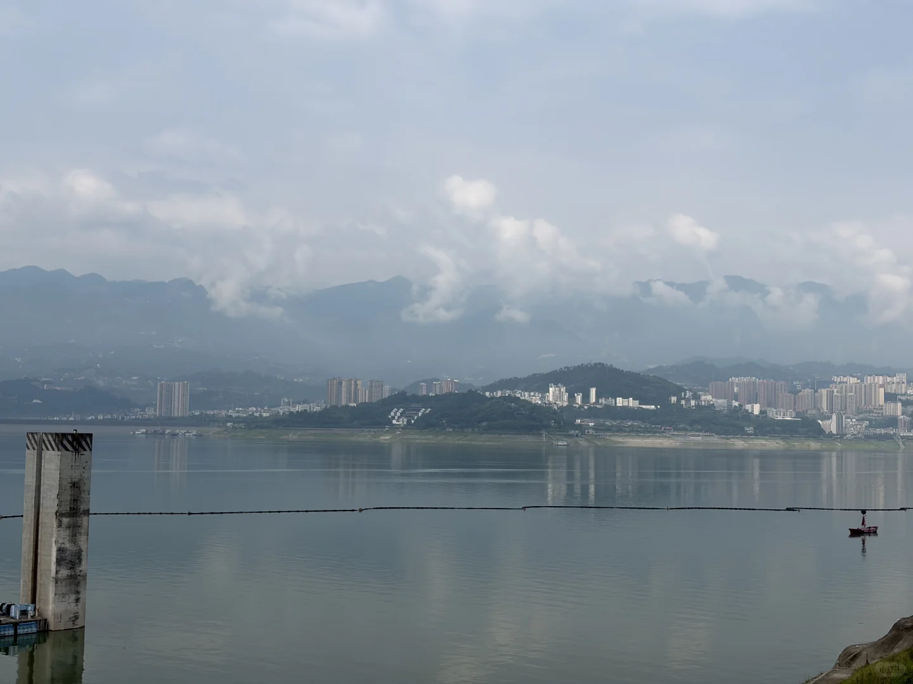
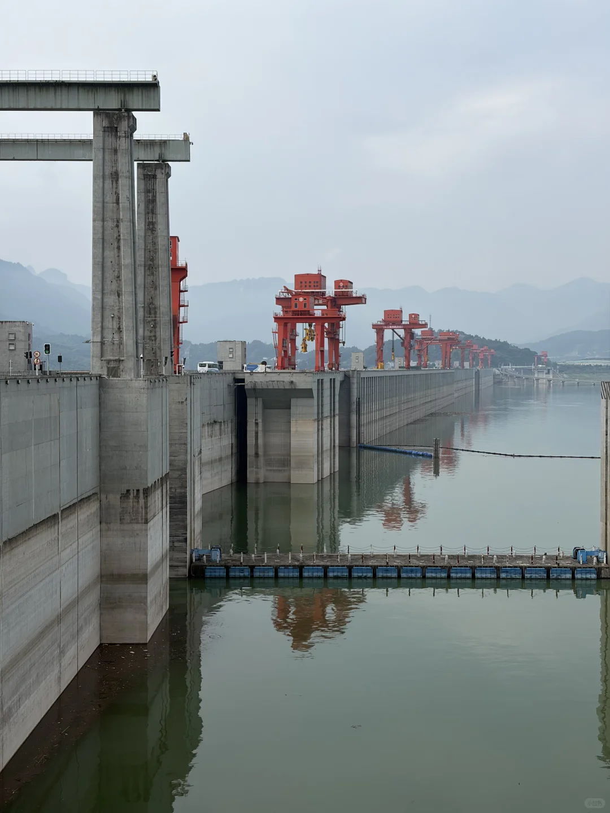
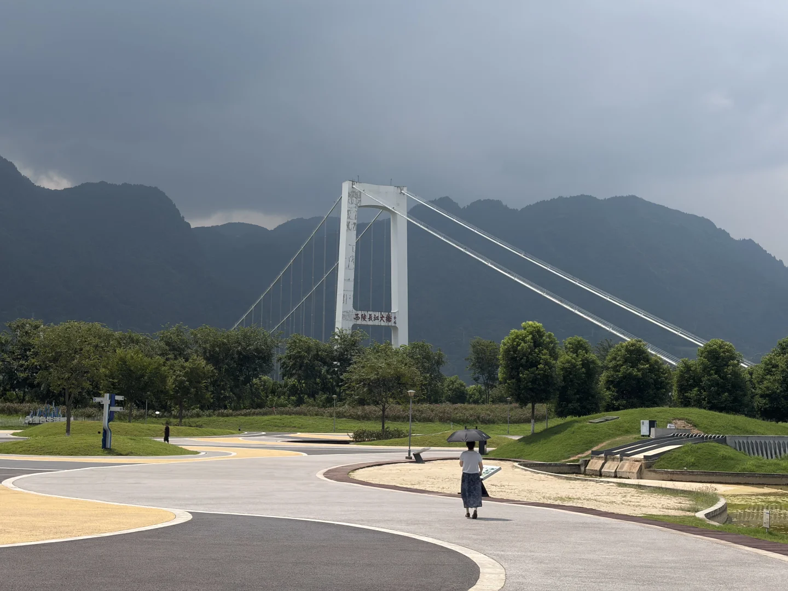
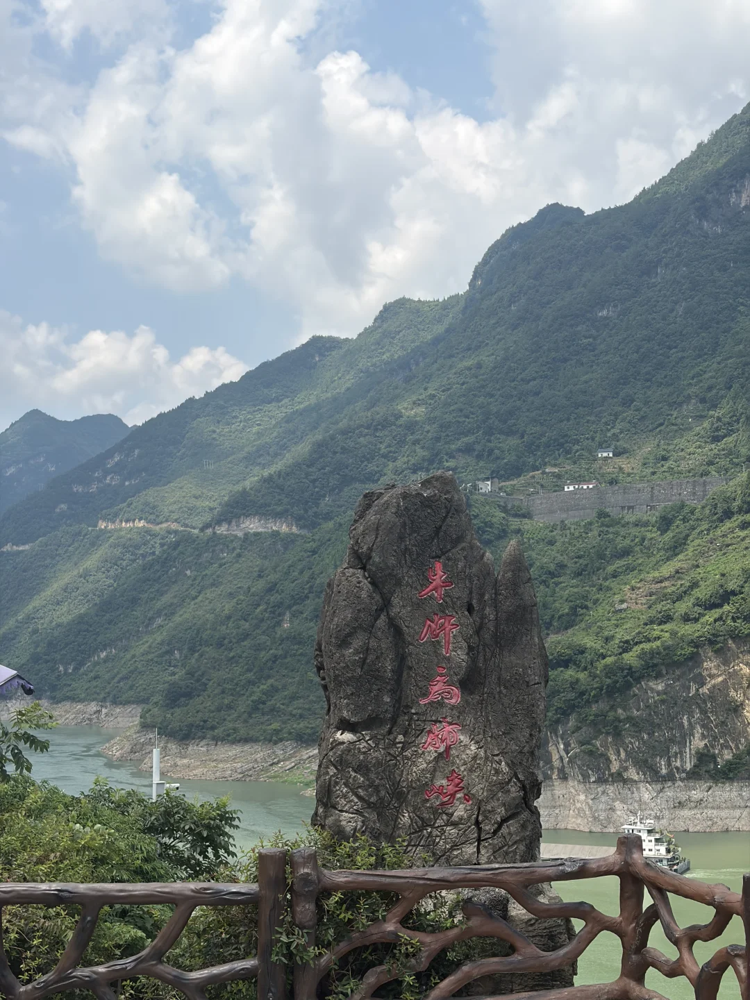
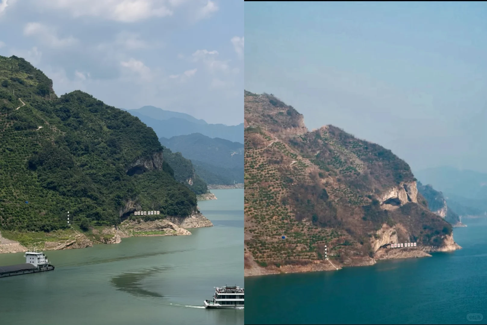
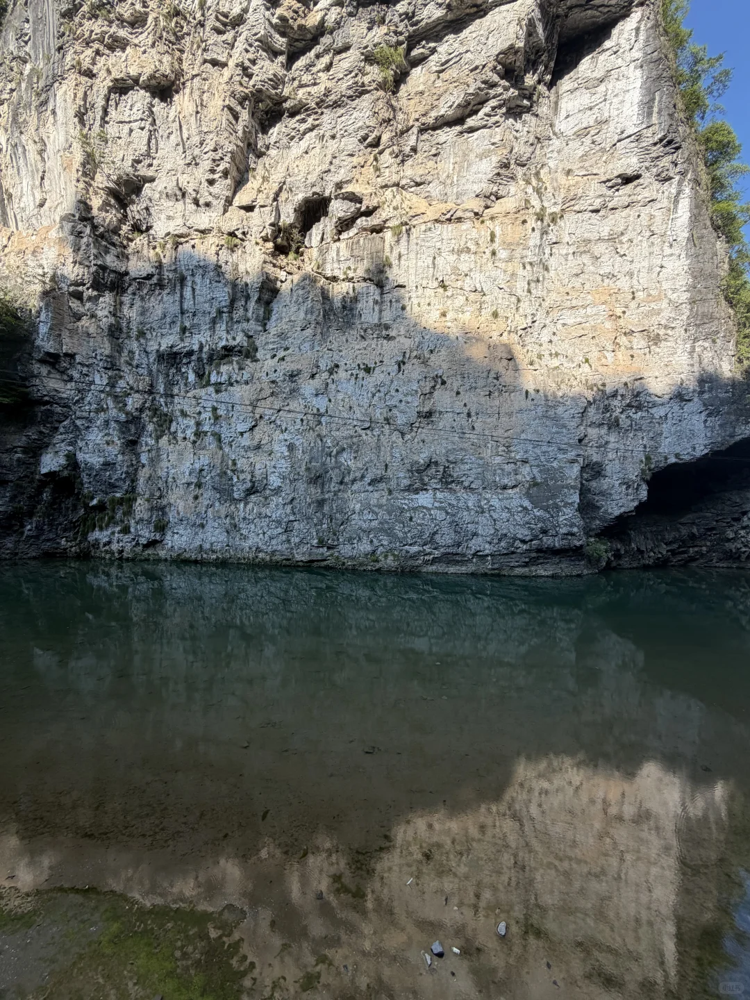

# 自驾编辑部20260809避暑DAY2

- 作者: 走在户外路上的momo
- 👍2 · 💬4 · ⭐ · 图 10
- feed_id: 6a78710c000000002402c671

> [OCR] 我来鄂西渝东北避暑啦!
宜昌➡️神农架➡️巫山➡️
奉节➡️恩施➡️宜昌
DAY1:
上海➡️宜昌
DAY2:
宜昌➡️神农架详细过程

> [OCR] [?][?][?][?]

> [OCR] 百年三峡历史变迁
至2016年
中国三峡集团已累计开展58次
放流500多万尾中华鲟

> [OCR] [?]

> [OCR] [?][?]

> [OCR] 西陵长江大桥
[?]

> [OCR] 牛坪为肺峡

> [OCR] 小红书

> [OCR] [?]

> [OCR] [?][?]

## 正文
早上八点从宜昌市区出发，p1在前往大坝的路上
九点多到三峡大坝游客换乘中心，（顺路办理坝区通行证，用时不到两分钟）
坐35元景交车陆路全面参观三峡大坝，五级船闸没有好的参观角度，还是景交车路过的时候最直观。p2是景交刚下的模型方便直观了解，p3-5参观过程中几张拍摄
十二点左右下来又出发，路边随机一家农家乐就食
然后开车路过p6牛肝马肺峡，看看景色和“小狗山”，p7是今日份小狗山和网友的图对比
p8是鹰嘴岩，上去就是打卡嘎嘎拍打卡照（最后要走10分钟）
一直到离开秭归长江大桥，都是左边山右边江的景色，beautiful
然后继续走，大部分算是谷底风格的山路，路过了个小地方p9，然后就到木鱼镇了，这地方有点凉快了#避暑好地方[话题]##自驾探索编辑部[话题]#

---