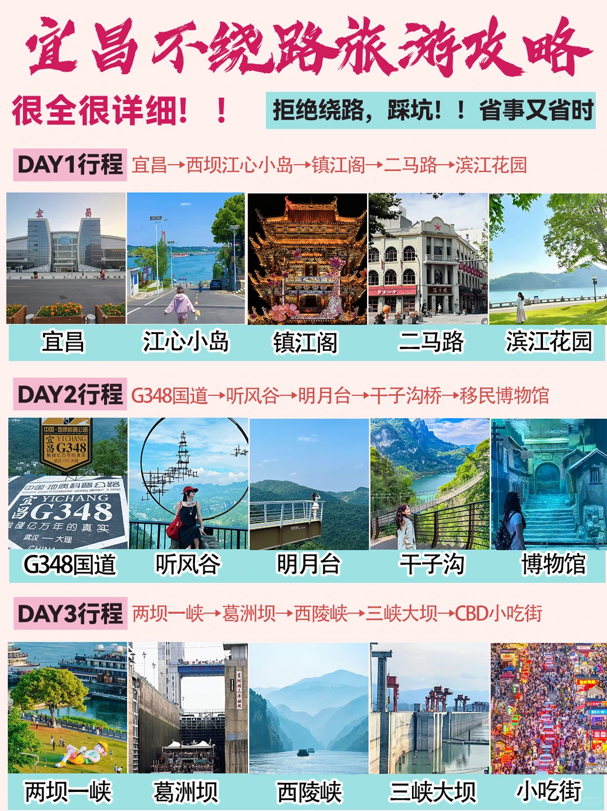
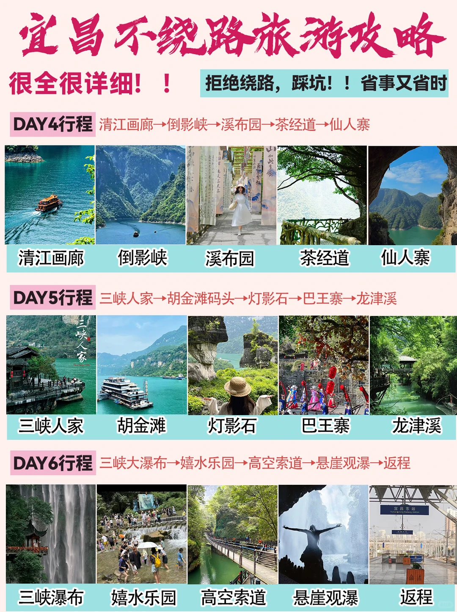
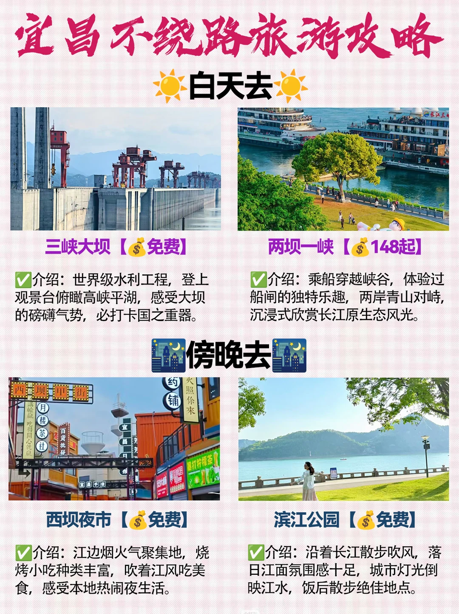
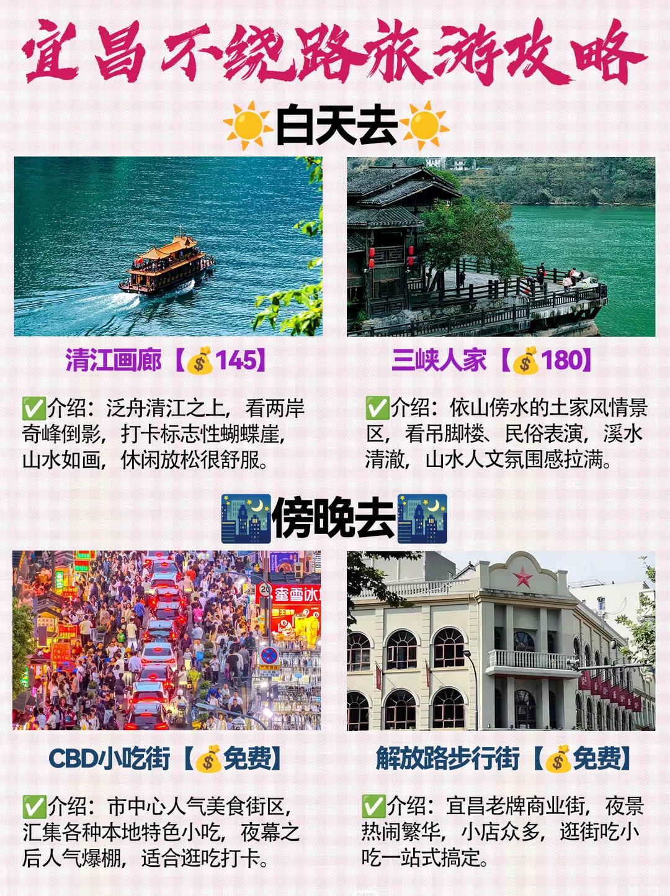
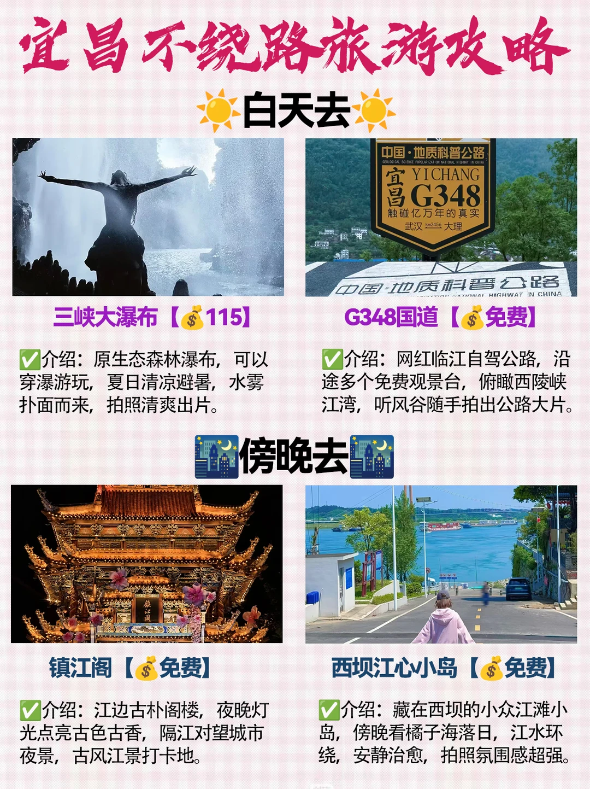

# 宜昌6天不绕路保姆级攻略✨白天晚上分开玩

- 作者: 跟着楚渝行去旅行
- 👍3 · 💬 · ⭐4 · 图 5
- feed_id: 6a7927d20000000027021137

> [OCR] 宜昌不绕路旅游攻略
很全很详细！！
拒绝绕路，踩坑！！省事又省时

DAY1行程 宜昌→西坝江心小岛→镇江阁→二马路→滨江花园

宜昌 江心小岛 镇江阁 二马路 滨江花园

DAY2行程 G348国道→听风谷→明月台→干子沟桥→移民博物馆

G348国道 听风谷 明月台 干子沟 博物馆

DAY3行程 两坝一峡→葛洲坝→西陵峡→三峡大坝→CBD小吃街

两坝一峡 葛洲坝 西陵峡 三峡大坝 小吃街

> [OCR] 宜昌不绕路旅游攻略
很全很详细！！
拒绝绕路，踩坑！！省事又省时

DAY4行程 清江画廊→倒影峡→溪布园→茶经道→仙人寨

清江画廊 倒影峡 溪布园 茶经道 仙人寨

DAY5行程 三峡人家→胡金滩码头→灯影石→巴王寨→龙津溪

三峡人家 胡金滩 灯影石 巴王寨 龙津溪

DAY6行程 三峡大瀑布→嬉水乐园→高空索道→悬崖观瀑→返程

三峡瀑布 嬉水乐园 高空索道 悬崖观瀑 返程

> [OCR] 宜昌不绕路旅游攻略

白天去

三峡大坝【免费】

介绍：世界级水利工程，登上观景台俯瞰高峡平湖，感受大坝的磅礴气势，必打卡国之重器。

两坝一峡【148起】

介绍：乘船穿越峡谷，体验过船闸的独特乐趣，两岸青山对峙，沉浸式欣赏长江原生态风光。

傍晚去

西坝夜市【免费】

介绍：江边烟火气聚集地，烧烤小吃种类丰富，吹着江风吃美食，感受本地热闹夜生活。

滨江公园【免费】

介绍：沿着长江散步吹风，落日江面氛围感十足，城市灯光倒映江水，饭后散步绝佳地点。

> [OCR] 宜昌不绕路旅游攻略

白天去☀️

清江画廊【💰145】

介绍：泛舟清江之上，看两岸奇峰倒影，打卡标志性蝴蝶崖，
山水如画，休闲放松很舒服。

三峡人家【💰180】

介绍：依山傍水的土家风情景区，看吊脚楼、民俗表演，溪水
清澈，山水人文氛围感拉满。

傍晚去🌙

CBD小吃街【💰免费】

介绍：市中心人气美食街区，
汇集各种本地特色小吃，夜幕之后人气爆棚，适合逛吃打卡。

解放路步行街【💰免费】

介绍：宜昌老牌商业街，夜景
热闹繁华，小店众多，逛街吃小吃一站式搞定。

> [OCR] 宜昌不绕路旅游攻略
白天去

三峡大瀑布【💰115】
介绍：原生态森林瀑布，可以穿瀑游玩，夏日清凉避暑，水雾扑面而来，拍照清爽出片。

G348国道【💰免费】
介绍：网红临江自驾公路，沿途多个免费观景台，俯瞰西陵峡江湾，听风谷随手拍出公路大片。

傍晚去

镇江阁【💰免费】
介绍：江边古朴阁楼，夜晚灯光点亮古色古香，隔江对望城市夜景，古风江景打卡地。

西坝江心小岛【💰免费】
介绍：藏在西坝的小众江滩小岛，傍晚看橘子海落日，江水环绕，安静治愈，拍照氛围感超强。

## 正文
宜昌别再乱规划路线啦！
整理好了不走回头路的6日行程，
景点分白天/傍晚打卡，游玩时间精准拿捏✅
山水、大坝、峡谷、夜市小吃一次性全部打卡！
.
🗓️完整行程安排
DAY1 市区休闲线
宜昌→西坝江心小岛→镇江阁→二马路→滨江花园
慢悠悠逛老城，傍晚吹江风看日落
.
DAY2 自驾观景线
G348国道→听风谷→明月台→干子沟桥→移民博物馆
沿着最美公路兜风，俯瞰壮阔峡谷风光
.
DAY3 两坝游船线
两坝一峡→葛洲坝→西陵峡→三峡大坝→CBD小吃街
坐船体验过船闸，亲眼见证国之重器的震撼
.
DAY4 清江山水画廊
清江画廊→倒影峡→溪布园→茶经道→仙人寨
泛舟碧绿江水之间，沉浸式感受土家山水画卷
.
DAY5 土家风情之旅
三峡人家→胡金滩码头→灯影石→巴王寨→龙津溪
看吊脚楼，体验地道民俗表演
.
DAY6 瀑布玩水日
三峡大瀑布→嬉水乐园→高空索道→悬崖观瀑→返程
夏日避暑绝佳地，穿瀑布玩水超解压
.
☀️适合白天打卡
▪️三峡大坝｜免费，世界级水利工程，打卡大国重器
▪️两坝一峡｜148起，乘船穿越峡谷，体验过闸乐趣
▪️清江画廊｜145，乘船观赏奇峰倒影，打卡蝴蝶崖
▪️三峡人家｜180，依山傍水的土家秘境，氛围感十足
▪️三峡大瀑布｜115，夏日避暑，可以穿瀑游玩
▪️G348国道｜免费，网红自驾公路，沿途观景台随手出片
.
🌙傍晚夜游打卡
▪️西坝夜市｜免费，江边烟火聚集地，烧烤小吃超多
▪️滨江公园｜免费，长江边散步，日落夜景超治愈
▪️CBD小吃街｜免费，本地美食聚集地，逛吃首选
▪️解放路步行街｜免费，老牌商业街，夜景热闹好逛
▪️镇江阁｜免费，古风阁楼，夜晚灯光古色古香
▪️西坝江心小岛｜免费，小众看日落点位，安静出片
.
💡出行小Tips
1️⃣游船票建议提前预定，选可以过葛洲坝船闸的班次
2️⃣瀑布游玩记得备一套换洗衣物，玩水会打湿
3️⃣傍晚江边风大，出行随身带一件薄外套
4️⃣市区景点大多免费，省钱玩法直接冲！
#湖北周边游[话题]# #旅行推荐官[话题]# #本地人做的攻略[话题]# #城市周边游[话题]# #宜昌[话题]# #宜昌旅游[话题]# #穷游攻略[话题]# #宜昌旅游攻略[话题]# #湖北[话题]# #无滤镜旅行攻略[话题]#

---