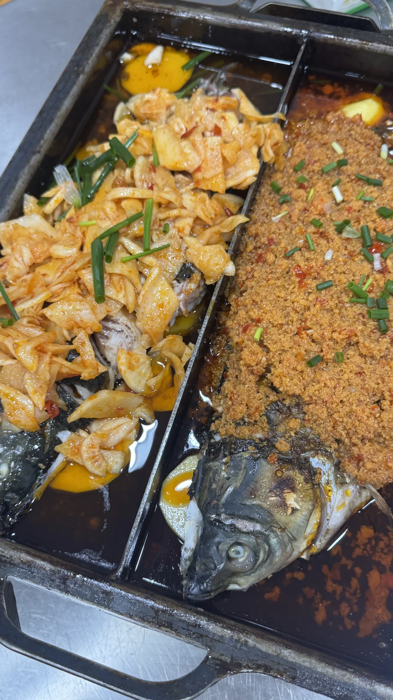
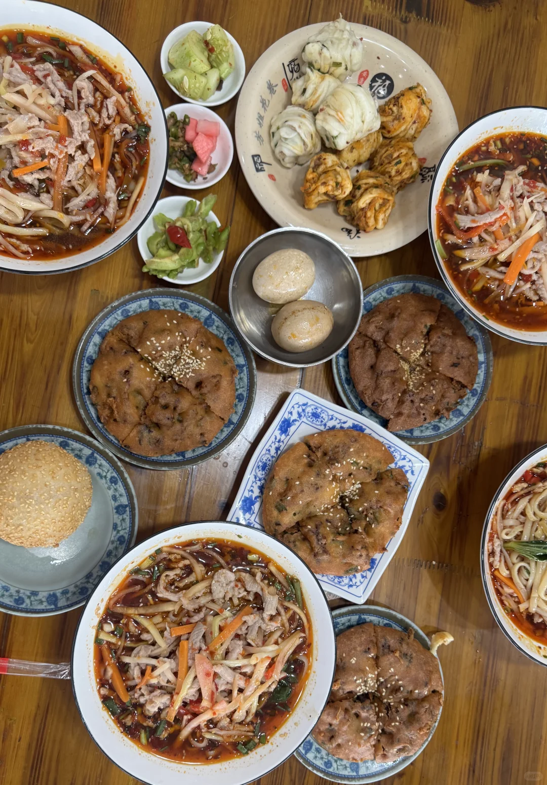

# 宜昌周末游｜宣恩看夜景

- 作者: 小时候
- 👍2 · 💬1 · ⭐1 · 图 7
- feed_id: 6a794ae20000000032022f6b

> [OCR] 打上便已
[?]

> [OCR] [?][?][?]

> [OCR] [?]
[?]

> [OCR] [?][?][?]

> [OCR] B~92.0p

> [OCR] [?]

> [OCR] 福
福

## 正文
先说大实话：
作为看过重庆洪崖洞、南山夜景的人，会觉得宣恩的夜景没那么好看✨，但小城独有的烟火气+文澜桥的璀璨灯光，搭配贡水河畔的热闹人潮，有种治愈的松弛感（仅个人感受）
	
🏠『关于住宿』
我们定了文澜桥附近的民宿，💰300+，页面写25平，结果进门转身都费劲…果断退房。县城住宿水平参差，建议直接冲酒店更稳妥！
后来临时改计划，直奔恩施高速口住了一晚新开的酒店，💰150+，空间大又干净，就是有点装修味（介意的话慎选），第二天去地心谷超方便，省时省力～
再就是高速口附近吃的早餐超好吃P7，油香、豆皮、辣花卷都贼好吃😋
	
🍢『关于吃的』
烤活鱼🐟：来都来了，必须尝！本地朋友推荐强哥烤鱼（烤鱼一条街店），味道中规中矩，偏油，但胜在氛围热闹～
	
瞿氏面筋😋：本地人按头安利！我们吃了烤苕皮、土豆、卷面筋（卷皮必点！）好吃到忘记拍照📸，调味贼香，路过一定别错过！
	
小建议📌
✔️ 宣恩适合顺路玩，专程来可能落差大，但搭配恩施行程刚刚好
	
——
碎碎念：小城夜景虽不及重庆魔幻，但河边吹风、看看打铁花，吃鱼撸串的快乐，也挺难忘的
#宣恩旅游[话题]# #恩施周边游[话题]# #烤活鱼[话题]# #小众旅行地[话题]# #宣恩夜景[话题]# #文澜桥[话题]#

---