# 牛扎坪一日游太舒服了

- 作者: 土豆派来的
- 👍2 · 💬 · ⭐ · 图 18
- feed_id: 6a789c2c0000000032021f81

> [OCR] Danish butter bread!
Although popular around the world to eat bread, but from a perspective of bread daily.
rop country will be eating habits and charters and
the Pie (Puff) what man rachob
concentrated in America. Middle
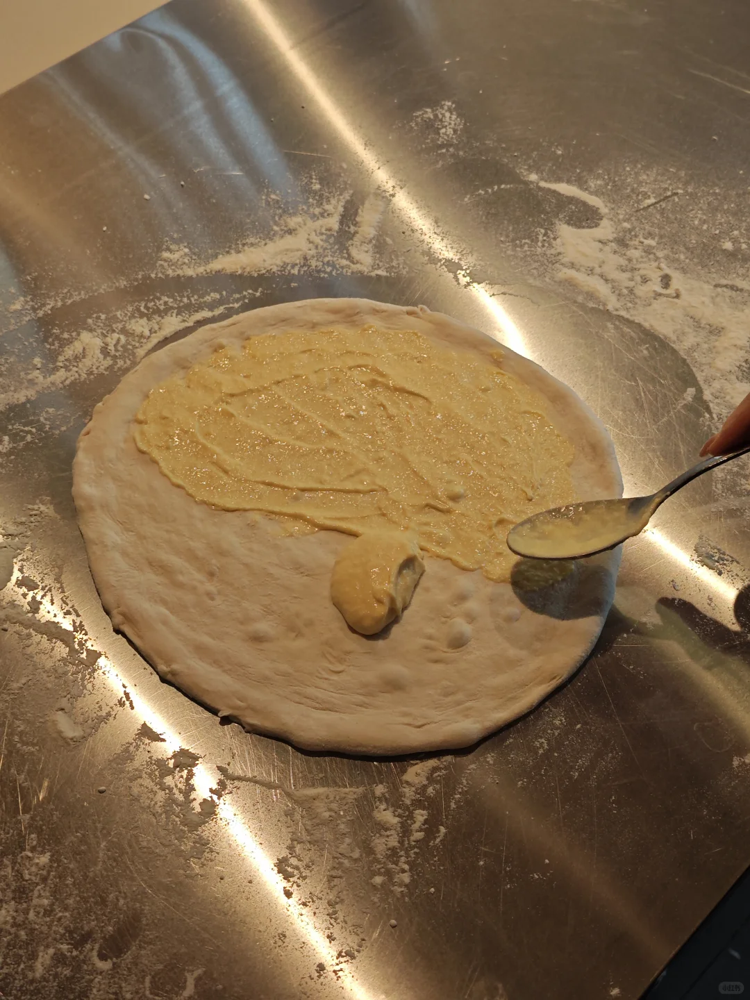
> [OCR] [?]
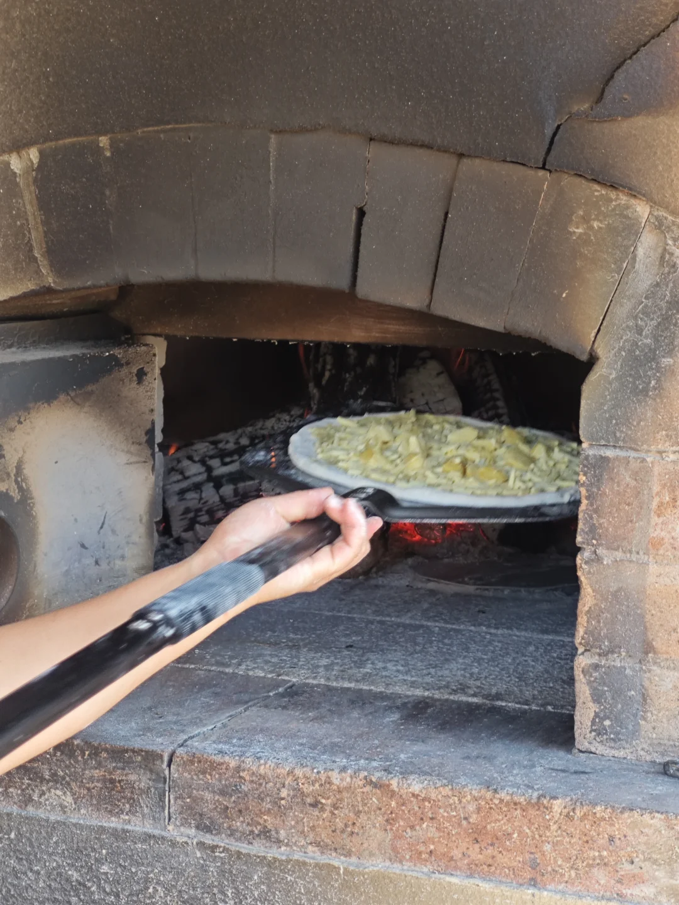
> [OCR] system
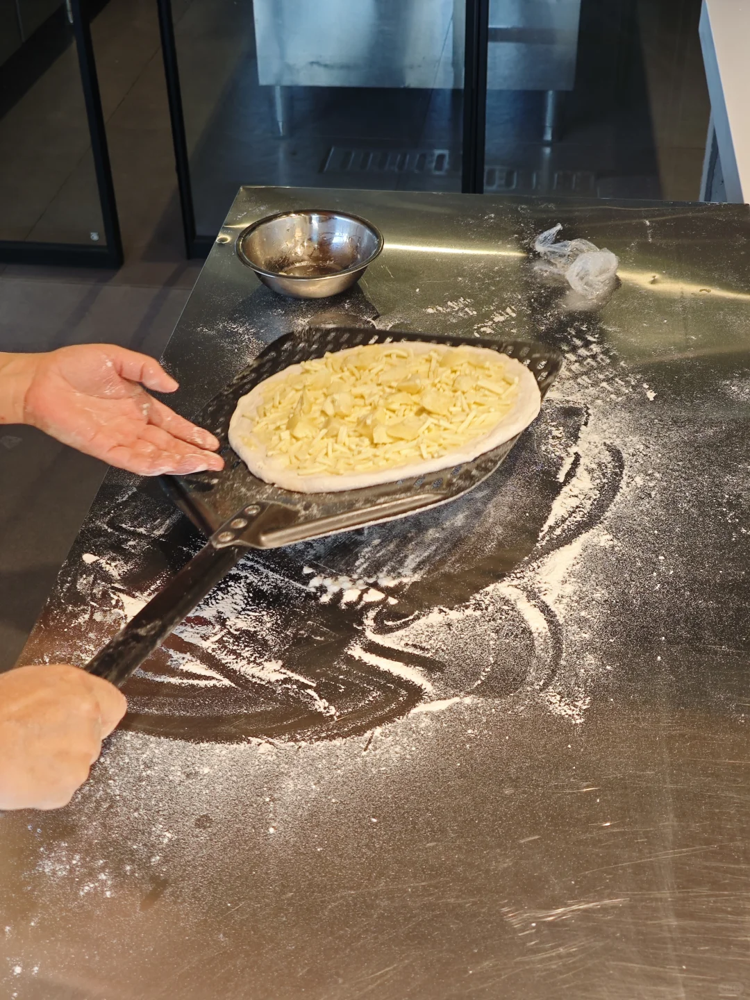
> [OCR] [?]

> [OCR] COUNTRY
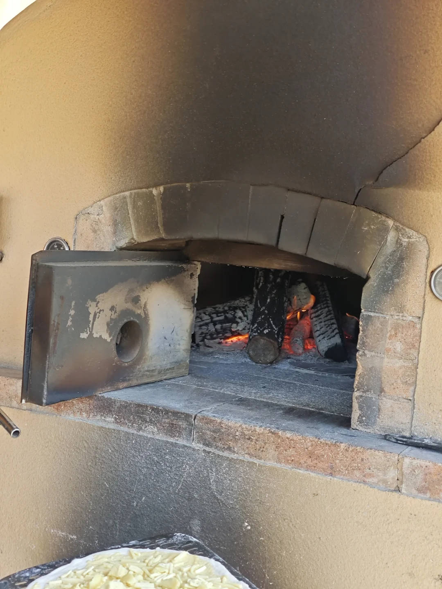
> [OCR] [?]
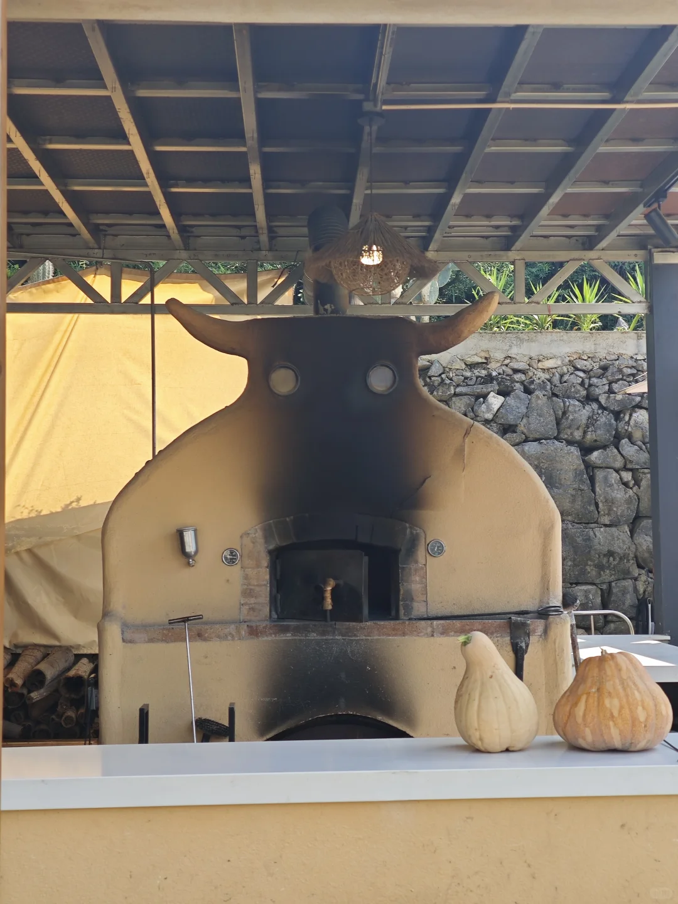
> [OCR] [?]
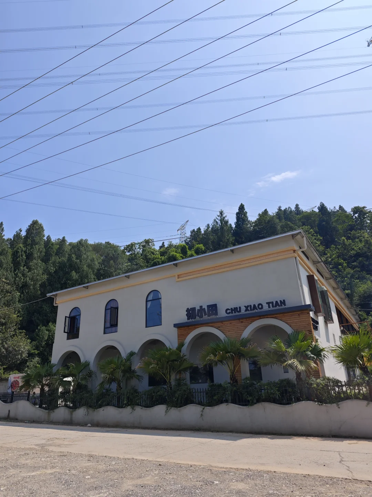
> [OCR] 初小田
CHU XIAO TIAN

> [OCR] around
Ail
of bread
and mainly include
to add too many
and as water
The
food to
add simple food to
the
and
on the
of
in a
The
around
of
[?]
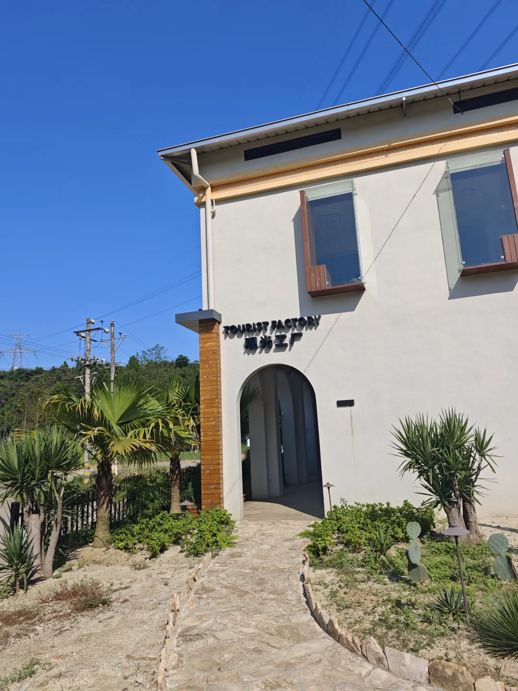
> [OCR] TOURIST FACTORY
观光工厂
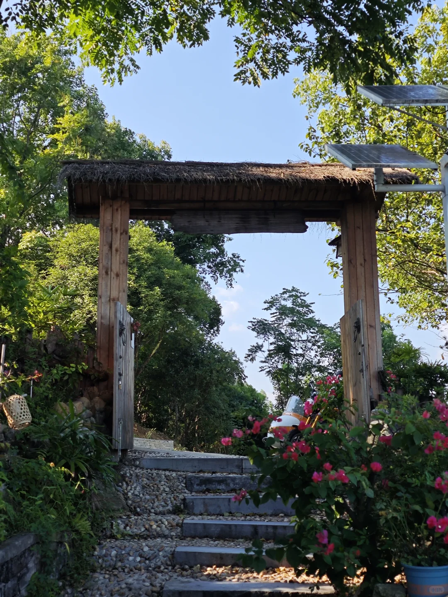
> [OCR] [?]

> [OCR] 山风
Coffee
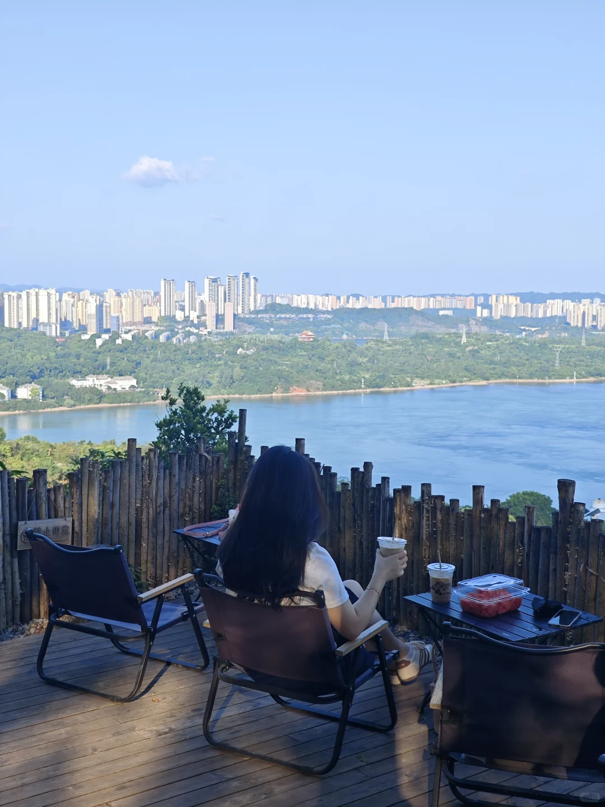
> [OCR] 禁止倚靠
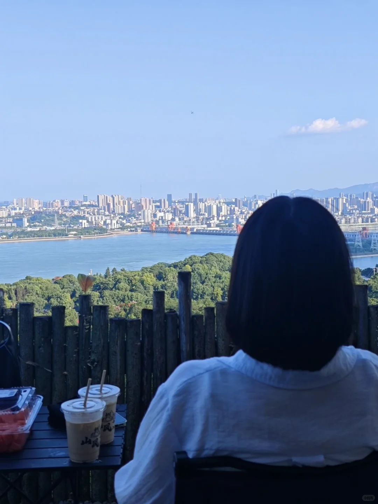
> [OCR] 山风
?[?]

> [OCR] INZS5
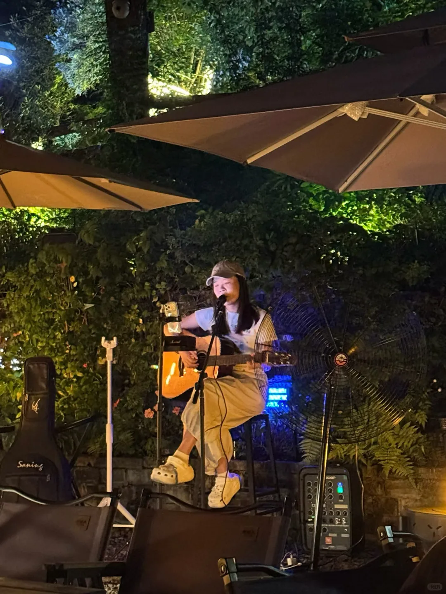
> [OCR] Saning
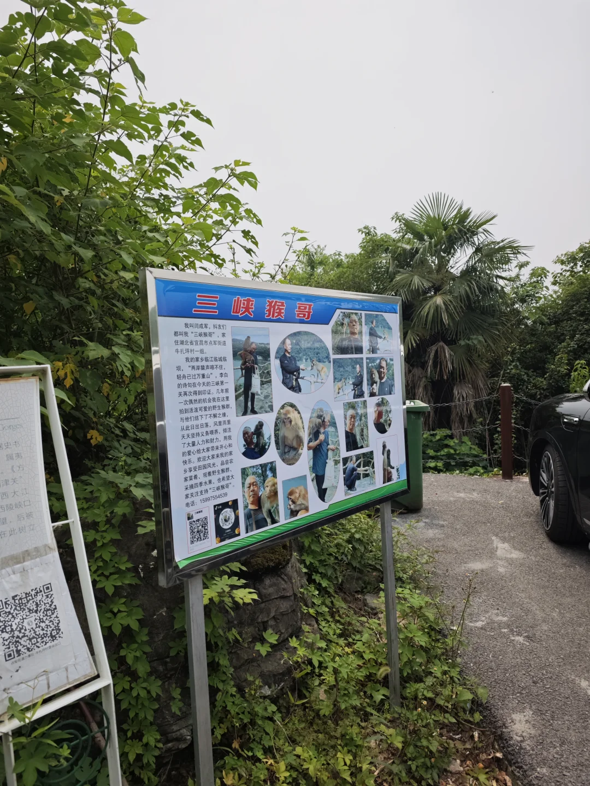
> [OCR] 三峡猴哥

我叫闫成军，抖友们都叫我“三峡猴哥”，家住湖北省宜昌市点军街道牛扎坪村一组。

我的家乡临江临城临坝，“两岸猿声啼不住，轻舟已过万重山”。李白的诗句在今天的三峡第一关再次得到印证。几年前一次偶然的机会我在这里拍到活泼可爱的野生猕猴群，与他们结下了不解之缘。从此日出日落，风雨无阻天天坚持义务服务，倾注了大量人力和财力，用我的爱心给大家带来开心和快乐。欢迎大家来我家乡享受田园风光、品尝农家菜肴、观看野生猕猴群、采摘四季水果，也希望大家关注支持“三峡猴哥”。

电话：15997554539

> [OCR] system

## 正文
宜昌周末不知道去哪的宝子！
听我的！直接冲牛扎坪！！
市区自驾只要25分钟就能抵达🌿
不用长途奔波，玩法超级丰富
🚗出行指南
宜昌市区自驾出发，二十多分钟就到！
路况很好，新手司机也完全没问题，停车很方便～
💐第一站：花木城绿植大棚
建议上午先来这里！超大的绿植花卉基地，一整片温室大棚真的巨治愈！各式各样的鲜花、多肉、家用绿植应有尽有，种类超级多，关键价格巨划算，比市区花店便宜好多！可以随便逛逛挑选喜欢的盆栽
	
🐒第二站：3km山野轻徒步 偶遇江景&小猴子
逛完花市刚好运动一下！
强推这条新手零难度徒步路线！全程仅3公里
坡度很平缓，不累不费腿，大人小孩、老人都能轻松走完！整条步道风景直接封神！
一边是郁郁葱葱的山林绿植，一边是一望无际的长江江景🌊边走边吹温柔的江风，沉浸式吸氧洗肺！
运气好还能偶遇可爱的野生小猴子！
⚠️远远拍照观赏就好，不要投喂、不要近距离触碰，安全第一！
	
🍕第三站：初小田｜亲手DIY窑烤披萨
徒步结束刚好过来吃下午茶！
最有意义的就是可以自己亲手做窑烤披萨✨
刷酱、铺芝士、加配料，全程沉浸式DIY，体验感直接拉满，超级有趣！
做好的披萨放进柴火老窑现烤，出炉的时候香气扑鼻，饼底焦香酥脆，芝士巨拉丝，味道真的绝了！完全不输外面的西餐厅！
小院环境也超美，绿植环绕，拍照巨出片，遛娃闺蜜游都超合适！
	
☕第四站：山风咖啡馆｜日落晚风+驻唱演出
把最绝的风景留到最后！
牛扎坪视野天花板的江景咖啡馆非它莫属！
半山腰的绝佳位置，露台直面整片长江和葛洲坝全景
傍晚的日落江景真的美到失语！
白天在这里喝咖啡、吹晚风、看江景发呆，超级解压
等到晚上氛围感直接翻倍！
八点半有超好听的现场驻唱演出🎤
江水、晚风、歌声、落日，浪漫直接拉满！
非常适合情侣约会、朋友小聚，待一整晚都不想走！
#宜昌旅游[话题]# #宜昌牛扎坪[话题]# #宜昌周边一日游[话题]# #宜昌周末去哪儿[话题]# #宜昌徒步[话题]# #宜昌遛娃好去处[话题]# #宜昌约会圣地[话题]# #湖北宜昌游玩攻略[话题]# #去山里过个周末[话题]# #人少好玩的地方[话题]#

---